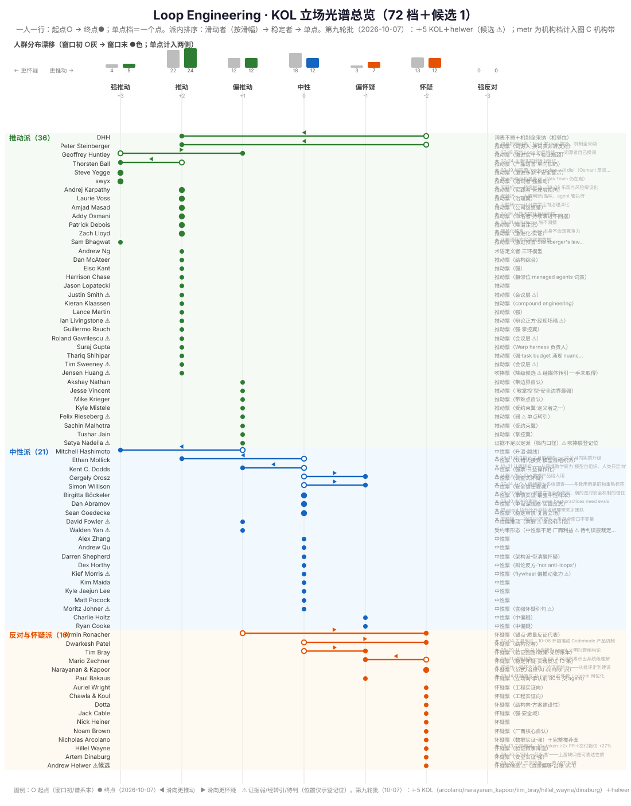
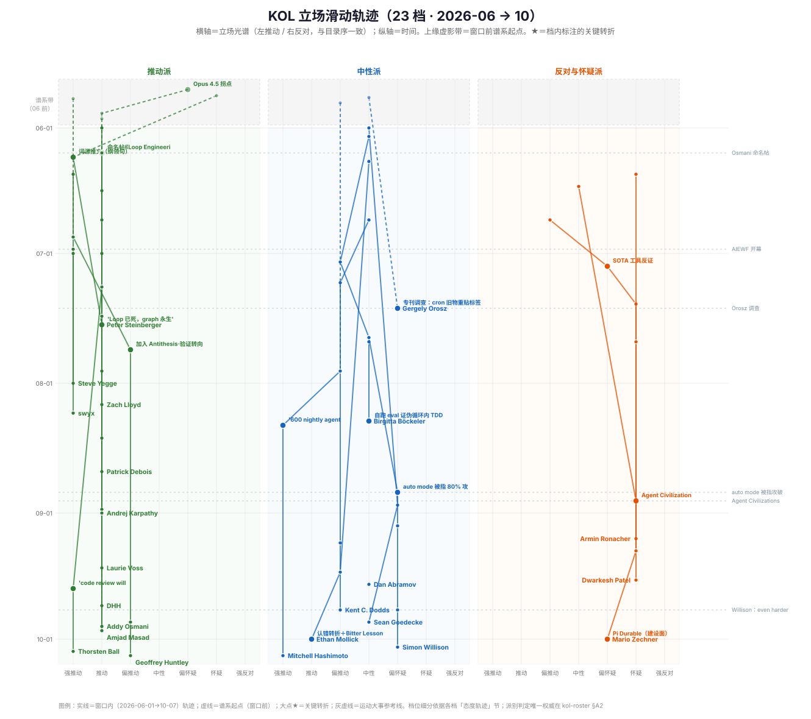
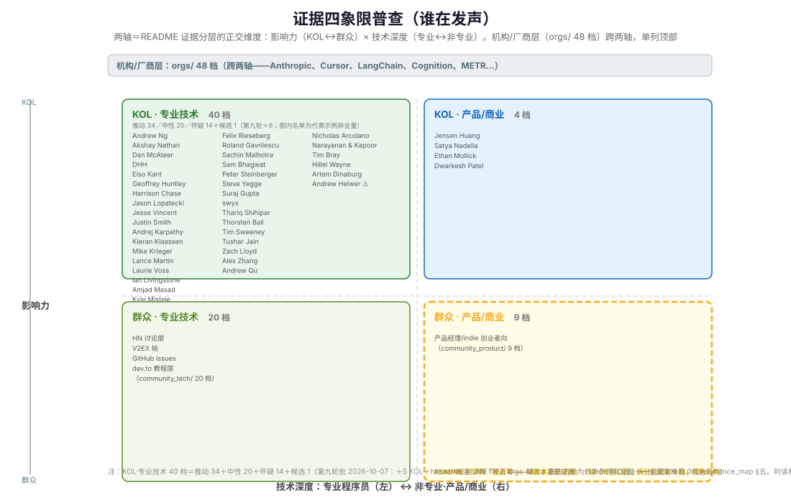

# 00_kol_stance_map — KOL 立场光谱与滑动图（2026-06 → 10）

> **问题**（用户 2026-10-07 提）：三派之外，能不能表达**每个人在哪个位置、位置怎么变化、是怎么滑动的**？
> 本文用三张 SVG 回答：**位置**（图 A 总览）、**滑动**（图 B 轨迹）、**谁在发声的结构**（图 C 普查）。
> 全部数据来自各 KOL 档头部「态度轨迹」节与各条目「派别适配」票面（2026-10-07 抽取）；台账与判读文件零改动。

## 一、定档规则（先于读图）

7 档光谱，**左推动 → 右反对**（与 01_advocates → 02_neutral → 03_skeptics 目录序一致）：

| 档 | 含义 | 锚点例 |
|---|---|---|
| **+3 强推动** | 激进极／世纪级修辞／无人值守默认 | swyx『entire game of the next century』、Yegge 舰队多派 |
| **+2 推动** | 把"设计循环让 agent 自动推进"当默认方向推荐 | Osmani 命名＋教程化、Andrew Ng 三环 |
| **+1 偏推动** | 推动但带边界自认／受约束翼／弱证据登记位 | Mistele 受约束翼、Krieger 难点自认、Nadella（⚠️） |
| **0 中性** | 有条件成立——划边界、给约束、先测再信 | Böckeler eval 实证、Goedecke 对齐派 |
| **−1 偏怀疑** | 部分票／共享怀疑派特定主张（门槛/成本/新瓶旧酒） | Willison 门槛证词、Orosz 调查式怀疑 |
| **−2 怀疑** | 给反证与批评（失败账本/质量退化/安全） | Ronacher 质量反证、Zechner security theater |
| **−3 强反对** | 全盘结构性否定 | **空位**——印证 [landscape §二.1](00_three_camp_landscape.md)：怀疑几乎全部来自实践者内部，无外人唱衰 |

三条铁则：

1. **派别判定唯一权威在 [kol-roster §A2](../../02_research/01_agent_engineering/loop_engineering/raw/kol-roster.md)**；档位只是派别之下的细分刻度。档位与目录归属打架处标 ⚠️，不静默统一（先例：sean_goedecke 头排「Google SWE」冲突——见其档背景行）。
2. **单点档（48/73）不画线**——"证据不足以判弧线"如实呈现（多为 AIEWF 讲者层与第九轮新人，各档标「待补挖」）。缺席的弧线本身是证据状态。helwer 为候选 ⚠️（台账 §C1），计入行数与派带、**不入分布带漂移计数**（分布带按 72 KOL 计）。
3. **⚠️ ＝档内明示证据弱／经转引／待判**（jensen_huang 吹票降级候选、nadella 证据不足、rieseberg 单点转引、david_fowler 全经转引链、walden_yan 厂商利益待判、livingstone 经现场稿、会议层票、helwer 候选）——这类位置仅示登记位，不是判定。

## 二、图 A · 立场光谱总览（72 档＋候选 1：谁在哪、谁滑了）

**读法**：一人一行。○＝起点（窗口初或谱系末）→ ●＝终点（2026-10-07 观测）；单点档＝一个实心点。派内排序：滑动者（按滑幅降序）→ 稳定者 → 单点。顶部灰色/彩色分布带＝人群重心漂移（○灰＝窗口初、●彩＝窗口末，单点计入两侧）。

**总览速读**（2026-10-07 第九轮批后；分布带按 72 KOL 计）：

- **分布带漂移**（窗口初 → 窗口末）：中性带 **18 → 12**（−6），两翼同时加厚——`+2` 22→24、`−1` 3→7、`+3` 4→5、`−2` **9→12**（第九轮怀疑派＋4：arcolano／hillel_wayne／dinaburg＋narayanan_kapoor 稳定）。**中场变薄、两端变厚**：不是单边漂移，是极化——且怀疑翼的加厚从"情绪/机制批评"转为"数据＋安全实证"（arcolano 数据曲线、dinaburg/METR 攻防实证）。
- **13 个滑动者，两个方向**：向推动滑 7（DHH、Steinberger、Thorsten Ball、Hashimoto、Kent C. Dodds、Mollick、Zechner〔建设面微滑〕）vs 向怀疑滑 6（Huntley、Orosz、Willison、Dwarkesh、Ronacher、**Tim Bray〔第九轮：政策性拒收〕**）。
- **−3 全程空位**＋厂商/商业领袖（Jensen、Nadella、Krieger、Chase、Rauch…）全部在推动侧，怀疑侧清一色一线工程、数据与安全实证（第九轮后"安全研究翼"成形：Dinaburg／METR／Cable）。
- 48 个单点：`+2`/`0` 带为 AIEWF 讲者层；第九轮怀疑派单点（arcolano／hillel_wayne／dinaburg）各带一手数据/实证——**单点不再等于弱证据**。

## 三、图 B · 滑动轨迹（25 档：光谱 × 时间）

**读法**：横轴＝7 档光谱（三派各一条泳道），纵轴＝2026-06-01 → 10-07（真实日期线性）。顶部虚影带＝窗口前谱系起点（Steinberger 2025-12 的反对长文、Hashimoto 02-05 的划线、DHH 2023–2025 抵制者时期、Orosz 01-07 grief、Huntley 01-13、Karpathy 04-30、**Arcolano 04-15 tokenmaxxing 成本谱系**）。★＝各档自标注的关键转折；右侧灰虚线＝运动大事参考线（命名帖、AIEWF、auto mode 攻破、Agent Civilizations……）。

**六条大弧线**（图上一眼可读）：

1. **Steinberger**：−2 → +3 → +2——词源人自己的双翻转，07-18『Loop 已死，graph 永生』。
2. **DHH**：−2 → +2——头号抵制者到机制全采纳（词表仍嘲讽——推动派相邻位样本）。
3. **Ronacher**：+1 → −2——审慎接受到内卷判词＋35h 白卷（怀疑派锚点的成形过程；10-06 Codemode 把怀疑落成建设面，方向不变）。
4. **Willison**：0 → −1——08-27 auto mode 被指 80% 攻破后安全信任崩塌（预算立场全程稳定，崩的只是对安全机制的信任）。
5. **Hashimoto**：+1 → +3——08-11『600 nightly agents』越过自己 2 月划的线（中性档里唯一的向推动大滑）。
6. **Huntley**：+3 → +1——激进实干极转向验证（07-24 Antithesis）＋对运动话语疏离。

**第九轮＋2**：**Tim Bray**（0 → −1，09-01 政策转折——逐 PR 人审没有累积出系统级理解，转而拒收 clanker PR）；**Arcolano**（谱系 04-15 → −2，08-13 数据批判——虚线接谱系带）。narayanan_kapoor 为稳定 −2 两点（06-11→09-14 同向），按铁则不单绘。

## 四、图 C · 证据四象限普查（谁的结构性在场/缺席）

**读法**：两轴＝[README 证据分层](README.md)的正交维度（影响力 × 技术深度）。KOL **72 档＋候选 1** 按象限计档（图内列**代表名单**非全量，全量定档见 §五：专业技术 40＝推动 34／中性 20／怀疑 14＋候选 1；产品/商业 4）；orgs/ **48 档**（第九轮＋METR）跨两轴单列顶部；community_tech 20 档＋community_product 9 档在群众行。右下格标 ⚠️：README 判读称『community_product 接近零——缺席本身是证据』系 2026-10-06 前口径，community 拆分批落位后现有 9 档，**成色另判**（是否真为非专业群众声音，待专题复核）。

## 五、定档总表（审计用——图从表生，不凭感觉画）

> 每行依据锚点指向对应 KOL 档；改档先改表。`档位`列＝起点→终点（单点档只标单点位）。**表共 73 行＝72 KOL＋helwer（候选 ⚠️，不入分布带计数）；metr 为机构档见表后补记。** 2026-10-07 第九轮批：＋5 KOL＋helwer＋机构补记，Ronacher 行转折注更新。

| 档 | 人物 | 派 | 档位（起→终 / 单点） | 关键转折（档内口径） | 票面（派别适配） | 依据锚点 |
|---|---|---|---|---|---|---|
| `dhh` | DHH | 推动派 | 怀疑→推动 | 词与机制分离：feed 零 loop 提及、机制全采纳 | 词表不屑＋机制全采纳（相邻位） | [`01_advocates/kol_tech/dhh.md`](01_advocates/kol_tech/dhh.md) |
| `steinberger` | Peter Steinberger | 推动派 | 怀疑→推动 | 07-18 宣告 Loop 时代终结——词源者自己换词 | 推动票（词源人·换词表非转反对） | [`01_advocates/kol_tech/steinberger.md`](01_advocates/kol_tech/steinberger.md) |
| `geoffrey_huntley` | Geoffrey Huntley | 推动派 | 强推动→偏推动 | 07-24 从激进实践转向验证 | 推动票（激进实干→验证瓶颈） | [`01_advocates/kol_tech/geoffrey_huntley.md`](01_advocates/kol_tech/geoffrey_huntley.md) |
| `thorsten_ball` | Thorsten Ball | 推动派 | 推动→强推动 | 09-19 加码至 'code review will die'（Osmani 反驳、Ball 未回应） | 推动票（产品语言·单向加码） | [`01_advocates/kol_tech/thorsten_ball.md`](01_advocates/kol_tech/thorsten_ball.md) |
| `osmani` | Addy Osmani | 推动派 | 推动→推动 | 08-31 skill decay 后不回摆 | 推动票（命名者·持续演进不回摆） | [`01_advocates/kol_tech/osmani.md`](01_advocates/kol_tech/osmani.md) |
| `akshay_nathan` | Akshay Nathan | 推动派 | 偏推动（单点） | — | 推动票（带边界自认） | [`01_advocates/kol_tech/akshay_nathan.md`](01_advocates/kol_tech/akshay_nathan.md) |
| `masad` | Amjad Masad | 推动派 | 推动→推动 | 07-16 从技术层升至组织层 | 推动票（公司级愿景） | [`01_advocates/kol_tech/masad.md`](01_advocates/kol_tech/masad.md) |
| `karpathy` | Andrej Karpathy | 推动派 | 推动→推动 | 无转折——人管判断/品味，agent 管执行 | 推动票（实践者·管理层视角） | [`01_advocates/kol_tech/karpathy.md`](01_advocates/kol_tech/karpathy.md) |
| `andrew_ng` | Andrew Ng | 推动派 | 推动（单点） | — | 术语定义者·三环模型 | [`01_advocates/kol_tech/andrew_ng/profile.md`](01_advocates/kol_tech/andrew_ng/profile.md) |
| `dan_mcateer` | Dan McAteer | 推动派 | 推动（单点） | — | 推动票（结构综合） | [`01_advocates/kol_tech/dan_mcateer.md`](01_advocates/kol_tech/dan_mcateer.md) |
| `eiso_kant` | Eiso Kant | 推动派 | 推动（单点） | — | 推动票（强） | [`01_advocates/kol_tech/eiso_kant.md`](01_advocates/kol_tech/eiso_kant.md) |
| `rieseberg` | Felix Rieseberg | 推动派 | 偏推动（单点） | — | 推动票（弱 ⚠️ 单点转引） | [`01_advocates/kol_tech/rieseberg.md`](01_advocates/kol_tech/rieseberg.md) |
| `rauch` | Guillermo Rauch | 推动派 | 推动（单点） | — | 推动票（强·掌控翼） | [`01_advocates/kol_tech/rauch.md`](01_advocates/kol_tech/rauch.md) |
| `harrison_chase` | Harrison Chase | 推动派 | 推动（单点） | — | 推动票（相邻位·managed agents 词表） | [`01_advocates/kol_tech/harrison_chase.md`](01_advocates/kol_tech/harrison_chase.md) |
| `livingstone` | Ian Livingstone | 推动派 | 推动（单点） | — | 推动票（辩论正方·经现场稿 ⚠️） | [`01_advocates/kol_tech/livingstone.md`](01_advocates/kol_tech/livingstone.md) |
| `jason_lopatecki` | Jason Lopatecki | 推动派 | 推动（单点） | — | 推动票 | [`01_advocates/kol_tech/jason_lopatecki.md`](01_advocates/kol_tech/jason_lopatecki.md) |
| `jensen_huang` | Jensen Huang | 推动派 | 推动（单点） | — | 吹捧票（降级候选 ⚠️ 经媒体转引·一手未取得） | [`01_advocates/kol_product/jensen_huang.md`](01_advocates/kol_product/jensen_huang.md) |
| `jesse_vincent` | Jesse Vincent | 推动派 | 偏推动（单点） | — | 推动票（'教掌控'型·安全边界最强） | [`01_advocates/kol_tech/jesse_vincent.md`](01_advocates/kol_tech/jesse_vincent.md) |
| `justin_smith` | Justin Smith | 推动派 | 推动（单点） | — | 推动票（会议层 ⚠️） | [`01_advocates/kol_tech/justin_smith.md`](01_advocates/kol_tech/justin_smith.md) |
| `kieran_klaassen` | Kieran Klaassen | 推动派 | 推动（单点） | — | 推动票（compound engineering） | [`01_advocates/kol_tech/kieran_klaassen.md`](01_advocates/kol_tech/kieran_klaassen.md) |
| `mistele` | Kyle Mistele | 推动派 | 偏推动（单点） | — | 推动票（受约束翼·定义者之一） | [`01_advocates/kol_tech/mistele.md`](01_advocates/kol_tech/mistele.md) |
| `lance_martin` | Lance Martin | 推动派 | 推动（单点） | — | 推动票（强） | [`01_advocates/kol_tech/lance_martin.md`](01_advocates/kol_tech/lance_martin.md) |
| `laurie_voss` | Laurie Voss | 推动派 | 推动→推动 | 无翻转——从分类学走向治理深化 | 推动票（治理翼） | [`01_advocates/kol_tech/laurie_voss.md`](01_advocates/kol_tech/laurie_voss.md) |
| `krieger` | Mike Krieger | 推动派 | 偏推动（单点） | — | 推动票（带难点自认） | [`01_advocates/kol_tech/krieger.md`](01_advocates/kol_tech/krieger.md) |
| `patrick_debois` | Patrick Debois | 推动派 | 推动→推动 | 商品化预言——loop 本身不会是竞争力 | 推动票（降温注记） | [`01_advocates/kol_tech/patrick_debois.md`](01_advocates/kol_tech/patrick_debois.md) |
| `roland_gavrilescu` | Roland Gavrilescu | 推动派 | 推动（单点） | — | 推动票（会议层 ⚠️） | [`01_advocates/kol_tech/roland_gavrilescu.md`](01_advocates/kol_tech/roland_gavrilescu.md) |
| `sachin_malhotra` | Sachin Malhotra | 推动派 | 偏推动（单点） | — | 推动票（受约束翼） | [`01_advocates/kol_tech/sachin_malhotra.md`](01_advocates/kol_tech/sachin_malhotra.md) |
| `sam_bhagwat` | Sam Bhagwat | 推动派 | 强推动（单点） | — | 推动票（激进预言·Steinberger's law） | [`01_advocates/kol_tech/sam_bhagwat.md`](01_advocates/kol_tech/sam_bhagwat.md) |
| `nadella` | Satya Nadella | 推动派 | 偏推动（单点） | — | 证据不足以定派（档内口径）⚠️ 吹捧层登记位 | [`01_advocates/kol_product/nadella.md`](01_advocates/kol_product/nadella.md) |
| `steve_yegge` | Steve Yegge | 推动派 | 强推动→强推动 | 警示升级但仍是多派（Gas Town 仍在跑） | 推动票（激进多派＋安全警示） | [`01_advocates/kol_tech/steve_yegge.md`](01_advocates/kol_tech/steve_yegge.md) |
| `suraj_gupta` | Suraj Gupta | 推动派 | 推动（单点） | — | 推动票（Warp harness 负责人） | [`01_advocates/kol_tech/suraj_gupta.md`](01_advocates/kol_tech/suraj_gupta.md) |
| `thariq_shihipar` | Thariq Shihipar | 推动派 | 推动（单点） | — | 推动票（强·task budget 涌现 nuance） | [`01_advocates/kol_tech/thariq_shihipar.md`](01_advocates/kol_tech/thariq_shihipar.md) |
| `tim_sweeney` | Tim Sweeney | 推动派 | 推动（单点） | — | 推动票（会议层 ⚠️） | [`01_advocates/kol_tech/tim_sweeney.md`](01_advocates/kol_tech/tim_sweeney.md) |
| `tushar_jain` | Tushar Jain | 推动派 | 偏推动（单点） | — | 推动票（掌控翼） | [`01_advocates/kol_tech/tushar_jain.md`](01_advocates/kol_tech/tushar_jain.md) |
| `zach_lloyd` | Zach Lloyd | 推动派 | 推动→推动 | 从布道转为实测爬坡数据 | 推动票（激进化·实证） | [`01_advocates/kol_tech/zach_lloyd.md`](01_advocates/kol_tech/zach_lloyd.md) |
| `swyx` | swyx | 推动派 | 强推动→强推动 | 无转折——持续推动，08-08 乐观与风险辩证化 | 推动票（造词者·强推动） | [`01_advocates/kol_tech/swyx.md`](01_advocates/kol_tech/swyx.md) |
| `ethan_mollick` | Ethan Mollick | 中性派 | 中性→推动 | 10-01 认错转折——从审慎教学转为'模型自组织、人类只定向' | 中性票（认错式接受·模型自组织派） | [`02_neutral/kol_product/ethan_mollick.md`](02_neutral/kol_product/ethan_mollick.md) |
| `hashimoto` | Mitchell Hashimoto | 中性派 | 偏推动→强推动 | 08-11 越过自己 2 月的划线——六个月内实质升级 | 中性票（升温·越线） | [`02_neutral/kol_tech/hashimoto.md`](02_neutral/kol_tech/hashimoto.md) |
| `orosz` | Gergely Orosz | 中性派 | 中性→偏怀疑 | 07-14 从个人情绪转为系统调查——多数用例是旧物重贴标签 | 中性票（调查式怀疑） | [`02_neutral/kol_tech/orosz.md`](02_neutral/kol_tech/orosz.md) |
| `kent_c_dodds` | Kent C. Dodds | 中性派 | 中性→偏推动 | 从教人怎么用→做成产品给人用 | 中性票（强票·日益操作化） | [`02_neutral/kol_tech/kent_c_dodds.md`](02_neutral/kol_tech/kent_c_dodds.md) |
| `willison` | Simon Willison | 中性派 | 中性→偏怀疑 | 08-27 转折——预算立场全程稳定，崩的是对安全机制的信任 | 中性票（安全信任衰减） | [`02_neutral/kol_tech/willison.md`](02_neutral/kol_tech/willison.md) |
| `alex_zhang` | Alex Zhang | 中性派 | 中性（单点） | — | 中性票 | [`02_neutral/kol_tech/alex_zhang.md`](02_neutral/kol_tech/alex_zhang.md) |
| `andrew_qu` | Andrew Qu | 中性派 | 中性（单点） | — | 中性票 | [`02_neutral/kol_tech/andrew_qu.md`](02_neutral/kol_tech/andrew_qu.md) |
| `boeckeler` | Birgitta Böckeler | 中性派 | 中性→中性 | 08-10 方法论事件：even best practices need evals | 中性票（审慎实证·最强中性样本） | [`02_neutral/kol_tech/boeckeler.md`](02_neutral/kol_tech/boeckeler.md) |
| `charlie_holtz` | Charlie Holtz | 中性派 | 偏怀疑（单点） | — | 中性票（中偏疑） | [`02_neutral/kol_tech/charlie_holtz.md`](02_neutral/kol_tech/charlie_holtz.md) |
| `dan_abramov` | Dan Abramov | 中性派 | 中性→中性 | 把 agent 协作比作非技术经理带天才团队 | 中性票（单点深观察·实践反思） | [`02_neutral/kol_tech/dan_abramov.md`](02_neutral/kol_tech/dan_abramov.md) |
| `darren_shepherd` | Darren Shepherd | 中性派 | 中性（单点） | — | 中性票（架构派·带清醒怀疑） | [`02_neutral/kol_tech/darren_shepherd.md`](02_neutral/kol_tech/darren_shepherd.md) |
| `david_fowler` | David Fowler | 中性派 | 偏推动（单点） | — | 中性偏推动（票弱 ⚠️ 全经转引链） | [`02_neutral/kol_tech/david_fowler.md`](02_neutral/kol_tech/david_fowler.md) |
| `dex_horthy` | Dex Horthy | 中性派 | 中性（单点） | — | 中性票（辩论反方·'not anti-loops'） | [`02_neutral/kol_tech/dex_horthy.md`](02_neutral/kol_tech/dex_horthy.md) |
| `kief_morris` | Kief Morris | 中性派 | 中性（单点） | — | 中性票（flywheel 偏推动张力 ⚠️） | [`02_neutral/kol_tech/kief_morris.md`](02_neutral/kol_tech/kief_morris.md) |
| `kim_maida` | Kim Maida | 中性派 | 中性（单点） | — | 中性票 | [`02_neutral/kol_tech/kim_maida.md`](02_neutral/kol_tech/kim_maida.md) |
| `kyle_lee` | Kyle Jaejun Lee | 中性派 | 中性（单点） | — | 中性票 | [`02_neutral/kol_tech/kyle_lee.md`](02_neutral/kol_tech/kyle_lee.md) |
| `matt_pocock` | Matt Pocock | 中性派 | 中性（单点） | — | 中性票 | [`02_neutral/kol_tech/matt_pocock.md`](02_neutral/kol_tech/matt_pocock.md) |
| `moritz_johner` | Moritz Johner | 中性派 | 中性（单点） | — | 中性票（含强怀疑引句 ⚠️） | [`02_neutral/kol_tech/moritz_johner.md`](02_neutral/kol_tech/moritz_johner.md) |
| `ryan_cooke` | Ryan Cooke | 中性派 | 偏怀疑（单点） | — | 中性票（中偏疑） | [`02_neutral/kol_tech/ryan_cooke.md`](02_neutral/kol_tech/ryan_cooke.md) |
| `sean_goedecke` | Sean Goedecke | 中性派 | 中性→中性 | 无翻转——验证/对齐留在人手是全窗口不变量 | 中性票（稳定审慎·复合立场） | [`02_neutral/kol_tech/sean_goedecke.md`](02_neutral/kol_tech/sean_goedecke.md) |
| `walden_yan` | Walden Yan | 中性派 | 偏推动（单点） | — | 受约束形态（中性票不足·厂商利益 ⚠️ 待判读层裁定） | [`02_neutral/kol_tech/walden_yan.md`](02_neutral/kol_tech/walden_yan.md) |
| `ronacher` | Armin Ronacher | 反对与怀疑派 | 偏推动→怀疑 | 07-04 工具退化反证——从'不可逆但有边界'转为'机制跟不上能力曲线'；10-06 Codemode 把怀疑落成建设面（方向不变） | 怀疑票（锚点·质量反证代表） | [`03_skeptics/kol_tech/ronacher.md`](03_skeptics/kol_tech/ronacher.md) |
| `dwarkesh` | Dwarkesh Patel | 反对与怀疑派 | 中性→怀疑 | 08-29 从一般 AI 访谈转为 agent 文明兴衰结构论 | 怀疑票（结构论者） | [`03_skeptics/kol_product/dwarkesh.md`](03_skeptics/kol_product/dwarkesh.md) |
| `mario_zechner` | Mario Zechner | 反对与怀疑派 | 怀疑→偏怀疑 | 连续性：循环合法性＝验证者能力——从批评走到建设 | 怀疑票（稳定怀疑·实践反证 13 条） | [`03_skeptics/kol_tech/mario_zechner.md`](03_skeptics/kol_tech/mario_zechner.md) |
| `auriel_wright` | Auriel Wright | 反对与怀疑派 | 怀疑（单点） | — | 怀疑票（工程实证向） | [`03_skeptics/kol_tech/auriel_wright.md`](03_skeptics/kol_tech/auriel_wright.md) |
| `chawla_koul` | Chawla & Koul | 反对与怀疑派 | 怀疑（单点） | — | 怀疑票（工程实证向） | [`03_skeptics/kol_tech/chawla_koul.md`](03_skeptics/kol_tech/chawla_koul.md) |
| `dotta` | Dotta | 反对与怀疑派 | 怀疑（单点） | — | 怀疑票（结构向·方案建设性） | [`03_skeptics/kol_tech/dotta.md`](03_skeptics/kol_tech/dotta.md) |
| `jack_cable` | Jack Cable | 反对与怀疑派 | 怀疑（单点） | — | 怀疑票（强·安全域） | [`03_skeptics/kol_tech/jack_cable.md`](03_skeptics/kol_tech/jack_cable.md) |
| `nick_heiner` | Nick Heiner | 反对与怀疑派 | 怀疑（单点） | — | 怀疑票 | [`03_skeptics/kol_tech/nick_heiner.md`](03_skeptics/kol_tech/nick_heiner.md) |
| `noam_brown` | Noam Brown | 反对与怀疑派 | 怀疑（单点） | — | 怀疑票（厂商核心自认） | [`03_skeptics/kol_tech/noam_brown.md`](03_skeptics/kol_tech/noam_brown.md) |
| `paul_bakaus` | Paul Bakaus | 反对与怀疑派 | 偏怀疑（单点） | — | 怀疑票（立场向·承认前 80% 交 agent） | [`03_skeptics/kol_tech/paul_bakaus.md`](03_skeptics/kol_tech/paul_bakaus.md) |
| `tim_bray` | Tim Bray | 反对与怀疑派 | 中性→偏怀疑 | 09-01 政策转折——逐 PR 人审没有累积出系统级理解 | 怀疑票（验证回路/政策·亲历账本） | [`03_skeptics/kol_tech/tim_bray.md`](03_skeptics/kol_tech/tim_bray.md) |
| `narayanan_kapoor` | Narayanan & Kapoor | 反对与怀疑派 | 怀疑→怀疑 | 09-14 怀疑落成 AI control 五件套＋control 岗位化 | 怀疑票（范式/治理·AI control 派） | [`03_skeptics/kol_tech/narayanan_kapoor.md`](03_skeptics/kol_tech/narayanan_kapoor.md) |
| `arcolano` | Nicholas Arcolano | 反对与怀疑派 | 怀疑（单点） | 08-13 三段衰减：10x token→2x PR→交付物仅 +27% | 怀疑票（数据实证·强）＋完整推荐面 | [`03_skeptics/kol_tech/arcolano.md`](03_skeptics/kol_tech/arcolano.md) |
| `hillel_wayne` | Hillel Wayne | 反对与怀疑派 | 怀疑（单点） | 09-30 反'FM 一劳永逸'——上游缺口是可表达性质 | 怀疑票（验证叙事降温） | [`03_skeptics/kol_tech/hillel_wayne.md`](03_skeptics/kol_tech/hillel_wayne.md) |
| `dinaburg` | Artem Dinaburg | 反对与怀疑派 | 怀疑（单点） | 08-26 VM 三次逃逸——按 APT 对待 | 怀疑票（安全实证·强） | [`03_skeptics/kol_tech/dinaburg.md`](03_skeptics/kol_tech/dinaburg.md) |
| `helwer` | Andrew Helwer | 反对与怀疑派（候选 ⚠️） | 怀疑（单点） | — | 怀疑票候选 ⚠️（边缘偏够·台账 §C1） | [`03_skeptics/kol_tech/helwer.md`](03_skeptics/kol_tech/helwer.md) |

> **机构补记（第九轮，不计入上表 72 KOL）**：`metr_org`（METR，具名 David Rein／Chris Painter）——怀疑票（机构实证·强）："监控回路可被 loop 主体篡改"（Inspect viewer XSS PoC）＋observability 安全化处方；档案 [`03_skeptics/orgs/metr.md`](03_skeptics/orgs/metr.md)，计入图 C 机构带（orgs/ 48）。

## 六、与其他文件的分工

| 文件 | 管什么 |
|---|---|
| [`00_three_camp_landscape.md`](00_three_camp_landscape.md) | 三派判读（文字结论） |
| [`00_debates_2026.md`](00_debates_2026.md) | 人对人对峙（10 条交锋轴） |
| **本文** | 每人位置＋时间滑动（可视化＋定档表） |
| [kol-roster §A2](../../02_research/01_agent_engineering/loop_engineering/raw/kol-roster.md) | 派别判定唯一权威（本文的上位口径） |

## 七、维护

- **新增发声** → 先更新对应 KOL 档「态度轨迹」节 → 再改本文定档表对应行 → 图 A 该行/图 B 该线随之更新（生成脚本为 `.tmp-` 一次性件，SVG 可手改或按表重生成）。
- **第九轮批（2026-10-07）已按表重生成三图**：生成脚本在 `.tmp-stancemap-r9/gen_stance_map.py`（`.tmp-` 不入库；重跑前先改本表＋脚本内 ROWS/ENTRIES 数据，几何参数与现行图一致）。
- **单点档升级为轨迹**（补挖到位）→ 图 A 该行由点变哑铃，图 B 加线。
- **派别判定变更** → 以台账 §A2 为准，本文档位跟随调整并在表内标注变更日期。
