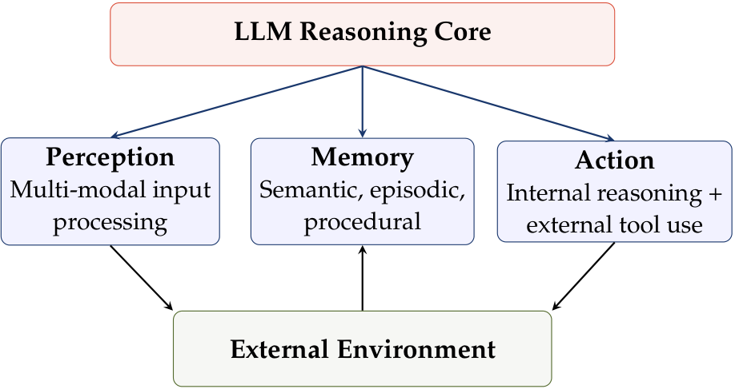
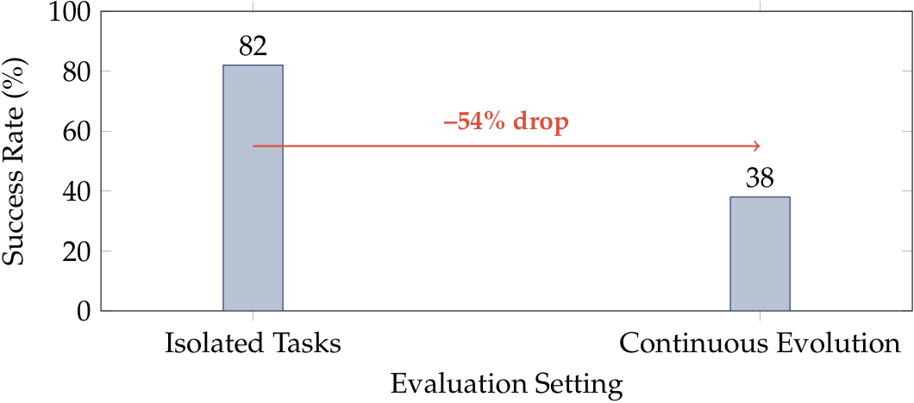

# Agentic Software（智能体软件）：AI Agent 如何重塑软件范式

Zhenfeng Cao

灵犀智能投资（深圳）发展有限公司

info@stellarsea.com

2026 年 6 月 11 日

## 摘要（Abstract）

半个多世纪以来，软件工程一直基于一个基本前提运作：人类工程师分解问题，将决策逻辑编码为静态代码，并随着需求变化手动调整代码。本文认为，AI Agent（人工智能智能体）——即以大语言模型作为主要推理引擎，动态生成并丢弃代码作为工具资源的系统——的出现，构成了对软件本质的根本性重塑，而非一次渐进式的工具改进。我们形式化了传统确定性软件与 agentic software（智能体软件）之间的区别：在前者中，代码是预先编写好的决策逻辑的载体；在后者中，agent 本身就是软件，其决策逻辑在运行时动态生成。我们追溯了从授权软件到 SaaS 再到 AaaS（Agent-as-a-Service，智能体即服务）的历史轨迹，表明每一次迁移都将额外的复杂性从最终用户那里转移走——而 agentic 迁移不仅转移了运维复杂性，更转移了决策本身的复杂性。我们提出 Agentic Engineering（智能体工程）作为软件工程学科向新范式的扩展，其核心研究对象（agent 系统而非静态源代码）、控制模型（LLM 驱动而非人类预定义）以及人类角色（意图架构师而非代码作者）均有本质区别。通过对近期基准测试证据（包括 SWE-bench Verified、EvoClaw 和 LangChain 的多智能体协作研究）的分析，我们展示了 agentic 范式的变革潜力及其当前的局限性。最后，我们提出了一个通向自我演化 agent 生态系统的四阶段路线图，并为正在经历这一转型的实践者提供具体建议。

## 1 引言（Introduction）

软件工程，正如 1968 年 NATO 会议 [1] 所确立的那样，诞生于一场危机：系统的复杂度增长超出了临时编程实践所能管理的范围。该学科的创始洞见是，严格的方法论——结构化设计（structured design）、模块化分解（modular decomposition）、配置管理（configuration management）、系统化测试（systematic testing）——能够驯服这种复杂性。五十年来，这个赌注大体上得到了回报。我们从瀑布模型（waterfall）走向敏捷（agile），从单体架构（monolith）走向微服务（microservices），从手动部署走向 CI/CD。

然而，一个更深层的结构性问题始终存在。正如 Brooks 在 *The Mythical Man-Month*（人月神话）[2] 中所观察到的，软件复杂度的扩展行为与其他工程领域有着根本的不同。不同于桥梁或电路，软件没有制造环节——设计本身就是产品。每一个新功能、每一个边缘情况、每一个集成点都会增加 Brook 所描述的"本质复杂度"（essential complexity）：问题本身固有的、非实现方式导致的复杂性。这使得可能的状态和交互呈组合爆炸式增长。

本文认为，AI Agent 的出现并不仅仅是在现有范式中提供一个新工具，而是从根本上重构了软件工程赖以建立的前提——不是终结它，而是扩展其定义。AI Agent 本身就是软件：它运行在硬件上，处理数据，产生输出。其区别不在于它脱离了软件的范畴，而在于它代表了一种新的软件——其中决策逻辑不再是预先编写好的，而是在运行时动态生成的。当一个大语言模型（Large Language Model, LLM）[12] 能够理解任务、将其分解为子任务、动态生成代码执行这些子任务，并在不再需要时丢弃这些代码，代码的角色就从**系统本身**变成**推理的短暂工具**。这一转变与从模拟电路到存储程序计算机的过渡一样根本。

我们提出三个核心主张：

1. **第一性原理必要性（First-Principles Necessity）**。Agentic 范式不是市场偏好的产物，而是复杂度扩展定律的必然结果。传统软件要求人类工程师显式地编码每一个决策；基于 LLM 的 agent 可以通过将推理外包给能力随训练计算增长而增长的模型，以非线性方式驾驭复杂性。

2. **软件被重新定义，而非被取代（Software Redefined, Not Replaced）**。从"AI → Software → Result"到"Agent → Result"的转变并不消除软件——agent 本身就是软件，只不过是一种根本不同类型的软件。它折叠了中间层：agent 同

3. **新兴学科（Emergent Discipline）**。Agentic Engineering 正在成为一门具有自己概念、工具和度量的独立实践。其实践者不是"更好的程序员"，而是一种根本不同的角色：意图架构师（intent architect）、agent 协调者（agent coordinator）和结果审计者（outcome auditor）。

本文其余部分的结构如下。第 2 节对传统软件和基于 agent 的系统进行了第一性原理分析，包括一个形式化的复杂度论证。第 3 节追溯了软件交付的历史范式迁移，并将 AaaS 定位为逻辑终点。第 4 节将 Agentic Engineering 定义为一门学科，并将其与传统软件工程进行对比。第 5 节回顾了近期基准测试的经验证据，承认突破性进展和持续存在的挑战。第 6 节提出了一个演化路线图。第 7 节总结了实践者和研究界的影响与建议。

## 2 第一性原理分析（First-Principles Analysis）

### 2.1 传统软件的本质（The Nature of Traditional Software）

我们从一个精确定义开始。

**定义 2.1**（传统软件系统，Traditional Software System）。*一个传统软件系统 S 是一个元组 S = (C, D, E)，其中：*

- *C 是一组计算资源（CPU、内存、I/O）；*
- *D 是一组编码在源代码中的确定性决策规则；*
- *E 是一个执行环境，评估 D 针对输入产生输出。*

*关键特性是 D 相对于执行是静态的：所有决策逻辑必须在系统遇到任何输入之前由人类工程师显式编写。*

根据这一定义，每一次功能添加、每一次 bug 修复、每一次对变化环境的适应都需要人类 (a) 理解所需的变更，(b) 在 D 中定位正确的位置，(c) 修改逻辑而不引入回归（regression），(d) 验证正确性。每次变更的成本是 D 的大小及其内部依赖密度的函数。

### 2.2 复杂度壁垒（The Complexity Barrier）

Brooks [2] 区分了"偶然复杂度"（accidental complexity，特定实现的产物）和"本质复杂度"（essential complexity，问题本身固有的）。虽然几十年的进步——高级语言、框架、自动化测试——已经系统性地降低了偶然复杂度，本质复杂度仍然无界。事实上，随着系统增长，组件之间的交互面呈组合式增长。

**命题 2.1**（复杂度扩展，Complexity Scaling）。*对于一个有 n 个组件的系统，每个组件可能与其他任意组件交互，可能的交互拓扑数量为 2^(n 选 2)，增长率 Θ(2^(n²))。虽然真实系统不会实现所有配置，但复杂度的上界以超指数级增长，而人类对这些交互进行推理的认知能力本质上是恒定的。*

这种错配是软件项目随着增长而边际生产力递减的深层结构性原因。传统的应对方式——分层分解（hierarchical decomposition）、模块化接口（modular interfaces）、封装（encapsulation）——降低了常数因子，但没有改变渐近行为。

### 2.3 Agentic 系统：一个形式模型（Agentic Systems: A Formal Model）

相比之下，agentic 系统基于根本不同的原则运行。

**定义 2.2**（AI Agent 系统，AI Agent System）。*一个 AI agent 系统 A 是一个元组 A = (M, T, M, Π)，其中：*

- *M 是一个大语言模型，充当推理引擎（reasoning engine）；*
- *T 是一组可执行工具（代码解释器、API、数据库、文件系统）；*
- *M 是一个记忆子系统（短期上下文、长期向量存储）；*
- *Π 是一个规划机制（planning mechanism），将用户意图分解为动作序列。*

*系统通过迭代执行来运行：a_t ← M(s_t, M), s_(t+1) ← exec(a_t)，其中 s_t 是系统在时间 t 的状态，a_t 是模型选择的动作。*

关键区别在于，在 agentic 系统中，决策逻辑是**在运行时生成的**。LLM M 可以动态生成代码、调用工具、根据中间结果调整行为——这些都不是预先编程的。它生成的代码不是系统本身，而是一个瞬态产物，按需产生和丢弃。

这一区别清晰地映射到 Karpathy 的"Software 2.0"框架 [3]，但更进一步。在 Karpathy 的表述中，神经网络用学习的权重取代手工编写的程序逻辑。Agentic 系统更进一步：神经网络不仅**取代**了程序——它**按需编写程序**，将代码作为服务于更广泛推理目标的工具。这一模式与 ReAct 框架 [9] 一致，后者证明将推理轨迹与工具使用动作交错进行可以显著提升任务性能；也与 Chain-of-Thought（思维链）[8] 一致，后者表明显式的中间推理步骤可以解锁 LLM 的潜在能力。

### 2.4 为什么 Agentic 范式的扩展方式不同

考虑一个任务 T，其解决方案需要对大小为 N 的空间进行推理。在传统范式下：

- 人类工程师必须在心理上遍历这一空间来识别解决方案路径。
- 该路径然后必须被编码为静态程序。
- 人类认知能力 C_H 本质上是固定的。
- 因此，对于 N > C_H，该任务在任何现实成本下都是不可行的。

在 agentic 范式下：

- LLM M 遍历该空间，有效能力 C_M 随模型规模和训练计算增长。
- 规划 Π 将 T 分解为子问题，每个子问题独立处理。
- 代码仅为特定的解决方案路径生成，而非针对所有可能情况。
- 随着 LLM 能力的提升（它们一直在指数级增长），C_M 相应地增长。

因此，agentic 范式将解决方案能力从人类认知限制中解耦。这不是 10% 的改进；这是一种质变，改变了哪些类型的问题可以在经济上得到解决。

## 3 从 SaaS 到 AaaS：第三次范式迁移（From SaaS to AaaS: The Third Paradigm Shift）

### 3.1 三代软件交付

商业软件的历史可以理解为复杂性从最终用户的逐步转移。表 1 总结了这一轨迹。

**表 1：三代软件交付（Three Generations of Software Delivery）**

| 代际 | 核心机制 | 复杂性承担者 | 收入模式 | 代表 |
|---|---|---|---|---|
| Software 1.0（本地） | 代码+数据在本地执行 | 最终用户（安装、维护） | 许可证销售 | Microsoft, Oracle |
| Software 2.0（SaaS） | 代码+数据在云端执行 | 供应商（基础设施、更新） | 订阅制 | Salesforce, AWS |
| Software 3.0（AaaS） | Agent 自主在云端运行 | Agent（理解、构建、运行） | 结果导向 | OpenAI, Anthropic |

每一次迁移都遵循相同的模式：最有能力吸收复杂性的一方吸收它，最没有能力管理复杂性的一方从中解放出来。SaaS 将企业从服务器机房中解放出来；AaaS 承诺将他们从指定结果**如何**产生的需求中解放出来——他们只需指定想要**什么**结果。

### 3.2 "AI → Software → Result"的失败

迄今为止，主流的企业 AI 范式一直是**AI 增强开发**（AI-augmented development）：使用 LLM 帮助人类工程师在传统软件生命周期内更快地编写代码。我们将此称为"AI → Software → Result"管道。

这种方法有三个结构性弱点：

1. **瓶颈持续存在（Bottleneck persistence）**。人类工程师仍然是设计决策、架构、集成测试和部署的关键路径。AI 加速了代码生成（实现的一个子步骤），但没有将人类从任何阶段移除。

2. **复杂度天花板完好无损（Complexity ceiling intact）**。最终交付物仍然是一个传统软件系统 S = (C, D, E)。其复杂度仍然随 D 的大小扩展，任何修改仍然需要人类理解。AI 只是使 D 的构建稍快了一些。

3. **迭代延迟（Iteration latency）**。即使有 AI 辅助，任何功能变更都需要遍历完整链条：需求 → 设计 → 代码 → 测试 → 部署。这种延迟无法降低到人类沟通和协调速度以下。

### 3.3 "Agent → Result"：Agent 即软件

替代性范式折叠了软件与其执行之间的区别：agent 就是软件。不是一个由人类构建的、产生结果的静态系统，而是一个动态系统，它推理、生成代码、执行代码并交付结果——全部在一个统一的集成循环内完成。

1. 人类向 agent 表达意图和约束。
2. Agent 自主规划、执行（根据需要生成代码）、验证并交付结果。
3. 人类审计结果并提供反馈。

在这一模型中，agent 既是软件也是其操作者。它可能生成数千行代码、执行数据库查询、调用外部 API、生成可视化——全部是短暂的，服务于结果。持久存在的不是中间代码，而是 agent 的能力。正如 Kumar 和 Ramagopal [7] 所说："AI 编码 agent 擅长在单一用户驱动的会话中将意图转化为代码。Agentic engineering 在更高的抽象层次上运作——它是一个控制平面，编排跨团队工作流，在 agent 之间维护长期记忆，并管理整个软件交付生命周期的状态和可追溯性。"

## 4 Agentic Engineering：扩展学科边界（Agentic Engineering: Expanding the Discipline）

### 4.1 定义领域

Agentic Engineering，由 LangChain 于 2026 年 4 月正式提出 [7]，被定义为"一种多 agent 协调模型，其中 AI agent 作为数字团队成员运作——每个都有明确定义的角色、共享记忆和统一的观测层——推动软件通过整个交付管道，而不仅仅是更快地生成代码。"我们认为，Agentic Engineering 不是取代软件工程，而是扩展它：agent 本身就是软件，构建、部署和治理 agent 系统只是学科的下一个前沿。

Wang 等人 [4] 提供了基于 LLM 的 agent 在软件工程中的基础分类法，识别出三个核心模块；Guo 等人 [13] 的补充调查对基于 LLM 的多 agent 系统中的多 agent 协作模式和进展进行了系统处理。

**图 1：面向软件工程的基于 LLM 的 agent 框架，改编自 Wang 等人 [4]。** 感知模块（perception module）处理多模态输入；记忆模块（memory module）维护语义、情景和程序性知识；动作模块（action module）执行内部推理和外部工具调用。所有这些都由 LLM 推理核心（reasoning core）编排。

这一架构的一个具体实现可以在 Hermes Agent [14] 中观察到，这是 Nous Research 的一个开源框架，它将感知-记忆-动作模型操作化为具有独特自我演化机制的形态。其最重要的特性是一个闭环学习过程：完成复杂任务后，agent 自主创建可复用的 Skills（技能）——参数化的程序模块——在后续使用中自我改进，当发现不足时自动修补自身。跨会话的情景记忆通过基于 FTS5 的对话搜索和 LLM 摘要实现，使 agent 能够随时间积累经验知识。该框架的子 agent 委托机制进一步展示了一个广泛部署的生产系统中的早期多 agent 协调。

### 4.2 对比 Agentic 工程与传统工程

表 2 映射了两种范式之间的关键差异维度。

**表 2：传统软件工程 vs. Agentic Engineering**

| 维度 | 传统软件工程 | Agentic Engineering |
|---|---|---|
| 核心产物（Core artifact） | 源代码（静态） | Agent 系统（动态） |
| 控制中心（Control center） | 人类工程师 | LLM 推理引擎 |
| 决策机制（Decision mechanism） | 预先设计的逻辑 | 运行时生成的推理 |
| 开发周期（Development cycle） | 线性（设计→代码→测试） | 自主迭代循环 |
| 人类角色（Human role） | 代码作者 | 意图架构师、协调者、审计者 |
| 复杂度上限（Complexity ceiling） | 人类认知（O(1)） | 模型能力（随计算增长） |
| 产出单元（Output unit） | 可运行的软件 | 交付的成果 |
| 错误处理（Error handling） | 程序员定义 | 模型自适应 |
| 演化方式（Evolution） | 手动重构 | 自我修改 |

### 4.3 重新构想人类角色

也许最重要的转变在于人类角色。在传统范式中，人的价值由编写正确、高效代码的能力来衡量。在 agentic 范式中，代码生成技能变得商品化。新的人类差异化能力是：

- **意图表达（Intent articulation）**。以足够的清晰度和约束明确目标的能力，使 agent 能够自主运行而不产生非预期结果。

- **架构监督（Architectural oversight）**。在系统层面理解多个 agent 应如何协调、什么记忆应共享、以及何处需要人类判断介入。

- **质量校准（Quality calibration）**。定义"好"是什么样子，并构建 agent 可以用于自我修正的评估框架。

- **伦理治理（Ethical governance）**。确保 agent 行为与组织价值观、法律要求和社会期望保持一致。

我们相信，这对个体实践者的影响是深远的：随着 agentic 能力的成熟，那些掌握 agent 编排的人的生产力倍增器将远超传统的"10x 工程师"基准——不是通过更快的键盘输入，而是通过协调 agent 群（swarms of agents）实现复杂成果的能力。天花板不是固定的；它随着模型能力和编排基础设施的每一次进步而上升。

## 5 经验证据与当前局限性（Empirical Evidence and Current Limitations）

### 5.1 突破性成果

经验证据为 agentic 论点提供了强有力的支持。我们突出四个代表性数据点。

**SWE-bench Verified。** Ma 等人 [5] 证明，Lingma SWE-GPT 72B，一个开放的、以开发流程为中心的模型，在 SWE-bench Verified 上解决了 30.20% 的 GitHub issue——接近 GPT-4o 的 31.80%，同时完全开放。值得注意的是，即使是 7B 变体也解决了 18.20%，证明小型模型在针对流程数据（process data）而非静态代码训练时，也可以执行有意义的自动化软件工程。这代表了相对于 Llama 3.1 405B（一个近 6 倍大的模型）22.76% 的相对改进。

**多 Agent 协调。** Kumar 和 Ramagopal [7] 报告了一项部署协调 agent 群处理 20+ 企业调试工作流的试点研究结果。协调 agent 系统将根因识别时间减少了 93%，单月节省了超过 200 个工程小时。关键是，这些收益不是来自更好的个体 agent，而是来自**编排**（orchestration）——跨 agent 维护共享上下文的能力、并行化调查的能力以及交叉验证发现的能力。

**自我演化。** Hermes Agent [14]，Nous Research 的一个拥有超过 179,000 个 GitHub star 的开源框架，提供了自我演化原则在生产系统中最完整的实现。其架构实现了一个闭环学习过程：完成复杂任务后，agent 自主创建可复用的"Skills"——捕获成功策略的参数化程序模块。关键是，这些技能在使用过程中自我改进——当技能被调用并发现不足时，agent 自动修补它，在连续交互中积累改进。这个模式——创建、使用、检测弱点、自我修补——无需人类干预即可运行，精确体现了将 agentic 系统与传统软件区分开来的自我演化动态。跨会话的连续性通过基于 FTS5 的对话搜索和 LLM 摘要实现，使 agent 能够回忆并建立在先前经验基础上。该框架的子 agent 委托机制进一步展示了在一个广泛部署系统中的早期多 agent 协调。

**泛化能力。** Wang 等人 [4] 编目了数百项将基于 LLM 的 agent 应用于全软件生命周期的研究：需求分析、架构设计、代码生成、测试、调试、部署和维护。覆盖的广度表明 agentic 模式不限于狭窄的任务，而是泛化到软件工程活动的各个方面。

### 5.2 持续挑战

尽管进展迅速，重大挑战仍然存在。EvoClaw 基准 [6] 提供了最令人清醒的数据。Deng 等人构建了一个基准，要求 agent 执行**持续**软件演化——不是孤立的 issue 修复，而是跨越提交历史的持续开发，其中每次变更必须保持系统完整性，且错误会累积。他们的关键发现：

*"综合性能得分从隔离任务上的 >80% 显著下降到持续设置中的最高 38%，暴露了 agent 在长期维护和错误传播方面的深刻困难。"* [6]

这揭示了四个核心挑战：

1. **上下文漂移（Context drift）**。随着代码库增长超出有效上下文窗口，agent 失去对系统范围的 invariants（不变量）和依赖关系的连贯理解。

2. **错误传播（Error propagation）**。早期提交中的一个小错误会级联成后续工作中的复合失败，agent 缺乏检测和恢复这些链条的稳健机制。

3. **技术债务意识（Technical debt awareness）**。Agent 目前不会建模其设计决策的长期成本——它们优化即时任务完成，而不考虑可维护性（maintainability）。

4. **验证保真度（Verification fidelity）**。自动化测试仍然不完整；agent 可以通过测试，但引入了微妙的语义错误，这些错误只在新的输入下才会显现。

图 2 可视化了 EvoClaw 揭示的性能悬崖。

**图 2：EvoClaw 基准上的 agent 性能 [6]。** 当在持续软件演化（要求在错误累积的情况下跨提交进行持续开发）上进行评估时，成功率从超过 80% 崩溃到最高 38%。数据基于对 12 个前沿模型、4 个 agent 框架的评估。

### 5.3 差距分析

隔离任务性能（>80%）和持续演化性能（<38%）之间的差距量化了当前 agent 能力与完全自主软件工程门槛之间的距离。这一差距并非根本性的——它反映了上下文管理、记忆架构和验证机制方面的局限，这些都是活跃的研究领域。但它作为一个重要的校准：agentic engineering 作为**增强**（augmentation）范式在今天已经是真实且具有变革性的，但在完全自主的软件开发在生产环境中变得可靠之前，还需要几年的集中研究。

## 6 演化路线图（Evolutionary Roadmap）

基于当前的能力和轨迹，我们提出了 agentic engineering 演化的四阶段路线图。表 3 总结了。

**表 3：Agentic Engineering 四阶段演化**

| 阶段 | Agent 能力 | 关键技术 | 人类角色 | 代表系统 |
|---|---|---|---|---|
| **I. 工具增强（Tool-Augmented）** | 代码补全、单 issue 修复、简单脚本生成 | 上下文学习（In-context learning）、RAG | 作者 + 审阅者 | GitHub Copilot, Claude Code |
| **II. 单任务自主（Single-Task Autonomous）** | 端到端功能构建、调试、基础系统维护 | 规划 + 工具使用、自我修正（self-correction） | 意图架构师 + 审计者 | Devin, OpenHands |
| **III. 多 Agent 团队（Multi-Agent Teams）** | 协调群对大系统的全生命周期管理 | 共享记忆、角色专业化、编排（orchestration） | PM + 架构师 + 审计者 | LangChain orchestration, MetaGPT [11] |
| **IV. 自我演化生态系统（Self-Evolving Ecosystems）** | 自主发现、学习、再生产、适应 | 元学习（meta-learning）、自我修改、生态系统治理 | 目标设定者 + 伦理治理者 | AGI 助手（前瞻性） |

### 6.1 第一阶段：工具增强（2023–2025）

当前的主导模式。Agent 作为人类主导工作流中的助手。突破在于编码领域：模型可以以接近专家水平生成、解释和调试代码，用于范围明确的任务。局限在于人类仍然必须分解问题、设计架构并验证正确性。

### 6.2 第二阶段：单任务自主（2025–2027）

Agent 开始从规范到部署端到端地拥有完整任务。像 Devin 和 OpenHands 这样的系统证明，agent 可以自主导航代码库、实现功能并提交 pull request。人类从"做"转变为"指定做什么并验证做了什么"。

### 6.3 第三阶段：多 Agent 团队（2026–2029）

专业化的 agent 以团队形式协调工作，映射人类工程组织的结构。"PM agent"将业务需求转化为技术规范；"架构师 agent"设计系统结构；"开发者 agent"实现组件；"QA agent"测试和验证。共享记忆和可观测性（observability）成为关键基础设施。LangChain 的试点 [7] 代表了这一模式的早期验证。

### 6.4 第四阶段：自我演化生态系统（2028+）

Agent 获得了改进自身架构、为新的问题领域生成专门化的子 agent、以及无需人类干预即可适应环境变化的能力。在这个阶段，"软件"和"agent"之间的区别完全消失——agent 就是系统，并且它持续演化。人类的参与转移到元级治理：设定伦理边界、定义价值函数、确保对齐（alignment）。

## 7 影响与建议（Implications and Recommendations）

### 7.1 对实践者

向 agentic engineering 的过渡要求有意的技能重塑策略：

1. **从代码产出转向意图工程（intent engineering）。** 最有价值的技能不再是高效编写代码，而是以足够的清晰度、上下文和约束表达任务，使 agent 能够正确执行它们。

2. **构建 agent 编排能力（orchestration competence）。** 理解如何在 agent 之间分解工作、管理共享记忆、设计评估量规，将是区分有效实践者的关键。

3. **投资观测基础设施（observability infrastructure）。** Agent 系统需要与传统软件根本不同的监控。追踪 agent 的推理链、检测幻觉（hallucinations）、衡量结果质量需要新的工具链。

4. **采用"人在回路中，agent 在驾驶座上"的姿态。** 今天最有效的模型既不是完全自主的，也不是完全人类驱动的。Agent 应主导执行；人类应主导意图、关键判断和伦理监督。

### 7.2 对研究者

几个开放问题以特别的紧迫性浮现：

1. **长上下文状态管理。** 正如 EvoClaw 所证明的，agent 在扩展的开发序列中失去连贯性。用于大规模压缩、索引和检索相关上下文的架构至关重要。

2. **开放场景中的验证。** 当前的基准测试隔离式的正确性；真实世界的系统需要安全性、可靠性和可维护性在时间维度上的保证。需要捕捉这些时间维度的新验证框架。

3. **Agent 对齐的规模化。** 随着 agent 变得更加自主并被组合成团队，确保它们的集体行为与人类价值观保持一致既变得更加重要，也更加困难。

4. **经济模型。** Agentic 服务应如何定价？结果导向定价（按解决的 issue、按部署的功能）可能取代订阅制和按量计费模型，但激励结构和风险分配需要仔细分析。

### 7.3 对组织

组织应现在开始为 agentic 转型做准备：

1. **识别 agent 就绪的工作流。** 并非所有软件工作都同样适合 agent 自动化。具有明确成功标准、定义良好的范围和现有测试基础设施的任务是理想的起点。

2. **投资评估框架。** Agent 产出的质量关键取决于评估信号的质量。组织应构建超越正确性、衡量稳健性、可维护性和与业务意图一致性的测试套件。

3. **重新设计团队结构。** 随着个体生产力通过 agent 杠杆以数量级倍增，团队拓扑结构必须演化。更小的"agent 编排者"团队可能取代更大的开发者团队，相应地带来招聘、晋升和职业发展方面的变化。

## 8 结论（Conclusion）

本文论证了 AI Agent 的出现构成了软件本质的范式迁移，而不仅仅是软件构建方式的变革。"AI → Software → Result"到"Agent → Result"的转变并不消除软件——agent 是软件，但是一种根本不同类型的软件：决策逻辑在运行时生成而非预先编码，系统可以在无需人类干预的情况下演化。这是软件工程学科的自然演进，而非其终结。

这一转变扎根于第一性原理。传统软件要求人类工程师显式编码所有决策逻辑；这一任务的复杂度随系统规模呈指数增长，而人类能力保持恒定。Agentic 软件将决策外包给 LLM，其能力随训练计算扩展，将解决方案能力从人类认知限制中解耦。这是一次质变，改变了哪些类型的问题可以在经济上得到解决。

然而，我们仍处于早期阶段。像 EvoClaw 这样的基准揭示了隔离任务性能与持续自主开发之间的鲜明差距。当前时刻需要雄心勃勃但经过校准的投资：拥抱 agentic 软件这一新范式，同时认识到完全自主系统仍然是一个需要多年研究的挑战。

Agentic Engineering 代表了软件工程学科的根本性扩展。其实践者不是学会了新工具的程序员，而是一种新型专业人才：意图架构师（intent architects），他们指挥 AI Agent 实现复杂成果。旧的软件工程没有终结；它正在成长为更大的事物。

## 致谢（Acknowledgments）

作者感谢开源社区公开研究工件（artifacts）和基准测试，以及 SWE-bench、EvoClaw 和 LangChain 的团队对 agent 评估基础设施的基础性贡献。
