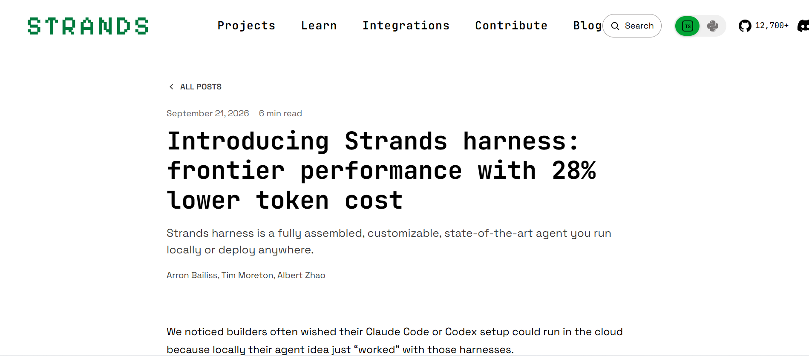
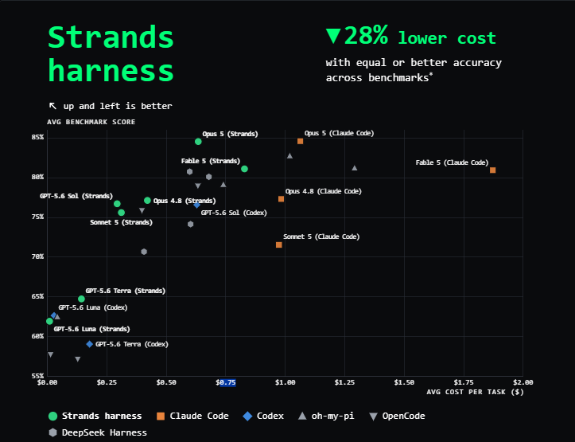
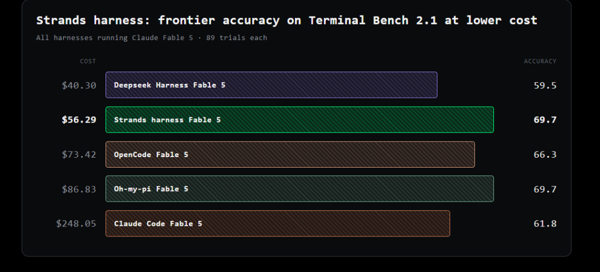
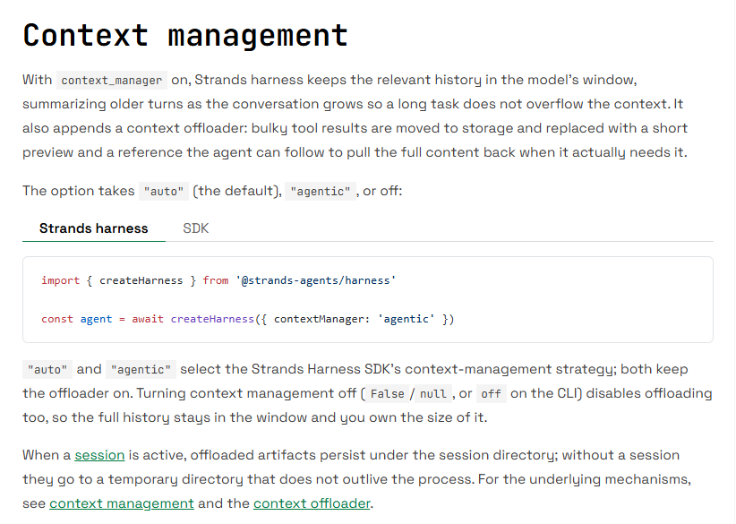
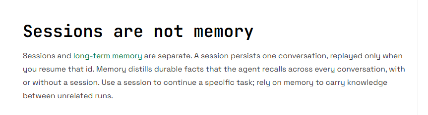
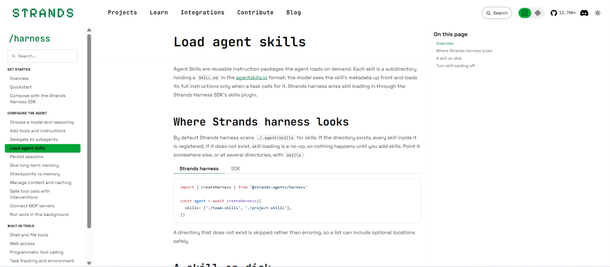

# 刚刚！AWS 开源 Strands Harness：Agent 开始只换模型、不换“身体”

> 来源：微信公众号 **DataFunTalk**（作者：DataFun），2026-09-22 13:00 发布
> 原文：<https://mp.weixin.qq.com/s/DWblbrYba92dPp9j2CnXxw>

> **导读**｜同一个 Claude Fable 5，同一个 Terminal-Bench 2.1，只换一套 Agent Harness，结果能差多少？AWS 9 月 21 日公布的自测数据是：89 个 trial 中，Strands Harness 成本 **56.29 美元**、得分 **69.7**；Claude Code 成本 **248.05 美元**、得分 **61.8**。底层都是 Fable 5，Strands 成本低约 **77%**，分数高 **7.9 分**。同场 DeepSeek Harness 更便宜，**40.30 美元**，但得分 **59.5**。这组数据来自 AWS Strands 团队自己，完整论文还没发，不能直接当成独立 Benchmark 结论；但它把一个问题推到了台前：Agent 的性能，已经越来越不只是模型决定的。

同一天，AWS 开源 Strands Harness。它不是让开发者自己拼 Agent 的 Framework，而是一套组装好的通用 Agent Runtime：Shell、文件读写、Web Search、Context Management、Prompt Cache、Session、长期 Memory、Subagent、Skills、MCP 都已接入，很多部分还带着 AWS 根据 Benchmark 调过的默认策略。过去切 Agent，往往模型和运行系统一起换；AWS 现在想把两层拆开：**Harness 保留，Claude、GPT、Gemini 甚至本地模型继续换。**

**主要内容包括以下几个部分：**

1. 同一个模型，Harness 把成本从 248 美元打到 56 美元

2. 1500 Token、85%：Strands 到底怎么压 Context

3. Context、Session、Memory、Skills 开始分层

4. Prompt Cache 之后，Agent 成本不再只是 Token 单价

5. 真正该评测的开始变成 Model × Harness × Workload

6. 结尾

图1｜Strands 官方发布页首屏：《Introducing Strands harness: frontier performance with 28% lower token cost》

---

## 01｜同一个模型，Harness 把成本从 248 美元打到 56 美元

AWS 这次专门做了一轮 Harness Benchmark。测试使用 EC2 分布式运行，由 Harbor 承担评测基础设施，覆盖 ALFWorld、ContextBench、GAIA、WebShop、τ³-bench、Terminal-Bench 2.1 六类 Benchmark，比较 Strands Harness、Claude Code、Codex、OpenCode、oh-my-pi、DeepSeek Harness 等系统。整体结果是：相同 Claude 或 GPT 模型下，Strands Harness 平均成本比对照 Harness 低约 **28%**，准确率相近或更高。Terminal-Bench 2.1 差距最明显。

图2｜Strands 官方「6 类 Benchmark 成本 × Accuracy」总览图

| Harness | 底层模型 | 89 次 Trial 成本 | Accuracy |
|---|---|---|---|
| **Strands Harness** | Claude Fable 5 | **$56.29** | **69.7** |
| oh-my-pi | Claude Fable 5 | $86.83 | 69.7 |
| OpenCode | Claude Fable 5 | $73.42 | 66.3 |
| Claude Code | Claude Fable 5 | $248.05 | 61.8 |
| DeepSeek Harness | Claude Fable 5 | $40.30 | 59.5 |

表1｜Harness Benchmark 对比：89 次 Trial 成本与 Accuracy（底层模型均为 Claude Fable 5，AWS 官方自测数据）

图3｜Strands 官方 Terminal-Bench 2.1 / Claude Fable 5 对比图

这张表有两个信息。第一，模型不变，Harness 可以让运行成本出现数倍差距：Strands 和 Claude Code 都跑 Fable 5，前者 56.29 美元，后者 248.05 美元；oh-my-pi 和 Strands 都是 69.7 分，但前者成本 86.83 美元。第二，Token 越省不等于 Harness 越强：DeepSeek Harness 只花 40.30 美元，比 Strands 低约 28%，但 Accuracy 只有 59.5。AWS 在六项 Benchmark 的总体结果里也指出，DeepSeek Harness 的 Token Efficiency 最好，平均成本又比 Strands 低约 14%，但各项得分都更低。也因为它被纳入比较，Strands 的总体成本优势才从对 Claude Code、Codex 的更大差距收窄到 28%。

Harness 的优化目标不是简单“少塞 Token”。真正难的是同时控制两件事：**哪些 Context 可以扔，哪些必须留下**；**少给模型 Token 的同时，不能把完成任务需要的信息一起删掉。**

## 02｜1500 Token、85%：Strands 到底怎么压 Context

AWS 解释，这组 Token Efficiency 很大程度不来自模型，而来自默认开启的 Context Management 和 Prompt Caching。Context 管理里有两条规则最关键。

第一条：**Tool Result 超过约 1500 Token，就开始处理。**

Agent 跑长任务时，最容易膨胀的往往不是用户 Prompt，而是工具结果：一条 Shell 命令可能吐出几千行 Log，一次搜索可能返回大量网页，一次测试执行又把整段报错送回模型。如果这些结果每轮完整留在 Context 中，后续每次模型调用都会重复支付这部分 Input Token。

Strands 的 ContextManager 可以对 Tool Result 设阈值。官方策略是超过 **1500 Token** 就 Truncate，只保留 Head/Tail Preview；原始内容不直接删除，而是写入 Stash，需要时 Agent 通过 retrieve_context 找回。传统 Truncation 是删掉、Context 变短、信息没了；Strands 是从 Context 移走、外部保存、需要时再取回。它把过去全塞进 Prompt 的上下文，变成了分层存储。

图4｜Strands 官方 Context management 文档页：Context Offloader 与 auto / agentic 两种策略

第二条：**Context 使用率超过 85% 时触发 Compaction。**

官方 Summarize 策略可以在 Context Window 利用率达到 **0.85** 时运行，同时保留最近若干条消息，例如 85% 时压缩旧内容并保留最近 4 条。AWS 的 Harness Benchmark 也用了超过 85% 自动 Summarization 的思路。Strands 不是等 Context 爆掉再救火，而是提前把长 Tool Result 外置、旧 Message 压缩成 Summary、最近工作状态留在 Context；如果处理完仍然 Overflow，Context Recovery 会直接在 Agent Loop 内继续执行，而不是让任务因 Context Length Error 中断。

这些规则看起来不复杂，但 Agent 跑几十轮后差异会累积。假设一个工具每轮返回 4000 Token，连续调用 20 次，原样留存就是 **8 万 Token** 的工具输出，模型之后每次推理还可能重复读取其中相当一部分。Harness 把已经处理过的 Tool Result 从热 Context 拿出去，省下的不是“一次 2500 Token”，而是之后多轮调用中反复读取它们的成本。这也是同一个模型换 Harness 后，Token Consumption 会出现巨大差距的直接原因。

## 03｜Context、Session、Memory、Skills 开始分层

再把 Session、Memory 和 Context Manager 放在一起看，Strands 已经不再把所有“模型记住的东西”当成一类信息。

最短期的是 Context Window，是模型当前真正能看到的内容，需要克制使用：Tool Result 太长就 Offload，Context 到 85% 就 Compact，真正需要时再 Retrieve。第二层是 Session，默认可以把完整会话状态持久化到磁盘，目录是 ./.agent/sessions；只要继续用同一个 Session ID，Agent 就能在进程重启后恢复任务，而不是从第一轮 Prompt 重来。第三层是 Long-term Memory。Strands 的 MemoryManager 把长期 Memory 分成 Recall、Injection、Extraction 三类能力：Recall 是按需搜索历史知识，Injection 是模型运行前把相关 Memory 放回 Prompt，这两项在接入 Memory Store 后默认开启；Extraction 则负责从对话中提取值得长期保留的信息并写入 Memory Store，但写入和自动 Extraction 需要显式开启。也就是说，Strands 默认更谨慎地解决“怎么读 Memory”，至于“什么应该被永久记住”，仍然交给开发者控制。

Session 保存“这段对话发生过什么”，Memory 保存“跨会话仍然值得知道什么”。这接近传统计算系统的层次化存储：**Context Window 约等于工作内存，Session 约等于当前任务状态，Memory Store 约等于长期持久化知识。**

图5｜Strands 官方 Sessions are not memory 对比说明

过去很多 Agent 把历史消息、工具返回、用户偏好、任务状态一起往 Context 里堆，Context Window 变大后短期看似问题不大，但长任务里会同时带来成本、延迟和注意力稀释。Strands 的方向相反：不是继续扩大 Context，而是尽量减少必须长期待在 Context 里的东西。Agent 真正需要的未必是无限大的工作台，而是知道什么该一直放桌面、什么应该收进抽屉。

图6｜Strands 官方 Load agent skills 文档页：Skills 按需加载说明

Skills 也用了类似策略。一个通用 Agent 如果同时会代码审查、PDF 处理、数据库分析、写邮件和部署应用，最直接的做法是把所有规则写进 System Prompt，但 Skills 越多，Agent 每次启动都要读取大量和当前任务无关的说明。Strands 的 Agent Skills 使用 **Progressive Disclosure**：默认只有 Skill 名称和 Description 进入 System Prompt，完整 Skill Instructions 不在启动时全部装进 Context，而是在模型判断需要后通过 Tool Call 加载。这和 Tool Result Offloading 是同一套思路：**不要因为“可能会用到”，就把所有东西提前塞给模型。**

AWS 预装的也不只是 Skills，create_harness() 默认包含 shell、read、write、edit、web_fetch、web_search、programmatic_tool_caller 和 subagent，同时默认启用 todos、environment 插件、长期 Memory、Prompt Caching、Context Manager，MCP Server 可以通过配置直接加入。对于开放式子任务，Harness 还内置 Generalist Subagent；主 Agent 可以把独立工作拆出去，同时通过 Todo 跟踪多步骤任务。所谓“fully assembled harness”真正做的，是把过去留给开发者自己决定的问题先给出一套默认答案：Tool 怎么组织、Context 什么时候压缩、状态放哪里、Skill 什么时候加载、Subagent 怎么调用、Cache 怎么开、任务怎么恢复。

甚至 **System Prompt 本身也被纳入 Harness 的默认策略**。Strands 的默认行为约束会要求 Agent 先探索环境再执行修改，对不可逆操作先确认，完成任务前重新验证结果。也就是说，Harness 控制的不只是模型“能调用什么”，还包括它以什么顺序行动、什么时候停下来确认、什么情况下才算任务完成。模型给出能力，Harness 开始负责把这种能力约束成稳定的执行行为。

## 04｜Prompt Cache 之后，Agent 成本不再只是 Token 单价

Context 之外，Prompt Cache 也是成本差距里容易忽略的一层。Strands Harness 默认把 caching 设为 auto，在底层 Provider 支持时利用 Prompt Cache。对于 Bedrock、Anthropic 这类支持显式缓存控制的 Provider，System Prompt、Tool Definitions 和稳定的消息前缀可以成为可复用内容，后续 Agent Loop 不必每一轮重新按完整输入成本处理。

这里同样不能一概而论：不同 Provider 的 Prompt Caching 能力并不一致。这也是为什么 Model Interface 可以尽量统一 Tool Calling、Streaming、Structured Output，却不能完全抹平底层模型 API 的差异。

**有效 Context × 调用轮数－ Cache 命中－ Offload 掉的历史内容＋ Compaction 成本＋ Subagent / Tool 调用成本**

模型价格一样，两套 Harness 最终账单也可能完全不同。这也是“Harness 本身需要 Benchmark”的原因。

## 05｜真正该评测的开始变成 Model × Harness × Workload

如果只是 Context 做得好，Strands Harness 还不足以支持“只换脑子、不换身体”这个判断。真正让这件事成立的是另一层设计：**Model Provider 被标准化到了 Harness 下面。**

Strands SDK 的 Model Interface 把 Streaming、Tool Calling、Structured Output 等能力尽量统一到 Provider 层，目前一等支持 Amazon Bedrock、Anthropic、OpenAI、Google，也能接 Ollama、LiteLLM、Mistral、Llama API、llama.cpp、Vercel 等 Provider。所以同一个 Agent，可以从 Anthropic Claude 切到 OpenAI GPT、Google Gemini，也可以直接指向本地 Ollama；模型 Provider 变了，外面的 Shell、Memory、Skills、MCP、Session 和 Context 策略不需要因此全部重写。AWS 还明确支持把同一套 Harness 部署到任何能跑 Linux Container 的环境，包括 Cloudflare Containers、Azure Container Apps、Google Cloud Run、Amazon ECS、Bedrock AgentCore 和 Modal。它同时在拆两层绑定：**模型和 Agent Harness 解耦，Agent Harness 和云平台解耦。**

但现在还不能把 Strands Harness 理解成模型已经彻底成为 CPU，拔下来就能无损更换。不同 Provider 的能力仍有差异。Strands 的 Provider 能尽量统一 Streaming、Tool Calling 和 Structured Output，但 Prompt Caching 明显受底层 API 能力限制；不同模型对 Tool Schema、Reasoning Effort、Context Window、Caching、Parallel Tool Call 的支持也不完全一致。换模型以后，Harness 可以不用重写，不代表性能一定不变。

AWS 这次自己的 Benchmark 恰恰证明：**Model × Harness 是一个组合，而不是两个完全独立的变量。** Harness 决定模型看到什么、保留什么、什么时候调用工具；模型能力又决定它能否正确利用 Harness 提供的信息。因此企业未来真正需要 Eval 的对象，可能不再只是“GPT 和 Claude 谁更强”，而是把不同 Model × Harness 组合放到自己的真实 Workload 上跑：多少钱、成功率多少、任务要多少步。这比单独看模型排行榜更接近生产环境。更准确地说，未来要评估的是 **Model × Harness × Workload**。

## 06｜结尾

AWS 这次发布 Strands Harness，表面看是又一个 Agent 开源项目，但它把过去一年越来越明显的一条变化做得更彻底了：**Agent 的 Scaling 对象正在从模型本身，向模型外面的运行系统扩散。**

当然，这是 AWS 自己的 Benchmark，后续论文仍未公开，数据还需要更多独立验证；AWS 官方也没有掩盖反例：DeepSeek Harness 的成本比 Strands 更低，只是准确率同时下降。但方向已经越来越清楚。模型仍然决定 Agent 能力的上限，但 Context、Memory、Tools、Skills、Cache 和执行循环，正在决定这颗“脑子”到底能发挥出多少。AWS 想做的，就是把后面这一整套东西固定下来：**脑子继续换，身体不用每次重新造。**

参考资料

• Strands Agents，Introducing Strands harness: frontier performance with 28% lower token cost，2026 年 9 月 21 日。

• Strands Agents Documentation，Strands harness / Configuration reference / Context Management / Memory / Skills。

• The New Stack，AWS open-sources an AI agent it says is 45% cheaper than Claude Code and Codex，2026 年 9 月 21 日。

---

## 抓取说明

- 本文由原文 HTML 转换，正文文字未作改写；图片为原图下载，共 6 张正文图（图1–图6），文件名按原文图注拟定。
- 为保证正文纯净，以下**非正文元素**未内嵌，另存于 `images/_非正文/`：页首「三步星标」引导横幅、文末 DataFun DACon 北京站广告海报、编辑器装饰图标 2 枚。
- 原文文末的「往期推荐」链接列表（8 条）与公众号页脚模板（点个在看 / SPRING HAS ARRIVED / 预览时标签不可点）属页面附属元素，未收录。
