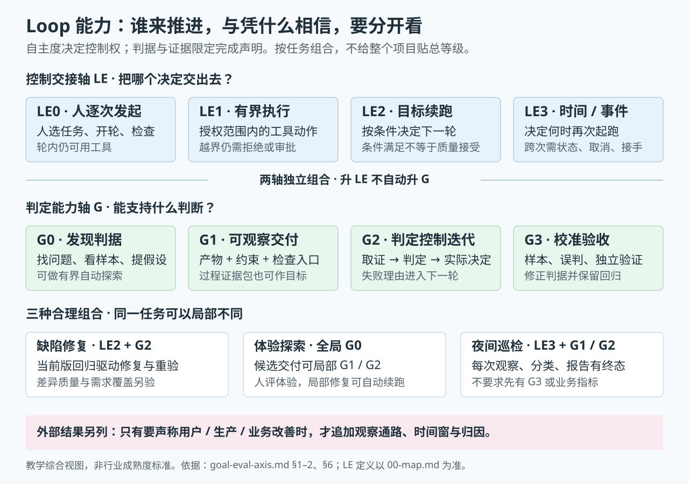
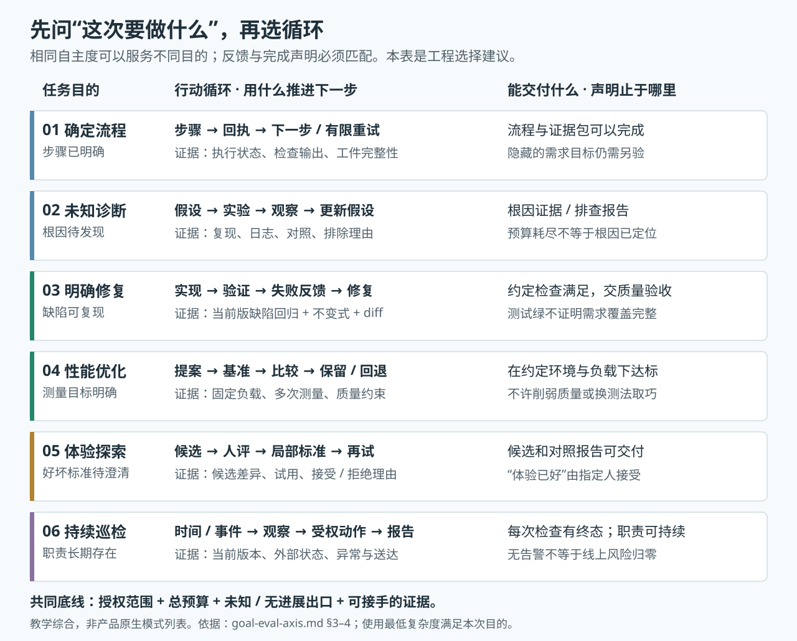
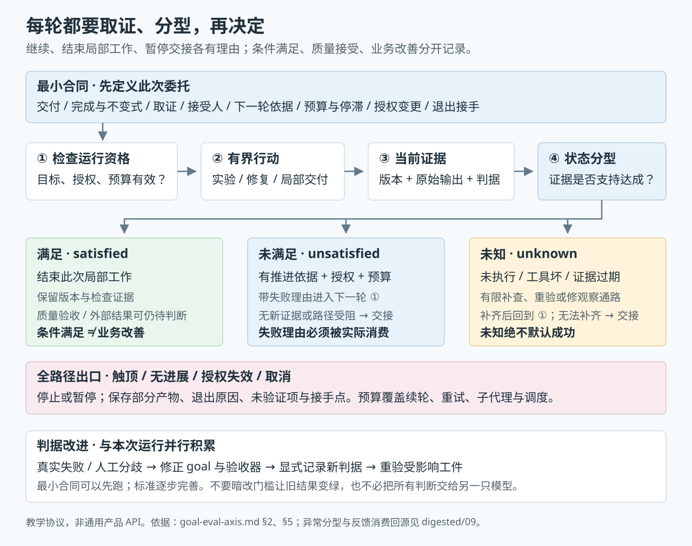

# Goal/Eval × Loop：按任务目的选择循环与验收能力

> 2026-10-05 · 跨主题研究综合。**核心判断：loop 有能力层次，但不能只排自主度；任务目的、完成条件的可判定性、授权风险共同决定采用哪种循环。** 本页提出的 G0–G3 是教学用的判定能力分层，外部结果观察另列，不把它们称为行业成熟度标准。LE 交接面的判定权威仍是 [00-map](00-map.md)；goal/eval 构造与困难分支的判读仍归 [goal/eval 专项](../../goal_eval_engineering/README.md)。

## 1. 三个直接结论

**第一，工程上应当写清 goal，但不是每项工作都能先写出一个业务分数。** 完成条件可以是环境中的布尔事实、多个约束同时满足、基准分布、专家 rubric 或指定人的接受。需要自动优化某个数时，才必须明确指标、测量协议与允许的退化；一般代码修复未必需要一个综合评分。

**第二，只有执行次序，已经足够驱动有界流程，却不足以证明最终需求满足。** “读代码→改代码→跑测试→出报告”可以自动完成；循环最多声称这些步骤确实执行且报告交付。若目的是修好某个缺陷，还须补缺陷的复现与验收。若这次目的本来就是跑一轮诊断、生成报告，那份报告及其证据完整性就是合法的产物目标。不能把所有过程型任务都判成无效 goal。

**第三，难定义 goal/eval 时，要改变本轮的委托对象。** 暂时交出“找证据、产生候选、验证假设、做可核对的小块”，把尚未表达或不可观察的最终判断留给人。探索也可以自动多轮：每轮围绕一个假设取得证据，按有限预算停止并交接；无需等到有完美 eval 才能开工。

本页的硬边界是：**继续的理由、停下的理由、验收的理由分别记录。** 可自动继续，不代表可自动验收；预算耗尽可以合法停止，但不能表示成功；测试/评分支持多大范围，完成声明就止于多大范围。

## 2. 能力层次：控制交接与结果判定分开



**图 1｜先看两轴，再看具体任务。** 蓝色是控制交接，绿色是判定能力；下方示例表明同一任务可局部组合，业务结果观察按声明需要另加。图为本页教学综合，非官方分级。

| 维度 | 解决的决定 | 本区结构 | 不能据此推出 |
|---|---|---|---|
| **控制交接** | 谁执行工具、谁续轮、何时再次唤醒 | LE0–LE3；编排 A / 元循环 B 可选支线 | 更强自主度等于更高质量 |
| **判定能力** | 能否构造可验的局部目标，让反馈进入控制路径，校准验收器 | 下表 G0–G3 | G 编号是官方级别或质量分 |
| **外部结果观察** | 用户接受、生产效果、业务指标何时出现、由谁判断 | 本页 §6，按需要附加 | 所有持久任务必须有业务指标 |

### G0–G3：围绕一个具体目标，能承担什么判断

| 能力 | 工程上实际增加什么 | 允许的运行方式 | 声明边界 |
|---|---|---|---|
| **G0 发现目标与判据** | 定位问题、记录假设、看样本、生成候选检查；最终标准尚未稳定 | 人逐轮，或有界自动探索；写入范围按 LE1 约束 | 提出可复核证据与候选；最终品质待判断 |
| **G1 构造可观察交付** | 定义对象、局部完成条件、不得改变的约束、检查入口和接受人 | 有限流程或固定预算的多轮运行；可把“生成诊断报告”本身做成可验目标 | 约定产物交付，或约定检查已运行；不扩展成业务成功 |
| **G2 用判定控制迭代** | 对当前版本取证；结果分型；失败理由回灌；成功/预算/停滞/升级确实控制下一轮 | 目标型 LE2；探索任务也可对局部交付目标使用 LE2 | 指定条件在指定证据内满足；未验收维度明确保留 |
| **G3 校准与维护验收** | 用真实失败、人工/专家标签、参考解或独立验证器发现误判；记录样本与判据版本；保留回归集 | 重复任务的 eval 调优；根据风险决定哪些检查可升级为阻断 | 在该样本和适用域内的分数、误判和接受情况；不承诺域外正确 |

**这些能力可以局部组合。** 同一项目可能对类型检查已达到 G2，对交互体验仍在 G0，对业务转化尚无观察通路；不能给整个项目贴一个总等级。G3 校准尤其适合 LLM judge 或大量重复任务；一次低风险代码修复可用独立回归验证，不必先标出一百条样本。

**LE3 不要求 G3 先完成。** 每晚定时拉取 CI 状态、执行扫描并通知人，即使最终业务结果不可见，也可以合理委派；只是没有足够验收证据时，不允许自动声称业务目标已达成。LE3 的新增要求是跨次状态、总预算、授权有效期、取消传播和接手，见 [LE3](rung-03-time-event-driven.md)。

### 最小合同先跑，真实失败再完善 goal/eval

每轮的状态分型、继续与交接出口，以及失败如何反过来改进判据，见下文 §5 的**图 3**。

goal/eval 并非必须开工前一次写完；先形成与风险相称的最小合同，再用 trace 和失败改进。**本次验收依据保持可追溯**：标准变更要显式记录，对受影响工件重新检查，不能悄悄降低门槛来证明旧实现已通过。标准不稳定时仍可继续研究，只降低自动放行的范围。

## 3. 按目的选循环，比继续爬级更重要



**图 2｜沿一行读：目的 → 循环 → 证据与声明。** 六行是并列选择，编号不是能力等级；先选与本次目的匹配的行，再查下表的细节。

图与下表是跨来源的**工程综合建议**，并非某家原生模式列表。

| 此次真正要做什么 | 最有用的反馈 | 默认循环 | 成功与停止如何区分 |
|---|---|---|---|
| **执行已确定的流程** | 步骤回执、检查输出、工件是否生成 | 顺序/状态机；失败按有限规则重试 | 步骤完成、失败、跳过分别记录；过程完成不自动等于需求满足 |
| **诊断未知问题** | 复现、日志、对照实验、能排除或支持假设的证据 | 假设→实验→观察→更新假设 | 可交付根因证据或排查报告；预算耗尽只代表诊断未收敛 |
| **修复明确缺陷** | 缺陷回归、类型/构建、有关联的回归与 diff | 实现→验证→失败反馈→修复 | 在当前版本缺陷检查和不变式同时满足后，交质量验收 |
| **优化性能/成本** | 固定工作负载、多次测量、基线比较、质量与资源约束 | 提案→基准→保留/回退 | 达标或无改进/预算出口；防止把工作负载、测量条件或质量削弱来换分 |
| **探索设计/体验** | 候选差异、真实试用、专家/用户接受或拒绝、逐块反馈 | 小批候选→人评→更新局部标准 | 一次候选集/实验报告可完成；“体验已好”须由指定接受人判断 |
| **巡检/运行维护** | 当前外部状态、事件、证据新鲜度、异常 | 时间/事件→观察→受权动作→报告 | 每次巡检有终态；长期职责可无全局完成点；取消/到期独立停止 |

**用最低复杂度满足目的。** 一份固定流程若分支已经清楚，确定性工作流通常比自由 agent 更易审计；只有下一动作确实依赖新发现时，才需要模型自主规划。多个 agent 解决分工，不修复目标含糊；自动改 harness 解决系统调优，不授予改自己的评分规则后自行放行的权力。相关机制见 [编排支线](branch-a-orchestration.md)、[元循环支线](branch-b-meta-loop.md)。

## 4. goal/eval 难写时，先判断到底难在哪

| 难点 | 本轮具体怎么改 | 何时可以扩大委托 |
|---|---|---|
| **需求本身还不清楚** | 读取真实材料，列假设/非目标/决策点；让 agent 起草局部完成条件，由负责人采用或修改 | 人能说出要交付什么，或先接受一份边界明确的调查报告 |
| **大产物核对不了** | 按可信锚点、小块事实、diff、引用拆开；每块允许接受/打回 | 局部事实和约束可以独立检查后，再组装整体 |
| **“什么叫好”只在人脑中** | 人先看真实样本，开放记录失败，再形成类型和 rubric；agent 帮助归类/起草，标准由负责人接受 | 过/不过或偏好判断可被他人稳定复用；模型裁判再与人对照 |
| **目标在系统外或晚出现** | 把可观察产物与外部结果拆成两份记录；指定谁在何时读取外部信号 | 观察通路足以支持所声称的结果；否则只放行产物 |
| **工具坏了/反馈缺失** | 先修观察通路、补取原始证据或当前版重验；有限重试后升级 | 能区分目标失败与检查失败，并确认证据到了消费者 |

前三种困难分别已有 [goal 构造](../../goal_eval_engineering/digested/01-goal-构造.md)、[难设计的三条路](../../goal_eval_engineering/digested/03-难设计.md)支撑。标准发现并非只允许人工生成：模型可提出 rubric；但“模型提出”与“人接受为有效标准”必须分开。现有 [AdaRubric 与人先标的差异](../../goal_eval_engineering/raw/evidence-2026-09-27-a6-how.md)仍保留，不能说成行业只准一条路径。

### 探索也需要合同，合同可以落在“降低什么不确定性”上

例如：“在限定模块内复现偶发超时；比较网络/锁竞争/缓存三种假设；每项保留实验输入、原始输出和支持/排除理由；交付下一步建议；到预算边界仍未定位时列明未知。”

这允许多个自动回合。**信息进展**是新复现、排除一个假设、发现证据矛盾或补齐一个缺失观测，未必是分数单调上升。若几轮只是重述同一猜测、重复同一命令、没有新证据，就应该更换调查路径或交人。

如采用严格 LE2，把“实验矩阵与报告满足约定检查”写成局部交付目标；**不能把“跑了若干轮”改名为“根因已经找到”**。最后的人审或后续调查是正常接口。

## 5. 可直接执行的最小循环协议



**图 3｜把反馈接到决定上。** 中间三支区分满足、未满足与未知；红色出口覆盖全部运行路径；底部用真实失败和人工分歧完善判据。框内“回到 ①”表示下一轮重新核对授权与预算。

以下为教学设计，不是任何产品的通用 API。任务是否需要独立 LLM grader，取决于判据：终态可程序检查就用测试/环境查询；品味与专业判断可用人/专家 rubric；模型 judge 要验证其错误边界。执行者可以运行检查，但完成依据不能仅是它自己的无证据自述；需要独立质量裁决时，接受人和判据管理应与执行者分离，不等于一定再调用另一只模型。

### 5.1 开始前写八件事

| 字段 | 必须写清的内容 |
|---|---|
| **目的与本轮交付** | 最终想改善什么；这次只交付修复、候选、实验报告还是巡检结果 |
| **完成与不变式** | 哪些事实同时满足；哪些接口、测试、范围与权限不能改变 |
| **取证方法** | 检查命令/观察源、对象版本、环境与必要原始输出 |
| **裁决与接受人** | 谁判局部条件；谁验收未自动化的质量维度 |
| **下一轮依据** | 哪种失败会回灌，失败理由如何实际进入执行上下文 |
| **预算与停滞** | 时间/费用/轮数/重试上限；何种重复或无新证据需要交接 |
| **授权与变更** | 可读写/执行什么；谁能改目标、判据或范围；变更后哪些证据需重验 |
| **退出与接手** | 成功、预算、未知、取消各自给谁交什么证据 |

### 5.2 状态分型，而非只有“绿/红”

```text
观察与判定： satisfied | unsatisfied | unknown
控制决定：   continue | finish | pause | escalate | cancel
退出原因：   condition_met | budget | no_progress | blocked | cancelled
验收记录：   pending | accepted | rejected
业务结果：   unobserved | observed（带时间窗和测量定义）
```

`unknown` 包含未执行、工具故障、版本不匹配、证据缺失等；它可以触发**有预算的补查/修复观察通路**，并非遇到一次未知立即停机，但绝不能默认成功。已知目标失败与工具故障的下一动作不同。

`condition_met` 不自动写成 `accepted`；`accepted` 不自动写成业务改善。`Impossible` 是 Claude `/goal` 等特定产品的出口，非所有循环必须具备的枚举；通用协议记录明确阻塞理由即可。资源/授权检查应覆盖外层续轮、重试、子代理和调度，而不是只写在 prompt。

### 5.3 每轮必须真正走到决定

```text
确认目标与授权仍有效
→ 依据当前假设/失败理由行动
→ 取当前对象的真实证据
→ 区分条件未满足、观察失败与条件满足
→ 满足：结束此次局部工作，保留验收/外部结果待办
→ 未满足且有下一步证据依据、授权与预算：继续
→ 未知：有限补查；不能补齐或反复无进展：暂停/升级
→ 任一路触顶或取消：保存部分产物、退出原因、未验证项与接手点
```

有红灯但控制器不读、有进度条但没有退出分支、有消息但下一轮没消费，都不能算控制闭环。反例与端到端机制见 [反馈接口](../digested/09-feedback-harness-interface.md)、[LE2 quickstart 反向实验](rung-02-goal-driven.md)。

## 6. 三份任务合同示例

**以下数值均为教学示意，须按本任务风险和成本设置，没有通用“8 轮/2 轮”标准。**

### A. 缺陷修复：有目标，缺一条可信检查

- 最终目的：空字段配置不再崩溃；本轮交付：有限范围的修复 diff 和复现/回归证据。
- 开始：先在原版本复现缺陷；新测试应在修复前失败、修复后通过，既有公开 API 保持不变。
- 判据：原始缺陷回归与相关回归通过；独立验证方保留判据和原始输出，检查未被删改来换绿。
- 边界：最多 8 轮；连续 2 轮没有新观察就交人；不自动推送或发布。
- 能声明：在指定版本、环境、测例上条件满足；需求覆盖与 diff 质量另由接受人检查。

**选法：G1→G2、有界 LE2。** 一次修复无需先建立庞大 eval 集；若此类缺陷重复出现，再做 G3 回归集与失败分析。

### B. 体验探索：目标含糊，局部产物可以清楚

- 最终目的：改善首次使用体验；本轮交付：三个可运行候选与对照记录。
- 局部判据：关键操作可走通、已有功能不破坏、同一条件下保留截图/观察；记录负责人对每个候选接受/拒绝的理由。
- 下一轮：根据人指出的具体问题收窄方向；不能自行把“看起来漂亮”生成一个总分并当最终验收。
- 边界：一次小批候选后先评；可在已批准的局部目标内自动修复已知错误。
- 能声明：候选与报告已交付、局部检查已过；最终体验由指定人接受，用户效果另观测。

**选法：全局 G0、局部 G1/G2；人评探索＋局部 LE2。** 同一任务并存多种判定能力，是正常状态。

### C. 夜间巡检：长期职责没有全局“做完”

- 目的：每天检查当前部署/依赖状态；每次交付：带版本、时间、检查范围的报告和异常通知。
- 每次终态：检查结果已分类并送达指定消费者；扫描器不可用写为未知。
- 动作：默认只读/报告；如需修复只生成候选 PR，另受测试与合并权限控制。
- 预算：每次费用/时间上限，加外层跨次限额、到期与取消；恢复后核目标、授权与证据是否仍适用。
- 能声明：此次检查覆盖的当前状态；不能因无告警就声称线上风险归零。

**选法：G1/G2＋LE3。** 不需要先有业务指标或 G3；若另要声称“用户受影响率下降”，才加外部观察、时间窗和归因评估。

## 7. 支撑结论的硬证据

本轮证据桥接索引见 [goal/eval-loop 档案](../../goal_eval_engineering/raw/evidence-2026-10-05-goal-eval-loop-bridge.md)。官方网页抓取受网络限制，该档案继承既有回源记录，**不增加独立来源票、不证明网页当前版本已重新核验**。下表引用各事实的原始归档位置。

| 一手机制/做法 | 已归档内容 | 它支撑的判断 |
|---|---|---|
| Claude Code 团队 2026-06-30 | “Tasks that have verifiable exit criteria”；成功条件或轮数上限：[A2 Source 1](../../goal_eval_engineering/raw/evidence-2026-09-27-a2-goal-more.md) | 目标续跑依赖明确检查；预算停止不同于达成 |
| Claude Code 团队 2026-07-22 | 写不出检查可先起草后改；项目规则示例“不允许无 backfill 的删列迁移”：[A2 Source 2](../../goal_eval_engineering/raw/evidence-2026-09-27-a2-goal-more.md) | goal 可以落在项目事实/约束上；未必需要综合数值 |
| LangChain 2026-06-16 | grader 可确定性/模型化；失败带反馈；链接可核而受众表达需人：[A2 Source 3](../../goal_eval_engineering/raw/evidence-2026-09-27-a2-goal-more.md) | 路径有自动检查与人判断的接口 |
| Anthropic 2026-01-09（窗边） | 能程序判则程序判；必要时模型与人补验；从 20–50 个真实失败开始：[A6 Source 1](../../goal_eval_engineering/raw/evidence-2026-09-27-a6-how.md) | 检查产出优先于把路径写死；样本建议不是任意任务的入场阈值 |
| Hamel 2026-06-29 | 拆为专家可接受/拒绝的小块；草图非上线对照：[C Source 1](../../goal_eval_engineering/raw/evidence-2026-09-27-c-hard.md) | 难 eval 时缩小核对面，局部证据再组合 |
| Yeret 2026-05-27（窗边） | output/outcome 分界；外部结果不可见时把这层责任留给人：[C Source 2](../../goal_eval_engineering/raw/evidence-2026-09-27-c-hard.md) | 业务结果与产物验收分账 |
| Hamel/Shankar 2026-09 | 人难判时先改成功定义；看裁判与人分歧后再自动调 prompt：[B2](../../goal_eval_engineering/raw/evidence-2026-09-27-b2-faq-sept.md) | 评分器也要验；不是分数越高就越好 |
| Aider / quickstart / DSH / LangGraph | 未执行与通过同值、进度不驱动停机、反馈到消费者的实际链：[反馈判读](../digested/09-feedback-harness-interface.md) | 只有检查/日志不足够；结果必须关联、投递并参与决定 |

这些证据包含**观点存在、机制、局部实战**，不全是效果实验。量化实战的主表见 [eval 调优](../../goal_eval_engineering/digested/02-eval-调优.md)：Ramp 离线/上线不同、Shopify 离线评价与打开率不同、Rippling 不同客户端反应不同，说明不能把代理内部得分当成产品收益，更不能推断本页分层的因果效果。

## 8. 工程收口

**有能力层次，按目的使用；最值得提升的是“构造可验交付、让证据控制下一步、发现验收器自己的错误”这三项能力。**

- 只有步骤：运行有限流程并记录步骤/产物；要声称需求满足，再补需求验收。
- goal 清楚：用环境检查和不变式驱动有界修复；资源、未知、停滞都有独立出口。
- goal 难写：让本轮产出证据、候选或可核对的小块；人把标准逐步说清，局部自动循环可以先跑。
- 需要持续运行：增加状态、取消、预算与接手；业务观察仅在声明业务结果时追加。

**自主度决定谁来推进；判据和证据决定能够相信什么。** 本页是有一手机制锚点的工程选择框架，供后续任务试点验证；现有研究未给出通用阈值或这套分层的净收益证明。
