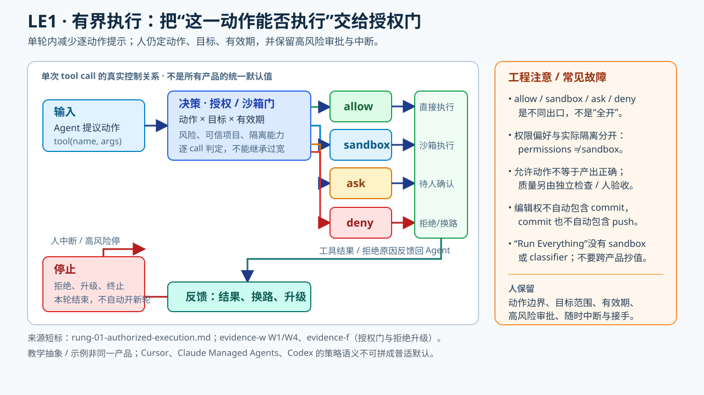

# LE1 有界执行（主线 · 机制已证）——交出单次运行中授权面内的工具动作



> **交接面**：人不再逐条批准授权面内的动作，改为划定**动作、目标与有效期**；面外动作拒绝或升级。人仍可中断并保留高风险动作审批。LE0 中一次请求的 agent 也能调用工具：本阶的增量是**授权方式**，不是首次拥有工具。

## 一、定义（跨源最小交集）

循环在**一轮之内**可依授权调用工具、执行命令、读写文件，收到失败反馈后可调整路径；人的介入点从“逐动作批准”后移到“设定与监督授权规则”，但高风险动作仍可能需要当场确认。

### 技术剖面：谁拦住一条工具调用

```text
用户任务 + 已授权范围
  → agent 提议 tool(name, args)
  → 工具/命令策略检查：显式许可？项目可信？沙箱能约束？动作危险？
  → 自动执行 | 放入沙箱 | 请求审批/修改 | 拒绝并返回工具结果
  → agent 消化结果、换安全路径或在同一轮继续
  → 本轮结束（不会仅因 auto mode 自动再开下一轮）
```

这是一张**跨产品教学流程图，不是某产品原样代码**。不同实现不能拼成一份默认配置：Cursor 对 Shell/MCP/Fetch 采用 allowlist→sandbox→classifier/人工的三级处置（[evidence-u S4a](../raw/evidence-2026-09-30-u-post-june-kols.md)）；Codex 固定版本的 `exec_policy.rs` 将危险命令、沙箱、项目信任和审批策略映射到 `Skip / NeedsApproval / Forbidden`，`Never` 对本需问人的操作可能变成**拒绝而非放行**（[evidence-f Source 1](../raw/evidence-2026-09-27-f-autonomy-gates.md)）。Claude Code auto mode 拒绝动作会作为工具结果返回，连续 3 次或累计 20 次拒绝便停机升级；这两个数字是**动作拒绝预算，不是工作轮数上限**（[evidence-b §4b](../raw/evidence-2026-09-26-b-stop-and-scheduling.md)）。

**走一遍（示意任务：在一个受限仓库内修复测试）**：

| 提议动作 | 规则应区分什么 | 学员实际查看什么 |
|---|---|---|
| 读取目标文件、跑定向测试 | 若策略显式许可或沙箱能拦住越界，则可少问人；*不是*这两个命令天然安全 | 调用参数、工作目录、实际沙箱、标准输出/退出码 |
| 修改指定文件后再测 | 写入路径、文件范围是否仍属授权目标 | diff 是否只触及约定文件；测试失败有没有被掩盖 |
| `git commit` / `git push` | “准许编辑”不等于“准许提交”；一次 push 不等于永久 push 许可 | 动作是否再次请求明确授权、目标分支与远端 |
| 提议被拒 | Claude auto mode 的例子是拒绝回传并寻找安全替代，而非换种拼写绕过 | 拒绝原因、后续动作、拒绝计数、能否升级给人 |

后三行体现的授权继承失败有第一人称事故报告（[evidence-f Source 4](../raw/evidence-2026-09-27-f-autonomy-gates.md)），表格是**练习时的检查法**，不声称各产品默认都采取同一策略。可以在低风险、可回滚的练习仓库中故意让一个面外动作请求审批，核对记录中是否真的经历了 `propose → decision → tool result`，不要拿“最终测试通过”冒充审批通过。

**再看一个实配置边界**：Cursor 官方 [Run Modes 文档（evidence-w W1）](../raw/evidence-2026-09-30-w-ladder-runtime-detail.md) 明确 `~/.cursor/permissions.json` 与项目 `.cursor/permissions.json` 管 Auto-review 倾向批准/拦截的规则，而 `sandbox.json` 管沙箱命令能访问的路径和网络；这是**策略偏好与实际隔离的两层**。同页 `Run Everything` 是每个 tool call 自动运行，**无 sandbox、无 classifier**；Auto-review 官方直说 “is not a security boundary”。故不要用宽泛 allow 规则代替真正的执行隔离，更不能把 Managed Agents worker 的 `--workdir` 当 shell 全局沙箱：其官方说明文件工具路径限制**不约束 bash**（[evidence-w W8](../raw/evidence-2026-09-30-w-ladder-runtime-detail.md)）。这些均为各产品自己的语义，不混作同一套默认值。

**常见错觉**：把“权限提示减少”当成“质量有人验”。LE1 的门只判**能否做这个动作**，不判变更对不对；若一轮结束还需人说“继续”，就尚未交出 LE2 的续跑权（[evidence-b §问题2.2](../raw/evidence-2026-09-26-b-stop-and-scheduling.md)）。

## 二、支撑条目与回源待办（⏳ 条目不计入支撑）

**② Cursor 官方语义（✅ 一手已核，2026-09-30 锚 [evidence-u](../raw/evidence-2026-09-30-u-post-june-kols.md) S4a）**
- Cursor 3.6 changelog（2026-05-29）逐字：
  > "Auto-review applies to Shell, MCP, and Fetch tool calls. **Allowlisted calls run immediately**, and **calls that can be sandboxed run in the sandbox**. **All other agent actions go to a classifier subagent** that decides whether to allow the call, try a different approach, or ask for your approval."
  > "Auto-review is a new run mode that allows Cursor to work for longer with fewer approval prompts and safer execution."
- 设置路径：Settings > Cursor Settings > Agents > Approvals & Execution；分类子代理可被用户指令 steering。
- **核销**：evidence-t §1 的 "Run Mode/Auto review/Command Allowlist" 三名词在 changelog 可见；`Run Everything` 已由 [官方 Run Modes docs（evidence-w W1）](../raw/evidence-2026-09-30-w-ladder-runtime-detail.md) 证实，且无 sandbox/classifier；`File Deletion Protection` 在已核页面仍未确认（⏳，不能引用为已证配置）。
- **界限价值**：官方把授权面切成**三级处置**（allowlist 直行 / 沙箱内跑 / 分类器裁决→人）——这正是"授权面"不是开关而是**分级处置表**的最好说明。

**③ 本仓自证（DSH 授权面即此阶实现）**——指针：[evidence-g](../raw/evidence-2026-09-27-g-dsh-control-surface.md)（沙箱模式/审批策略即 LE1 授权面的运行实例）。

**④ Anthropic auto mode：deny-and-continue 全机制（✅ 逐字，[evidence-b §4b](../raw/evidence-2026-09-26-b-stop-and-scheduling.md) → auto mode 博客 2026-03-25）**
> "When the transcript classifier flags an action as dangerous, that denial comes back as a tool result along with an instruction to treat the boundary in good faith: find a safer path, don't try to route around the block. If a session accumulates 3 consecutive denials or 20 total, we stop the model and escalate to the human."
> "The classifier sees only user messages and the agent's tool calls; we strip out Claude's own messages and tool outputs, **making it reasoning-blind by design**."
- 参数级：**3/20 拒绝熔断，官方明写不可配置**（docs：> "These thresholds are not configurable."）；headless 下无人可问→直接终止进程。
- 教学点：拒绝不是终点而是**引导信号**（"find a safer path"）＋裁判输入隔离防操纵。

**⑤ OpenAI Codex 源码级授权判据（✅ 逐字，[evidence-f Source 1](../raw/evidence-2026-09-27-f-autonomy-gates.md) → exec_policy.rs，commit 1f4c473）**
> "If the command is flagged as dangerous or we have no sandbox protection, we should never allow it to run without approval."
> "In restricted sandboxes, do not prompt for non-escalated, non-dangerous commands; let the sandbox enforce restrictions without a user prompt."
> "Projects marked untrusted require approval for every command that is not explicitly allowed by an exec policy rule."
- 三维授权判定：**危险启发式 × 沙箱能力 × 项目可信度**——授权面比"白名单"多两维。

**⑥ 工具名粒度的 interrupt policy（✅ 逐字，[evidence-f Source 7](../raw/evidence-2026-09-27-f-autonomy-gates.md) → LangChain HITL docs）**
> `"write_file": True,  # All decisions (approve, edit, reject) allowed`
> `"read_data": False,  # Safe operation, no approval needed`
> "the action can be approved as-is (`approve`), modified before running (`edit`), or rejected with feedback (`reject`)."
- 人在环三动作：approve / **edit** / reject——"edit"是授权面里最容易被忽略的中间选项。

**⑦ 授权语义的三重边界（✅ 反例，[evidence-f Source 4](../raw/evidence-2026-09-27-f-autonomy-gates.md) → claude-code issue #95749）**
> "Editing files must not imply authorization to commit."
> "Authorization to commit must not imply authorization to push."
> "Authorization for one push must not become standing authorization for later pushes."
- 授权的三个独立维度：**动作类别 × 目标 × 时间有效性**——窄授权被当广授权用是真实事故报告。

**⑧ LE1↔LE2 的官方分界线（✅ 界限信号，evidence-b §问题2.2）**
> "Auto mode on its own approves tool calls **within a single turn** but doesn't start a new one. Claude stops when it judges the work done."
- LE1 的自主度**封顶在单轮内**；跨轮续跑权是 LE2 才交的东西。这句是两阶之间最硬的界限。

## 本阶 dissent

- **预写规则实测证伪**（[evidence-c 4a.1](../raw/evidence-2026-09-26-c-autonomy-and-convergence.md) → marmelab 引 arXiv 2608.27443）：> "The rule writers blocked **20.1 percentage points** fewer bad actions… **93% of permission prompts get approved**. **A rule that ends in a prompt isn't a rule.**"——授权面写了没人执行是实测结论，不是猜测。
- **行业执行缺口**（evidence-c → marmelab 2026-09-24 审计）：> "Everybody writes instructions, **almost nobody enforces them** … Only **12** of the 391 repositories commit a single `deny` rule."
- **拒绝后无升级路径**（evidence-f Source 3 → issue #67519）：> "The denial is final, even when the user is actively in the conversation and has explicitly, repeatedly authorized the exact action in chat."——升级可达性是独立于拒绝合理性的第二个控制问题。

## 反例位

- 授权面过大＝LE1 直接升级成事故面：命令级越权的第一人称事故在 [evidence-f Source 4](../raw/evidence-2026-09-27-f-autonomy-gates.md)（与 ⑦ 同源——窄授权被当广授权，14 文件直推 main）：
  > "Claude Code implemented and pushed commit 46a9356 directly to origin/main even though I had not asked it to commit or push this feature."
  > "The only earlier push authorization concerned a separate two-line change in commit afb8c13. Claude incorrectly treated that narrow authorization as permission to publish a later, substantially larger feature."
  资源层失控（烧钱/僵尸循环）另见 [stop_conditions practices ②](../stop_conditions/02_hard_caps/README.md)，与授权面分开教学。
- "Run Everything 只在 demo 用"——中文传播层与 Anthropic 分档口径同构（evidence-t §3），升阶前先核对官方原文。

## 四、升 LE2 的闸门

授权面内的执行可减少逐动作打断，但必须先能**界定可做动作、拒绝与升级路径**；测试/机器闸门能降低产出风险，不能取代沙箱和动作授权。要再交出跨轮续跑权，还需可观察的完成条件、资源上限与独立验收边界。对应做法见
[`stop_conditions/01_machine_gates/`](../stop_conditions/01_machine_gates/README.md) 与 [`03_verdict_split/`](../stop_conditions/03_verdict_split/README.md)。
