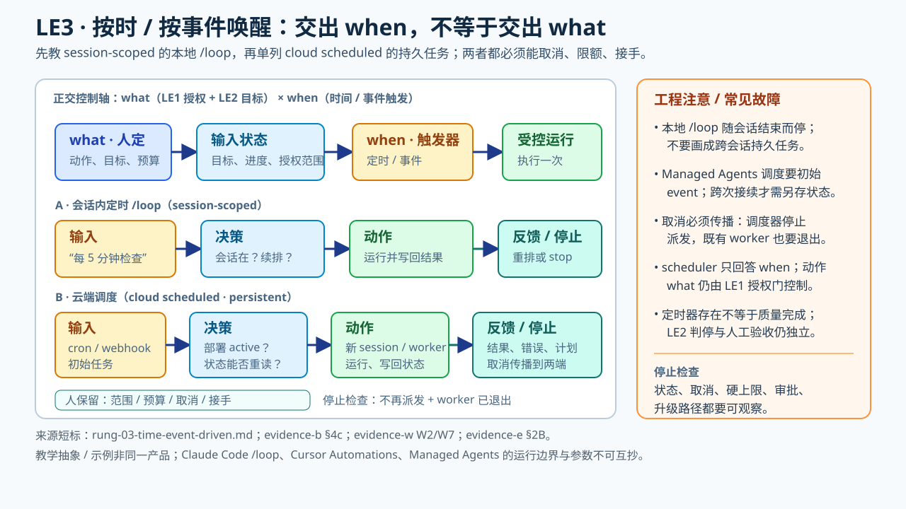

# LE3 按时/按事件唤醒（主线 · 机制已证）——交出再次起跑的时机



> **交接面**：时间表或事件源决定**何时再次启动**，人设范围、跨次成本边界、取消方式与升级路径。**会话内定时续跑**（如 Claude Code `/loop`）与**跨会话持久任务**（如云端调度）是不同运行边界：后者才可能在人不在场、会话结束后继续运行。Managed Agents 可选的 budget 只约束每个 session；需要跨次总额时由外层另设账本与熔断（[evidence-w W6](../raw/evidence-2026-09-30-w-ladder-runtime-detail.md)）。

## 一、定义（跨源最小交集）

本阶交出启动时机，而不是默认交出会话存续或所有高风险动作的授权。教学先演示会话内唤醒，再讨论跨会话持续运行所需的持久状态、取消传播与可达的人工接手；两者都需界定资源预算。

### 技术剖面：一次唤醒要接上哪些状态

```text
触发器（固定间隔 / 动态间隔 / 事件）
  → 判断任务还有效吗？会话还在吗？取消是否已传播？
  → 读取上次运行的目标、进度与授权范围
  → 启动受控迭代；写回结果 / 错误 / 新的唤醒计划
  → 达到目标、硬上限或人工停止时终止后续唤醒
```

这张图是**跨实现检查清单**：调度只解决 **when**；操作权限仍由 LE1 的 **what** 管，达成判断仍要看 LE2 的目标与验收。OpenClaw 的原句是 “Standing orders define what the agent is authorized to do. Automations define when it happens.”（[evidence-e §2B](../raw/evidence-2026-09-27-e-cross-feature-observability.md)）。跨会话的“读取进度”还要求另有持久化实现，不能从存在定时器推出来。

| 跑法 | 实际入口与轮间状态 | 切断什么会停 | 源中可核的机制 |
|---|---|---|---|
| **会话内定时** | 官方 `/loop 5m check the deploy`：每隔 5 分钟再跑该提示；也可省略间隔，由 Agent 在 1 分钟至 1 小时内动态选择下一次唤醒 | 会话退出便不再靠这个本地循环持续执行 | `ScheduleWakeup` 可用 `stop: true` 取消；未续排时约 20 分钟兜底；遗忘循环 7 天到期，见 [evidence-b §4c 与问题2.2](../raw/evidence-2026-09-26-b-stop-and-scheduling.md) |
| **跨会话持久任务** | 云端调度把触发配置与执行环境放到可在本地会话之外存活的一侧；持久日志/进度需在后续执行时重读 | 停止一条任务须核对调度器与正在运行的 worker **都收到取消** | `/schedule` 跨 session 的界限见 [evidence-a D10](../raw/evidence-2026-09-26-a-originators.md)；`emitEvent(id,event)`、失败后 `wake(sessionId)` 是 Anthropic Managed Agents 的**另一种**持久执行实现，见 [evidence-b §问题2.5](../raw/evidence-2026-09-26-b-stop-and-scheduling.md) |

**走一遍（示意值班任务，不是实测日志）**：先在开着的会话里设 `/loop 5m check the deploy`。一次迭代见 CI 仍在跑→约定只记录状态/等待，不把“未红”当“部署成功”；下次醒来若 CI 失败→保留错误日志、通知人，而不是擅自扩大为生产推送。要改成夜间云端任务时，必须额外明确重启后从哪读部署 ID、上次结果、谁可取消、同一失败事件重复投递怎么办；**幂等键与防重入是此示例的设计检查，不声称 `/loop` 默认自带**。官方 `/loop` 的过期和兜底也不等于云任务的默认上限。

**跨会话参数长什么样**：[Managed Agents scheduled deployment（evidence-w W7）](../raw/evidence-2026-09-30-w-ladder-runtime-detail.md) 的例子是 `ant apply deployment.md`，声明 `agent`、`environment_id`、`schedule.type: cron`、`expression: "0 20 * * 5"`、`timezone: America/New_York`，还必须有初始 `user.message` 或 `user.define_outcome` 告诉**每次**新 session 干什么；可看 `schedule.upcoming_runs_at` 校验下次起跑点。缺初始事件，即使 cron 正确也不会凭空产生任务。这是 Managed Agents 的 scheduled deployment，不是 Claude Code 本地 `/loop` 语法。

[Cursor Automations（evidence-w W2）](../raw/evidence-2026-09-30-w-ladder-runtime-detail.md) 则把 cron、GitHub/GitLab/Slack/Linear 事件或 webhook 与云端 Agent 绑定；创建时选择工具和 repo（可多 repo/无 repo），保存并激活后 webhook 才生成 URL/API key；cron **可能延迟，但不早于指定时间**。官方还说 fork 发来的 PR 触发会以 “Fork pull requests not supported” 失败。这些是各平台的**具体失败出口**，不能反向套给会话内 `/loop`。

**最容易漏的失败现场**：[孤儿自动化 issue](../raw/evidence-2026-09-28-o-runaway-incidents.md) 中用户关掉自动化，实际 `tmux` worker 却没收到 kill。检查停止不能只看“控制台已关”，要核对 scheduler 不再派新任务、既有 worker 确已退出、外部副作用不再发生；这三项是针对事故的工程化验收问题，不是假定所有产品实现同一种取消协议。

**结果可信闭环**：[交接页](result-reliability-interface.md) 用夜间扫描和部署监视对比同一 LE3 触发器下的完成证据。跨会话任务除取消与成本，还要保存目标/判据版本和可复核的观察结果；若业务结果尚不可见，状态应为“产物/检查条件已达成，业务待观察”，不能用运行次数或唤醒成功率替代质量。这里是按任务风险提出的联调检查，非产品通用默认配置。**跨会话反馈的增量核查（2026-10-04 增；逐机制判读见 [digested/09](../digested/09-feedback-harness-interface.md)）**：跨次结果关联（恢复后旧证据以什么资格复用——未见一手机制，保持未知）、迟到/重复结果在消费前先核归属、人变更后在途 worker 的处置（消息发出≠worker 已停）。取消三面核查（本页「失败现场」）不因此重复或扩展。

## 二、支撑、反例与回源待办（⏳ 条目不计入支撑）

**① Runkle event-driven loop（✅ 逐字见本档 ⑧，[evidence-b 问题2 §5「LangChain 四环的调度环」](../raw/evidence-2026-09-26-b-stop-and-scheduling.md)）**
- 四环之三：事件 / 定时 / webhook 触发，agent 是更大系统内持续运行的组件而非手动调用——逐字引句即 ⑧。触发词以源文为准；台账综合节自撰的「channel」一词无逐字，不引用。（旧锚「§4e」有误：§4e 只含 verification loop 与四环表格第 2 行，event-driven 行原文未入档。）

**② CC 团队 time-based / proactive 两类（[evidence-a D3](../raw/evidence-2026-09-26-a-originators.md)）**
- > "For these, you can trigger when Claude runs with /loop, which re-runs a prompt on an interval."（[evidence-a D3](../raw/evidence-2026-09-26-a-originators.md)）
- `/loop` 的 7 天到期见 [evidence-b §4c](../raw/evidence-2026-09-26-b-stop-and-scheduling.md)；auto mode 的 3/20 拒绝熔断见同档 §4b。两者分别管**调度寿命**与**动作审批**，后者并非本阶专属，也不能代替跨会话任务的停止上限。

**③ Osmani 的实践界限（[evidence-a](../raw/evidence-2026-09-26-a-originators.md)，[2026-08-14 原文 Fine print](https://addyosmani.com/blog/practical-loop-engineering/)）**
- > "loops are session-scoped … If you need something that outlives your session, /schedule runs it in the cloud."——先教“再次唤醒”，再单列“跨会话持久”所需保障。

**④ Cursor `/loop` 官方语义（✅ 2026-09-30 锚 [evidence-u](../raw/evidence-2026-09-30-u-post-june-kols.md) S4b）**
- Cursor 3.5 changelog（2026-05-20）逐字——**三种唤醒条件**，与 CC 分类同构：
  > "With /loop, Cursor can run a prompt repeatedly **on a local schedule**, **until a certain outcome is achieved**, or **until you stop it**. If you don't specify a fixed interval, **the agent decides when or what event should wake it**."
- 注意第三个分句：**唤醒时机本身可以交给 agent 决定**——LE3 内部还有一层"触发权"的微阶梯（人定间隔 → 人定结果条件 → agent 自主唤醒）。

**⑤ LE2↔LE3 分界的最清晰表述（Ronacher，✅ S1）**
- > "There is already an **agent loop** inside every coding agent. The model calls a tool, incorporates the result, calls another tool, reads a file, edits a file, runs tests, and eventually produces some answer. … The other loop is the **harness level loop: the loop outside the agent loop**."
- 教学价值：Ronacher 区分工具调用所在的 agent 内循环与决定是否重新驱动它的 harness 外循环；**内外是控制层次，不是会话边界**。`/goal` 也可能使用外层继续判定；跨会话持久性须另看调度器。

**⑥ 本阶的人本成本证词（Ronacher，✅ S1——dissent）**
- > "In the harness operated loop **I'm not sure what my role even is**. Even the 'done' signal loses all meanings … **My role is reduced to that of a messenger**."
- > "If attackers and reporters loop, defenders will eventually need to loop too to keep up."（不可退出的趋势证词）
- 教学时并列给出：无人值守可能让人的“done”判断变得模糊；**LE3 交出的是触发权，不是成果裁决权**。必须另外指定可复核判据与接手者。

**⑦ 官方终止栈（✅ 逐字，[evidence-b §4c](../raw/evidence-2026-09-26-b-stop-and-scheduling.md) → CC scheduled-tasks docs）**
> "Recurring tasks automatically **expire 7 days** after creation. The task fires one final time, then deletes itself. This bounds how long **a forgotten loop** can run."
> "If an iteration ends without either rescheduling or stopping, Claude Code schedules one **fallback wakeup about 20 minutes later** and ends the loop when that iteration doesn't reschedule either."
> "Claude calls the `ScheduleWakeup` tool with `stop: true`, which cancels the pending wakeup immediately."
- 这是**该 `/loop` 机制**的终止路径：人 Esc、模型自停、未续排时的 20 分钟兜底、7 天到期；不等于所有跨会话任务都有同样的默认保护。
- 无 prompt 时循环干什么也有官方规格（范围封顶＋不可逆动作须有授权继承）：> "Claude does not start new initiatives outside that scope, and irreversible actions such as pushing or deleting only proceed when they continue something the transcript already authorized."

**⑧ 环定义原文（✅ Runkle/LangChain，2026-06-16，[evidence-b §问题2.5](../raw/evidence-2026-09-26-b-stop-and-scheduling.md)）**
> "The event-driven loop connects your agent to your ecosystem. An event fires — a new document lands, a schedule triggers, a webhook arrives — and the agent runs. **The agent isn't something you invoke manually**; it's a component running continuously inside a larger system."

**⑨ LE1×LE3 正交分界句（✅ OpenClaw，[evidence-e §2B](../raw/evidence-2026-09-27-e-cross-feature-observability.md)）**
> "Standing orders define **what** the agent is authorized to do. Automations define **when** it happens."
- 授权面（what）与触发器（when）是两个独立旋钮——教学时别让学员把"常设授权"和"定时触发"混成一个决定。

**⑩ 事故与产品化闸门（✅ 反例，[evidence-o](../raw/evidence-2026-09-28-o-runaway-incidents.md)）**
- zombie 循环穿透显式关闭（issue #46787）：> "2 'ralph' automation loops … I had explicitly turned these off days earlier, **but the kill did not propagate to the actual tmux sessions**"
- doom-loop 检测产品化（OpenRouter）：> "That's a doom loop: **the run keeps spending money without getting anywhere.** … recommended defaults: observe@2, block@3, stop@6"——**默认关闭**也是要点。
- 硬超时样本（Copilot cloud agent，[evidence-i Source 8](../raw/evidence-2026-09-27-i-high-influence-control.md)）：> "maximum execution time of **59 minutes** … cannot be extended or bypassed."

## 本阶 dissent

- > "**a loop running unattended is also a loop making mistakes unattended**" / "**done is a claim and not a proof.**"（Osmani，[evidence-a D7](../raw/evidence-2026-09-26-a-originators.md)）
- > "An AI agent is an LLM **wrecking its environment in a loop**."（Willison 转引 Solomon Hykes，[evidence-i Source 4](../raw/evidence-2026-09-27-i-high-influence-control.md)）
- 放权卡点（Böckeler）：行为面 harness 尚不足以支撑减监督——见 rung-02 dissent 引句；LE2→LE3 之间最宽的沟。

## 反例位（补充指针）

- 无人值守×失控＝最危险的组合：失控实录三案（资源层失控，锚 [stop_conditions/02_hard_caps](../stop_conditions/02_hard_caps/README.md) practices ②）即本阶事故面；zombie 穿透显式关闭的逐字引句已在 ⑩（evidence-o S2），无需另搬。
- **传播层未讲无人值守**（[evidence-t](../raw/evidence-2026-09-30-t-shenmejiaoqq-video-zh.md)）：视频从 goal 直接讲并发，没有介绍持久运行的额外风险；这是一处叙事遗漏，不证明必须先掌握 LE3 才能并发。

## 四、可选方向：编排与元循环

从有界任务可直接探索[多主体编排](branch-a-orchestration.md)，不必先做跨会话无人值守。另一条是[改进循环本身](branch-b-meta-loop.md)：先由人审核修改建议，再讨论外围件的受控应用；自动改核心判据仍未成熟。两者均不是本阶后必修的高阶方向。

## 五、与缺口的关系

feature 级四列空矩阵（授权史/priority 变更/业务阻塞原因/跨 feature 验收，[`digested/07`](../digested/07-控制问题矩阵.md)）
在本阶**最疼**：人不在场时，这四列是"回来之后还能不能接上"的全部依据。LE3 档后续把四列作为观察清单挂靠。
