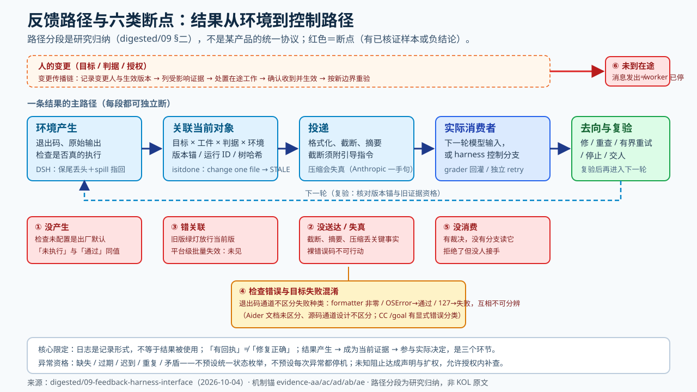
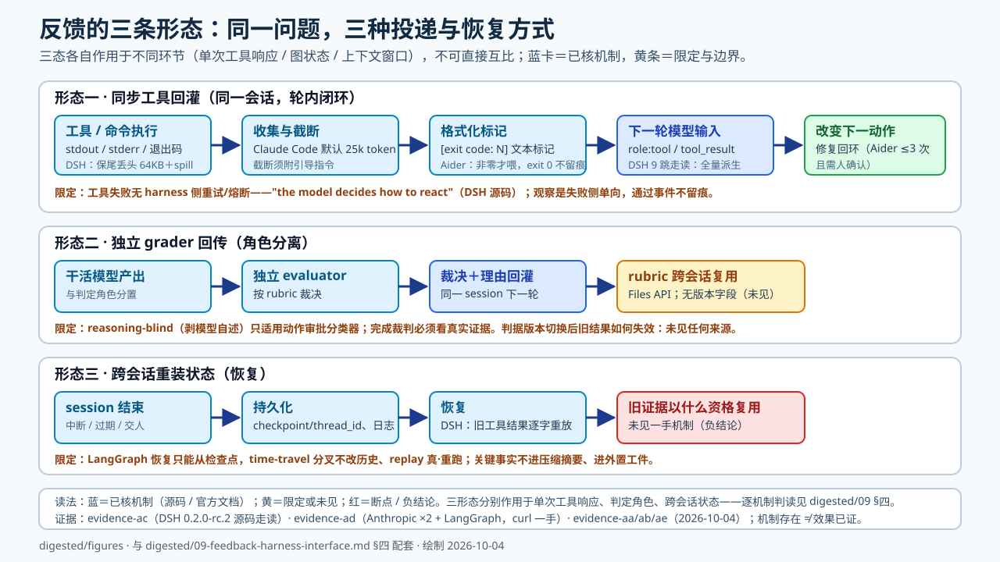

# 09 · 反馈接口判读：结果从环境到控制路径，Loop 对 Harness 的能力要求

> **性质**：初步判读（P-mechanism 为主，2026-10-04）。回答一个问题：**为什么有日志、有检查，循环仍然失控？** 本文把「反馈参与下一步」拆成机制链，给出 Loop 层对 Harness 层的能力要求与边界。
> **边界**：本篇不把 Feedback 立为与 Goal/Eval 并行的新分类，不宣布「反馈是停止条件第四骨架」——反馈接口是既有控制件真正作用于执行路径的条件（2026-10-04 用户确认范围时定）。概念区分标「研究归纳」，不冒充 KOL 原文；无阈值不造数字；模型自述不计实际消费证明。
> **证据**：[aa](../raw/evidence-2026-10-04-aa-observation-error-semantics.md)（观察与错误语义·Aider）· [ab](../raw/evidence-2026-10-04-ab-association-timeliness-admission.md)（关联时效与准入）· [ac](../raw/evidence-2026-10-04-ac-delivery-consumption-dsh.md)（DSH 源码端到端走读）· [ad](../raw/evidence-2026-10-04-ad-delivery-consumption-web.md)（投递消费网页一手）· [ae](../raw/evidence-2026-10-04-ae-human-change-inflight.md)（人的变更与在途）；既有 evidence-b/f/p/w、evidence-g、digested/03/07/08、result-reliability-interface。

## 一、反馈是什么，怎样发挥控制作用

**四种形态必须分开**（研究归纳）：

| 形态 | 例 | 控制链落点 | 常见偷换 |
|---|---|---|---|
| 观察事实 | 退出码、原始输出、树哈希 | Environment Feedback | 把转述当观察 |
| 诊断解释 | 「失败是因为缓存」 | 模型或人的解释，可错 | 把解释当事实 |
| Eval 裁决 | `Met` / `Not yet met` / `Impossible` | Eval / 裁判 | 把裁决当验收 |
| 人的新判断 | 改目标、改判据、撤授权 | Goal / Authority | 把消息发出当变更生效 |

**本篇核心限定：日志是记录形式，不等于结果被使用。**「结果产生 → 结果成为当前证据 → 证据参与实际决定」是三个环节，每个都可独立断（研究归纳；断点机制见 §二）。正面样本：`/goal` 三值判定把「未达成的理由作为下一轮指导」（[manual §2](../../../../../03_practice/loop_governance/result/manual.md)，CC `/goal` 语义·evidence-b）；LangGraph 的 durability 三档直接决定结果何时**有资格**被下一轮消费（[ad L5]）。

**内存工具返回与确定性控制器直接判断同样成立**：最小反馈通路就是同步工具回灌——工具结果回到上下文并改变下一动作，不需要独立 grader（[ad]；Aider 编辑—lint 环，evidence-i）。反向限定：**「有回执」≠「修复正确」**——isitdone 的签名回执只证明「工作树哈希与上次通过时一致」（[ab M1]），不证明业务正确。

## 二、反馈路径在哪些地方断

**图：反馈路径与六类断点**（figures/feedback-path-breaks.svg，2026-10-04）——主路径五段＋断点①–⑥；与下表逐条对应。

六类断点（研究归纳，每类给机制锚或反例锚）：

| # | 断点 | 锚 |
|---|---|---|
| 1 | **结果没产生，且与「通过」不可区分**：检查未配置是出厂默认态（`--test-cmd` 默认空、`--auto-test` 默认关，[aa S3]）；`/test` 未配置时**静默 return**，模型与用户都得不到「没执行」的信号（[aa S4a]）；更关键的是 auto-test 开而 test-cmd 未配时 `test_outcome` 被记为 True——**「没执行」在 outcome 通道里与「通过了」同值**（[aa S4c]）；exit 0 时输出不进 chat，通过事件在对话里不留观察记录（[aa S2/S4b]） | [aa] |
| 2 | **没送达/送达即失真**：截断、摘要、压缩丢关键事实 | Claude Code 工具响应默认 25,000 token 上限＋截断须附引导指令（[ad W1/W2]，机制与建议分标）；**compaction 一手负面句**："This happens even with compaction, which doesn't always pass perfectly clear instructions to the next agent."（[ad H1]） |
| 3 | **旧版结果误用**：上一次通过的证据被当成当前版本的放行依据 | 树哈希回执「change one file and the receipt reads STALE」（[ab M1]，树粒度触发）；平台级批量失效规则**未见**（[ab 负结论 1]） |
| 4 | **检查错误与目标失败混淆**：退出码通道不区分失败种类 | formatter 改文件的非零退出会 "confuse aider into thinking there's an actual lint error"（[aa S1b] 官方原话）；lint 进程拉不起（OSError）被记成**通过**、命令不存在（127）被记成**失败**——同一类「工具坏了」随故障层次分别落入两态（[aa S4d]）；对照：CC `/goal` 把四类不可恢复错误清空目标与普通错误三次重试暂停分开（evidence-b，[aa 对照节]） |
| 5 | **裁决没有消费者**：红灯打出来，没有任何分支读它 | 验收分离的动机（digested/03 §一）；[ad H5] 把完成度放 `passes` 字段而非对话/摘要——让裁决有固定消费者 |
| 6 | **人的变更未到在途执行者** | 孤儿自动化反例：kill 未传播到 tmux worker（rung-03 §⑩）；「消息发出≠worker 已停/已生效」（[ae]） |

## 三、Loop 对 Harness 的能力要求（七项）

每项按「要求—机制—缺失反例—最小核查—缺失时委托边界」。**这是 Loop 层对 Harness 层的接口清单，不是新分类**：

| # | 要求 | 已有机制锚 | 缺失反例 | 最小核查 | 缺失时的委托边界 |
|---|---|---|---|---|---|
| 1 | **观察真实结果**：退出码与原始输出可复查，未执行≠失败 | 机器闸门（digested/03）；[aa] 三例雏形（通过=exit 0 全部、未执行=outcome 同值、失败=原文直灌） | 「没跑检查」在 outcome 通道与「通过」同值（[aa S4c]） | 原始输出位置＋本次实际执行的检查清单 | 委托人执行或保持 LE0/LE1，不写自动 `Met` |
| 2 | **关联当前对象**：结果绑定目标×工件×判据×环境版本 | 树哈希回执（[ab M1/M2]）；会话三元绑定（[ab M5]）；run↔触发器×repo（[ab M10]） | 旧版绿灯放行当前版 | 每份证据写版本锚；变更后列受影响证据 | 不声称「当前版本已通过」，只声明历史 |
| 3 | **呈送可行动信息**：错误可行动、截断附指令、关键事实不进有损摘要 | "specific and actionable"（[ad W3]）；截断＋引导指令（[ad W2]）；DSH spill 文件脚注指回全文（[ac]） | 裸错误码/堆栈丢上下文 | 交付物里能指出「据此做什么」 | 改聚合型工具，工具侧消化中间输出（[ad W6]） |
| 4 | **使消费者能读取与恢复**：checkpointer/resume pointer 存在 | interrupt 依赖 checkpointer（[ae]；evidence-f）；thread_id 主键（[ad L1]）；pending writes 不重跑（[ad L3]）；DSH 中断尾轮合成带安全指导的 isError closers（[ac]） | 无 checkpointer 则暂停后无法按 thread 恢复（evidence-f 明写） | 恢复指针字段有值；恢复后旧状态处理明确 | 只做会话内有界任务，不开跨会话 |
| 5 | **保护证据与判据**：裁判输入不被当事人改写 | 测试不可删改＋JSON 清单（digested/03 保护条款族）；reasoning-blind **仅适用动作审批分类器**——2026-10-04 裁定按角色拆句：完成裁判必须看真实证据，防操纵走判据保密/清单保护等其他机制，现有 auto mode 工程文一手足够支撑，无需新增回源（实践层 manual §4 已同步拆句） | 完成裁判被喂模型自述 | 判据所有权在执行者之外；输入按角色分 | 人持判据或独立检查者 |
| 6 | **暴露预算与中断**：budget 耗尽、interrupt 可达、拒绝预算可见 | 硬上限落在真实反馈路径（result-reliability 资源行）；在途请求 bounded overshoot（[ab]）；Aider 反射上限 3 次（[aa S4c]） | 面板「已关闭」但 worker 未停（rung-03） | 中断入口点得到；budget 与质量分分账 | 有界单轮＋人守熔断 |
| 7 | **留下决策与接手依据**：消费链、决定来源、接手渠道可追溯 | 审批归因字段 `source=AutomatedReviewer/User`（[ab M8]，**未合并 PR**）；result-reliability 跨次责任行 | 拒绝后无人接手（digested/03 §三反例） | 每个裁决写决定来源与去向 | 不升档；停在人守 |

## 四、跨实现比较：三条形态各追一条路径

**图：三条形态泳道**（figures/feedback-three-forms.svg，2026-10-04）——每条泳道的已核机制、限定与未见项；蓝＝已核机制、黄＝限定、红＝断点。

**形态一：同步工具回灌**（工具结果 → 下一轮模型输入）。
- **DSH 0.2.0-rc.2 源码走读 9 跳**（[ac]）：OutputCollector 尾窗收集（**字节级、保尾丢头**，每流默认 64,000 字节，全量 spill 至 /tmp 0700 文件，模型文本以脚注指回 spillPath；设计注释注明理由取自 pi/OpenCode「错误集中在输出尾部」）→ `renderResult` 格式化（非零退出→`[exit code: N]` **文本标记而非 error 对象**；截断→`[output truncated; full output: …]`）→ `tool/result` 事件落持久会话 → `deriveMessages()` 全量派生 → adapter 映射为 `tool_result{tool_use_id, is_error}` 进下一轮请求。行为证据：本会话运行时注入产物与代码逐字比对一致（非模型自述）。**控制分支结论：工具失败无 harness 侧重试/熔断**——设计注释明言 "the model decides how to react"；独立 retry 只针对 LLM 请求失败；审批拒绝走同一错误结果管线，无旁路。
- **Aider**（[aa]）：触发条件且仅写成非零退出码（"Aider will try and fix any errors if the command returns a non-zero exit code."）；错误文本以固定模板作为 user 消息进 chat（"I ran this command… And got this output…"），**退出码本身不进模板**；观察是**失败侧单向**（exit 0 不留痕）；修复回环上限 3 次反射＋需人确认（confirm_ask），超限后带未解决错误退出循环。
- 对照：Claude Code 截断上限 25,000 token＋截断附引导指令（[ad W1/W2]）。

**形态二：独立 grader 回传**。路径：干活的模型产出 → 独立 evaluator 按 rubric 裁决 → 反馈回灌同一 session 下一轮；rubric 可经 Files API 跨会话复用但**无版本字段**（[ab M7]）——判据版本切换后旧结果如何失效**未见任何来源**（[ab] 负结论）。角色边界：审批分类器可 reasoning-blind，完成裁判必须看真实证据（J2 裁定）。

**形态三：跨会话重装状态**。路径：session 结束 → 状态持久化 → 恢复。
- LangGraph：thread_id 主键、checkpoint 全量快照＋prune 不靠摘要、恢复只能从检查点、time-travel 分叉新检查点不改历史、replay 真·重跑（[ad L1–L4]）。
- DSH：goal 状态跨 resume/fork/restart 持久化（evidence-g）；**旧工具结果逐字重放**——surface 全量派生，非摘要非丢弃，仅 compaction/pruner 改投影不改日志原件；中断尾轮的未答 tool call 合成为带「结果未知，仅只读/幂等可重试，勿盲试」指导的 isError 结果（[ac]）。
- Managed Agents 从最后事件恢复（evidence-e）。**共同风险：恢复后旧证据是否复用、以什么资格复用——未见一手机制**（[ae]）。

三份来源合看的共同答案：**关键事实不进压缩摘要、进外置工件**——feature list JSON、progress 文件、git、全量 checkpoint（[ad H/W/L]）；但三者分别作用于单次工具响应/图状态/上下文窗口，不同环节不可直接互比。

## 五、关键异常怎么影响控制资格

不预设所有产品同一状态枚举，不预设每次异常都只能停机。五类异常的资格影响（「处置候选」栏为研究归纳，非产品机制）：

| 异常 | 机制锚 | 资格影响 | 处置候选 |
|---|---|---|---|
| 缺失 | 检查未配置/未执行与通过同值（[aa S4c]）；排队 `processed_at` 可观测是少数显式机制（[ab M4]） | 缺证据不是 `Impossible` | 补原始输出；授权内有界重查；不扩权 |
| 过期 | 树哈希 STALE＝工作树任一文件改变（[ab M1]，树粒度；**不把任何 commit 改变一律当所有证据失效**） | 旧证据降级为历史 | 关联当前版重验 |
| 迟到 | bounded overshoot（[ab]）；rescheduling 自动重试态（[ab]） | 到达时先核归属再消费 | 过期即按历史处理 |
| 重复 | 同哈希缓存免重跑（[ab M2/M3]）；重复**通过**的平台级去重**未见**（[ab] 负结论） | 重复不产生新信息 | 复用缓存；防重复副作用 |
| 矛盾 | 新旧裁决冲突→停自动 `accepted` 交人（manual §10；新旧分数不横比） | 冲突本身是升级信号 | 停自动放行；人裁 |

## 六、人的纠偏与慢反馈

**变更传播链**（实践层变更走读的研究基础）：人改目标/判据/授权 → 记录变更人与生效版本 → 列受影响的证据/裁决 → 处置在途工作 → 确认执行者收到并生效 → 按新边界重验。

机制现状：挂起点在工具执行前（LangChain after_model hook 与 Horthy「tool selection 与 invocation 之间」双源汇合，[ae]）；三动作 approve/edit/reject 回传（一手逐字，[ae]）；在途结算语义**存在但产品间不统一**——Anthropic Managed Agents 明写「cap 跨越时在途请求仍跑完，暂停态只收结算类事件」（[ae] 引 evidence-w W6），LangChain 未见，**不可互套**。

**未见（负结论）**：「旧版只作历史、不默默覆写当前控制状态」没有任何一手机制表述；新批准与旧授权的区分机制未见（维持 evidence-f 空白登记）。因此本段在实践层只能以**显式工程建议**落地，不写成产品能力。

**慢反馈（T6 条件增补，本篇只留边界）**：产品结果反馈与 Harness 改进各由谁提案、谁确认生效——留待 T6；Ng 产品学习环是时间尺度分层（digested/08），不能替代运行中版本/责任处理。

## 七、证据强度与未答问题

- **分层**：本篇全部为 P-mechanism / P-existence；不写「已部署」「有收益」。效果层为空。
- **访问通道说明**：2026-10-04 会话内 web_fetch 工具对多域名报 "hostname resolves to a non-public IP"（**工具层 DNS 异常，非网络不可达**）；全部补抓改走 `curl -sL` 一手直取（[aa]/[ad] 正文及当晚待核闭合批，见各 evidence「补抓核证」节）。
- **待核（2026-10-04 晚两轮补抓后全部收口，见各 evidence「补抓核证」节）**：~~HITL 文档当日版本~~ ✅ 关键句仍在、机制未漂移（[ae 补抓]）；~~LangGraph persistence 逐字~~ ✅ persistence.mdx @ `933a2f9` 全文取得，准入表「恢复后旧状态是否复用」行闭合——恢复机制已核（thread_id 定位、成功节点不重跑），显式版本准入规则仍未见（[ab 补抓]）；~~PR #7498~~ ✅ 已合并 2026-04-16（[ae 补抓]）；~~Agent Server 自动持久化~~ ✅ 官方明写自动处理（[ab 补抓]）；~~Aider max_reflections 可配置性／超时／OSError 分层~~ ✅ 类常量无开关、无超时、两层行为已证（[aa 补抓]）；~~「auto-test 未配」实际运行验证~~ ✅ 隔离环境实跑 aider 0.86.2：静默返回（None＋零输出零确认），环境故障与测试失败在 /test 通道同形（[aa 运行验证]）；~~Claude Code 25k 现状~~ ✅ 2.1.220 二进制核证：Bash 通道 `BASH_MAX_OUTPUT_LENGTH` 默认 30,000 字符（上限 150,000、env 可配），Managed Agents 沙箱 100k 字符≈25k tokens 落盘——W1 的「25,000 tokens 默认」为 2025-09 博客自述，当前两机制并存标注（[ad 补抓 2]）；~~H 三件套进 SDK 默认~~ ✅ agent-sdk 0.3.289 全包 grep 零命中——quickstart 物料不随 SDK 提供（[ad 补抓 2]）。**本篇无剩余待核项**；0.86.2 实装与 main 分支的 cmd_test 差异（callable 分支）已在 [aa] 双录。
- **负结论（未见显式处置）**：平台级旧版结果批量失效；重复通过结果去重；判据版本切换后旧结果失效；resume 起点与中断前证据存留；新批准与旧授权区分；Aider 文档不区分工具异常与目标失败（唯一官方承认的歧义是 formatter 特例，[aa S1b]）。
- **单源标注**：isitdone 回执机制为实践者一手单人样本（65% 数字不外推）；M8 为未合并提案；M9 为固定 commit 源码证据；[ac] 为打包产物走读（0.2.0-rc.2），非仓库源码。
