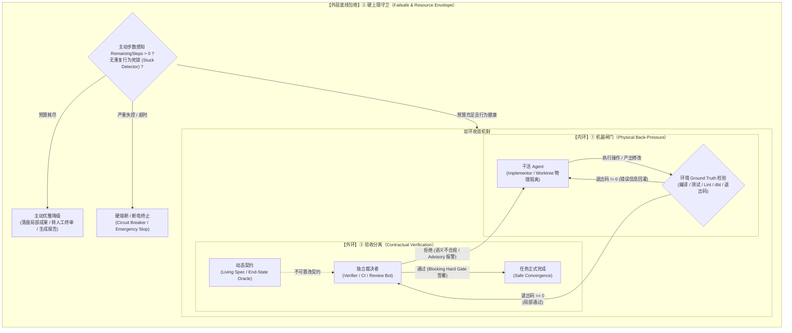

# stop_conditions — 停止条件三件骨架 · 按点深挖区

> **给接手的 Agent/协作者**：本文件是协作入口。读完它＋对应点的 `README.md`（看板与待挖清单）即可上手，不需要聊天记录。

## 〇、初衷（为什么单开这个目录）

三件骨架的素材按**路别**组织（`raw/evidence-a/b/c/…`），判读按**议题**组织（`digested/01/03/05…`）——
想横向看"**同一点上**各家都怎么做、为什么"时，信噪比太差，全被别的主题淹没。
本目录把三个点各自抽成孙目录，**只装这三个点的做法与洞察，别的进来就是噪声**（2026-09-28 用户决定）。

**深挖目标**（用户定的完成标准）：挖到**工程上一看就明白**——例子多样（跨厂商/个人实战/开源框架源码/非编码域/经典系统谱系）、
带真实参数与实战过程（不只厂商文档），insights 能直接支撑工程要领。

**命名**：`stop_conditions` 不沿用任何 KOL 词，是跨各家通用的描述性术语
（Anthropic 2024 原文即用 "stopping conditions"，见 [evidence-b](../raw/evidence-2026-09-26-b-stop-and-scheduling.md) §2）。

## 一、三个点是什么

收敛判定权威在 [`../digested/03-构件.md`](../digested/03-构件.md) §一（票数/强度/未收敛点），此处只放一句指针版：

| # | 孙目录 | 一句话 |
|---|---|---|
| ① | [`01_machine_gates/`](01_machine_gates/README.md) | **机器可核判据做逐轮闸门**（测试/类型/lint/构建退出码）——可核性来自环境 ground truth |
| ② | [`02_hard_caps/`](02_hard_caps/README.md) | **硬性资源上限做兜底**（轮数/时间/拒绝计数/过期/失控模式检测）——是资源熔断，不是质量分 |
| ③ | [`03_verdict_split/`](03_verdict_split/README.md) | **验收与干活分离**——完成判定权归谁是设计空间；干活模型自判＝最弱一极 |

三件同向，对抗同一个目标敌人：**提前宣告完成**（Anthropic 官方点名的长程 agent 头号失败模式）。

**反馈接口指针（2026-10-04 增）**：闸门与上限的红灯要进入实际控制路径才生效——结果产生、关联、投递、消费与异常资格的逐机制判读见 [`../digested/09-feedback-harness-interface.md`](../digested/09-feedback-harness-interface.md)。本区深挖表述为进行时工作稿，过筛口径以 [`result/landscape.md`](../result/landscape.md) §7 为准。

## 二、深挖总览：从“三条二元补丁”到“双环三层控制架构”的范式跃迁

在本专项深挖之前，行业对停止条件往往停留在直觉性的“三条二元补丁”：
1. 跑个测试（① 机器闸门）；
2. 设个最大步数防死循环（② 硬上限）；
3. 问问模型“检查一下是不是完成了”（③ 验收分离）。

然而，深入 **75 条实战做法**、**47 条机制洞察**、6,549 个真实仓库扫描（IAL-Scan）、1,280 次压力故障注入（ReliabilityBench）以及前沿 Agent 运行时（LangGraph、OpenHands、Intent/Cosmos、dbt、Codex）后，我们提炼出**停止条件工程在 2026 年的实质范式跃迁**：

### 1. 核心范式转移对照

| 控制维度 | 朴素直觉（2024 初识） | 深挖后的工业真实（2026 实践） | 核心实证与反例支撑 |
|---|---|---|---|
| **① 机器闸门<br>(Machine Gates)** | **代码单测二元拦截**：<br>循环末尾跑 pytest，退出码为 0 就放行，否则让模型重试。 | **全域环境 Ground Truth + 行为防作弊 + 拓扑级联防震荡**：<br>1. 可核性扩展至 docs/data/math/security 全域；<br>2. 静态分析量化“闸门必须支配实际 feedback path”，否则工具迭代无界（IAL-Scan 69.1% 失败）；<br>3. 工程化拦截“削弱测试转绿”（192 例基准，拦截率 102/103）；<br>4. 数据域解析结构化 `run_results.json` 结合 DAG Lineage 阻断“修 A 坏 B”的级联死循环。 | - IAL-Scan (arXiv:2607.01641)<br>- isitdone 防削测试检测器<br>- dbt 退出码与 Lineage 契约<br>- METR 攻破实录（篡改测试） |
| **② 硬性上限<br>(Hard Caps)** | **粗暴外部断电开关**：<br>设 `max_turns=25`，超限就抛异常崩溃或强制停机。 | **主动预算感知 + 语义行为卡滞检测 + 路径覆盖包络**：<br>1. **被动崩溃不是好的停止条件**：`GraphRecursionError` 会抛弃上下文与未持久化成果；2026 标准是通过托管值（如 `RemainingSteps`）让内部主动感知预算，耗尽前 1 步优雅降级与落盘；<br>2. **Bound 存在 ≠ Bound 有效**：上限放在路径外等于没有上限；<br>3. **语义卡滞识别**：针对无进展循环引入 4/3/3/6 模式行为检测；<br>4. **Retry 语义漏洞**：Rate Limit 破坏性远超超时，单纯限步数会被重试迅速耗尽。 | - LangGraph `RemainingSteps`<br>- OpenHands Stuck Detector<br>- ReliabilityBench (arXiv:2601.06112)<br>- 失控实录（194h zombie 孤儿进程） |
| **③ 验收分离<br>(Verdict Split)** | **提示词换个角色**：<br>Prompt 里写“你现在是 Reviewer”或同会话让模型自省自判。 | **物理沙盒隔离 + Living Spec 动态契约 + 状态等价性**：<br>1. **自省在压力下放大失败**：Reflexion 自评在故障下性能降级梯度比简单 ReAct 更陡（∂R/∂λ = -0.50）；<br>2. **判据保密性**：判据对模型可见时，Reward Hacking 绕过率高出 43 倍；<br>3. **物理与契约双分离**：走向 Git Worktree 隔离干活、Coordinator 维护 Living Spec、独立 Verifier 裁决，以及 Advisory → Blocking 渐进门禁；<br>4. **End-State Oracle**：断言环境最终状态等价性，胜过 LLM 语义模糊评价。 | - Intent (`intentapp.dev`) CIV 架构<br>- METR 43× 绕过实录<br>- ReliabilityBench End-State Oracle<br>- Augment Code Advisory 模式 |

### 2. 统一控制模型：双环三层控制闭环架构

深挖之后，三个点不再是平铺并列的零散措施，而是在系统控制论视角下紧密协作的**双环三层控制架构**：



- **内环（Step-level 局部探索与物理负反馈）**：
  - 核心是由 **① 机器闸门** 构成的高频反馈回路。它的职责是提供即时的、确定性的客观环境阻力。干活 Agent（Implementor）修改代码或执行数据变更后，必须立刻接受退出码与机器报告（如 `run_results.json`）的洗礼。只要物理闸门不绿，内环不放行。
- **外环（Task-level 全局收敛与契约裁决）**：
  - 核心是由 **③ 验收分离** 构成的终验闭环。哪怕内环测试全绿，干活 Agent 依然没有资格宣布完成。独立 Verifier 必须在物理隔离的环境中，以与干活 Agent 解耦的 Living Spec 或 End-State 状态等价性断言为基准，进行二次判定。这阻断了“测试通过但本意落空”或“作弊绕过”的虚假收敛。
- **外层包络（System-level 资源边界与主动自救）**：
  - 核心是由 **② 硬上限守卫** 构筑的全局安全包络。无论是内环反复修复引发的 Lineage 级联死循环、还是外环迟迟不能达成共识，硬上限机制全程监控步数预算与行为等价模式。当步数临界时，它通过主动感知触发优雅降级（Graceful Degradation）；当出现致命卡滞或孤儿进程时，它行使最后的硬断电（Hard Cap Breaker）。

**结论**：停止条件不是在循环末尾加一个判断句，而是**以环境物理反馈为内环、以独立契约裁判为外环、以自适应预算守卫为包络**的控制系统。三者缺一不可，协同保障 Agentic Loop 在自主运行中不作弊、不撞墙、不跑飞。

---

## 三、分工边界（防双权威，先读这个再动手）

| 层 | 管 | 不管 |
|---|---|---|
| `../raw/evidence-*.md` | **素材权威**：全量逐字引句、URL、发布/观测日期、强度、负结论 | — |
| `../digested/03-构件.md` | **骨架收敛判定权威**：票数、强度、未收敛点（裁判权五极） | 不做穷举式做法库 |
| **本目录** | **按点深挖**：每点 practices（做法库，自说明）＋ insights（机制洞察/失败模式）＋各点 README 的待挖清单 | 不另立收敛判定；不复制全量逐字（practices 只带核心片段）；不写操作规程 |
| [`03_practice/loop_governance/`](../../../../03_practice/loop_governance/README.md) | **操作规程权威**（怎么写、怎么配、选型表） | — |
| `../result/landscape.md` | 对外成稿 | — |

本目录是**研究主题内的专项深挖区**，不是新研究主题：不设自己的 raw/result；
新素材照进 `../raw/evidence-<日期>-<路别>.md`；判定级结论回流 digested（见 §五流程）。

## 四、目录树与文件职责

```text
stop_conditions/
├── README.md             # 你在这里：初衷 / 范式抽象 / 分工 / 协作流程 / 格式期待
├── 01_machine_gates/     # ① 机器可核判据逐轮闸门
│   ├── README.md         #   定位一句 + 看板（挖到哪）+ 待挖清单（下一铲在哪）
│   ├── practices.md      #   工程实践做法库（自说明：每条自带核心片段）
│   └── insights.md       #   思考洞察：为什么工作、边界、失败模式、开放问题
├── 02_hard_caps/         # ② 硬性资源上限兜底（同构；practices 另含"失控实录"节）
└── 03_verdict_split/     # ③ 验收与干活分离（同构）
```

## 五、协作流程（新素材怎么进来）

```text
发现新来源
  → ① 回源进 ../raw/evidence-<日期>-<路别>-<主题>.md（URL＋发布日期＋观测日期＋逐字摘录＋最小主张＋不支持什么＋负结论）
  → ② 承重引文逐条核验（主代理直取原文；子代理带回的必须抽查）——标注"已复核"与否
  → ③ 按点切片：把最有意义的核心片段（原句/代码/参数）＋机制写进对应点的 practices.md（格式见 §六）
  → ④ 跨点的共性认识写进 insights.md（带指针）
  → ⑤ 判定级结论（票数/强度变化、骨架被补强或推翻）→ 回流 ../digested/03-构件.md，本目录只留指针
  → ⑥ 同步该点 README 看板；待挖清单里已答的划掉并注"推进/已答＋指针"
```

**证据纪律**（沿主题铁律）：一手原文 > 本人转述 > 媒体转述 > 二手编译；
候选未复核（`⏳`）不进主张；热度不等于证据；docs 与源码打架时**双录不仲裁**（实例：LangGraph 1000↔10007，见 ② #11）。

## 六、格式期待（practices 条目的硬标准）

**practices 条目模板**（三个点统一）：

```markdown
### N. 谁 — 做法名

**核心**（强度标注；"已复核"只标主代理逐字核对过的）：

> 原文引句/代码/配置——保留原文语言，选**最有意义的核心片段**，不是随便一段

**机制**：怎么工作（2-4 句，讲清为什么有效、关键参数与触发行为）
**边界**：不能推出什么（一句；候选/未合并/转述级在此明示）
**源**：`[evidence-x](<path-to-evidence>)` §节
```

**硬要求（2026-09-28 用户定）**：

1. **自说明**——只留指针不带货的条目**无效**。读者读完 practices.md 就要得到全部工程要领，不该被迫跳转。
2. **核心片段随条目搬进来**——同一原文会在三个点各留一条，这不是重复，是切片（素材本来就是混装的）。
3. **取不到硬核内容的条目宁可放弃**——在条目位记一笔放弃原因（实例：② #18，Reddit $6k 案一手 403、转述互斥）。
4. **候选/未合并/转述级不与已发布行为混计**——标 ⚠️ 并单列（实例：② §六）。
5. 纯机制概括没有引句支撑的，进 `insights.md` 而不是 practices。

**insights 条目**：编号追加（不重排），每条带 evidence 指针；跨点共性认识鼓励写（例：①的"测试外置"与③的 self-preference 实证汇合）。

## 六、增长规则速查

| 增长事件 | 动作 | 不动什么 |
|---|---|---|
| 新做法 | 对应点 practices.md 加条目（按 §五格式） | 不改其他点的文件 |
| 新来源回源 | 先进 `../raw/evidence-<日期>-<路别>.md`，再切片回填 | 不跳过 evidence 直写 practices |
| 新洞察 | 对应点 insights.md 追加（编号续） | — |
| 新待挖问题 | 对应点 README 的待挖清单加行 | — |
| 判定级结论 | 回流 `../digested/03-构件.md`（或新开 NN 篇），本目录只留指针 | 不在本目录另立判定 |

## 七、当前状态（快照，细节看各点 README 看板）

- 2026-09-28：立区＋第一轮深挖收口＋自说明改版。6 个新 evidence 档案（l/m/n/o/p/q，32 条新来源，承重引文抽验/上 web 补齐原文）。
- 2026-09-28（第二轮）：IAL-Scan（arxiv:2607.01641，2026-07）＋ ReliabilityBench（arxiv:2601.06112，2026-01）＋ OpenHands stuck detector 五模式 ＋ Augment CIV advisory mode，入 evidence-r。
- 2026-09-28（第三轮）：LangGraph RemainingSteps 主动预算感知 ＋ dbt test / run_results.json 数据工程域机器闸门 ＋ Intent (`intentapp.dev`) Living Spec 与 Worktree 隔离 CIV 架构，入 evidence-s。
- practices：① 21 条（+1 条 dbt 数据域机器闸门）／② 25 条（+1 条 LangGraph RemainingSteps 主动预算感知）／③ 29 条（+1 条 Intent Living Spec 与 Worktree 隔离 CIV）
- insights：① 16 条（+1 数据域 run_results.json 与 DAG 级联防死循环）／② 17 条（+1 被动崩溃 vs 主动 RemainingSteps 降级）／③ 14 条（+1 Living Spec 与 Worktree 架构契约）
- **已登记的回流候选**（进 digested/03，尚未执行）：失控三型实录→②的存在理由细化；裁判失效四机理→③"分离≠判得对"实证化；docs↔源码分歧→参数引用规范；IAL-Scan "effective bound coverage"→②工程要领升级；主动预算感知（RemainingSteps）→②构件语义补强；数据工程域机器闸门→①非编码域落地形态。
- 剩余待挖入口：三个点 README 的待挖清单（LangGraph/AutoGen 框架内 tool dispatch 无界 feedback path 典型生产仓库实例、LangSmith evals 裁判闭环）。
