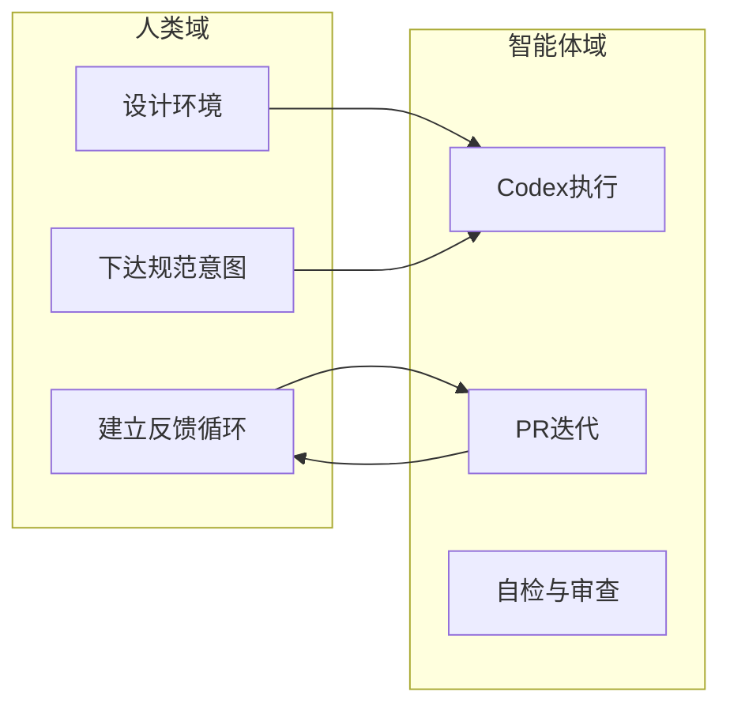
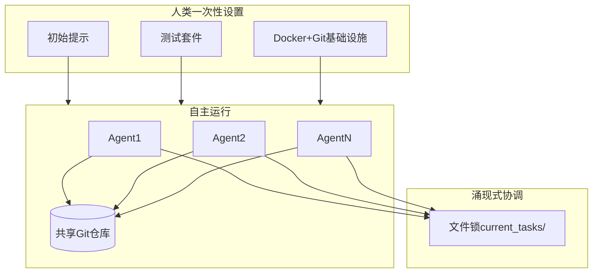
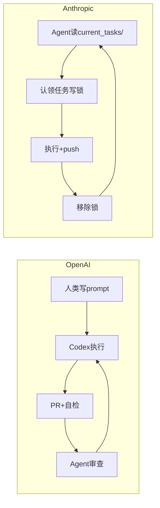

# OpenAI Harness vs Anthropic Agent Teams 深度比较分析

## 一、两篇原文的核心定位

| 维度 | OpenAI Harness | Anthropic Agent Teams |
|------|----------------|------------------------|
| **原文** | [route_1_raw_openai_zh.md](route_1_raw_openai_zh.md) | [route_2_raw_anthropic_zh.md](route_2_raw_anthropic_zh.md) |
| **原始出处** | [OpenAI Harness Engineering](https://openai.com/index/harness-engineering/) | [Anthropic Engineering Blog](https://www.anthropic.com/engineering) (Nicholas Carlini) |
| **目标** | 生产级产品交付（百万行代码、真实用户） | 能力边界压力测试（C 编译器、研究实验） |
| **时间尺度** | 5 个月持续开发 | 2 周集中运行 |

---

## 二、根本思想对比

### 2.1 OpenAI Harness：主控与治具派

**核心命题**：人类负责定舵掌控方向，智能体负责执行。

- **Harness** = 围绕 Agent 的「治具」：测试、CI、可观测性、文档结构、架构约束
- **哲学**：环境设计 > 代码编写；唯一稀缺资源是「人类的时间与注意力」
- **约束**：刻意「0 行手写代码」以倒逼基建与流程

### 2.2 Anthropic Agent Teams：自主与涌现派

**核心命题**：多 Agent 并行、基本无人值守，通过环境与测试驱动涌现式协作。

- **Agent Teams** = 多个 Claude 实例并行、无中央编排器
- **哲学**：探索「完全放手」时 Agent 能走多远；协调靠文件锁 + Git 冲突解决
- **目标**：压力测试模型能力上限，为未来高可靠性模型做预演

---

## 三、一致性部分

### 3.1 测试与反馈是核心杠杆

- **OpenAI**：测试 + CI 是验收标准；Agent 通过测试判断是否完成
- **Anthropic**：测试套件质量直接决定 Agent 能否「自我驱动」；需「极高水准的测试用例」

### 3.2 仓库即知识来源

- **OpenAI**：`docs/` 为唯一真相来源，AGENTS.md 作导航
- **Anthropic**：README、进度追踪文件、设计文档需高频刷新，供 Agent 定位

### 3.3 机器可读性 (Legibility)

- **OpenAI**：显式提出 Legibility——UI、Log、Metrics、Traces 需对 Agent 可程序化访问
- **Anthropic**：避免「上下文污染」；报错需结构化、可 grep；统计数据预计算以减少 Token 消耗

### 3.4 人类角色上移

- 两者都认为：人类从「写代码」转向「设计环境、规范、反馈机制」

### 3.5 深度优先与环境补齐

- **OpenAI**：当 Agent 卡住时，不是「再试一次」，而是诊断「缺什么能力」并补齐
- **Anthropic**：当测试揭示缺陷时，针对性设计新测试用例「卡住陷阱」

---

## 四、不一致部分（核心差异）

### 4.1 人机关系：持续主控 vs 一次性放手

| 维度 | OpenAI Harness | Anthropic Agent Teams |
|------|----------------|------------------------|
| 人类参与 | 持续：描述任务、触发 Agent、审阅（可选） | 一次性：设定目标与测试后基本不介入 |
| 任务分配 | 人类通过 prompt 下达 | Agent 自选「下一个最明显的 bug」 |
| 协调机制 | 人类 + Agent-to-Agent 审查 | 文件锁 + Git 冲突，无编排器 |

### 4.2 目标：生产交付 vs 能力边界探索

| 维度 | OpenAI Harness | Anthropic Agent Teams |
|------|----------------|------------------------|
| 产出 | 真实产品、内部/外部用户 | C 编译器（研究产物） |
| 成功标准 | 功能、质量、可维护性 | 能否编译 Linux 内核等硬指标 |
| 成本意识 | 隐含在流程中 | 显式：约 2 万美元 API、2000 次会话 |

### 4.3 编排与协调

- **OpenAI**：人类是隐式编排者；有 Agent-to-Agent 审查流；依赖分层架构约束
- **Anthropic**：**无 Orchestrator**；协调完全由「文件锁 + 任务认领 + Git 合并」涌现

### 4.4 环境复杂度

- **OpenAI**：Chrome DevTools、LogQL/PromQL/TraceQL、本地可观测栈、分支级应用实例
- **Anthropic**：Bash 死循环 + Docker 容器 + 共享 Git；极简「治具」

### 4.5 知识管理

- **OpenAI**：AGENTS.md 仅作目录（~100 行）；禁止巨型单文件；渐进式披露
- **Anthropic**：强调 README、进度文件「巨细无遗」且高频更新；未强调单文件限制

---

## 五、核心落地实践差异

### 5.1 任务分解与分配

### 5.2 并行策略

| 实践 | OpenAI | Anthropic |
|------|--------|-----------|
| 并行单位 | 单 Agent 多任务流；审查可并行 | 16 个 Agent 物理并行 |
| 分工方式 | 人类指定任务类型 | 角色专业化（去重、性能、文档、架构批判） |
| 并行瓶颈 | 未详述 | Linux 内核编译时需「缩小背锅范围」——用 GCC 对比定位问题文件 |

### 5.3 质量保障

| 实践 | OpenAI | Anthropic |
|------|--------|-----------|
| 架构约束 | 机械执行：Types→Config→Repo→Service→Runtime→UI | 未强调分层约束 |
| 代码审查 | Agent-to-Agent 全自动 | 未强调 |
| 回归防护 | CI 阻断、结构性测试 | 测试切片、横跨 VM 全覆盖 |
| 熵控制 | 「垃圾回收」Agent 定期扫描偏离 | 无对应机制 |

### 5.4 可观测性与自验证

| 实践 | OpenAI | Anthropic |
|------|--------|-----------|
| UI 验证 | Chrome DevTools 接入 Agent | 无（编译器无 UI） |
| 日志/指标 | LogQL、PromQL、TraceQL 直接暴露 | 结构化日志、grep 友好、预计算统计 |
| 时间感知 | 未强调 | 显式解决「时间盲区」——固定子集快测避免长时间无进展 |

---

## 六、权威比较与行业观点

### 6.1 现有比较来源

- **InfoQ**（[报道](https://www.infoq.com/news/2026/02/openai-harness-engineering-codex/)）：将 Harness 概括为「context engineering、architectural constraints、garbage collection」的结合
- **Engineering.fyi**：强调 Harness 的「progressive disclosure」「mechanical invariant enforcement」「repository-as-system-of-record」
- **htek.dev**（[Agent Harnesses](https://htek.dev/articles/agent-harnesses-controlling-ai-agents-2026/)）：提出「Harness = 控制平面」，类比 Kubernetes 与容器；与「Agent Teams」的自主并行形成对照
- **行业共识**（[MarkTechPost](https://www.marktechpost.com/2025/10/25/google-vs-openai-vs-anthropic-the-agentic-ai-arms-race-breakdown/)）：OpenAI 偏生态与工具链，Anthropic 偏安全与治理

### 6.2 概念澄清

- **Anthropic「Effective Harnesses」**（长期运行 Agent 的 harness 设计）与 **Carlini 的 Agent Teams** 不同：前者关注单 Agent 多会话、上下文衔接；后者关注多 Agent 并行、无编排
- **OpenAI Harness** 与 **Anthropic Agent Teams** 可视为互补：Harness 回答「如何控制 Agent」；Agent Teams 回答「放手时 Agent 能做什么」

---

## 七、总结：两种范式的定位

| 维度 | OpenAI Harness | Anthropic Agent Teams |
|------|----------------|------------------------|
| **隐喻** | 人类是「驯兽师」：设计笼子、规则、反馈 | 人类是「实验设计者」：设定目标后观察涌现 |
| **适用场景** | 生产级产品、需可控质量与架构 | 研究、能力边界测试、一次性大型任务 |
| **核心投入** | 环境设计、可观测性、机械约束、文档结构 | 测试质量、任务可分解性、并行友好问题设计 |
| **风险偏好** | 低：人类持续在场、强约束 | 高：无人值守、接受失败与重试 |

两者共同指向：**软件工程的重心从「写代码」转向「设计能让 Agent 可靠运作的环境」**。差异在于：OpenAI 选择「主控 + 治具」以保障生产可用性；Anthropic 选择「放手 + 涌现」以探索能力上限。
