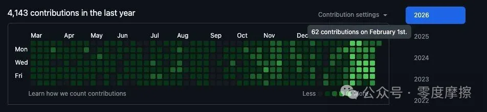
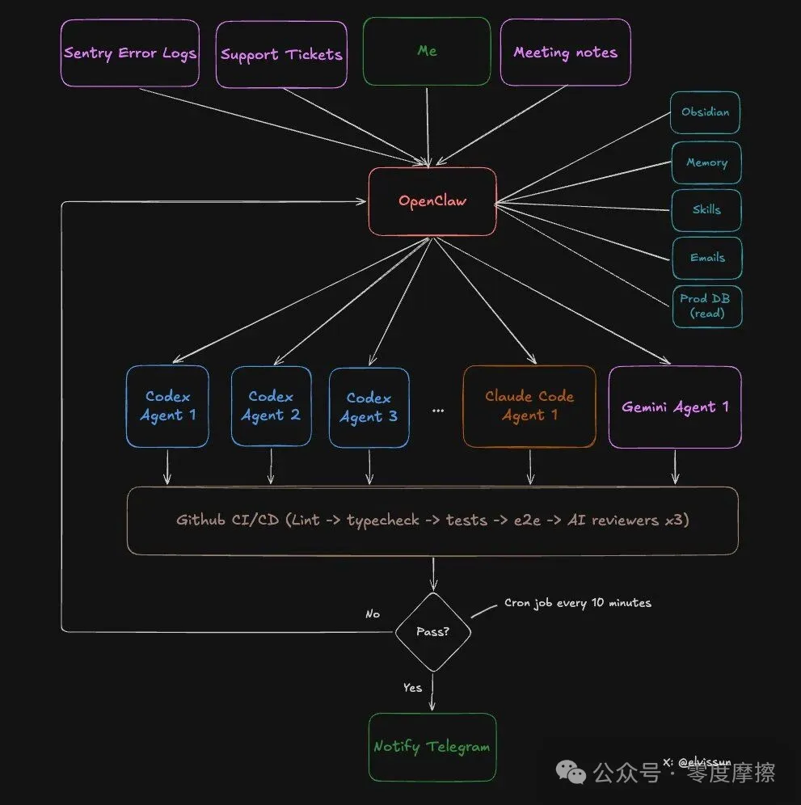
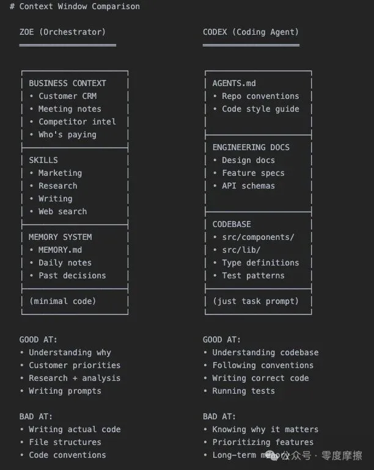
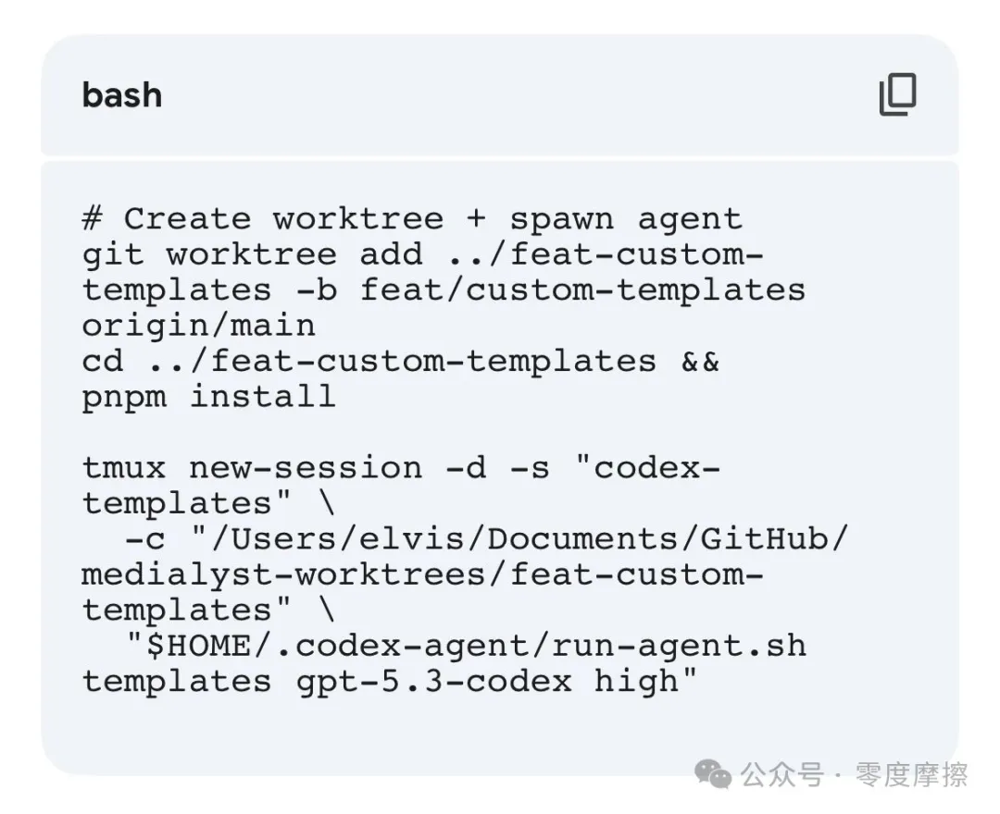
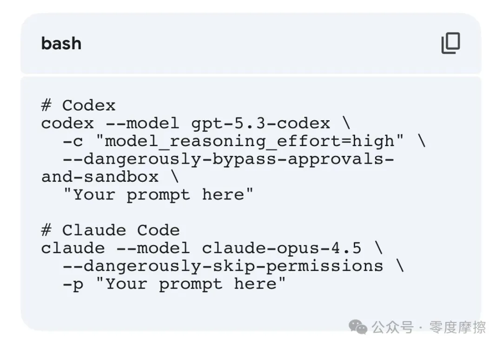
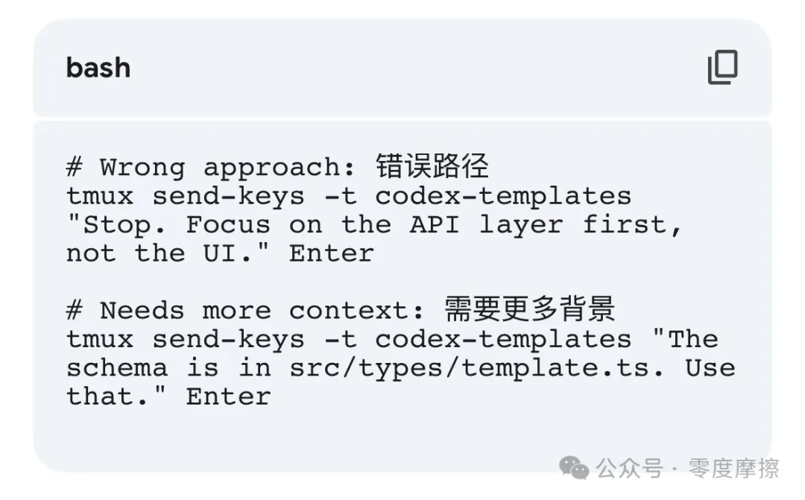
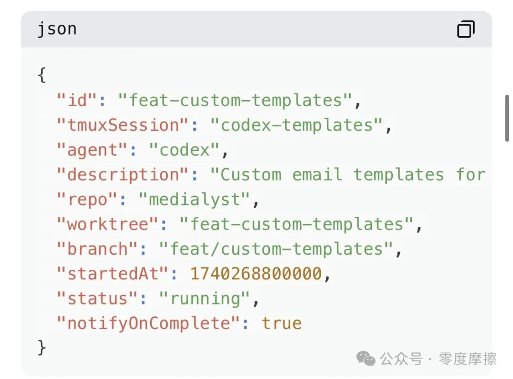
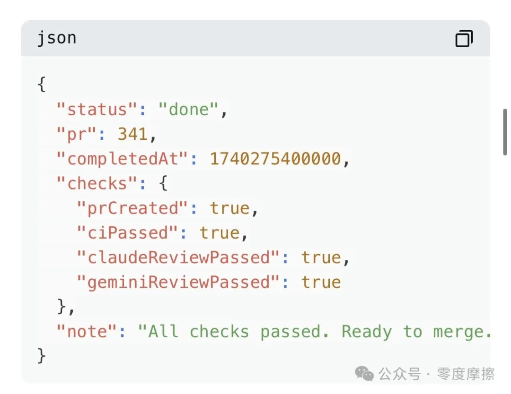
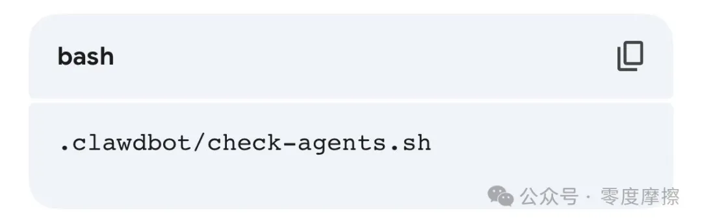

# Elvis || OpenClaw + Codex/Claude Code 智能体集群：一人开发团队 \[完整配置指南\]

[零度摩擦](javascript:void(0);)

_2026年2月25日 15:04_ _日本_

在小说阅读器中沉浸阅读

  

作者：Elvis @elvissun

  

发布日期：2026年2月23日

  

我不再直接使用 Codex 或 Claude Code 了。

  

我将 OpenClaw 作为我的编排层。我的编排者 Zoe 会负责孵化智能体、编写提示词、为每个任务选择合适的模型、监控进度，并在拉取请求（PR）准备好合并时通过 TG 提醒我。

  

过去 4 周的证明数据：

  

\* 单日提交代码 94 次： 这是我效率最高的一天——我打了 3 个客户电话，一次都没打开过编辑器。平均每天提交约 50 次。

  

\* 30 分钟完成 7 个 PR： 从想法到生产环境的速度极快，因为编码和验证基本上都是自动化的。

  

\* 提交转化为月经常性收入（MRR）： 我将这套系统用于我正在构建的一个真实的 B2B SaaS 项目——结合创始人主导的销售，当天就能交付大部分功能需求。速度将潜在客户转化为了付费用户。

  

（图片说明：1月前仅使用 CC/Codex | 1月后由 OpenClaw 编排 CC/Codex）

  

我的 Git 历史记录看起来就像刚聘请了一个开发团队。但实际上，我只是从“管理 Claude Code”，变成了“管理一个负责领导一整支 Claude Code 和 Codex 智能体舰队的 OpenClaw 智能体”。

  

成功率： 系统几乎可以在没有任何干预的情况下，“一发入魂（one-shot）”完成所有中小型任务。

  

成本： Claude 每月约 100 美元，Codex 每月约 90 美元，但你也可以从 20 美元开始尝试。

  

为什么这比直接使用工具效果更好：

  

\> Codex 和 Claude Code 对你的业务背景知之甚少。

  

它们只能看到代码，看不到你业务的全貌。

  

OpenClaw 改变了局面。它充当了你与所有智能体之间的编排层——它将我所有的业务背景（客户数据、会议记录、过去的决策、成功与失败的经验）存储在我的 Obsidian 笔记库中，并将这些历史背景转化为发送给每个编码智能体的精确提示词。编码智能体专注于代码，编排者则停留在高维的战略层面。

  

这是系统工作流程展示图：

  

  

上周 Stripe 撰文介绍了他们名为“Minions”的后台智能体系统——由集中编排层支持的并行编码智能体。我不小心造出了同样的东西，只不过它运行在我的 Mac mini 本地。

  

在我告诉你如何配置之前，你应该了解为什么你需要一个智能体编排器(agent orchestrator)。

  

为什么一个 AI 无法兼顾两者

  

上下文窗口是零和博弈。你必须选择把什么放进去。

  

填满代码，就没空间放业务背景；填满客户历史，就没空间放代码库。这就是为什么两层系统有效：每个 AI 都只加载它精确需要的内容。

  

OpenClaw 和 Codex 拥有完全不同的上下文：

  

图片说明：通过上下文实现专业化，而非通过不同模型。

  

完整的 8 步工作流

  

让我带大家回顾一下上周的一个真实案例。

  

第一步：客户需求 → 与 Zoe 进行范围界定

  

我和一家机构客户通了电话。他们希望能在整个团队中复用已经配置好的设置。

  

通话结束后，我向 Zoe 简单交代了需求。因为我所有的会议记录都会自动同步到我的 Obsidian 库，我这边完全不需要任何解释。

我们共同界定了功能范围——并确定了一套模板系统，让用户能够保存和编辑现有的配置。

  

然后 Zoe 做了三件事：

  

\*充值额度以立即解除客户限制 —— 她拥有管理端 API 权限。

  

\*从生产数据库抓取客户配置 —— 她拥有生产环境数据库的只读权限（我的编码智能体永远不会拥有此权限），用以获取现有的设置，并将其包含在提示词中。

  

\* 孵化一个 Codex 智能体，附带包含所有背景信息的详细提示词。

  

第二步：孵化智能体

  

每个智能体都会获得自己的工作树（isolated branch）和 tmux 会话：

智能体在 tmux 会话中运行，并通过脚本记录完整的终端日志。

以下是我们启动智能体的方式：

  

我以前使用 codex exec 或 claude -p，但最近切换到了 tmux：

  

tmux 好得多，因为任务中途的重定向功能非常强大。如果智能体走错了方向？别关掉它：

  

任务会被记录在 .clawdbot/active-tasks.json 中：

  

完成时，它会更新 PR 编号和检查项。（详见第五步）

  

第三步：循环监控

  

一个定时任务（cron job）每 10 分钟运行一次，负责照看所有智能体。这基本上功能类似于改进版的 Ralph Loop，稍后详述。

  

但它不会直接轮询智能体——那样太贵了。相反，它运行一个脚本读取 JSON 注册表并检查：

该脚本是 100% 确定性的，且极其节省 Token：

• 检查 tmux 会话是否存活

• 检查被跟踪分支上开启的 PR

• 通过 GitHub CLI 检查 CI 状态

• 如果 CI 失败或收到关键评审反馈，则自动重启失败的智能体，最多尝试 3 次

•仅在需要人工干预时发出警报

  

我不用盯着终端。系统会告诉我在什么时候介入。

  

第四步：智能体创建 PR

  

智能体进行提交、推送，并通过 gh pr create --fill 开启 PR。此时我不会收到通知——单单一个 PR 并不代表任务完成。

  

完成的定义（让你的智能体了解这一点至关重要）：

  

• PR 已创建

• 分支已同步到主分支，无合并冲突

• CI 检查通过：语法、类型、单元测试、端到端测试

• Codex 评审通过

• Claude Code 评审通过

• Gemini 评审通过

•如果涉及 UI 变动，需包含截图

  

第五步：自动化代码评审

  

每个 PR 都会由三个 AI 模型进行评审。它们关注的点各不相同：  

  

1\. Codex 评审员 —— 擅长边缘案例。进行最彻底的评审。捕捉逻辑错误、缺失的错误处理、竞态条件。误报率极低。

  

2. Gemini 代码辅助评审员 —— 免费且极其有用。能发现其他智能体漏掉的安全问题和可扩展性问题。并提供具体的修复建议。闭眼安装即可。

  

3. Claude Code 评审员 —— 基本没用——倾向于过度谨慎。有很多“考虑添加……”之类的建议，通常都是过度设计。除非被标记为“严重（critical）”，否则我一概忽略。

  

三者都会直接在 PR 上发表评论。  

  

第六步：自动化测试  

  

我们的 CI 流水线运行大量的自动化测试：  

• 代码规范和 TS 检查

• 单元测试

• 端到端测试

•在与生产环境一致的预览环境中运行 Playwright 测试

  

我上周加了一条新规：如果 PR 改动了任何 UI，必须在 PR 描述中包含截图。否则 CI 会失败。这极大地缩短了评审时间——我一眼就能看出变动了什么，而不需要去点开预览环境。

  

第七步：人工评审  

  

现在我收到了 TG通知：“PR #341 已准备好评审。”  

  

到这一步时：

• CI 已通过

• 三个 AI 评审员已批准代码

• 截图展示了 UI 变动

• 所有边缘案例都已记录在评审评论中

  

我的评审只需 5-10 分钟。很多 PR 我甚至不看代码就合并了——截图已经告诉了我需要知道的一切。

  

第八步：合并  

  

PR 合并。每日定时任务会清理孤立的工作树和任务注册 JSON。

  

Ralph Loop V2 版本

  

这本质上是 Ralph Loop，但更好用。  

  

Ralph Loop 从记忆中提取背景、生成输出、评估结果并保存心得。但大多数实现方式在每个循环中运行相同的提示词。提炼出的心得虽然改善了未来的检索，但提示词本身是静态的。

  

我们的系统则不同。当一个智能体失败时，Zoe 不会只是用同样的提示词重启它。她会结合完整的业务背景审视失败原因，并想办法解除阻塞：

  

• 智能体上下文用完了？ “只关注这三个文件。”

  

• 智能体走错方向了？“停下。客户想要的是 X 而不是 Y。这是他们在会议上说的。”

  

• 智能体需要澄清？“这是客户的邮件以及他们公司的业务介绍。”

  

  

Zoe 照看智能体直至其完成任务。她拥有智能体没有的背景——客户历史、会议记录、我们之前尝试过什么、为什么失败。她利用这些背景在每次重试时编写更好的提示词。  

  

而且她也不等我分配任务。她会主动寻找工作：

• 早上： 扫描 Sentry \\rightarrow 发现 4 个新错误 \\rightarrow 孵化 4 个智能体进行调查和修复。

• 会议后： 扫描会议记录 \\rightarrow 标记客户提到的 3 个功能需求 \\rightarrow 孵化 3 个 Codex 智能体。

• 晚上： 扫描 Git 日志 \\rightarrow 孵化 Claude Code 来更新变更日志和客户文档。

  

我在客户电话后散个步。回来后看 Telegram：“7 个 PR 已准备好评审。3 个功能，4 个 bug 修复。”

  

当智能体成功时，模式会被记录下来。“这种提示词结构适用于计费功能。”“Codex 需要预先提供类型定义。”“务必包含测试文件路径。”

  

奖励信号包括：CI 通过、所有三项代码评审通过、人工合并。任何失败都会触发循环。随着时间的推移，Zoe 能写出更好的提示词，因为她记得哪些代码成功上线了。

  

选择合适的智能体

  

并非所有编码智能体都一样。快速参考：

• Codex 是我的主力军。负责后端逻辑、复杂的 Bug、多文件重构，以及任何需要跨代码库推理的任务。它较慢但很彻底。我 90% 的任务都用它。

• Claude Code 速度更快，更擅长前端工作。它的权限问题也更少，因此非常适合处理 Git 操作。（我以前更多地用它来驱动日常工作，但现在 Codex 5.3 确实更好、更快）

• Gemini 有另一种超能力——设计感。为了做出精美的 UI，我会让 Gemini 先生成 HTML/CSS 规范，然后交给 Claude Code 在我们的组件系统中实现。Gemini 负责设计，Claude 负责构建。

  

Zoe 为每个任务选择合适的智能体，并在它们之间路由产出。计费系统的 Bug 交给 Codex。按钮样式修复交给 Claude Code。新的仪表盘设计则由 Gemini 开始。

  

如何配置这套系统

  

将整篇文章复制到 OpenClaw 中并告诉它：“为我的代码库实现这套智能体集群配置。”

  

它会读取架构、创建脚本、搭建目录结构并配置定时任务监控。10 分钟内搞定。

  

没课卖给你。

  

没人预料到的瓶颈

  

这是我目前遇到的天花板：内存（RAM）。

  

每个智能体都需要自己的工作树。每个工作树都需要自己的 node\_modules。每个智能体都要运行构建、类型检查和测试。五个智能体同时运行意味着五个并行的 TypeScript 编译器、五个测试运行器、五套依赖项被加载进内存。

  

我 16GB 的 Mac Mini 在开启 4-5 个智能体后就会开始使用交换内存（Swap）——而且我得祈祷它们不要同时尝试进行构建。

  

所以我买了一台配备 128GB 内存的 Mac Studio M4 Max（3500 美元）来驱动这套系统。它 3 月底到货，届时我会分享它值不值。

  

展望：一人百万美元公司

  

从 2026 年开始，我们将看到大量年营收百万美元的一人公司。对于那些懂得如何构建“递归自我改进型智能体”的人来说，杠杆效应是巨大的。

  

景象就是这样的：一个作为你自己延伸的 AI 编排器（就像 Zoe 对我而言），将工作委派给处理不同业务职能的专业智能体。工程、客户支持、运营、营销。每个智能体都专注于自己擅长的领域。而你则保持极度的专注和全面的控制。

  

下一代企业家不会聘请 10 人团队来完成一个人靠正确系统就能做到的事。他们会这样构建业务——保持精简、快速行动、每日上线。

  

现在有太多的 AI 生成垃圾信息。关于智能体和“控制任务”的炒作满天飞，却没造出任何真正有用的东西。华丽的演示背后没有实际收益。

  

我正尝试做相反的事：少点炒作，多点关于构建真实业务的记录。真实的客户、真实的收入、真实的上线代码提交，以及真实的损失。

  

我正在构建什么？Agentic PR —— 一家挑战企业级公关巨头的一人公司。通过智能体帮助初创企业获得媒体报道，而不需要每月支付 1 万美元的顾问费。