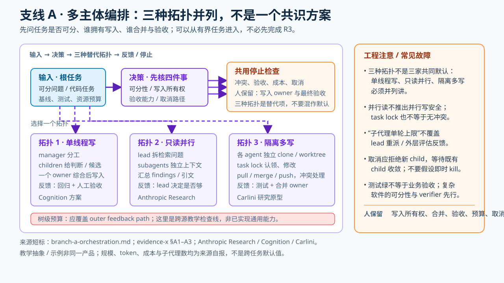

# 支线 A · 多主体编排——部分场景已落地，非必经阶

> **证据判定**：[evidence-u](../raw/evidence-2026-09-30-u-post-june-kols.md) S2/S3/S5 分别展示 Cognition 的写入单线程、Carlini 的分布式文件锁和 Anthropic 的研究编排器；它们**共同支持分工/并行的能力存在**，不共同支持同一写入拓扑或普遍收益。支线可以从有界任务进入，**不要求先完成 R3 的持久无人值守**；应用仍受任务可分性、验收与预算约束。

## 一、交接面（可选分支）

人把可分的任务交给多个主体，另设分工、资源隔离、合并与验收机制。并发读、并发写、集中编排和分布协调是不同方案；人必须为重叠写入与结果冲突指定负责人。高阶不要求每位学员掌握，展示可用场景、成本与失败模式即可。

### 技术剖面：三个不同拓扑，不能拿同一张“多代理图”代替

| 拓扑与任务 | 调度/共享什么 | 写入与合并在哪里 | 该观察到的失败 |
|---|---|---|---|
| **Anthropic 研究编排器**：并行查不同问题 | lead agent 拆任务、workers 并行检索，lead 汇总；简单事实查询用 1 个 agent/3–10 次工具，比较任务可用 2–4 个（[evidence-u S5](../raw/evidence-2026-09-30-u-post-june-kols.md)） | 各 worker 回传研究材料，由 lead 综合；**不是**多人同时改同一仓库 | 50 个 subagents 查简单问题、无来源时无限搜；研究内部 eval 的 +90.2% 不外推编码域 |
| **Cognition 受约束写入**：多方供分析 | manager 分解、children 提供判断或候选 | 它推荐把**写操作保持单线程**，由拥有最终写权的主体综合后行动（[evidence-u S2](../raw/evidence-2026-09-30-u-post-june-kols.md)） | 意见多不等于实际代码已被独立验收；这是该团队方案，不是多家共识 |
| **Carlini 分布式并发改码**：16 个 agents 建 C 编译器 | 每个 Docker agent 把裸仓库 `/upstream` clone 到自己的 `/workspace`，用 `current_tasks/<任务>.txt` 占任务；冲突经 git 同步使后来者换任务（[Carlini 一手文](https://www.anthropic.com/engineering/building-c-compiler)） | 各自 pull/merge/push 到共享 upstream，完成后删 lock；**没有**单独的编排 agent，合并冲突频繁 | 任务锁只防“同一条任务被认领”；改同一底层模块仍会合并冲突，不能把锁等同于安全隔离 |

**走一遍真实瓶颈（Carlini 案例）**：最初许多独立 failing tests 可由各 agent 各修一项；到编译 Linux kernel 时，内核编译成了一个巨大的失败目标，16 个 agent 都追同一 bug、互相覆盖，增加并发无收益。作者改用 GCC 作 known-good oracle：大部分文件由 GCC 编译，仅让自研编译器编译一小部分，再收窄出问题文件，让不同 agent 有**可独立工作的失败子集**；最后还要 delta debugging 识别“单独正常、组合失败”的文件对（[Carlini 一手文](https://www.anthropic.com/engineering/building-c-compiler)）。这说明规模上限先受**任务切分与 verifier 质量**制约，不是先受 agent 个数制约。

**教学练习（示意协议，不是产品命令）**：给同一 repo 的两个独立问题开两个隔离工作区，事先写下 `(任务所有者, 可改路径, 基线 commit, 测试命令, merge owner)`。分别提交候选→集成负责人依次合并并重跑回归→保留失败 diff 和成本。若两人都须改同一核心文件，就先串行写入或细分任务，不要把 `git merge` 当自动验收。此练习可在 R1/R2 的有界任务做，**不需要**先让 R3 持久无人值守。

**成本与停止**：worker 的单轮上限不一定覆盖 lead 的再拆分与失败后重派，预算和取消须覆盖**整棵代理树**；测试/build 共用机器时会出现 back pressure，Huntley 特别警告数百子代理同时跑构建（[evidence-b §问题2.4](../raw/evidence-2026-09-26-b-stop-and-scheduling.md)）；OpenClaw Task Flow 的取消语义是拒新 child link、待已活跃子任务收敛后结案（[evidence-e §2B](../raw/evidence-2026-09-27-e-cross-feature-observability.md)）。这两者是不同系统的工程检查线索，不是 Carlini 原型的内置保障。

Carlini 的具体隔离/任务锁/合并链与只读研究拓扑，逐字取证集中在 [evidence-x §1 A1–A2](../raw/evidence-2026-09-30-x-ladder-branches-detail.md)。**停止整个树**不能照抄 Carlini 原型：OpenClaw 的 Task Flow 用 `queued → running → terminal` 记子任务，取消 flow 时先拒绝新的 child link、待活跃子任务收敛后才标 `cancelled`（[evidence-x A3](../raw/evidence-2026-09-30-x-ladder-branches-detail.md)）；它没有证明同一系统还实现了统一全树 dollar/token cap。这里是跨系统的风险检查，不是“已有成套方案”。

## 二、支撑条目（拓扑并列，不互相代言）

**① 一种受约束的写入方案（Walden/Cognition，2026-04-22，S2）**
- 演化背景：2025-06《Don't Build Multi-Agents》→ 2026-04 修正票：
  > "**multi-agent systems work best today when writes stay single-threaded** and the additional agents **contribute intelligence rather than actions**."
- 实用拓扑：> "The practical shape is **map-reduce-and-manage**: a manager splits work, children execute, the manager synthesizes and reports back."
- 明确排除项：> "the unstructured-swarm approach, arbitrary networks of agents negotiating with each other, **is mostly a distraction**."

**② 经典编排器-工人（Anthropic，2025-06-13，S5）**
- > "our architecture uses a **multi-agent architecture with an orchestrator-worker pattern**, where a lead agent coordinates the process while delegating to specialized subagents that operate in parallel."
- 效果与成本参数：内部研究 eval **+90.2%**；多代理 token 消耗约为对话 **15×**（单 agent 4×）。
- **努力尺度规则（参数级，可直接教）**：
  > "Simple fact-finding requires just 1 agent with 3-10 tool calls, direct comparisons might need 2-4 subagents with 10-15 calls each, and complex research might use more than 10 subagents with clearly divided responsibilities."
- 失败模式：> "Early agents made errors like **spawning 50 subagents for simple queries**, scouring the web endlessly for nonexistent sources"
- **适用域边界**：> "most coding tasks involve fewer truly parallelizable tasks than research, and LLM agents are not yet great at coordinating and delegating to other agents in real time."

**③ 变体形态：无编排器（Carlini/Anthropic，2026-02-05，S3）**
- 文件锁同步：> "Claude takes a 'lock' on a task by writing a text file to current_tasks/ … If two agents try to claim the same task, git's synchronization forces the second agent to pick a different one."
- > "I don't use an orchestration agent. Instead, I leave it up to each Claude agent to decide how to act."
- 参数：16 agents / 近 2,000 sessions / 2B input tokens / 约 **$20,000** / 100k 行编译器过 GCC torture test 99%。
- 角色专门化：> "Parallelism also enables specialization."（去重/性能/质量/文档各占一个 agent）

**④ 学术构件票（arXiv:2608.21884，2026-08，S6）**
- 灰色文献综述把 "verifier sub-agents, token budgets" 列为建议构件；其 [全文 §3 O3、§4.1](https://arxiv.org/html/2608.21884v2) 同时声明来源非独立，仓库样本中 verifier 定义可见命中为零。不能把构件清单计为并发写入拓扑或工程普及的第四张独立票。

## 三、采用前检查（不是 R3→R4 的升阶闸门）

**可分性与可验证性**——Walden 对其案例的界限句：
> "they all share a property most real software doesn't: **a simple, verifiable success criterion**. Real software requires a system that scales human taste and decision-making."
这支持“简单、可验证的任务更适合扩大并行”，**不推出所有复杂软件都不得并行**；并行读与并行改写应分别评估。其余核查见 stop_conditions 三件，另加整棵代理树的成本上限、写入所有权、合并责任与人工验收能力。

## 四、反例位与警示

- 编码域慎用并发（S5 适用域边界）；demo≠生产（S2 判据性质）。
- 作者本人的不安（S3）：> "it is easy to see tests pass and assume the job is done, when this is rarely the case."（与 stop_conditions ①的"提前宣告完成"头号失败模式同频）

**⑤ 编排原型的最早一手（Ralph/Huntley，2025-07-14，[evidence-b §问题2.4](../raw/evidence-2026-09-26-b-stop-and-scheduling.md)）**
> "Your primary context window should operate as **a scheduler**, scheduling other subagents to perform expensive allocation-type work."
> "If you were to fan out to a couple of hundred subagents and then tell those subagents to run the build and test of an application, what you'll get is **bad form back pressure**."
- 并发的环境约束：共享资源（build/test）要串行化——fan-out 不是免费的。

**⑥ 编排层接口化（✅ Anthropic Managed Agents，2026-04-08，[evidence-b §问题2.5](../raw/evidence-2026-09-26-b-stop-and-scheduling.md)）**
> "We virtualized the components of an agent: a **session** (the append-only log of everything that happened), a **harness** (the loop that calls Claude and routes Claude's tool calls …), and a **sandbox** …"
> "When one fails, a new one can be rebooted with `wake(sessionId)` … and resume from the last event."
- 故障恢复语义：编排的单位是可重启的虚拟化组件，不是会话。

**⑦ 编排状态持久化（✅ OpenClaw Task Flow，[evidence-e §2B](../raw/evidence-2026-09-27-e-cross-feature-observability.md)）**
> "A flow is a **durable record** of multi-step work with its own status, JSON state, revision counter, and linked task records."
> "Cancellation intent refuses new child links. The flow finalizes as cancelled once its active children have settled."
- 取消语义：拒新子链、待存量收敛——树级停止条件的样子。

**⑧ 学术闸门判据（✅ IAL-Scan，[evidence-r S1](../raw/evidence-2026-09-28-r-ial-scan-reliability.md)）**
> "Retry feedback without bounds, tool-call iteration without bounds, and **multi-agent chat without turn bounds** account for 47 findings (69.1%)."
> "An inner turn cap on a nested agent call **does not cover an outer evaluator feedback cycle unless it dominates the outer feedback path**."

**⑨ 历史注记**：Anthropic 2025-11 明言单代理与多代理编码何者更优仍是开放问题——> "it's still unclear whether a single, general-purpose coding agent performs best across contexts, or if better performance can be achieved through a multi-agent architecture."（[evidence-b §问题2.1](../raw/evidence-2026-09-26-b-stop-and-scheduling.md)）。后续案例证明一些场景可行，不代表已解决通用选型。

## 本阶 dissent

- 厂商红队自警（OpenAI auto-review，[evidence-b §4d](../raw/evidence-2026-09-26-b-stop-and-scheduling.md)）：> "Auto-review should not be treated as a guarantee of security. During automated and human red-teaming, we identified cases where Auto-review could be **misled** into approving commands."
- 变体之争裁决（marmelab，[evidence-c 4a.1](../raw/evidence-2026-09-26-c-autonomy-and-convergence.md)）：> "**Looping works. Throwing away the context each time is unproven.** … What actually helps isn't the wipe, it's that the work is written down in files."
- 观察信号（Kent Beck，[evidence-i Source 3](../raw/evidence-2026-09-27-i-high-influence-control.md)）：放权后盯三件事——> "1. Loops. 2. Functionality I hadn't asked for … 3. Any indication that the genie was cheating, for example by disabling or deleting tests."

## 五、待补清单

1. S7 advisor strategy 正文（官方"聪明朋友"形态，与 S2 ② 互证）。
2. LangGraph supervisor 按 (evidence-q/s) 控制链归位。
3. 子代理工作流的失败模式与 R5 交接界面（manager Devin 的沟通问题，S2"Looking Ahead"节）。
