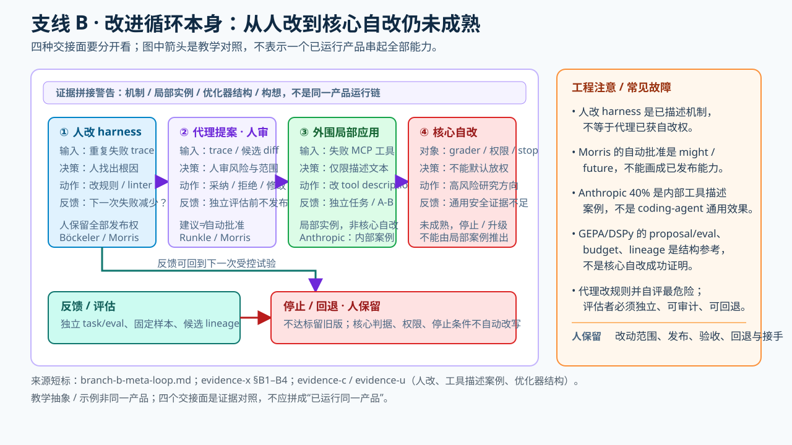

# 支线 B · 改进循环本身——局部实例已证，广义自动自改未成熟

> **证据边界**：Runkle（[evidence-a §3 C1](../raw/evidence-2026-09-26-a-originators.md)）、Morris（[evidence-c §问题3.1](../raw/evidence-2026-09-26-c-autonomy-and-convergence.md)）定义元循环；Anthropic 工具测试代理改写**工具描述**是一个局部实例（[evidence-u S5](../raw/evidence-2026-09-30-u-post-june-kols.md)）。Böckeler 描述的是**人**根据重复失败改进 harness，不能算代理获得自改权的独立票；与 Morris 同属 Thoughtworks 也不作独立机构票。
> 此支线用于展示将来的方向，**不是学员必修的最高阶**。尤其是代理自动更改评估器或核心循环结构，当前不能从工具描述案例推断为已成熟做法。

## 一、交接面（四个不同权限）

修改对象从产物转向产生产物的系统；教学按**人亲自改 → 代理给提案、人审核 → 代理在受限外围件上应用、独立验证 → 代理改写核心规则/判据**讲清幅度。前两者有明确机制，工具描述等外围改动有案例；最后一项仍是高风险研究方向，不默认放权。Morris 的分界句说明“人改 harness”，他的 flywheel 才进一步讨论“代理参与管理/改进”。
> "The 'in the loop' way is to fix the artefact … The 'on the loop' way is to **change the harness that produced the artefact** so it produces the results we want."

### 技术剖面：这次改的是“产物”，还是“制造产物的规则”

| 交接幅度 | 输入与实际改动对象 | 谁能应用 | 可核出处和限制 |
|---|---|---|---|
| **人修 harness** | 重复出现的失败 trace → 人改规则、工具描述、测试门或 linter | 人 | Böckeler 明确说人的工作是反复失败后改 feedforward/feedback controls；OpenAI 把无效文档规则升为代码约束（下文 ③/⑤） |
| **代理提案、人审核** | Agent 分析 trace → 产出配置候选和理由 | 人决定采纳、何时部署 | Runkle 的 hill-climbing 描述方向；Morris “might … automatically approved” 是未来式，不能算已发布自动放行（[evidence-x B1–B2](../raw/evidence-2026-09-30-x-ladder-branches-detail.md)） |
| **外围件局部自动修改** | 工具测试代理调用失败的 MCP 工具→改该工具的**描述文本** | 案例中代理改描述；部署和独立验收链未在原句交代 | Anthropic 报以后使用新描述的 agent 完成时间下降 40%，只属内部局部案例；不等于改判据（[evidence-x B3](../raw/evidence-2026-09-30-x-ladder-branches-detail.md)） |
| **自动改评估器/核心循环** | 拟改 grader rubric、授权策略、停止条件或核心调度 | **不默认授权** | 这些对象掌控“成功/允许/何时停”的定义；目前这里的来源不足以证实通用安全效果 |

**走一遍低风险演练（教学设计，不是上述厂商的端到端产品）**：某 MCP 工具连续返回参数错误→保留失败 trace 与旧描述→让代理只提出**新工具描述**的候选 diff→先由人核对未扩大工具权限、未偷改 grader→用同一组隔离任务做 A/B 对比，独立检查调用成功率、错误类别、额外成本→只有通过事先定义的准入规则才发布；未过则沿旧版本继续。不要让“提案 agent 自己说新描述更好”成为验收。这个演练的比较、审批与旧版回退是**建议配置的控制协议**，不是 Anthropic 40% 报告声称包含的步骤。

**结构参考，不是 coding-agent 自改的成功证明**：DSPy GEPA 区分 proposal 的 reflection LM 与 evaluation 使用的 task model；两种**角色**不保证默认是不同模型或独立所有权。可用 `max_metric_calls` 作计量调用上限，并留存每个 candidate、parent 与逐样本 score 的 `detailed_results`。若任务要求异源验收，还须分别配置模型和评估数据/权限；保留旧候选只提供撤回记录，不等于生产环境有自动 rollback（[DSPy 官方文档及 evidence-x B4](../raw/evidence-2026-09-30-x-ladder-branches-detail.md)）。**最危险的闭环**是同时允许代理改规则和判定自己是否改得好：分离提案与评估、冻结验收样本并审计变化是工程上的必要检查，不证明核心自改可安全放行。

## 二、支撑条目（原文与成熟度分开）

**① 定义句（Runkle/LangChain，2026-06-16，[evidence-a §3 C1](../raw/evidence-2026-09-26-a-originators.md)）**
> "The hill climbing loop runs an analysis agent over those traces and uses the findings to **rewrite the harness** with improved configuration."
> "the return arrow doesn't just loop back to the top — **it reaches inside and updates the agent loop directly**. Each cycle of the outer loop makes the inner loops more effective."

**② 人机分工与首个自动放行判据（Morris flywheel，[evidence-c §问题3.1.4/5](../raw/evidence-2026-09-26-c-autonomy-and-convergence.md)）**
> "The next level is humans directing agents to manage and improve the harness rather than doing it by hand."
> "As we gain confidence, the agents can assign scores to their recommendations, including the risks, costs, and benefits. We might then decide that recommendations with certain scores should be **automatically approved and applied**."

**③ 触发判据（Böckeler steering loop，[evidence-c §问题3.3.3](../raw/evidence-2026-09-26-c-autonomy-and-convergence.md)）**
> "The human's job in this is to **steer** the agent by iterating on the harness. **Whenever an issue happens multiple times**, the feedforward and feedback controls should be improved."
- 触发条件＝同一问题多次发生→改 controls（不是预防式臆造规则）。

**④ 存在理由（Anthropic Managed Agents，2026-04-08，[evidence-b §问题2.5](../raw/evidence-2026-09-26-b-stop-and-scheduling.md)）**
> "a harness encodes assumptions about what the model can't do … **those assumptions rot as the model improves**"
- 模型升级会使部分 harness 假设过时，因而需要**复审和维护**；这不是允许代理自动改写 harness 的论据。

**⑤ 机构实践（OpenAI《Harness engineering》，2026-02-11，[evidence-i Source 6](../raw/evidence-2026-09-27-i-high-influence-control.md)）**
> "When documentation falls short, we **promote the rule into code**."
> "Our team used to spend every Friday (20% of the week) cleaning up 'AI slop.' Unsurprisingly, that didn't scale."
> "We tried the 'one big AGENTS.md' approach. **It failed.**"
- 规则升级路径：文档→linter/代码；巨型单文件路线自述失败。

**⑥ 规则溯源判据（Osmani，2026-04-19，[evidence-c §问题3.2.5](../raw/evidence-2026-09-26-c-autonomy-and-convergence.md)）**
> "**Every line in a good `AGENTS.md` should be traceable back to a specific thing that went wrong.**"

**⑦ 改写幅度光谱（本区归纳，两票定标）**
- 外围件（已实证）：工具描述改写，Anthropic tool-testing agent，> "resulted in a 40% decrease in task completion time"（evidence-u S5）。
- 循环结构（概念）：Runkle "updates the agent loop directly"。
- 教学顺序应沿光谱从外围到核心，护栏强度随幅度递增。

**⑧ 人肉前身（Huntley Ralph"signs"，[evidence-b §问题1.1](../raw/evidence-2026-09-26-b-stop-and-scheduling.md)）**
> "one then tunes Ralph by adding a sign next to the slide saying 'SLIDE DOWN, DON'T JUMP, LOOK AROUND,'"
- 把踩坑教训写成环境内持久提示——人工改进 harness 的入口形态。

## 三、受控尝试的必要核查（不是自动放行保证）

以下是可讨论的风险控制与研究线索，尚无证据证明四条同时满足就能安全放行核心自改；优先从人审核的外围件改动开始。

1. **提案-评估异源**（实证：self-preference 与 self-recognition 线性相关，[evidence-m Source 5](../raw/evidence-2026-09-28-m-judge-lineage.md) → arXiv:2404.13076）：
   > "an LLM evaluator scores its own outputs higher than others' while human annotators consider them of equal quality."
2. **判据泄露与绕过风险**（METR，[evidence-n Source 8](../raw/evidence-2026-09-28-n-verdict-split-coding.md)）：
   > "Reward hacking was more than **43×** more common on RE-Bench tasks **than HCAST tasks**, perhaps because on RE-Bench tasks the model was able to see the entire scoring function, making that function easier to bypass…"
   - 这是两类任务间的比较与作者的可能解释，**不是**同一任务“公开判据 vs 隐藏判据”随机对照得出的通用 43× 因果效果。
3. **Goodhart 上界**（[evidence-m Source 2](../raw/evidence-2026-09-28-m-judge-lineage.md) → arXiv:2210.10760）：
   > "optimizing its value too much can hinder ground truth performance, in accordance with **Goodhart's law**."
4. **反应式构建**（marmelab 审计，[evidence-c 对照面4a](../raw/evidence-2026-09-26-c-autonomy-and-convergence.md)）：
   > "a harness should be built **in reaction to an agent failure**, not based on an assumption that the agent can't do something properly."

## 四、dissent（本阶火力最猛，必须并列教）

- **定量反调**（ReliabilityBench，[evidence-r S2](../raw/evidence-2026-09-28-r-ial-scan-reliability.md)）：
  > "The degradation gradient ∂R/∂λ is steeper for Reflexion (−0.50 per 0.1 λ) than ReAct (−0.38), indicating that **self-reflection mechanisms may amplify rather than mitigate fault impacts**."
- **反直觉 ablation**（marmelab）：> "we think a harness should be built by a human, instead of an agent. If an agent needs supervision, how can it decide the supervision it needed? This is **our opinion rather than a finding**: the only ablation study we found (NLAH, arXiv 2603.25723) **measures the opposite**, with a self-improving harness gaining 4.8 and 2.7 points."
- **哲学张力**（Cherny YC，2026-02-17，[evidence-a §1b A3](../raw/evidence-2026-09-26-a-originators.md)）：
  > "you can improve performance maybe 10, 20% … And then essentially **the gain is wiped out with the next model**. … never bet against the model."
  ——loop 配置本身也是 scaffolding；支线 B 改写的东西会随模型换代贬值，这是本方向投资回报的内在折扣。

## 五、待补清单

1. GEPA/DSPy 提案-评估分离素材从缺口 5 按本档格式搬运（护栏四条的工程化展开）。
   ✅ 活跃度与身份核验（2026-09-30 观测）：**GEPA（Genetic-Pareto）**＝斯坦福/Databricks 线（Agrawal…Khattab）的
   反思式文本参数优化器——LLM 通读执行 trace（报错/工具输出/推理日志）诊断失败原因→提案修改→按指标测试→
   从自身尝试的 **Pareto 前沿**合并互补教训；六项任务对比 RL(GRPO) 平均高 **6%**、rollout 最多减少 **35×**（非平均值），**ICLR 2026 Oral**
   （[arXiv:2507.19457](https://arxiv.org/abs/2507.19457)，v2 2026-02-14）。仓库 [gepa-ai/gepa](https://github.com/gepa-ai/gepa)
   6.8k stars、2026-09-29 仍有提交，README 口径已扩到 "prompts, code, **agent architectures**, configurations"。
   DSPy 侧：3.4.0 于 2026-09-25 发布（月更节奏），含 ReActV2 原生工具环、RLM 递归循环、沙箱解释器。
   **归位注意**：GEPA/DSPy 是优化器的**结构对照线索**（提案-评估分离、候选档案、指标驱动），
   不是 coding-agent harness 自改机制的验证；不能从其数字推得本支线的效果。
2. NLAH（arXiv 2603.25723）与 marmelab 引文的原文核验。
3. Morris 卡片四级修订联动（flywheel 的元循环概念对照见 [00-map](00-map.md)）。
