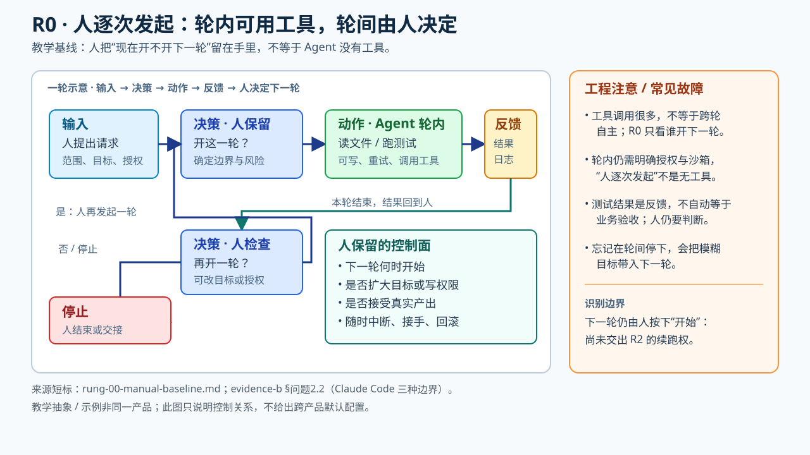

# R0 人逐次发起——用来识别下一层究竟交出了什么

> **定位**：教学基线，不是“没有工具的 Agent”。人决定何时开始一项工作、读一次回答后是否追问或再开任务；单次请求内部仍可能有读文件、调用工具、改代码和重试。Claude Code 的官方对照明确区分“轮内工具审批”“上一轮结束后启动下一轮”“过了时间间隔再启动”三件事（[evidence-b §问题2.2](../raw/evidence-2026-09-26-b-stop-and-scheduling.md)）。

## 一次任务如何走（教学示例，不是产品运行日志）

| 时点 | 具体动作 | 谁作决定 | 留下什么可核对的东西 |
|---|---|---|---|
| 起跑 | 人说“定位这一处失败测试，先不要改代码” | 人决定**开这一轮**及范围 | 请求文本、工具权限 |
| 轮内 | Agent 读文件、运行获准的测试、报告失败定位 | Agent 决定轮内步骤；工具仍受授权/沙箱约束 | 工具请求与结果、日志 |
| 本轮结束 | Agent 汇报推断与测试结果 | 人检查是否值得修复、要不要给写权限 | 尚未验收的候选结论 |
| 再起跑 | 人下达“只修改这个测试关联文件，跑对应测试” | 人决定**再开一轮** | 新请求及其授权边界 |

**辨认办法**：即便第一轮 Agent 自己跑了十次工具，只要它结束后不会因一个持久 goal 条件自动开启下一轮，也没有定时器重新唤醒它，这仍可用 R0 作为教学基线。工具调用次数不是分阶变量；“逐次发起”也不保证轮内每个动作都经人批准（[evidence-b §问题2.2](../raw/evidence-2026-09-26-b-stop-and-scheduling.md)）。

**实战感觉**：慢处在每次结果都要人读取、决定是否继续；好处是方向偏了可在下一轮前改目标。若痛点是**轮内反复批准安全动作**，看 [R1](rung-01-authorized-execution.md)；若是**每轮结束都要人说继续**，看 [R2](rung-02-goal-driven.md)；若是**人得守着时钟重新启动**，看 [R3](rung-03-time-event-driven.md)。这些可以按任务选择，并非必须全部打开。
