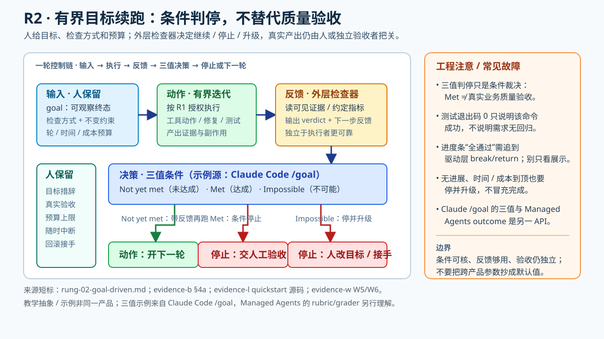

# LE2 有界目标续跑（主线 · 机制已证）——交出下一轮的启动与路径选择



> **交接面**：人给出目标、检查方式和资源边界；系统在一轮结束后根据条件决定是否继续、下轮怎样推进。人保留目标措辞、实际产出验收及随时中断权；独立检查约定条件**不等于**独立判断实现是否足够好。

## 一、定义（跨源最小交集）

入口是有界目标＋完成条件；循环以 goal 作为续跑/停止依据多轮自驱。条件应说明**可观察终态、检查方式和不该改变的边界**；检查可以由独立模型完成，不能把其 verdict 与独立质量验收画等号。这是本阶与 LE1 的关键增量。

### 技术剖面：谁真正按下“下一轮”

```text
人写 goal（终态 + 检查方式 + 不得更改的约束 + 轮/时间预算）
  → 执行一轮（工具仍按 LE1 授权）
  → 本轮结束时，由外层完成检查器读取可见证据并给出 verdict
  → 未达成：反馈下一轮；已达成：停；不可能：停并升级
  → 人/独立验收者检查真实行为与副作用
```

上图是 [Claude Code `/goal` 规格](../raw/evidence-2026-09-26-b-stop-and-scheduling.md)的**教学抽象**，不是“所有 Agent 的通用实现”。其三值为 `Not yet met / Met / Impossible`；在执行没有进展（连续若干 turn 没有工具调用等）时亦可停止；turn/time 子句用于设上限。`/goal` 是当前会话条件，Stop hook 则可由设置作用到其范围内的会话并用脚本或提示判断；auto mode 只移除**轮内**审批提示，不会替 `/goal` 发起下一轮（[evidence-b §问题2.2](../raw/evidence-2026-09-26-b-stop-and-scheduling.md)）。

**走一遍（示意日志，不是产品跑出来的结果）**：采用下文 ⑧ 的 `Dashboard.tsx` Lighthouse 目标作为规格，预先约定 `score ≥ 92`、`LCP < 1.8s`、hooks 的 public API 不变、两次无改善或十轮即停。第一轮跑 Lighthouse 未达标→把指标反馈给执行者而非宣告完成；第二轮指标达标但 hooks 的 public API 改了→**只有约束检查能从 transcript/工具输出看到该违例**，检查器才应拒判 `Met`，否则可能误报完成；修复后指标与不变式同时满足→检查器可给 `Met`，**人还要检查**用户体验与是否测错页面。实际分数和轮次仅为教学假设，不能当作品效果报告（原命令及各约束见 ⑧、[evidence-a Osmani 原文](../raw/evidence-2026-09-26-a-originators.md)）。

**另一套真实 API，不要与 `/goal` 混用**：Anthropic Managed Agents 的 `user.define_outcome` 要求提供 Markdown rubric，可内联或经 Files API 复用；单独 context 的 grader 按 criterion 给反馈，再送回执行 agent 迭代（[evidence-w W5](../raw/evidence-2026-09-30-w-ladder-runtime-detail.md)）。会话先 `sessions.create(agent, environment_id)`，后送 `user.message` 才开工；已送事件 `processed_at=null` 只代表**在排队**，不是已执行。会话有 `idle / running / rescheduling / terminated`，其中预算暂停是 `idle` 而非完成或销毁（[evidence-w W3](../raw/evidence-2026-09-30-w-ladder-runtime-detail.md)）。

**可核参数示例**（仅属 Managed Agents）：`budget={"type":"limit","max_list_cost":{"amount":"125","currency":"USD"}}` 的 `"125"` 是**125 美分，即 $1.25**。触顶 `stop_reason=budget_reached`，在途请求仍可稍超额完成，新 `user.message` 得 400；提高/移除预算可恢复原 session（[evidence-w W6](../raw/evidence-2026-09-30-w-ladder-runtime-detail.md)）。预算是**花费暂停阀**，不是 `Met` 的同义词；rubric grader 也不同于 LE1 的工具审批器，更不是无条件的业务验收者。

| 你看到的信号 | 它说明什么 | 它**不**说明什么 |
|---|---|---|
| 测试命令退出码 0 | 指定命令在该环境成功 | 测试覆盖真实需求或无回归 |
| 独立检查器返回 `Met` | 约定条件在其可见证据内成立 | 实际用户已经验收 |
| 进度文件显示 `passes == total` | 被记录的项目均标记通过 | 驱动进程必然据此停机 |
| 轮数/时间耗尽 | 预算到边界，必须停或交人 | 任务自动已完成 |

**结果可证成性的附加检查**：即使三值检查器给 `Met`，仍需核它看见的证据是否覆盖目标、不变式和真实版本，执行者是否能改判据；量不到的业务结果继续留给人或另设外部观察。见 [正交交接页](result-reliability-interface.md) 的五个接口。它不把所有 LE2 任务强制升级成独立模型裁判，也不拿预算上限当成功信号。

**最硬的反向实验**：Anthropic 的 [官方 quickstart 源码](../raw/evidence-2026-09-28-l-quickstart-code.md) 里，`progress.py` 会打印 `passing/total`，但 `agent.py` 没有 `passing == total` 的退出分支；成功时 `run_agent_session` 仍回 `continue`，`--max-iterations` 默认 `None`（无限），错误也换新 session 重试。单看进度条会误以为装了 LE2 停机闸门；应追到**驱动层的 `break`/return 路径**。这是一个 demo 的源码现象，不外推为 `/goal` 的实现或 Anthropic 生产系统。

## 二、支撑、反例与回源待办（⏳ 条目不计入支撑）

**① Osmani `/goal`（转述自台账，逐字在 evidence-a）** ⏳ 逐字待补
- 要点（转述 [`raw/kol-roster.md`](../raw/kol-roster.md) §A `addy_osmani` 行）：`/goal` 评估器**只核 transcript 硬规则、不判内容好坏**；
  分层运行模式第二级即 `/goal`。锚 [evidence-a](../raw/evidence-2026-09-26-a-originators.md)。

**② Anthropic quickstart 源码（对“有 goal 就能自动判停”的反例）**——一手源码，观测 2026-09-28，全文在 [evidence-l](../raw/evidence-2026-09-28-l-quickstart-code.md)：
- 驱动层退出路径逐字：
  > `while True:` / `iteration += 1` / `if max_iterations and iteration > max_iterations:` →
  > `print(f"\nReached max iterations ({max_iterations})")` / `break`
- **循环内没有完成检查**：`run_agent_session` 成功时恒返回 `("continue", response)`；驱动层不读通过率、不判"全部 passes"。
- 通过率的实际住处：`count_passing_tests` 读 `feature_list.json` 的 `passes` 字段——**算给人看**（每轮打印），不以 `passing == total` 停机。
- 对本阶的教训（落差即发现）：**博客叙事里的"goal 完成"，在配套驱动代码里是靠人看进度 summary 实现的**——LE2 的"交出判停权"在工程上并不自动成立，判据住哪一层是设计决定。

**③ 可观察措辞纪律** ⏳ 逐字待补
- 中文传播层的转述与本主题判读同构（[evidence-t](../raw/evidence-2026-09-30-t-shenmejiaoqq-video-zh.md) §2，侦察级）：
  > "你不能写让代码达到生产就绪，因为AI没法验证，你必须写测试通过且lint检查无误，这样评估者才能通过读取终端输出判断是否真正完成。"
- 主题侧权威表述在 [`agent_goal_eval/`](../../agent_goal_eval/README.md)（goal/eval 怎么构造归那个主题，此处只指针）。

**④ 学术共识口径（✅ 2026-09-30 锚 [evidence-u](../raw/evidence-2026-09-30-u-post-june-kols.md) S6）**
- arXiv:2608.21884（2026-08，ASE 2026 workshop 在审）摘要逐字——灰色文献"基本一致"的构件清单里，本阶占两头：
  > "triggered agent runs bounded by **machine-checkable stop conditions**, persistent state files, verifier sub-agents, token budgets, and **defined points of escalation to humans**."
- 这说明“机器可核停止条件＋人升级点”已成为灰色文献的**设计词汇**；论文 [§3 O3 与 §4.1](https://arxiv.org/html/2608.21884v2) 同时提醒来源承袭、仓库中可见的 goal/stop 定义未检出。不能写成已普及或已证明 LE2 效果。

**⑤ 判据性质的 nuance（Ronacher，✅ S1）——纪律的边界**
- > "The harness just needs some signal that lets it continue. **It does not have to be objective or binary**, it just has to be useful enough to drive another iteration."
- 与"机器可核"纪律构成真实张力：**停止条件要可核，续跑信号可以只是"够用的信号"**——两句话别混成一句。入口 goal 要可验，中间迭代的推进信号可以弱得多。这挡住了把"判据必须二值"教条化的误读。

**⑥ 闸门质量实证（Carlini，✅ S3）**
- > "it's important that the **task verifier is nearly perfect**, otherwise Claude will solve the wrong problem."
- 16-agent / $20k 的 C 编译器项目里，作者自述大部分精力花在验证器与环境设计——LE2 阶"人保留的东西"的重心：**判据质量本身就是工作量**。

**⑦ 官方规格：可核条件三要素与三值判定（✅ 逐字，[evidence-b §4a](../raw/evidence-2026-09-26-b-stop-and-scheduling.md) → Claude Code /goal docs）**
> "A condition that holds up across many turns usually has: **One measurable end state** … **A stated check**: how Claude should prove it, such as '`npm test` exits 0' … **Constraints that matter**: anything that must not change on the way there"
> "The model returns one of three verdicts: **Not yet met** … **Met** … **Impossible**: the evaluator judged that the condition can never be satisfied."
> "If Claude keeps answering the evaluator without making progress (no tool use for several turns in a row), Claude Code stops the loop … with the goal still set."
> "To bound how long a goal runs, include a turn or time clause in the condition, such as `or stop after 20 turns`."
- 教学四件：三要素写法、三值出口（含 Impossible）、无进展熔断、上限作为条件子句。

**⑧ 教科书级 goal 全例（✅ Osmani，2026-08-14，[evidence-a 补充回源](../raw/evidence-2026-09-26-a-originators.md)）**
> "/goal Refactor the data-fetching layer in Dashboard.tsx until Lighthouse performance score is >= 92 and LCP is under 1.8s as shown by the Lighthouse CLI output. Do not change the public API of any hooks. Each turn must improve at least one reported metric; abort if two consecutive turns show no improvement. Stop after 10 turns."
- 六要素齐全：可度量终态＋检查方式＋约束＋单调进步＋空转熔断＋轮数上限。直接可背的模板。

**⑨ 为什么评估者必须独立（✅ 一句机制解释）**
> "agents reliably skew positive when grading their own work. **It's GANs for prose.**"（Osmani，2026-04-19，[evidence-c §问题3.2.1](../raw/evidence-2026-09-26-c-autonomy-and-convergence.md)）

## 本阶 dissent

- **"测试绿了"不等于行为对**（Böckeler，2026-04-02，[evidence-c §问题3.3.4](../raw/evidence-2026-09-26-c-autonomy-and-convergence.md)）：
  > "This approach puts a lot of faith into the AI-generated tests, **that's not good enough yet**."
- **自纠正循环的定量反调**（ReliabilityBench，[evidence-r S2](../raw/evidence-2026-09-28-r-ial-scan-reliability.md)）：
  > "The degradation gradient ∂R/∂λ is steeper for Reflexion (−0.50 per 0.1 λ) than ReAct (−0.38), indicating that **self-reflection mechanisms may amplify rather than mitigate fault impacts**."
- **准入反句**（Osmani，2026-08-14）：> "a vague goal would be 'keep going until this UI design is good'. What does that mean? Good to who? … Tasks that require human taste, subjective design, or open-ended creative exploration **aren't a good fit**."
- **适用性独立判据**（Willison，2025-09-30，[evidence-i Source 4](../raw/evidence-2026-09-27-i-high-influence-control.md)）：> "problems with **clear success criteria** where finding a good solution is likely to involve (potentially slightly tedious) **trial and error**."

## 三、反例位

- goal 措辞含糊 → 循环烧钱无果：行为面反例矩阵待收口（CURRENT 缺口 5），落位后搬入 ⏳。
- 评估者只读 transcript 的局限（Osmani 口径）→ 与 ③ 验收分离（[`stop_conditions/03_verdict_split/`](../stop_conditions/03_verdict_split/README.md)）衔接。

## 四、进入 LE3 前的额外检查

LE2 的多轮续跑不自动提供定时或事件唤醒。当任务需要**以后再次起跑**（CI 轮询、夜间跑批），先定触发范围和**硬上限与熔断**（[`stop_conditions/02_hard_caps/`](../stop_conditions/02_hard_caps/README.md)）；如跨会话运行，还须状态持久、取消传播和人工接手。也可停留在 LE2，直接探索有界的并行研究支线，不把 LE3 当所有后续能力的前置。
