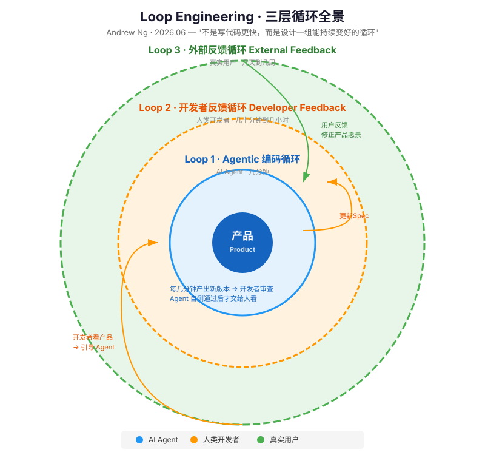
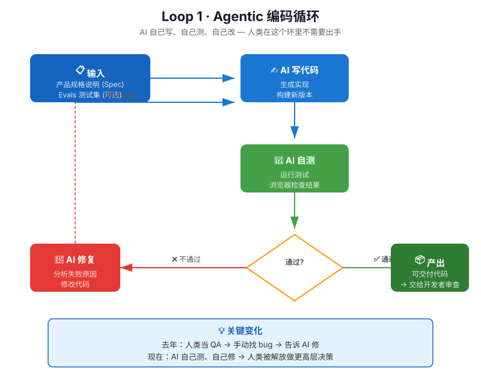
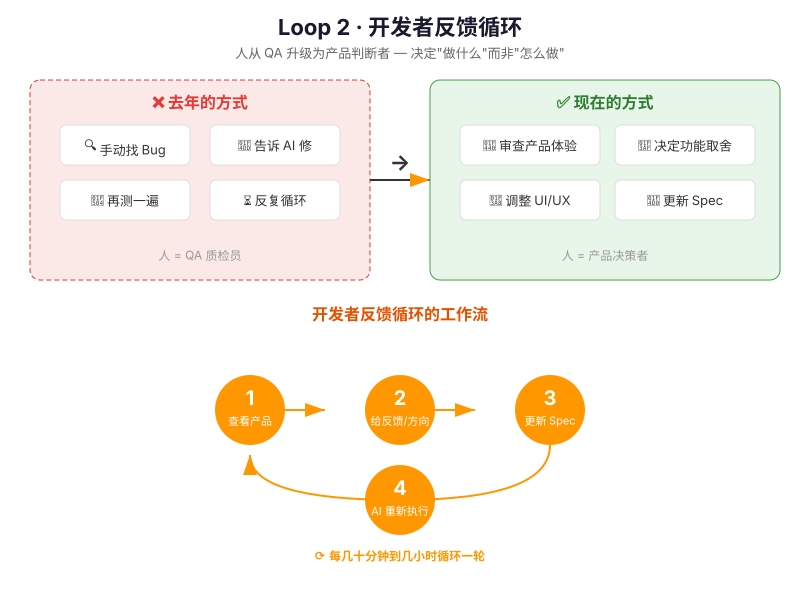
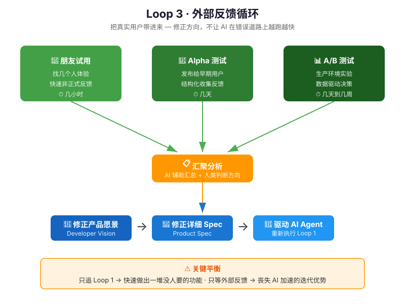
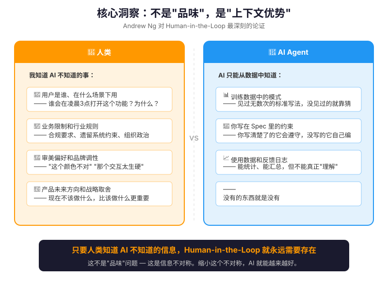

# 吴恩达谈 Loop Engineering：AI 编程真正的变化不是写代码更快

> 原文: Andrew Ng, 2026.06.30 · 消化自 [X post](https://x.com/AndrewYNg/status/2071988145667928442) + ThinkInAI 中文解读

---

## 一句话理解

"Loop Engineering" 这个词最近因为 Claude Code 创作者 Boris Cherny 和 OpenClaw 创作者 Peter Steinberger 的讨论突然火了。但吴恩达说，它不只是新 buzzword——

> **AI 时代的软件开发，不是一次性把需求丢给模型，而是设计一组能持续变好的循环。**

他把做 0→1 产品的核心方法论拆成了三个环：AI 自己跑的环、开发者指导的环、真实用户验证的环。

---

## 全景：三个环怎么嵌套

三个环不是孤立的——**外环的数据修正内环的方向**：

- **外环（用户反馈）** → 告诉你该做什么
- **中环（开发者反馈）** → 把方向变成清晰规格
- **内环（AI 编码）** → 把规格快速实现出来

---

## Loop 1：Agentic 编码循环 — AI 自己写、自己测、自己改

**这个环每几分钟跑一轮。** AI 拿到 Spec 和 Evals 之后：

1. 写代码
2. 运行测试、浏览器检查结果
3. 不通过 → 自己分析原因、修改、再来
4. 通过 → 输出给开发者看

吴恩达举了自己给女儿做打字练习 App 的例子——AI Agent 可以**自己跑一个多小时**，用浏览器反复检查构建结果，中间完全不需要他介入。

**关键变化**：去年开发者还得当 QA 手动找 bug，现在 AI 自己测自己修，人被解放出来做更高层决策。

---

## Loop 2：开发者反馈循环 — 人从 QA 升级为产品判断者

**这个环每几十分钟到几小时跑一轮。**

去年很多开发者（包括吴恩达自己）的工作模式是：看 AI 输出 → 找 bug → 让 AI 修 → 再看。现在 AI 自测能力大幅提升，人不再需要当 QA。释放出来的精力花在：

- 决定该做什么功能
- 调整 UI/UX
- 设计用户流程
- 把模糊的产品愿景翻译成清晰的可执行 Spec

**看见实现之后才想清楚想要什么**——这是常态。所以写 Spec 不是一次性工作，而是看到版本、修改判断、更新 Spec、让 AI 再跑的持续过程。

---

## Loop 3：外部反馈循环 — 把真实用户带进来

**这个环最慢，几天到几周。** 但最关键——它修正方向。

三种常见方式：朋友试用 → Alpha 测试 → A/B 测试

反馈数据**回流到产品愿景和 Spec**，再驱动 AI 重新执行 Loop 1。

> ⚠️ 只追 Loop 1 → 快速做出一堆没人要的功能
> 只等外部反馈 → 丧失 AI 加速的迭代优势
> **真正的能力是把三个环协同起来。**

---

## 核心洞察：不是"品味"，是"上下文优势"

很多人把人类在产品中的独特贡献叫"品味（taste）"。吴恩达不同意。

他认为应该叫 **"上下文优势（context advantage）"**——

> 人类比 AI 知道更多关于用户、场景、业务限制、产品运行环境的信息。AI 也许能总结数据、提出建议，但它不天然拥有这些上下文。

所以 **human-in-the-loop 不是因为 AI 不够好，而是因为信息不对称**——只要人类知道 AI 不知道的信息，就需要人把这些知识注入系统。

这个表述之所以重要：它给出了清晰的方向。不是"培养品味"这种说不清的软技能，而是——**缩小人与 AI 之间的信息差**。你怎么让 AI 知道你所知道的？

---

## 真正稀缺的东西

AI 把实现成本打下来之后，稀缺的不再是"写代码的速度"，而是：

| 不再稀缺 | 真正稀缺 |
|----------|----------|
| 写代码 | 对用户的理解 |
| 实现功能 | 对问题的判断 |
| 执行需求 | 对产品方向的取舍 |
| 一个人写所有代码 | 把模糊愿景转成可执行 Spec |
| 手动找 bug | 设计有效的反馈循环 |

---

## 如何开始练习？

吴恩达建议工程师从小项目开始，刻意练三件事：

1. **写清楚 Spec**，好到让 AI 能独立构建和测试
2. **定期看版本**，反馈从"修 bug"提升到"改体验、改方向"
3. **尽早让真实用户试用**，不要只在本地和 AI 自嗨

团队层面该问的问题：
- 我们的 AI Agent 有没有测试闭环？
- 开发者反馈有没有沉淀成 Spec？
- 真实用户反馈有没有及时进入下一轮产品判断？

---

*消化自 Andrew Ng 原文 + ThinkInAI 社区中文解读，SVG 图文均为原创绘制。*
