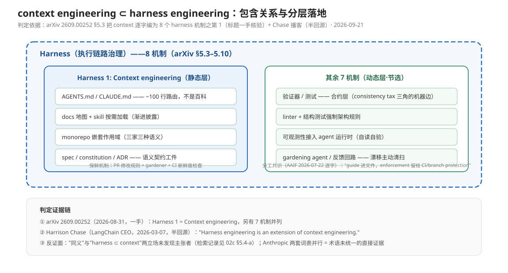

# 深挖三-B：context engineering 与 harness engineering 的概念关系辨析

> **元数据**
> - 观测日期：2026-09-21（用户直问：两者是不是一回事？context 是不是 harness 的一层？）
> - 上游：`02-context-engineering.md`（context 派已收内容，本文不重复其 AGENTS.md/治理细节）与 `03-harness-governance.md`（harness 派已收内容，本文只补"关系"轴）
> - 回源分级：**一手** = 本次直接抓到原文（Anthropic、arXiv 2609.00252 abs+HTML 目录、DigitalToday-Chase 报道、阿里云三层文、Roadie）；**半回源** = 经第三方消化稿/转引核验（OpenAI 原文 403 依赖消化稿、Trivedy X 帖、Karpathy/Lütke X 帖、Cole Medin 知识库消化稿）——逐条标注
> - 红线执行：每条断言 URL+日期；直引逐字；半回源一律降级标注

---

> 包含关系图：静态层（context 的四类工件）与动态层（其余 7 机制）+ 三条判定证据链。

## 0. 一句话判定（先给结论）

**两者不是一回事，且主流证据支持"context engineering 是 harness engineering 的一个（静态/信息）层"——即关系①；但在 Anthropic 一侧的语料里两词至今互不出现，"同义合并"（②）没有任何一方主张。**

---

## 1. 权威定义并排（2025-06 → 2026-09，逐个摘原文）

### 1.1 起源三连：Lütke → Karpathy → Anthropic（context 一侧）

- **Tobi Lütke（Shopify CEO，X 帖，2025-06-19）**——context engineering 一词的公认起点：
  > "I really like the term 'context engineering' over prompt engineering. It describes the core skill better: the art of providing all the context for the task to be plausibly solvable by the LLM."
  - URL：[x.com/tobi/status/1935533422589399127](https://x.com/tobi/status/1935533422589399127)；日期 2025-06-19。**半回源**：X 原帖未直接抓取，经 [Roadie《The Word 'Context' Has Stopped Meaning Anything》](https://roadie.io/blog/context-engineering-definition-problem/)（2026-06-30，本次一手回源）逐字转引。
- **Andrej Karpathy（X 帖，2025-06-25，六天后放大）**：
  > "context engineering is the delicate art and science of filling the context window"（在"every industrial-strength LLM app"中）
  - URL：[x.com/karpathy/status/1937902205765607626](https://x.com/karpathy/status/1937902205765607626)；日期 2025-06-25。**半回源**：同经 Roadie 文转引（Roadie 一手可查）。
- **Anthropic 官方博客《Effective context engineering for AI agents》（2025-09-29，本次直接回源）**——三个连续定义句（原文逐字）：
  > "After a few years of prompt engineering being the focus of attention in applied AI, a new term has come to prominence: **context engineering**. Building with language models is becoming less about finding the right words and phrases for your prompts, and more about answering the broader question of 'what configuration of context is most likely to generate our model's desired behavior?'"
  > "**Context** refers to the set of tokens included when sampling from a large-language model (LLM). The **engineering** problem at hand is optimizing the utility of those tokens against the inherent constraints of LLMs in order to consistently achieve a desired outcome."
  > "**Context engineering** refers to the set of strategies for curating and maintaining the optimal set of tokens (information) during LLM inference, including all the other information that may land there outside of the prompts."
  - URL：[anthropic.com/engineering/effective-context-engineering-for-ai-agents](https://www.anthropic.com/engineering/effective-context-engineering-for-ai-agents)；日期 2025-09-29。
  - **关系判读关键事实**：全文（含 compaction/结构化笔记/sub-agent 等长任务技术清单）**一次都没有出现 "harness" 一词**——Anthropic 在系统阐述 context engineering 时把 sub-agent 架构、memory 工具、渐进披露都收编进 context 之下，harness 词表当时不存在于其官方口径。

### 1.2 OpenAI《Harness Engineering》（2026-02-11）——harness 一侧的旗舰

- **回源状态**：原文 [openai.com/index/harness-engineering](https://openai.com/index/harness-engineering/) 直接抓取 **403**（本次及 2026-09-20 两轮均被拒）。以下细节沿用 `03-harness-governance.md` §1 已交叉核验的两个第三方消化稿，**半回源降级**。
- **核心定义句**（消化稿口径）："Humans steer. Agents execute."——人类不是代码来源而是**环境设计者**；harness 的操作面包括 ~100 行 AGENTS.md 路由、docs 三目录知识库、per-worktree 可观测性栈、taste linter、doc-gardening/cleanup agent、merge 门禁姿态。
- **关系判读关键事实**：在这份最系统的 harness 文里，**AGENTS.md 与 docs 地图（即 context 派的全部标的）只是 harness 的第 1、2 条模式**（评估卡 10 条模式清单的 1/2 条），可观测性/review loop/cleanup agent 等"动态层"占其余 8 条——**OpenAI 的用法天然把 context 管理当作 harness 的一个子集**。

### 1.3 arXiv 2609.00252（UPM，2026-08-31 提交，本次直接回源 abs + HTML）——唯一学术化的显式分层

- **harness 的正式定义**（摘要，逐字）：
  > "characterize the harness, i.e., the set of technical and methodological mechanisms through which teams govern agent behavior"
  - URL：[arxiv.org/abs/2609.00252](https://arxiv.org/abs/2609.00252)；日期 2026-08-31。
- **关系判读关键事实（本专题最硬的一条证据）**：论文 §5 把 harness 操作化为 **8 个机制，其第 5.3 节标题就是"Harness 1: Context engineering"**——context engineering 被逐字收编为 harness 的**第一个机制**（§5.3 正文在本次抓取中截断未逐字读，标题与章节结构一手核验；正文表述按**半回源**对待）。§5.1 的 technical harness 定义（经 04 文档 2026-09-20 全文回源核验）明确把"上下文工程、工具、验证脚本、可观测性"并列为 technical harness 的构成要素。论文引言同时注明 harness 概念来自 practitioner 文献"Agent = Model + Harness"（引 Böckeler & Fowler 2026、LangChain 2026）。
- **论文自己的降级声明**（诚实义务）：依据"predominantly on gray literature"，自我定位是"a first step toward academic–industrial consensus rather than a validated theory"——引用时按**概念框架先行者**而非实证结论。

### 1.4 LangChain：Trivedy 术语命源 + Chase 关系表态

- **Viv Trivedy（X 帖 "Anatomy of an Agent Harness"，约 2026-01）**：
  > "Agent = Model + Harness. If you're not the model, you're the harness."
  - URL：[x.com/Vtrivedy10/status/2031408954517971368](https://x.com/Vtrivedy10/status/2031408954517971368)。**半回源**：原帖未直接抓取，经 Osmani [2026-04-19 文](https://addyosmani.com/blog/agent-harness-engineering/)转引（04 文档 §7.1 已核）。在这个减法里，**context 属于"非模型"一侧——按定义落入 harness**。
- **Harrison Chase（LangChain CEO，VentureBeat 播客，2026-03-07 报道，本次直接回源报道页）**——**关系问题上唯一一位CEO级的一手表态**：
  > "Harness engineering is an extension of context engineering."
  > "He said the recent trend is to hand more control over context engineering to the model itself. That means letting the model decide what it will and will not look at."
  - URL：[digitaltoday.co.kr/en/view/28196](https://www.digitaltoday.co.kr/en/view/28196/langchain-ceo-ai-agent-success-depends-on-context-engineering)；报道日 2026-03-07。**半回源**：报道一手可查，但播客原声未回源；引语为报道转写。
  - 判读："extension of context engineering" = harness engineering 在 context engineering **之外还多出东西**（循环、工具、长任务结构），即 ① 的语义。
- **LangChain DeepAgents 受控实验（2026-02-17，04 文档 §7.6 已收）**：同模型只改 harness 提 13.7 分，五项改动中第一项就是"启动期目录/工具映射的**上下文工程**"——工程实践上同样把 context 工程当作 harness 改造的一个部件。

### 1.5 Cole Medin（YouTube，2026-05-27）——明确面对"这不是就是 context engineering 吗"的视频

- **定义句**（知识库消化稿逐字）：
  > "harness engineering, building and continually evolving the AI layer around a coding agent... is the 2026 evolution of context engineering"
  > "The first is the harness inside a single coding-agent session, which is largely a direct evolution of context engineering."
  - URL：[youtube.com/watch?v=ulNsa0sD8N0](https://www.youtube.com/watch?v=ulNsa0sD8N0)（2026-05-27），经 [coleam00/cole-medin-knowledge-base](https://github.com/coleam00/cole-medin-knowledge-base/blob/main/sources/harness-engineering-what-separates-top-agentic-engineers-right-now.md)（2026-07-21 建卡）逐字消化。**半回源**。
- **关键时间戳 [0:04:32]**："The elephant in the room: isn't this just context engineering? Two distinctions follow"——他给出的两条区分是**控制权与"skill issue"心法**（每个错误变成 harness 改进，而非等下个模型版本）+ **多会话编排**（单会话内的 harness 才"largely"等价于 context engineering）。

### 1.6 中间层表述：阿里云开发者社区《Prompt、Context、Harness：三层架构》（2026-04-09，本次直接回源）

> "三者不是竞争关系而是分层。Prompt 关注如何表达任务；Context 关注模型在执行任务时看到什么；Harness 关注模型运行其中的系统。"
> "Context 层缺了 Harness 层，是一个信息充分但缺乏反馈的 Agent。Harness 层缺了 Context 层，则是一个受约束但无法获取所需信息的 Agent。缺哪个都不行。"

- URL：[developer.aliyun.com/article/1725017](https://developer.aliyun.com/article/1725017)；日期 2026-04-09（注明为转载型社区文，作者署 "JIN"，原出处 avoid.overfit.cn——**中文二手消化层，权重中低**，但它是观测到的最明确的"分层而非合并"大众化表述）。

### 1.7 并排定义表

| 来源 | 词 | 定义（原文核心句） | 日期 | URL | 回源 |
|---|---|---|---|---|---|
| Lütke | context engineering | "the art of providing all the context for the task to be plausibly solvable by the LLM" | 2025-06-19 | x.com/tobi/status/1935533422589399127 | 半 |
| Karpathy | context engineering | "the delicate art and science of filling the context window" | 2025-06-25 | x.com/karpathy/status/1937902205765607626 | 半 |
| Anthropic | context engineering | "the set of strategies for curating and maintaining the optimal set of tokens (information) during LLM inference" | 2025-09-29 | anthropic.com/engineering/effective-context-engineering-for-ai-agents | 一手 |
| OpenAI (Lopopolo) | harness engineering | "Humans steer. Agents execute."（harness=AGENTS.md 路由+docs 知识库+可观测性+review loop+cleanup agent 的整体） | 2026-02-11 | openai.com/index/harness-engineering（403，消化稿交叉） | 半 |
| Trivedy | harness | "Agent = Model + Harness. If you're not the model, you're the harness." | ~2026-01（原帖日期未精确核验，以 Osmani 2026-04-19 转引文为观测锚点） | x.com/Vtrivedy10/status/2031408954517971368 | 半 |
| arXiv 2609.00252 | harness | "the set of technical and methodological mechanisms through which teams govern agent behavior"；§5.3 "Harness 1: Context engineering" | 2026-08-31 | arxiv.org/abs/2609.00252 | 一手（§5.3 正文半） |
| Chase/LangChain | 两者关系 | "Harness engineering is an extension of context engineering." | 2026-03-07 | digitaltoday.co.kr/en/view/28196 | 半（报道一手） |
| Cole Medin | 两者关系 | "harness engineering... is the 2026 evolution of context engineering" | 2026-05-27 | youtube.com/watch?v=ulNsa0sD8N0 | 半 |
| 阿里云社区 | 两者关系 | "Prompt 关注如何表达任务；Context 关注模型在执行任务时看到什么；Harness 关注模型运行其中的系统" | 2026-04-09 | developer.aliyun.com/article/1725017 | 一手（低权重） |

---

## 2. 关系的四种可能：逐个找主张者，判定最强

| 立场 | 主张者与原文依据 | 强度判定 |
|---|---|---|
| **① context ⊂ harness**（context 是 harness 的内容/静态层） | arXiv 2609.00252 §5.3（context engineering = 8 个 harness 机制之第 1，逐字标题）；Chase "Harness engineering is an extension of context engineering"（2026-03-07）；Cole Medin "the 2026 evolution of context engineering"（2026-05-27）；OpenAI harness 文把 AGENTS.md/docs 地图列为 harness 模式 1/2（消化稿）；LangChain 实验把"上下文工程"列为五项 harness 改造之一（2026-02-17）；Trivedy 减法"非模型即 harness"逻辑蕴含 context ⊂ harness | **最强**。学术（1）+ CEO 一手表态（1）+ 实践受控实验（1）+ 多个 practitioner（≥3）四个层位独立同向 |
| **② context ≈ harness 同义** | **未发现主张者**（检索记录见 §5.4-a）。最接近的是 Cole Medin 自己抬出的"elephant in the room: isn't this just context engineering?"（0:04:32），但他随即用"控制权 + skill issue 心法 + 多会话编排"两条区分**否掉了合并** | 无主张者。唯一可见的合并质疑出现后即被原作者驳回 |
| **③ 两者正交**（context 管输入内容、harness 管执行环境） | 阿里云三层文："Context 关注模型看到什么；Harness 关注模型运行其中的系统"，且明确"缺哪个都不行"（2026-04-09）；Böckeler guides/sensors 二分（martinfowler.com 2026-04-02，04 文档 §7.3）在机制上同构——guides（前馈，AGENTS.md/skills）≈ context 侧，sensors（反馈，linter/review）≈ harness 动态侧，但 Böckeler 把两者都装进她的 harness 框架里 | **作为概念分析成立、作为词义归属不成立**：即便按 ③ 的分法，"管执行环境"的 harness 在 2026 年的用法里仍然**包含**对"管输入内容"机制的编排——两轴有交叠而非互斥 |
| **④ harness ⊂ context**（harness 是 context 的执行装置） | **未发现显式主张者（检索记录见 §5.4-a）**。最接近的反向逻辑是 Chase 的下一句："the recent trend is to hand more control over context engineering to the model itself"——若 context 决策权外置给模型/环境，harness 似乎可视为"决定 context 的机制"，即 harness 决定 context 而非相反。但这是 ① 的另一种表述（决策机制 ⊃ 内容），不构成 ④ | 最弱，无主张者 |

**判定：关系①（context ⊂ harness）证据最强**——它同时拥有学术操作化（arXiv 把 context engineering 编号为 Harness 1）、厂商 CEO 关系表态（Chase）、受控实验的工程解构（LangChain）与多个独立 practitioner 的演化叙事（Cole Medin 等）。补充一个限定：① 成立的前提是采用 **2026 年的 harness 词义**（OpenAI/Trivedy/arXiv 一脉）；若限定在 Anthropic 2025-09 的词义（context = token 集合的策展策略），context engineering 与"执行环境"确实分属两轴（③ 的合理内核）——**两词的争议本质是 harness 词义从 2025 的"agent loop 包装程序"扩张到 2026 的"团队级治理机制全集"造成的**。

---

## 3. 工程含义：若 context ⊂ harness，落地分层是什么样

**结论：分层表述在 2026 年已有多个独立给出者，但"静态层/动态层"这个二分法名目是本文归纳，无逐字出处。**

1. **静态层（规则文件治理 = harness 治理的 context 部分）**。OpenAI harness 文的 AGENTS.md（~100 行 TOC）+ docs 三目录 + doc-gardening agent（04 文档 §1.2–1.3）就是"规则文件作为 harness 静态层并配保鲜机制"的最完整实践；arXiv 论文把它抽象为机制 ①（context engineering）+ 机制 ②（persistent shared knowledge）两个并列座位。
2. **动态层（可观测性/反馈回路）**。Böckeler 的 **guides / sensors 二分**（[martinfowler.com/articles/harness-engineering.html](https://martinfowler.com/articles/harness-engineering.html)，2026-04-02，04 文档一手回源）是目前**最接近"静态/动态分层并被论证"的公开框架**："Guides（前馈：AGENTS.md、skills、LSP）/ Sensors（反馈：linter、结构测试、AI review）"，并补了元治理之问："我们需要一种类似代码覆盖率对测试那样的方法，来评估 harness 覆盖率和质量。"——即**分层之后还要分层治理**。
3. **显式分层并论证的最清晰实践文本**是阿里云三层文（§1.6 引文）：给出按失效模式诊断应诉诸哪一层的判定表（格式错→Prompt；知识缺失/选错工具→Context；漂移/静默失败/破坏性动作→Harness）——这是"关系判定有工程后果"的具象化：**判错层就会把反馈回路问题当成措辞问题去修**。
4. 对本仓库既有结论的衔接：04 文档 §5.2 的 P0→P4 梯度，本质就是"先治理静态层（P0：AGENTS.md 砍成路由、spec 迁 docs）再上动态层（P1–P4：linter→可观测性→review loop→自愈）"——层级关系在团队落地顺序上被再次印证。

---

## 4. 分歧点：谁反对合并 / 谁在拆台

1. **合并的反质疑及其驳回**（Cole Medin，2026-05-27）：公开面对"isn't this just context engineering?"，驳回理由是 harness 多出**控制权语义**（每个错误工程化为 harness 改进）与**多会话编排**两个 context engineering 不覆盖的东西。
2. **Anthropic 一侧的沉默即分歧**：Anthropic 官方 context engineering 文（2025-09-29）通篇不用 harness；其 harness 方法论两篇（2025-11 长任务 harness、2026-03-24 harness 设计，04 文档 §7.5）反向以 harness 为组织词——**同一厂商在两套词表下各写各的，是"两词未完成统一"的最直接证据**。核心原话："every component in a harness encodes an assumption about what the model can't do on its own."（[anthropic.com/engineering/effective-harnesses-for-long-running-agents](https://www.anthropic.com/engineering/effective-harnesses-for-long-running-agents)，2025-11；回源等级：半回源——经 04 文档 §7.5 与 04a A5 逐字核验）
3. **"context engineering 是营销膨胀词"的批评线**（反对的是 context 一词的滥用，不直接针对 harness）：Roadie《The Word 'Context' Has Stopped Meaning Anything》（[roadie.io/blog/context-engineering-definition-problem/](https://roadie.io/blog/context-engineering-definition-problem/)，2026-06-30，本次一手回源）：
   > "By 2026 the label had been stretched to cover almost anything sitting between data and a model - a retrieval pipeline, a session-memory store, a rebadged data catalogue."
   > "most of what is being called context engineering in enterprise pitches in 2026 is either RAG with better marketing or a service catalogue with a new name."
   其引用的社区情绪样本：Reddit r/AI_Agents 帖 "The word 'context' has stopped meaning anything in enterprise AI"（2026，转引）。**判定**：这条线攻击的是 context 一词的语义稀释，客观上反而**加强了**把严格治理装进 harness 词伞的动机——与 ① 的胜出互为因果。
4. **"harness 是过度工程化包装"的批评**：本次观测**未找到点名反对 harness engineering 一词的高权重文本**。最近的弱反信号是 04 文档已收的 arXiv 2609.00252 自述（construct 尚无同行评审定义）与 Tsinghua 消融"外挂 verifier 反而有害"（机制堆叠可能过度工程）——均属对 harness **实践**的警示，不是对该词的反动。

---

## 5. 局限与开放问题

1. **逐字直引的半回源债**：OpenAI 原文（403）、Trivedy/Karpathy/Lütke 的 X 原帖、VentureBeat 播客原声均未直接回源，本文引语全部依赖独立第三方转引且已标注；正式对外使用前需完成一级回源（经 Roadie 2026-06-30 文转引，见上）。
2. **arXiv 2609.00252 §5.3 正文未逐字读**（抓取截断）："Harness 1: Context engineering" 标题一手核验，但论文如何论证"为何 context engineering 是 harness 的机制而非平行学科"，须回源全文补引。
3. **时间轴向混杂**：context engineering（2025-06 命名）早于 harness engineering（2026-01 命名）约半年；两词是"演化关系"还是"包含关系"，Chase/Cole Medin 说的是前者，arXiv 操作化的是后者——两种说法目前并存且不互斥，未见有人显式调和。
4. **检索覆盖声明**：3Blue1Brown 语料本次未检索到与两词区分相关的任何内容（推测其未涉足此题）；除 Cole Medin 的"elephant in the room"外，未找到第三处正面辩论"两者是否一回事"的文本——**这场辨析在 2026-09-21 仍是社区默认、少有人明说的状态**，本文判定属首次显式结构化（对本仓库而言）。
5. 3Blue1Brown 之外的 KOL（Willison）在观测窗口内也未见两词关系的专文（04 文档 §7.10 已记其 loop 设计角度）——**关系判定目前没有第三方独立复核**，引用本文结论时应带"本文作者归纳"限定。
