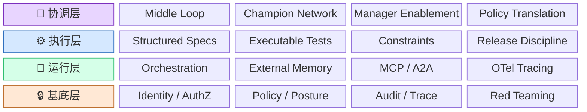
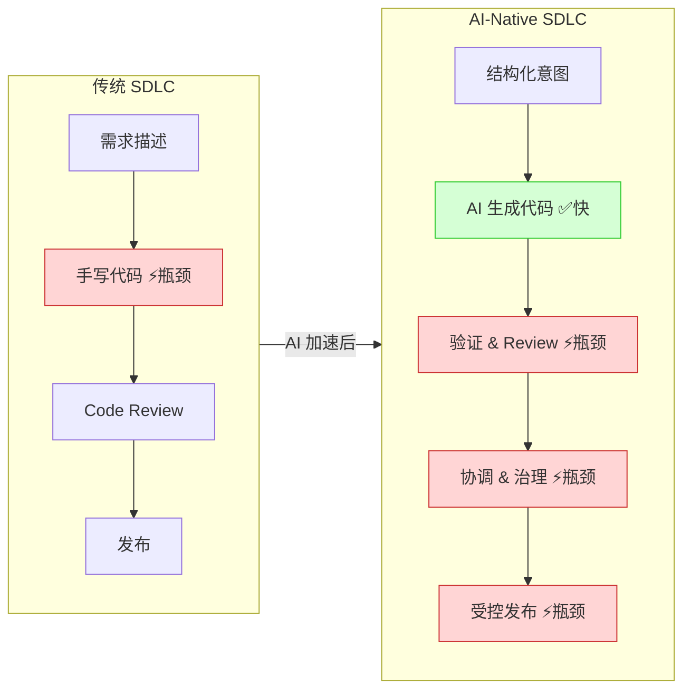
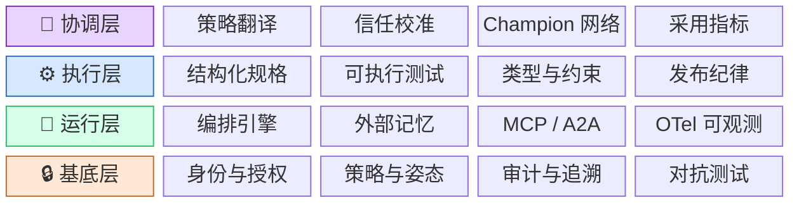
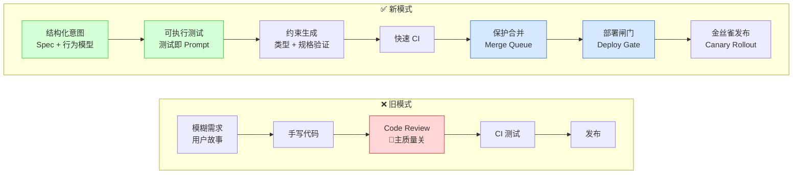
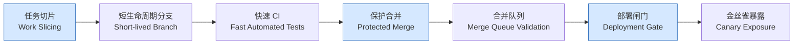
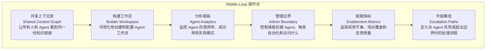
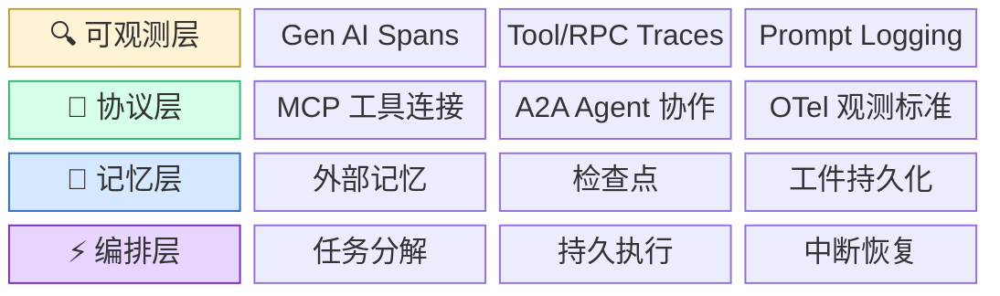
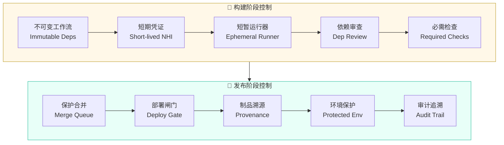
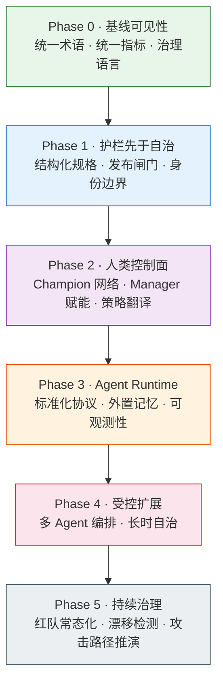
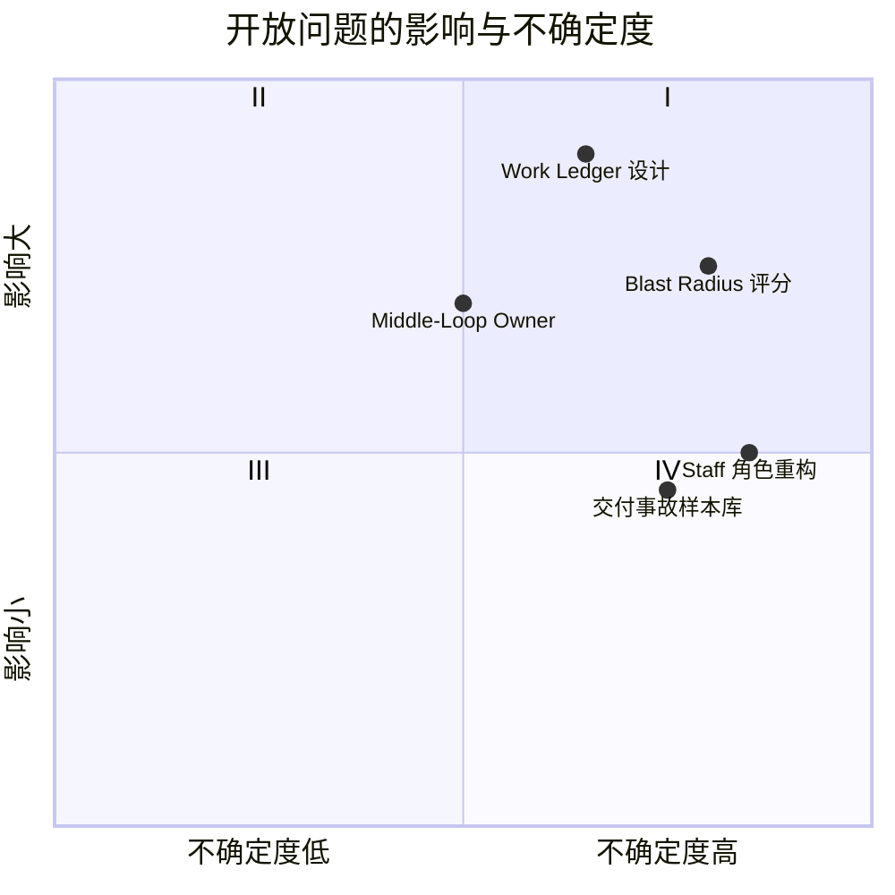

# AI-Native SDLC 控制栈重构：面向工程师与技术管理者的结构化报告

> **报告定位**：这份报告解释一件事——AI 进入软件研发之后，真正改变的不是"代码写得多快"，而是"整个控制体系需要怎样重新组织"。我们把它叫做 **控制栈重构（Control Stack Redesign）**。
>
> **谁应该读**：资深工程师、架构师、平台工程负责人、安全工程负责人、技术管理者。
>
> **读完能干什么**：
> - 向同事解释"为什么 AI-Native SDLC 不等于装个 Copilot"
> - 画出一张四层控制栈草图，说出每层解决什么问题
> - 指出自己团队当前在哪些控制面上有缺口
> - 在技术选型讨论中区分"有强证据的工程建议"和"目前还是猜想的趋势"

---

## 一页判断总览

在进入正文之前，先给出本报告最重要的 6 个判断。每个判断标注了类型和证据强度，帮助你快速定位哪些可以直接拿去做决策、哪些需要继续观察：

| # | 核心判断 | 判断类型 | 证据强度 | 一句话依据 |
|---|---------|---------|---------|-----------|
| 1 | AI-Native SDLC 的本质不是"更快写代码"，而是控制栈重构 | 分析判断 | ⬛⬛⬛⬜ 强 | DORA 报告显示 AI 提升本地生产力但未自动改善交付稳定性；多家企业实践证实瓶颈已转移到验证、协调与发布 |
| 2 | 质量主战场正在从 code review 转移到 spec → test → constraint → release discipline | 硬事实 | ⬛⬛⬛⬛ 很强 | TDD 基准测试、结构化需求研究（EARS）、GitHub 分支保护与 merge queue、Google SRE canary 实践均提供直接证据 |
| 3 | 组织必须显式建设一层"人类控制面"（Middle Loop），这不是过渡态 | 分析判断 | ⬛⬛⬛⬜ 强 | GitHub AI Champions 项目、Microsoft Frontier Firm 角色正式化、Atlassian Teamwork Graph 均指向同一方向 |
| 4 | Agent Runtime 应被视为分层系统软件，而不是单一产品 | 分析判断 | ⬛⬛⬛⬜ 强 | Anthropic 多智能体系统、MCP/A2A 协议分化、OpenTelemetry GenAI 语义规范提供架构证据 |
| 5 | 安全与发布控制正在耦合成统一的 release-risk gate | 实施建议 | ⬛⬛⬛⬜ 强 | GitHub/Google/GitLab 三大平台均已提供 merge gate + provenance gate + deploy gate + environment gate 的实现级控制 |
| 6 | Work Ledger（工作账本）是下一个关键基础设施，但尚未定型 | 开放问题 | ⬛⬛⬜⬜ 中等 | Temporal/LangGraph/OpenAI/Inngest 提供了 primitives，但缺统一企业级设计 |

### AI-Native 冲击维度地图

AI 对软件研发的冲击不是单一的，而是同时命中多个维度。下表展示各维度当前的"回答状态"：

| 冲击维度 | 核心问题 | 回答状态 | 说明 |
|---------|---------|---------|------|
| 🔧 工程范式 | 质量防线放在哪里？ | ✅ 已有清晰答案 | 证据充分：spec → test → constraint → release discipline |
| 👥 组织与角色 | 人类该干什么？ | 🔶 有方向，待定型 | Middle loop 是真实需求，但组织归属和工具面仍在成形中 |
| 🏗️ 基础设施 | Agent 跑在什么上面？ | 🔶 有方向，待定型 | 分层栈模型清晰，但 work ledger 等关键组件尚无统一范式 |
| 🛡️ 安全治理 | 如何不让 AI 炸掉大盘？ | ✅ 已有清晰答案 | Zero Trust + release-risk gate + 持续对抗测试，平台级方案已存在 |
| 📊 度量与反馈 | 怎么衡量 AI 交付健康度？ | ⚪ 完全开放 | DORA 指标仍然适用，但缺 AI-specific 度量体系 |
| 💼 Staff 工程师角色 | 资深工程师的价值锚点在哪？ | ⚪ 完全开放 | 从手写代码转向 orchestration 和 judgment，但新锚点尚未明确 |

### 控制栈总览

下面这张图是全文的"认知地图"。后续所有章节都是在解释这张图的某一层或某个层间关系：

**读法**：从下往上看——没有基底层的身份和策略控制，运行层的工具权限会失控；没有运行层的持久化和可观测，执行层的质量护栏无法在长流程中稳定工作；没有执行层的规格和测试，协调层只能管理混乱输出；没有协调层，再好的平台能力也会被组织误用或搁置。

---

## 1. 为什么不是"更快写代码"

### 实战现场：Salesforce 的发现

> Salesforce 的工程团队在 AI 编码工具大规模部署后，报告了一个清晰的数据：**进入生产的代码量增加了 30%**。但他们紧接着说了一句更重要的话：瓶颈已经从"写代码"转移到了"**让代码安全上线**"（preparing that code for safe shipment）。他们的应对不是"更信任 AI"，而是加大对验证工作流、测试覆盖自动化和 review 支持的投资。Salesforce 还明确规定：生成式或推理型 AI **不允许**自主变更生产系统——人类仍然是生产影响决策的最终责任人。（详见附录 证据 E01, E02）

同一时期，Salesforce 的另一篇工程文章指出了 AI 之下 code review 崩塌的具体机制：AI 辅助开发增加了代码体量，PR 大小超出了人工有效审查的范围，review 延迟增加——即使写代码的时间缩短了。文章明确说，更深层的问题是"**第二双眼睛保证（second-pair-of-eyes guarantee）的侵蚀**"。可预测的失败模式包括：大 PR 导致概念连贯性丧失、reviewer 的认知负荷非线性增长、reviewer 参与度下降。（详见附录 证据 E03）

### 实战现场：ThoughtWorks 研讨会的观察

> 在 2026 年 2 月的 ThoughtWorks 闭门研讨会上，来自大型科技公司的资深从业者报告了一个反复出现的模式：**你给一个团队 AI 工具，他们在几天内清空了积压工作——然后就撞上了跨团队依赖、架构评审和人类速度决策的墙壁。** 结果不是更快的交付，而是同样的速度加上更多的挫败感，因为瓶颈已经从工程能力转移到了"其他一切"。（详见附录 证据 E04）

这些来自不同来源的观察汇聚成同一个结论。DORA 2024 年的研究报告提供了最系统的数据支持：随 AI adoption 增加，文档质量、代码质量、review 速度都有正向变化。**但同一报告也给出了负面结果：交付吞吐量可能轻微下降，交付稳定性下降更明显。** 这意味着"AI 让个体更快"与"团队交付更稳"不是同一个命题。（详见附录 证据 E05）

### 范式转移：Before vs After

为什么会出现"写得更快但交付更差"的矛盾？因为传统 SDLC 的控制体系是围绕**人类手写代码**这个速度设计的。当代码生成速度突然提升一个量级，原有的每个控制节点都面临过载：

| 维度 | 传统 SDLC（人类速度） | AI-Native SDLC（机器速度） |
|------|---------------------|--------------------------|
| **瓶颈所在** | 写代码太慢 | 验证、协调、发布太慢 |
| **质量主阀门** | Code Review（逐行阅读） | Spec + Test + Constraint + Release Gate（组合控制） |
| **Review 角色** | 主质量防线，承担大部分错误拦截 | 高判断密度的 checkpoint，只聚焦意图正确性和跨模块风险 |
| **发布节奏** | 小批量是"最佳实践"的建议 | 小批量是**必须强制执行**的平台默认 |
| **安全检查** | 事后审查 + 定期扫描 | 嵌入交付流水线的实时闸门 |
| **组织协调** | 隐性的、靠个人经验 | 必须显式建设的控制面（Middle Loop） |
| **衡量标准** | 代码行数、PR 数量 | 交付健康度（部署频率、变更失败率、恢复时间） |

### 瓶颈迁移路径

**关键认知**：引入 AI 不是消灭了瓶颈，而是**把瓶颈从一个点转移到了三个面**。如果企业只盯着"编码更快了"这一个指标庆祝，而不去加固验证、协调和发布这三个面，交付质量反而会下滑。

DORA 2025 年的研究进一步指出：**AI 的主要作用是放大组织原有的优势和弱点。** 最大的 AI 投资回报来自改善底层组织系统本身，而不仅仅是部署工具。（详见附录 证据 E06）

### 这意味着什么

- **对工程师**：不要只用"我一天能提多少 PR"来衡量 AI 的价值。真正的价值指标是：可控交付吞吐量——在保持质量和安全的前提下，能稳定上线多少功能。
- **对技术管理者**：当你把目标设定为"用 AI 提升 3 倍开发速度"时，请同时问一个问题：我们的验证能力、发布控制和组织协调是否也能承受 3 倍负载？

> [!NOTE]
> **技术管理者视角**：本章的核心启示是——AI 编码工具的 ROI 不应该用代码产量来衡量，而应该用 DORA 四指标（部署频率、交付前置时间、变更失败率、故障恢复时间）来衡量。如果代码量翻倍但变更失败率也翻倍，净收益为零甚至为负。

---

## 2. 新的控制栈：一张图读懂全局

上一章解释了"为什么不只是写代码更快"。这一章的任务是给出一个完整的结构——当代码生成不再是瓶颈时，企业到底需要建设哪些控制能力，这些能力之间是什么关系？

### 四层控制栈

我们把 AI-Native SDLC 所需的控制能力组织成四层。这不是随意分类，而是基于一个关键观察：**每一层都依赖它下面的层才能正常工作**。

### 每层的"电梯解释"

| 层 | 一句话解释 | 类比 |
|----|----------|------|
| 🔒 **基底层** | 身份、权限、审计和安全测试——"谁能干什么，干了之后有没有记录" | 类似一栋大楼的门禁系统和监控系统；没它，楼里的人和设备都在"裸奔" |
| 🔄 **运行层** | Agent 稳定运行的系统软件——编排、记忆、协议、可观测 | 类似 Kubernetes 之于容器；Agent 单靠一个 prompt 窗口跑不了企业级任务 |
| ⚙️ **执行层** | 工程质量的前置保障——规格、测试、约束和发布控制 | 类似工厂的质检链条；产品下线前必须过的每道闸门 |
| 🧭 **协调层** | 人类对 AI 工作的监督、翻译和校准能力 | 类似公司的管理层；不是"管人"，而是"管目标、边界和信任" |

### 层间依赖矩阵

为什么说这四层不能分开来各做各的？下面这张表展示：**如果缺了某一层，其他层会出什么问题**：

| 缺失的层 | 对运行层的影响 | 对执行层的影响 | 对协调层的影响 |
|---------|-------------|-------------|-------------|
| ❌ 缺基底层 | Agent 工具调用的权限失控，无法审计"谁干了什么" | 发布闸门形同虚设，因为身份和 provenance 无法验证 | 管理者没有治理语言，只能在"完全禁止"和"完全放开"之间摇摆 |
| ❌ 缺运行层 | — | 质量护栏对短任务有效，但 Agent 一旦执行长流程就会丢失上下文和中间状态 | Middle Loop 的监督缺少可观测数据，等于盲人摸象 |
| ❌ 缺执行层 | Agent 能跑起来，但产出质量不可控——没有 spec 约束，没有测试验证，没有发布兜底 | — | 协调层只能管理混乱输出，而不是管理可验证的流程 |
| ❌ 缺协调层 | 平台再好也会被组织误用——没人翻译策略，没人校准信任，没人收集反馈 | 工程规范写了但没人推、没人查、没人改进 | — |

> [!NOTE]
> **技术管理者视角**：这张矩阵的核心信息是——AI-Native 转型不能当成四个独立项目（"搞个 Agent 平台"、"改一下工程规范"、"加强安全"、"组织调整"）来推进。它们是一个耦合的控制系统，必须协调演进。先投哪层、后投哪层可以分阶段决定（见第 7 章），但不能假装它们互不相关。

---

## 3. 工程纪律的上移：从 Review 到控制链

### 核心转变

在传统研发流程里，**Code Review 是最重要的质量关卡**。一个 PR 提交后，reviewers 逐行阅读 diff，检查逻辑错误、风格问题和潜在 bug。这套机制在人类手写代码的速度下运行了几十年，效果不错。

但当 AI 开始每天生成大量变更时，这套机制开始崩塌——不是因为 review 不重要了，而是因为 **reviewer 的认知带宽跟不上 AI 的产出速度**。Salesforce 的工程团队发现，当 AI 辅助产出大量 PR 后，reviewer 最先丧失的能力是"意图重建"（Intent Reconstruction）——他们无法在合理时间内理解一个大型 diff 背后到底在试图做什么。

这意味着质量保障必须从"事后人工审查"转变为"多层自动化控制 + 人类高价值判断"：

### 旧流水线 vs 新流水线

关键对比：旧模式把质量押注在 **一个点**（Code Review）上；新模式把质量分散到 **一条链** 上——从意图表达、测试约束、到合并保护、部署闸门和金丝雀发布，每个环节都有独立的拦截能力。

### TDD 在 AI 时代的角色变化

测试驱动开发（Test-Driven Development, TDD）在 AI 编码场景下，角色发生了质变。它不再只是"先写测试再写代码"的开发习惯，而同时承担了四个以前不存在的角色：

| TDD 的角色 | 传统含义 | AI-Native 含义 | 关键证据 |
|-----------|---------|---------------|---------|
| **Prompt Interface** | 不存在 | 测试就是给 Agent 最精确的"指令"——比自然语言描述更不模糊 | SWE-Bench 论文证明，提供"tests as prompt"能显著提升 AI 生成代码的正确率 |
| **Behavior Contract** | 验收后置物 | 在代码生成之前就定义好"什么行为是对的、什么是错的"，防止 Agent 自己编测试来验证自己的错误 | LLM4TDD 研究证实，无增量约束的 AI TDD 会生成迎合提示的代码而非满足真实质量的代码 |
| **Automated Verifier** | CI 中的测试套件 | 每一轮生成-验证循环的自动化裁判 | 多项基准显示测试作为 verification interface 比人工检查更稳定、更快 |
| **Steering Loop** | 不存在 | 测试失败 → 自动反馈给 Agent → 重新生成 → 再验证，形成闭环迭代 | Constraint Dependency Graph 研究显示，显式约束能提高修复能力和正确性 |

### "大批量变更陷阱"

> 这是 AI-Native SDLC 中**最危险的反模式**之一。
>
> 过去十年，DevOps 社区花了巨大力气让团队接受"小批量交付"。DORA 的数据反复证明：小批量 = 高稳定性，大批量 = 高风险。（详见附录 证据 E10）
>
> 但 AI 把这件事倒转了。ThoughtWorks 研讨会明确将此标记为"**一个正在发生的倒退**"（an active regression）：用 AI 工具轻松产出大型变更集正在推动一些团队回到类似瀑布的模式——大量、低频的发布取代了小量、高频的发布。这是对 DORA 十年研究成果的直接逆转。（详见附录 证据 E04）

针对这个问题，解决路径不是"告诉团队注意批量"，而是**在平台层面强制执行小批量控制链**：

这条链路中的每一环都已有成熟的平台级实现：
- **短生命周期分支**：DORA trunk-based development 指南推荐 branch lifetime 控制在 1 天以内
- **保护合并 + 合并队列**：GitHub 的 branch protection + merge queue 已经支持 required checks、linear history 和队列验证
- **部署闸门**：GitHub 支持 `require deployments to succeed before merging`，把合并和部署联锁
- **金丝雀发布**：Google SRE 的 canarying 实践把发布切片从代码合并扩展到流量分配和指标评估

> [!WARNING]
> **反面教材**：如果你的团队接入了 AI 编码工具，但仍然允许不受限的分支生命周期、没有 merge queue、没有 deployment gate，那么你实际上是在"用新引擎跑旧刹车"——车速翻倍了，但制动力没变。

> [!NOTE]
> **技术管理者视角**：工程纪律上移意味着投资方向要改变。过去投在"让开发者写得更快"上的预算，现在需要同比例地投在"让验证更自动化、发布更受控"上。具体来说：把规格产物升级为可被 Agent 和 CI 同时消费的结构化对象，把测试从验收后置物提升为任务分解的一部分，把小批量做成平台默认而不是团队倡议。

---

## 4. 人类控制面：中间循环不是过渡态

### 代码不再是瓶颈，什么是？

当 AI 把代码生成的速度提升了一个量级后，一组以前隐藏在日常工作中的任务突然浮出了水面：

- **谁来把模糊的业务需求拆解成 Agent 能处理的清晰任务包？**
- **谁来决定 Agent 的输出是否值得信任——是直接合并、还是需要人工复查？**
- **谁来把组织层面的安全策略和合规要求翻译成 Agent 能理解的约束？**
- **谁来监控 Agent 的工作效果，发现问题后决定是调整策略还是升级处理？**
- **谁来跨团队对齐 AI 的使用方式，防止不同团队各自为政、标准混乱？**

这些工作以前并不明显——因为人类写代码的速度慢，这些协调工作有时间自然消化。但当代码生产被加速后，它们全部变成了显性瓶颈。

这就是 **中间循环（Middle Loop）** 的由来。它不是一个岗位名称，而是一组控制面能力——覆盖任务拆解、上下文打包、策略翻译、信任校准（Trust Calibration）、升级决策（Escalation）和采用反馈（Adoption Feedback）。

### 两个团队的对比

| 维度 | Team A：只有工具接入 | Team B：有完整控制面 |
|------|-------------------|-------------------|
| AI 工具 | ✅ 全员接入 Copilot / Agent | ✅ 全员接入 Copilot / Agent |
| 策略清晰度 | ❌ 没有明确的 AI 使用政策，靠个人判断 | ✅ 有清晰的 AI stance，团队知道什么能做、什么不能做 |
| Champion 网络 | ❌ 没有，大家自己摸索 | ✅ 有 2-3 个 Champion 做示范、辅导和反馈收集 |
| Manager 参与 | ❌ Manager 只关心产出数字 | ✅ Manager 能讨论 AI proficiency，参与信任校准 |
| 采用指标 | ❌ 只看 PR 数量和代码行数 | ✅ 跟踪交付健康度、判断质量和采用节奏 |
| **结果** | 野生试用、信任混乱、输出参差不齐、偶发安全问题 | 问题集中暴露、风险分级处理、经验可被组织复用 |

两个团队用的是同一个 AI 模型。差异不在模型能力，在于控制面。

DORA 2025 年的研究给出了一个更深层的解释：**AI 的主要作用是放大组织原有的优势和弱点。** 最大的 AI 投资回报来自改善底层组织系统本身，而不仅仅是部署工具。（详见附录 证据 E06）

### 实战现场：谁在做 Middle Loop

**GitHub 的 AI Champions 网络**：GitHub 说 AI 采用不只是技术问题，而是变革管理问题。他们在内部建立了 advocate 网络——这些人不靠行政权力运作，而是通过 **peer-to-peer 的信任**来帮助同事越过早期障碍。他们的功能包括：让 AI 变得实用、帮助同事扫清上手障碍、作为从团队到领导层的反馈回路。（详见附录 证据 E11）

**Thomson Reuters 的分阶段采用**：Thomson Reuters 的 AI 推广经验包括分阶段 rollout、配套培训、指标驱动的采用跟踪，以及正式的 champion program。这是目前公开的、最完整的企业级 AI 采用操作模型之一。（详见附录 证据 E12）

**Microsoft Work Trend Index 2025 的数据**：Microsoft 的报告说，**28% 的管理者正在考虑招聘"AI 人力资源管理者"来领导人类-Agent 混合团队，32% 计划在未来 12-18 个月内招聘"AI Agent 专家"** 来设计、开发和优化 Agent。这不是创业公司的愿景——这是来自大规模企业调查的数据。（详见附录 证据 E13）

### Middle-Loop 操作台：不是更强的聊天框

中间循环的日常工作台不是"一个更强的 AI 聊天窗口"。基于 Atlassian Teamwork Graph、Rovo Studio 和 GitHub AI-powered Workforce Playbook 的具体实践，一个可操作的 middle-loop 工具面至少包含：

### 角色如何变化

| 角色 | 传统职责 | AI-Native 新增职责 | 证据来源 |
|------|---------|------------------|---------|
| **PM** | 写需求、排优先级 | 把业务意图转化为 Agent 能消费的结构化规格 | 职责与 middle-loop 开始趋同 |
| **Staff Engineer** | 系统设计 + 跨团队协调 | Orchestration 设计 + control-plane 架构 + 判断哪些任务适合自治 | 需要从"写最难的代码"转向"设计最关键的控制" |
| **Manager** | 管理人、管理进度 | 讨论 AI proficiency、校准信任、管理采用节奏 | GitHub Executive Support Playbook 明确要求 manager enablement |
| **Champion** | 不存在 | 策略与执行之间的人类桥梁：示范、翻译、辅导、反馈 | GitHub、Thomson Reuters 的 Champion 网络已是正式角色 |
| **Platform Engineer** | 维护 CI/CD 和基建 | 提供 Agent 运行平台 + 安全默认 + 可观测基础设施 | 平台层是 middle-loop 控制面的技术底座 |

> [!NOTE]
> **技术管理者视角**：Middle Loop 最容易犯的错误是"把它当成临时过渡——等 AI 更强就不需要了"。但证据指向相反方向：AI 越强，需要验证的决策量越大，策略翻译和信任校准的工作量也越大。正确的做法是用 `champions + manager enablement + policy translation + analytics` 组成最小人类控制面，并把绩效讨论从代码产量转到交付健康度和判断质量。

---

## 5. Agent Runtime：为什么不只是"更强的聊天框"

### 从聊天窗口到系统软件

很多团队对"用 AI 做开发"的理解还停留在"一个更聪明的聊天框"——你描述需求，它给你代码，你复制粘贴，完事。

这在单步、短任务、低风险的场景下确实够用。但一旦任务变成：
- **跨越多个步骤**（调查缺陷 → 定位根因 → 提出修复方案 → 实施修改 → 验证结果）
- **需要多人协作**（后端 Agent 改了接口 → 前端 Agent 需要同步 → 测试 Agent 需要验证）
- **长时执行**（一个重构任务可能持续数小时，中间可能被中断）
- **访问高价值资源**（数据库、密钥库、生产环境）

这时候，prompt-only 的工作方式就会迅速暴露不稳定性。

### 实战现场：Anthropic 的多智能体生产系统

Anthropic 公开描述了他们在生产环境中运行的多智能体研究系统架构——这是目前公开的最具体的多 Agent 工程实践。它用 **lead-agent + subagent 的 orchestrator-worker 模式**运行，几个关键的工程事实值得注意：

- **计划存入外部记忆**：lead agent 把计划存在 memory 中，即使上下文被重置，计划也不会丢失，可以在子 agent 之间传递
- **工件外部持久化**：subagent 不通过对话历史传递产出，而是直接创建外部 artifact，产出不受 context window 限制
- **持久执行和恢复**：系统依赖 durable execution 和 resume capability，因为从头重跑长时 agent 的成本太高了
- **多 Agent 的代价**：Anthropic 也坦承，多 Agent 系统很贵，而且对紧密耦合的任务不太适用

（详见附录 证据 E14）

这个真实案例说明：Agent Runtime 不是"一个更强的 API 调用"——它需要**编排、记忆、工件持久化和恢复机制**，这些都是系统软件层面的能力。

### Agent Runtime 的分层架构

企业级的 Agent Runtime 不是"一个接了工具的大模型"，而是一个 **分层系统**——每一层解决一类问题：

**类比**：如果把 Agent 看作容器（Container），那么 Agent Runtime 就是 Kubernetes——你不能只有容器而没有编排、没有存储、没有网络、没有监控。同样，你不能只有一个聪明的 LLM 而没有编排、没有记忆、没有协议、没有可观测性。

### "没有 X 会怎样"

| 如果缺少… | 直接后果 | 场景示例 |
|-----------|---------|---------|
| ❌ 编排 + 持久执行 | Agent 一旦失败，只能重头跑；无法断点续传 | Agent 花 2 小时做代码重构，在最后一步因网络超时失败，全部工作丢失 |
| ❌ 外部记忆 | Agent 无法积累学习，每次任务都从零开始 | 同一个 Agent 连续接手 Bug 修复任务，但对前一次修复的上下文完全没有记忆 |
| ❌ 检查点 / Artifact 持久化 | 中间结果无法保存和审计 | Agent 执行了一系列工具调用，但没有人知道它具体调用了什么、修改了哪些文件 |
| ❌ 协议标准 | Agent 和工具之间的连接是脆弱的一次性集成 | 换一个 LLM 供应商，所有工具集成要重做 |
| ❌ 可观测性 | Agent 变成黑盒，无法调试、审计和优化 | 一个长时运行的 Agent 在生产环境做了异常操作，但没有任何 trace 可查 |

### 协议层对比

当前，Agent 基础设施正在形成 **三协议分层** 的趋势。每个协议解决一类不同的问题：

| 协议 | 解决什么 | 不解决什么 | 当前状态 |
|------|---------|-----------|---------|
| **MCP**（Model Context Protocol） | 工具连接：让 Agent 以标准化方式调用外部工具和数据源 | Agent 间协作、可观测性、安全策略 | 已有多家供应商支持，快速成为事实标准 |
| **A2A**（Agent-to-Agent Protocol） | Agent 间协作：能力发现、长时任务协作、流式通信、安全互操作 | 单 Agent 内部的工具调用 | Google 主导的开放协议，正在标准化 |
| **OTel GenAI Semconv**（OpenTelemetry） | 可观测标准：Agent spans、GenAI metrics、MCP/RPC 语义约定 | 编排、记忆、安全策略 | OpenTelemetry 社区活跃开发中，已有初版规范 |

### Work Ledger：下一个关键基础设施

Work Ledger（工作账本）是一个还没有统一设计、但已经被多方实践证明其必要性的概念。简单说，它就是**面向 Agent 任务的"系统记录簿"**——把以前散落在不同系统中的任务信息挂到一个统一的控制面上。

| Work Ledger 字段 | 含义 | 谁在提供 Primitives | 成熟度 |
|-----------------|------|-------------------|--------|
| Run / Thread Identity | 每个 Agent 执行有唯一标识 | OpenAI Agents SDK, LangGraph | ⬛⬛⬛⬜ 较成熟 |
| Ordered Execution History | 按顺序记录每一步操作 | Temporal Event History | ⬛⬛⬛⬛ 成熟 |
| Checkpoints | 中间状态快照，支持断点恢复 | LangGraph Checkpoints, Inngest | ⬛⬛⬛⬜ 较成熟 |
| Step Outputs / Artifacts | 每步的产物持久化 | OpenAI Agents SDK | ⬛⬛⬜⬜ 中等 |
| Interruption Boundary | 定义何时可以安全中断 Agent | Inngest Durable Execution | ⬛⬛⬜⬜ 中等 |
| Traces | 全链路追踪 | OpenTelemetry GenAI Semconv | ⬛⬛⬛⬜ 较成熟 |
| Capability / Budget | Agent 被允许使用哪些工具，预算多少 | 尚无统一实现 | ⬛⬜⬜⬜ 不成熟 |
| Authorization | Agent 的权限和身份 | 需要与 Foundation Layer 打通 | ⬛⬜⬜⬜ 不成熟 |
| Acceptance Criteria | 完成标准 | 尚无统一实现 | ⬛⬜⬜⬜ 不成熟 |

> [!WARNING]
> Work Ledger 的底层 primitives（执行历史、检查点、追踪）已经可以拼装出来，但**权限、预算、能力约束和验收标准**的统一设计仍然是开放问题。不要误以为"有了 Temporal + LangGraph 就等于有了 Work Ledger"——那只是地基的一部分。

### 实战现场：电信公司的知识图谱基建

在讨论 Agent Runtime 的知识底座时，一个来自 ThoughtWorks 研讨会的真实案例特别值得关注：

> **一家大型电信公司**对其整个业务领域进行了本体建模（domain ontology），发现**整个领域可以用大约 286 个概念来捕获**。这个数字让原本看起来不可能的工作变得"可实现"。（详见附录 证据 E04）
>
> 实际价值在于**遗留系统现代化**：团队用 LLM 自动从现有代码中识别命令（commands）、事件（events）、聚合（aggregates）和策略（policies）——本质上是**自动生成事件风暴（Event Storming）制品**。然后由人类领域专家验证和纠正，把数周的发现研讨会压缩到几天。
>
> 通过这种方式构建出的概念数据模型，成为了 Agent 安心进行现代化改造所需的"规格说明层"——Agent 在执行任务前，先有了一张完整的领域地图。

这个案例的启示是：在让 AI 进入老系统之前，**知识基建（knowledge infrastructure）的准备工作是不可跳过的**。286 个概念听起来不多，但这 286 个概念的提取、验证和结构化，是 Agent 能自信工作的前提。

ThoughtWorks 研讨会把这类工作称为构建"**Agent 潜意识**"（agent subconscious）——从多年的事后分析和事件数据中构建知识图谱，为 Agent 提供解读实时信号所需的历史上下文。一些组织已经在通过自动化 post-mortem 起草来做这件事，但**添加细微差别和上下文的人工步骤仍然不可或缺**。

> [!NOTE]
> **技术管理者视角**：Agent Runtime 的投资建议是——先标准化协议层（MCP/A2A/OTel），再外置记忆和可观测，最后在任务结构和收益明确时才引入多 Agent 编排。不要因为"多 Agent"听起来酷就过早投资复杂的多 Agent 系统——当前公开证据显示，多 Agent 在 research 类任务中收益显著，但在 coding 类任务中何时值得上、何时会过度复杂，仍然是开放问题。

---

## 6. 安全与发布：一道耦合的闸门

### 为什么安全和发布是同一个问题

在传统 SDLC 中，安全和发布是两个相对独立的关注点：安全团队做 review 和扫描，发布团队做 CI/CD 和部署。但在 AI-Native 的世界里，这两件事正在合并成一个问题。

原因很简单：**Agent 是一种新的 non-human actor。** 它能调用工具、生成代码、修改配置、访问数据库、触发部署——所有这些操作的安全性和质量控制必须在同一个闸门里解决，而不是分散到两个独立的审查流程中。

### 实战现场：安全案例

**案例 1：CircleCI 2023 安全事故**

> 2023 年 1 月，CI/CD 平台 CircleCI 披露了一起严重的安全入侵。攻击者通过在工程师笔记本上植入恶意软件，窃取了一个有效的 2FA SSO 会话，然后提权进入生产系统子集。CircleCI 事故报告描述了具体的攻击链：（详见附录 证据 E15）
>
> - 攻击者从**运行中的进程**提取了加密密钥，使"静态加密"对已泄露数据的保护大打折扣
> - 客户存储在平台中的环境变量、tokens 和第三方系统密钥被泄露
> - CircleCI 要求所有客户轮换密钥
> - 计划的修复包括：step-up 认证、更频繁的 token 轮换、向 GitHub Apps 迁移以获得更细粒度权限、更短时效的内部权限
>
> 这个事故的核心教训是：**CI/CD 平台本身就是一个特权运行时**——它同时持有代码访问、凭证存储、制品生成和部署权限。当你给 Agent 连接 CI/CD 工具时，同样的风险面被完整继承。

**案例 2：ThoughtWorks 研讨会的安全警告**

> ThoughtWorks 研讨会忧虑地指出：安全讨论环节的出席率很低——反映了安全被当成"等技术跑通再说"的行业模式。研讨会给出了**最生动的攻击场景**：授予 Agent 电子邮件访问权限 -> 密码重置 -> 账户接管。开发工具的完整机器访问权限意味着 Agent 决定做的任何事情都拥有完整的机器访问权限。（详见附录 证据 E04）
>
> 研讨会的建议很明确：**平台工程应该让安全行为简单、不安全行为困难。** 组织不应依赖个人开发者在配置 Agent 访问权限时做出安全意识的选择。

### Release-Risk Gate：统一的发布准入系统

基于 GitHub、Google Cloud 和 GitLab 三大平台当前已经提供的实现级控制能力，一个完整的 Release-Risk Gate 长这样：

这个闸门的关键特征是：**它不是一个万能评分，而是一组可独立配置的控制组件。** 企业可以根据环境等级（开发/测试/预发/生产）选择性地启用不同级别的控制：对开发环境只需要 required checks，对生产环境则要求全部组件。

### Zero Trust 在 Agent 场景中的映射

零信任架构（Zero Trust Architecture, ZTA）不是口号，而是目前最适合描述 Agent 安全架构的语言。因为 Agent 本质上就是一种**新的 non-human actor**——它有身份、有权限、有行为，但不是人类。

| Zero Trust 原则 | 传统含义 | Agent 场景映射 |
|---------------|---------|-------------|
| **从不信任，始终验证** | 每个网络请求都需要身份验证 | 每个 Agent 的工具调用都需要身份验证和范围检查 |
| **最小权限** | 用户只获得完成工作所需的最小权限 | Agent 只获得当前任务所需的工具和数据访问权限（tool scope） |
| **假设已被攻破** | 持续监控，假设入侵者已在网络中 | 持续监控 Agent 行为，假设 Agent 可能幻觉、被注入或被劫持 |
| **基于身份而非边界** | 保护的是身份和数据，不是网络边界 | 保护的是 Agent 身份和工具调用链，不是"这个 Agent 在内网还是外网" |
| **持续验证** | token 自动刷新、姿态持续检查 | Agent 凭证短期化、权限随任务结束自动收回、运行时姿态漂移检测 |

关键的身份管理实践：
- Google Workload Identity Federation（WIF）要求：联邦身份 + 唯一 subject 映射 + impersonation 日志 + 最小权限 impersonation
- SPIFFE/SPIRE 提供：工作负载证明（attestation）→ SVID 签发 → 自动轮换 → 信任束分发
- Microsoft Entra Workload ID 在 AKS 中的 fail-close 行为说明：NHI 生命周期不仅是"发 token"，还包括运行时失败策略

### Blast Radius：从"完美公式"到"可操作代理模型"

很多人期望有一个公式能算出"这个变更的爆炸半径是多少分"。坏消息是：**这样的公式目前不存在，尤其在 diff 级和 tool-call 级的粒度上。** 但好消息是：已经有一组可操作的代理模型可以组合使用：

| 代理模型 | 思路 | 谁在做 |
|---------|------|--------|
| **Attack Exposure Scores** | 基于资产暴露路径计算风险分 | Google Security Command Center |
| **Toxic Combinations** | 识别单独无害但组合起来致命的权限/配置 | Google Security Command Center |
| **Attack Path Analysis** | 从攻击者视角模拟入侵路径 | Microsoft Defender |
| **High-Value Resource Sets** | 标记最关键的资产（数据库、密钥库、CI/CD 平台） | 行业通用实践 |
| **Chokepoint Analysis** | 识别攻击路径必经的瓶颈节点 | Google + Microsoft |

> [!NOTE]
> **技术管理者视角**：安全治理的投资优先级建议——
> 1. 最先做：短期凭证（替换所有长期静态密钥）+ 保护高等级环境
> 2. 然后做：provenance verification + deployment gate 联锁
> 3. 最后做：持续的 posture drift 检测 + attack-path reasoning + 红队测试常态化
>
> 不要等到有了"完美的 blast radius 评分系统"才开始做安全——先用现有工具堵住最大的洞，再逐步精细化。

---

## 7. 企业落地顺序：先做什么，后做什么

### 一个常见的错误路径

> ❌ **反面教材：先上 Agent，再补治理**
>
> "我们先让全员用上 AI 编码助手，看看效果怎么样，然后再慢慢补安全策略和质量流程。"
>
> 这种路径的问题是：**当你发现需要补治理的时候，已经有几百个不同团队在用几十种不同的方式使用 AI 了。** 每个团队有自己的"最佳实践"，有自己的 prompt 模板，有自己对"什么时候该人工介入"的不同理解。这时候再想统一策略、统一安全边界、统一质量标准，难度和成本比一开始就做大 10 倍。
>
> 更可怕的是，在这个"先跑再说"的窗口期里，可能已经有人把长期密钥塞进了 prompt、有人让 Agent 直接操作了生产数据库、有人把未经 review 的 AI 生成代码推到了主干分支。

### 推荐的落地路径：先建控制面，再扩大自治

### 每阶段的关键行动

#### Phase 0：基线可见性

| 目标 | 在扩展任何 AI 能力之前，确保组织有共同的语言和度量 |
|------|------|
| 关键行动 | 1. 固定关键术语定义（参见附录术语表） 2. 建立 DORA 类交付指标基线 3. 明确 AI 使用策略 |
| 退出条件 | 所有团队使用同一套术语、指标和治理语言 |
| ⏱️ 典型时长 | 2-4 周 |

#### Phase 1：护栏先于自治

| 目标 | 先建立最小质量和安全控制链，再允许大规模 AI 使用 |
|------|------|
| 关键行动 | 1. 规格产物升级为结构化对象 2. 测试套件前置为任务定义的一部分 3. 启用 required checks + merge queue + deployment gate 4. 建立短期凭证和环境保护机制 |
| 退出条件 | 任何 AI 生成的变更都必须通过质量闸门和身份验证才能进入生产 |
| ⏱️ 典型时长 | 4-8 周 |

#### Phase 2：人类控制面

| 目标 | 建立组织级的 AI 使用监督和赋能体系 |
|------|------|
| 关键行动 | 1. 选定 2-3 个 Champion 2. 对 Manager 做 AI proficiency 讨论培训 3. 建立策略翻译机制 4. 建立采用指标和反馈回路 |
| 退出条件 | 有 Champion 在做示范、Manager 能讨论 AI 效能、采用节奏可被量化追踪 |
| ⏱️ 典型时长 | 4-12 周 |

#### Phase 3：Agent Runtime 基座

| 目标 | 从 prompt-only 升级到可持续运行的系统软件层 |
|------|------|
| 关键行动 | 1. 标准化工具协议（MCP）和 Agent 协议（A2A） 2. 外置记忆和 artifact 持久化 3. 接入 OTel 可观测性 4. 只在私有数据推理确实需要时才引入知识图谱 |
| 退出条件 | 长流程 Agent 有 checkpoint、有 trace、有 artifact 持久化 |
| ⏱️ 典型时长 | 8-16 周 |

#### Phase 4：受控多 Agent 扩展

| 目标 | 只在任务结构和收益明确时才引入多 Agent 和长时自治 |
|------|------|
| 关键行动 | 1. 评估哪些任务适合多 Agent 编排 2. 要求 resumability、artifact persistence 和 telemetry 3. 定义长时执行的中断和恢复策略 |
| 退出条件 | 多 Agent 工作流经过验证，有明确的收益和可控的失败模式 |
| ⏱️ 典型时长 | 按需 |

#### Phase 5：持续治理与对抗测试

| 目标 | 把安全测试和治理从一次性项目变成持续运营能力 |
|------|------|
| 关键行动 | 1. 红队测试常态化 2. 持续 posture drift 检测 3. Attack-path reasoning 定期执行 |
| 退出条件 | 安全和治理是持续运转的系统，不是年度审计 |
| ⏱️ 典型时长 | 持续进行 |

> [!WARNING]
> **不要跳过 Phase 0 和 Phase 1。** 高监管行业或低平台成熟度的组织，可能需要在 Phase 1 和 Phase 2 停留更久。宁可起步慢一点、基础扎实一点，也不要"先跑再说"——因为修复一个已经失控的 AI 使用环境，比一开始就建好框架要贵得多。

> [!NOTE]
> **技术管理者视角**：每次新能力上线，都要同时定义六样东西：owner（谁负责）、metrics（怎么衡量）、rollback path（怎么回退）、credential scope（凭证范围）、environment boundary（环境边界）、audit trail（审计追溯）。如果新能力上线时缺了其中任何一个，说明控制面还没准备好。

---

## 8. 开放问题：什么还不能说死

### 为什么需要这一章

一份可信的技术报告不应该把所有趋势都伪装成结论。AI-Native SDLC 正在快速演进中，有些领域确实已经有了清晰的方向和足够的证据，但有些领域仍然是开放问题——把它们标注清楚，比假装已经有答案更有价值。

### "能说"vs"不能说"

| 领域 | ✅ 能说（有足够证据） | ❌ 不能说（缺乏证据或尚未收敛） |
|------|--------|--------|
| **工程纪律** | 质量主战场正在从 review 转移到 spec/test/constraint/release | 企业已经普遍掌握了全链自动化（spec→test→code→merge→provenance→deploy→canary） |
| **组织角色** | Middle Loop 是真实的控制面需求，不是过渡态 | Middle Loop 已经固定为某个标准岗位或组织归属 |
| **Agent Runtime** | Agent OS 应是分层组合栈，不是单一产品 | Work Ledger 已有统一的企业级标准设计 |
| **安全治理** | Agent 安全是 identity + tool + protocol + runtime + governance 的复合问题 | Agent 安全只是 LLM security 的轻微延伸 |
| **Blast Radius** | 环境级、身份级、graph-based 的代理模型越来越清晰 | Diff 级或 tool-call 级的 blast radius 评分已经成熟 |
| **AI-Native SDLC** | 本质是控制栈重构 | 只是生产力工具升级，装个 IDE 插件就行 |

### 五大未收敛问题

| # | 开放问题 | 重要性 | 当前证据强度 | 为什么重要 |
|---|---------|--------|-----------|---------|
| 1 | **Work Ledger 的统一设计** | 🔴 极高 | ⬛⬛⬜⬜ 中等 | 任务状态、权限、预算、工件、验收标准需要挂到同一个控制面——primitives 已有，但统一范式还没出现 |
| 2 | **Middle-Loop Tooling 的 owner 和 failure mode** | 🟠 高 | ⬛⬛⬜⬜ 中等 | Builder surface、analytics、policy routing 由谁拥有？失败时如何恢复？边界在 admin、platform、ops 和 manager 之间模糊 |
| 3 | **Diff/Tool-Call 级 Blast Radius 评分** | 🟠 高 | ⬛⬜⬜⬜ 弱 | 在合并前对任意 diff 或工具调用做可信风险评估——当前做得好的是环境级和身份级，代码变更级还很不成熟 |
| 4 | **Agent-Specific 交付事故样本库** | 🟡 中 | ⬛⬜⬜⬜ 弱 | 制定 agent release policy 需要案例驱动，但公开的 agent-specific 交付事故仍然很少（最强的仍是 CI/CD 平台事故，如 CircleCI） |
| 5 | **Staff Engineer 在新控制面中的角色重构** | 🟡 中 | ⬛⬜⬜⬜ 弱 | 当更多价值从手写代码转向 orchestration 和 judgment 时，资深工程师的成就感和职业锚点如何重建——目前还没有答案 |

### 战略赌注可视化

**象限读法**：

| 象限 | 位置 | 含义 | 落入的问题 |
|------|------|------|-----------|
| **I** | 右上 | 高影响 + 高不确定 = **战略赌注** | Work Ledger 设计、Blast Radius 评分 |
| **II** | 左上 | 高影响 + 低不确定 = **优先投资** | Middle-Loop Owner |
| **III** | 左下 | 低影响 + 低不确定 = 按部就班 | （当前无） |
| **IV** | 右下 | 低影响 + 高不确定 = 持续观察 | 交付事故样本库、Staff 角色重构 |

> [!NOTE]
> **技术管理者视角**：这些开放问题不会推翻本文的核心判断，但会影响你在未来 12-24 个月内如何制定平台、组织和治理的投资计划。建议做法：
> 1. 显式地把这些问题列入 roadmap，标记为"待收敛"
> 2. 允许一部分问题保持 `not yet mature` 状态——不要为了追求完整叙事而过度下结论
> 3. 对外宣讲时，把这些 gap 定位为"战略研究方向"而不是"已具备的能力"

---

## 结语

对工程师来说，AI-Native SDLC 的核心不是"如何让 Agent 多写一些代码"，而是"如何把意图、验证、权限、运行和发布重新编织成一个更稳的系统"。

对技术管理者来说，核心也不是"如何押注一个热门工具"，而是"如何建立一个能让 autonomy 在清晰边界内扩张的组织和平台"。

如果把这件事继续讲成 coding acceleration，企业会在最脆弱的地方失速。如果把它讲成 control stack redesign，很多看似分散的问题就会落到同一张工程图上——规格、测试、identity、runtime、release gate、middle loop、observability，本质上都在回答同一个问题：

**当代码生成不再稀缺时，企业如何继续保持可控、可审计、可恢复、可发布的软件交付能力。**

这份报告给出了当前可用的结构化答案。其中一些答案已经有了强证据，可以直接参考设计；另一些还只是方向性判断，需要持续跟踪和验证。**区分这两者，本身就是工程判断力的一部分。**
