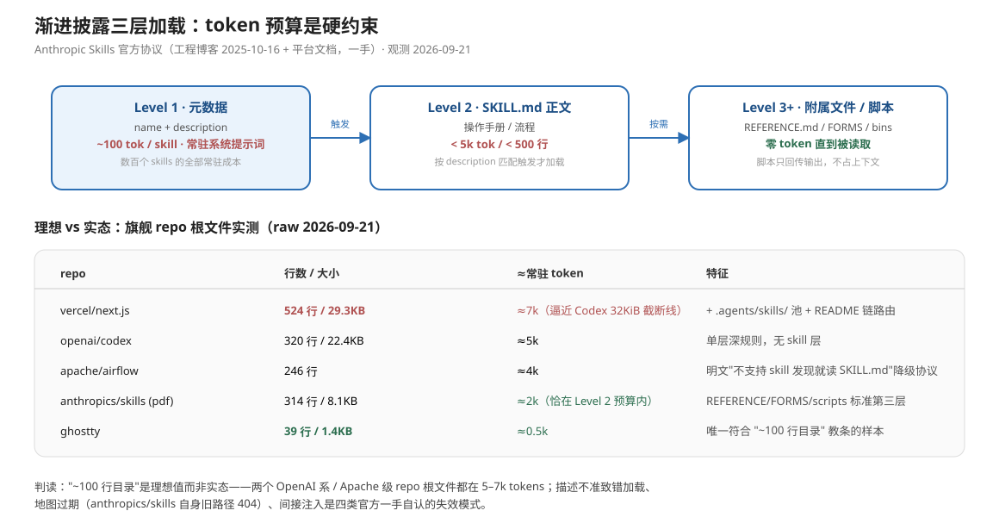
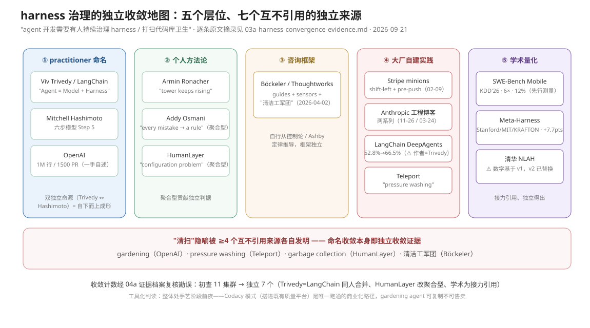

# SDD 的替代与后继形态——批判面指向的出路到底长什么样

> **本目录结构（2026-09-20 升格为独立子目录）**：本 README 是总览（机制速览 + 光谱图 + 结论）；五个形态各自深挖成篇——深挖版与本文摘要**以各分篇为权威**，本文不复制分篇正文。
>
> **2026-09-21 二次升格**：经用户定名，本目录自 `spec_driven_development/alternatives/` 升格为独立主题目录（"SDD 批判之后，控制 AI 写代码的形态光谱"），当日先落位 `02_research/`、同日归入实践层 `03_practice/beyond_spec_driven_development/`。与 SDD 工具层实践的分工指针见 [`../spec_driven_development/README.md`](../spec_driven_development/README.md)；原路径不保留实体，只在该处留指针。

| 分篇 | 形态 | 一句话 |
|---|---|---|
| [01-verifiable-specs.md](01-verifiable-specs.md) | 验证优先/可验证 spec | spec 必须降格为机器可校验的产物（VSDD/compilable specs/facts） |
| [04-plan-mode.md](04-plan-mode.md) | Plan mode 派 | 规划内嵌于 harness，会话内对齐、用完即弃 |
| [02-context-engineering.md](02-context-engineering.md) | Context engineering 派 | 只管 repo 级规则文件纪律，不建 feature 级工件 |
| [03-harness-governance.md](03-harness-governance.md) | Harness 治理派 ★ | 治理对象从 spec 文档转向 agent 执行链路——团队级收敛点 |
| [05-test-first.md](05-test-first.md) | 测试优先回归 | 测试就是 spec：给 CI 读的可执行断言替代文档合约 |

**阅读路径建议**：① 先看两张总图（光谱 → 验证迁移）建立框架 → ② 按优先级读分篇（01 → 02 → 03），每篇先图后文 → ③ 需要溯源进对应证据档案（全部逐字摘录 + 引用链核验，2026-09-21 审计）→ ④ 04/05 仅作对照。

**研究优先级（2026-09-21 用户定，编号对应重排后）**：**01 可验证 spec / 02 context engineering / 03 harness 治理为重点路线**（深挖 + 证据档案 + 审计齐备）；**04 plan mode / 05 测试优先为背景参照、不作为重点**——按用户经验：plan mode 是默认实践，够不上独立"后继形态"；测试优先是既有工程常识的延续，不是新范式。引用 04/05 时作对照用，不作主张依据。

**最靠谱判断（2026-09-21，captain 判断，与光谱结论第 4 条同向但判据为其补充）**：03 harness 治理最靠谱——三点判据、当日补查的新实证（SSRN 119-repo 实证 null result 全文回源）与二至五名排序见文末 §7。

### 证据档案（逐字摘录 + 引用链核验，全部经 2026-09-21 审计）

| 档案 | 服务的分篇 | 内容 |
|---|---|---|
| [01a-verifiable-convergence-evidence.md](01a-verifiable-convergence-evidence.md) | 01 | 13 集群正反原文摘录 + 独立性判定（含对撞） |
| [01b-verifiable-academic.md](01b-verifiable-academic.md) | 01 | 20+ 篇学术一手回源 + 7 例工业案例 |
| [01c-verifiable-community.md](01c-verifiable-community.md) | 01 | HN 立场分歧 + 中文社区宽度 |
| [02a-progressive-disclosure-evidence.md](02a-progressive-disclosure-evidence.md) | 02 | 渐进披露 B1–B9：官方预算表 + 五 repo 实测 |
| [02b-agents-md-governance-evidence.md](02b-agents-md-governance-evidence.md) | 02 | 治理 A/B/C/D：大厂范式 + repo git 史 + 度量勘误 |
| [02c-context-vs-harness.md](02c-context-vs-harness.md) | 02 | context ⊂ harness 关系判定 |
| [03a-harness-convergence-evidence.md](03a-harness-convergence-evidence.md) | 03 | 10 集群 78 处原文摘录 + 引用链核验 |
| [03b-harness-academic-and-metrics.md](03b-harness-academic-and-metrics.md) | 03 | 学术三篇回源 + 度量缺口论证 |

图形（SVG）：
- ——九个位置从"重 spec 工件"排到"零 spec 工件"
- ——文档中心 vs 机器中心的结构性对照
- ——①篇：三角回写困境与两个失效面
- ——②篇：token 预算与五 repo 实测
- ——②c 篇：包含关系与静态/动态分层
- ——③篇：五层位收敛地图

```yaml
topic: SDD 的替代/后继形态（验证优先、plan mode、context engineering、harness 治理、测试优先）
accessed_at: 2026-09-21  # 一轮 2026-09-20；二轮/三轮深挖与三轮证据审计至 2026-09-21
captain_verdict: 2026-09-21  # §7 判断层：harness 治理最靠谱（判据 + 当日 SSRN/IEEE 补查，新证据此前未收）
promoted_at: 2026-09-21  # 自 spec_driven_development/alternatives/ 升格为独立主题目录（当日先落 02_research、同日归入实践层 03_practice/），用户定名 beyond_spec_driven_development
collector: delegated research agent
scope: 2026 年（尤其 2026Q2–Q3）社区材料；承接 ../spec_driven_development/debate/critiques.md「批判观点聚类」第 5 条的出路指向
related:
  - ../spec_driven_development/debate/critiques.md          # 批判面（本文的"问题从哪来"）
  - ../spec_driven_development/comparison.md             # SDD 工具横比（光谱图左端的素材）
  - ../spec_driven_development/debate/authoritative-verdicts.md
weights: 高=大厂/学术/高热帖；中=有实证的博客/团队案例；低=个人观点
limitations:
  - isoform.ai《The Limits of Spec-Driven Development》正文抓取失败（critiques.md 已记录），facts 路线以 av/facts（GitHub, HN 7 分）为主要锚点。
  - 「Google 改口 context-driven」未找到 Google 官方逐字表述；本文以 Google 2026-05 白皮书《The New SDLC with Vibe Coding》（Osmani 等）与 Addy Osmani 2026 年系列文章作为该派最接近的官方锚点，措辞按二手转述标注。
  - 部分中文社区帖（知乎/腾讯云）为署名个人文章，权重按中低计。
```

---

## 0. 定位：这五条形态在回答什么问题

critiques.md 的批判聚类收敛到两个死结：**spec 无法自我验证**（裸 markdown 是"看似严谨的散文"）和 **spec 作为长期资产的维护税**（spec 债、一致性税、context tax）。2026 年社区给出的出路不是单一替代品，而是一个**离散谱**：各家在"保留多少 spec 工件、把验证交给谁"上给出不同答案——从"spec 仍是核心工件但必须机器可校验"，到"spec 工件彻底消失、只留下测试与上下文纪律"。本文按"重 spec → 零 spec"顺序展开五条形态，最后合成光谱图。

---

## 1. 验证优先 / 可验证 spec（VSDD、compilable specs、facts）→ 深挖：[01-verifiable-specs.md](01-verifiable-specs.md)

**机制**：承认"spec 先行"的价值，但否定"自然语言 spec 本身可作合约"。spec 必须降格为**机器可校验的产物**——或编译成测试/形式化约束（compilable specs），或收缩为一份事实清单（facts），或加上对抗性验证层（VSDD）。LLM 在这条路线里只做"翻译"：把可验证的规约翻译成实现，而不是从散文里自由发挥。

**代表实践/工具**：
- **VSDD（Verified Spec-Driven Development）**：dollspace-gay 的 gist 提案（2026-02-28），把 SDD、TDD、对抗验证排成顺序门禁：spec 过关才准写测试、测试存在才准写代码、对抗 reviewer 找不出真缺陷才准交付（[gist](https://gist.github.com/dollspace-gay/d8d3bc3ecf4188df049d7a4726bb2a00)，HN 211 分/118 评；二手解读见 [Midas Tools 文](https://dev.to/midastools/vsdd-the-ai-coding-methodology-actually-worth-stealing-35ah)）。
- **compilable specs**：VSDD 讨论串里的主流收敛观点——"markdown spec 是弱合约，必须编译成测试/形式化约束才可信"。学术侧的近亲是 spec 自动形式化（如 Verus-SpecGym，arXiv 2605.26457，评测 spec→形式规约的 autoformalization）；实践侧如 Sadogursky 的 "intent integrity chain"（意图→验证管线，见 production-ready/chapters/06-spec-formalization.md）。
- **av/facts**（2026-05-04）：作者直接弃用 SDD，把 spec 降级为"一堆 facts"——只保留可核对的事实、丢掉流程性文本，动机是原话"agents start making mistakes maintaining them. There's a constant **consistency tax**"（[github.com/av/facts](https://github.com/av/facts)，HN 7 分/4 评）。

**与 SDD 的本质区别**：SDD 相信"写清 spec = 控制住 agent"；验证优先派认为**未被验证器消费的 spec 没有控制力**。控制权从"文档的说服力"转移到"验证器的通过/失败"——spec 不再是给 agent 读的散文，而是给校验器读的输入。facts 是其极简变体：不维护叙事与流程，只维护事实，直接砍掉 spec 债的来源。

**已有证据与热度**：本五形态中热度最高（HN 211/118 是 2026 年 SDD 相关最大讨论场），且直接由批判共识催生。但证据形态仍是"提案+群体辩论"，缺大规模落地实测；facts 是单人工具、热度低但代表"用行动背书"的分化点。

**对团队的适用性**：适合**契约清晰、可测试性强的领域**（API、协议、解析器、正确性敏感的系统）。成本在于把需求写成可验证形式需要专门能力（deontologician 批判在此仍然成立：你还糊涂时写不出可验证 spec）。facts 形态适合小团队止损：与其维护注定漂移的 spec 叙事，不如只维护事实清单。对探索性需求（不知道自己要什么）不适配。

---

## 2. Context engineering 派 → 深挖：[02-context-engineering.md](02-context-engineering.md)

**机制**：约束对象从"这个 feature 要什么"（feature 级 spec）上移为"这个仓库的 agent 该怎么干活"（repo 级规则文件与上下文结构）：AGENTS.md / CLAUDE.md / 规则文件 + 结构化 docs 目录 + 渐进式披露（给地图而非全书）。纪律是**永久但轻量**的，feature 级意图不落盘。

**代表实践/工具**：
- **AGENTS.md 标准**：已成多 agent 通行的 repo 级规则文件事实标准；Hashimoto 的实践是每条规则来自一次真实坏行为（Ghostty 的 AGENTS.md），Osmani 则警告 `/init` 生成巨型 AGENTS.md 是反模式。
- **Google 侧**：白皮书《The New SDLC with Vibe Coding》（Osmani/Saboo/Kartakis，2026-05）虽口头上背书 spec-driven，但其给出的可操作抓手大量落在 context 侧（上下文工程、评估、反馈回路）；Osmani 本人的 2026 年系列（《How to write a good spec for AI agents》2026-01、AGENTS.md 反模式文）横跨两派，被中文社区转述为"context-driven"取向（此"改口"说法未回源到 Google 官方原文，按二手标注）。
- **OpenAI Harness 实践**（见 §3 Harness 治理派）：AGENTS.md 必须是 ~100 行的**目录**而非百科全书——"挤掉有效上下文、过多导致失效、立即腐烂、难以核实"。

**与 SDD 的本质区别**：SDD 的治理单位是**变更**（每个 feature 一套 spec/plan/tasks 工件）；context 派的治理单位是**环境**（repo 的持久上下文质量）。它完全放弃 feature 级工件的创建-维护闭环，因此不产生 spec 债——代价是每个 feature 的意图只在会话内存活，跨会话的"为什么"信息流失。

**已有证据与热度**：AGENTS.md 采用率极高（各大 agent 均读取）；OpenAI 的"大 AGENTS.md 是陷阱"结论（2026-02 Harness Engineering 文）是最有力的内部实证；Google 白皮书（2026-05）给该派背书。权重：中高（大厂一手 + 广泛采用，但多为经验而非量化对照）。

**对团队的适用性**：**brownfield 与日常迭代**的主流解——现成代码库本身就是最大的上下文，规则文件修好 agent 行为、结构化 docs 供按需导航即可，不值得为每个小需求开 spec 工件链（marmelab 的"sledgehammer to crack a nut"批判正指向此）。短板：多人/多服务间的语义契约（错误码含义、跨服务约定）放不进规则文件，这正是腾讯云文里"补上缺失语义才做对"的案例场景——纯 context 派在此留白。
---

## 3. Harness 治理派 ★ → 深挖：[03-harness-governance.md](03-harness-governance.md)

**机制**：把"让 agent 做对"的工程投入从**写文档**转移到**工程化执行环境**：自定义 linter + 结构测试强制架构规则、可观测性直接接入 agent 运行时（日志/指标/追踪供 agent 自读自验）、定期运行的 gardener agent 扫描漂移、"每次 agent 犯错就工程化地消灭该错误类别"（Hashimoto 六步模型的 **Step 5 "Engineer the Harness"**——Step 6 是 "Always Have an Agent Running"；原注"第六阶段"已按 [03-harness-governance.md](03-harness-governance.md) 勘误）。spec（若有）只是 harness 中 scaffolding 的一个组件。

**代表实践/工具**：
- **OpenAI《Harness Engineering》**（2026-02）：5 个月、空仓库起步、约 100 万行代码、1500 个全 agent 生成 PR；人类转向定义规格、约束与反馈系统；product-specs/ + design-docs/ + exec-plans/ 三件结构化目录 + linter/结构测试 + doc-gardening agent（[openai.com/index/harness-engineering](https://openai.com/index/harness-engineering/)）。
- **Hashimoto《My AI Adoption Journey》**（2026-02）：个人向 harness 工程化（AGENTS.md 记坏行为 + 专用验证脚本）（[mitchellh.com](https://mitchellh.com/writing/my-ai-adoption-journey)）。
- **arXiv 2609.00252**（2026-08-31 提交）：学术化该叙事——SDD 被重述为 ASE（Agentic Software Engineering）的使能学科，正式区分"technical harness（围着 agent）"与"methodological harness（围着团队）"，spec 是人机之间的"contract substrate"（[arxiv.org/abs/2609.00252](https://arxiv.org/abs/2609.00252)）。
- **中文社区**：腾讯云《Harness Engineering 来了，SDD 还有意义吗？》（2026-03-31）与阿里云社区同题文章，提出"spec 是需求层的 harness"——把 harness 概念上移到需求层，spec 是 harness 里被放大的输入而非独立方法论（[腾讯云](https://cloud.tencent.cn/developer/article/2647987)、[阿里云](https://developer.aliyun.com/article/1732302)）。

**与 SDD 的本质区别**：SDD 是**工件中心**的（管好 spec 就管住了 agent）；harness 派是**系统中心**的——agent 出错时，答案不再是"把 spec 写得更细"，而是"执行链路里还缺什么能力"（linter？反馈信号？验证脚本？）。批判中的三个死结在此被系统性吸收：spec 漂移→doc-gardening agent 主动检测；虚假控制感→由机器约束与反馈回路替代文档说服；context tax→"地图而非全书"的渐进披露。注意它并不必然废弃 spec：OpenAI 与腾讯云文都保留 spec 作为 harness 的语义层——该派真正的立场是**spec 从"方法论本体"降格为"harness 的一个可替换组件"**。

**已有证据与热度**：五形态中证据最硬——OpenAI 一手大样本（1500 PR / 1M 行）+ Hashimoto 一手 + arXiv 论文 + 中文大厂社区跟进（腾讯云 3.3K 阅读）。权重：高。但"1500 PR 的质量"仍以厂商自述为主，独立验证缺位。

**对团队的适用性**：有平台能力的团队（能自建 linter、结构测试、可观测性接入）的中长期解；也是唯一同时回应"漂移维护留白"和"规模失控"两条重批判的形态。小团队只可取其精神（犯错即工程化修复），全套 harness 成本高。对探索期项目过度设计。
---

---

## 4. Plan mode 派（背景参照）→ 深挖：[04-plan-mode.md](04-plan-mode.md)

**机制**：不引入任何独立 spec 工件。规划作为 agent harness 的**内置阶段**存在：agent 先出计划、人批准、再执行（Claude Code plan mode、Codex 的 plan/approval 机制、Antigravity 的"plan approval before executing"）。规划是一次性的会话内产物，用完即弃，不进入仓库、不需要维护。

**代表实践/工具**：Claude Code plan mode 与 Codex 内置规划；HN 2026-08 帖中多位开发者自述"plan mode 就够了"——如 [HN 48235526](https://hn.nuxt.dev/item/48235526)（"For myself I always found the plan mode to work well"）；更结构化的用法如 "Separation of planning and execution"（[althacker 讨论](https://althacker.news/item?id=47106686&p=2)）：规划会话与执行会话分离，计划以对话形式存在。

**与 SDD 的本质区别**：SDD 把"意图"做成**跨会话的持久资产**；plan mode 派认为持久 spec 工件正是 spec 债的根源，规划的价值在**当下会话内对齐**，对齐完就该消失。另一个区别：plan mode 的产出由 harness 的生命周期管理（不可编辑、不漂移），SDD 的 spec 则必须有人维护——而批判已证明没人维护。反向声音也存在：Nearform《Why plan mode is not enough》（**2026-03-18**，作者 Luca Lanziani；原注 2026-09 有误，详见 [04-plan-mode.md](04-plan-mode.md)）主张 plan mode 规划实现不规划产品、缺多角色参与，处方是 BMAD 多 persona 而非恢复 spec 工件链——两派是同一问题的两个解。另一关键动向（2026-02 Boris Cherny YC 访谈，原注 2026-09 有误）：Claude Code 作者判断 plan mode"生命周期有限、会被模型自动触发吸收"；硬证据是 Codex 2026-08-31 将 `update_plan` 改 opt-in（PR #41744）——内置规划器正被 harness 化为可拆卸组件。

**已有证据与热度**：plan mode 是 2026 年**事实上的默认实践**（所有主流 coding agent 内置），使用基数最大；但"plan mode 就够了"以零散 HN 回帖与个人实践为主，无系统实证。反对文（Nearform）热度中等。整体权重：中（实践普及度高、论证散）。

**对团队的适用性**：单人/小团队、中等复杂度、代码库上下文可被 agent 自行探索的场景——这是大多数日常任务的真实形态。不适合需要跨会话/跨人沉淀契约的团队协作与长周期系统：一次性计划无法承担"可继承的工程记忆"职能（腾讯云 Harness 文中 OpenAI "Agent 看不到的就不存在"论是它的对命题）。

---

## 5. 测试优先回归 → 深挖：[05-test-first.md](05-test-first.md)

**机制**：干脆不写行为 spec——**测试就是 spec**。契约由 TDD 的 red-green-refactor 纪律或性质测试（property-based tests）承载：先写会失败的测试（即先写下"系统应该怎样"的可执行断言），实现使其变绿。漂移问题自动消解：测试随代码同 PR 演化，测试挂了就是 spec 与实现失配的显式报警——这恰好补上 harness 派承认的"Spec 漂移是沉默的"缺口。

**代表实践/工具**：经典 TDD 在 AI 语境的复兴；性质测试作契约（不变量、roundtrip 性质等由 agent 自行探索边界）；**Superpowers** 的 TDD 纪律 skills 链（无机器 spec 工件，靠"极细计划 + 测试先行 + 两段式 review 对照"软约束 agent；2026-09 实测 289k stars、v6.4.1 周级发版，见 comparison.md）是此路线最热的方法论载体；学术/工具侧如 Consort（arXiv 2609.09671）"spec-first agent framework for **enforced, test-driven** development"——用数据库分支等机制**强制**测试纪律，是"测试作硬合约"的工具化形态。

**与 SDD 的本质区别**：SDD 的合约是**给人读、给 agent 读的文档**；测试优先派的合约是**给 CI 读的可执行断言**。verify 与 define 合一：不存在"spec 说了但代码没做"的验证留白（marmelab 的 False Sense of Security 案例——agent 把 "verify implementation" 标 done 却零测试——在此结构性不可能）。代价：测试只能表达"可断言的行为"，无法承载意图、理由、非功能约束的"为什么"——它管住行为，不管住方向。

**已有证据与热度**：TDD 作为工程常识无需热度证明；Superpowers 289k stars 说明"行为纪律"路线在 2026 年实际比多数 spec 工具更受欢迎；dbreunig 复盘中的 whenwords（纯 spec + 750 个 YAML 一致性测试）可视为两者的杂交先例——但作者本人已自我推翻其单向等式。权重：中高（实践广、方法论热、独立量化少）。

**对团队的适用性**：测试基础设施成熟的团队几乎无门槛，特别适合**回归保护与行为锁定**场景（重构、bug 修复、给 agent 划红线）。短板与 facts 派对称：表达力上限——探索性/设计密集的工作先没有可写的断言（TDD 圈自己的"测试驱动设计 vs 先想清设计"老争论在 agent 语境重现）。

---

## 6. 形态光谱图：从"重 spec 工件"到"零 spec 工件"

> 图形版见 [spectrum.svg](figures/spectrum.svg)（结构对照）与 [verification-shift.svg](figures/verification-shift.svg)（验证责任迁移的两种落法）；下方 ASCII 为纯文本备援，表格为权威口径。

```
重 spec 工件 ◄──────────────────────────────────────────────► 零 spec 工件

  Tessl          Spec Kit / Kiro    OpenSpec     VSDD / compilable    Harness 治理       Context eng.      Plan mode      facts      TDD/性质测试
  (spec 为唯一源)  (全流程工件链)      (轻量delta)   specs (可验证spec)    (spec=组件之一)     (repo规则文件)     (会话内即弃)    (仅事实)    (spec隐含在测试)
  │◄────────── 经典 SDD 区间 ──────────►│◄───── 后继形态（本文）─────────────────────────────────────►│
```

| 位置 | 形态 | spec 工件地位 | 验证由谁承担 | 漂移风险 | 典型适用场景 |
|---|---|---|---|---|---|
| 最左 | Tessl 式 spec-as-source | 唯一源，人不写代码 | 形式化/工具链 | 极高（MDD 同构） | 押注型实验，2026-03 起已停摆转型 |
| 左 | Spec Kit / Kiro / OpenSpec | 一等持久工件 | 人工 review + checklist | 高（spec-kit #1191 群证实） | greenfield、契约清晰的新功能 |
| 中左 | VSDD / compilable specs | 持久但必须机器可校验 | 验证器 + 对抗 reviewer | 中（验证器逼你同步） | 正确性敏感系统（API/协议/解析器） |
| 中 | Harness 治理（OpenAI 式） | 降格为 scaffolding 组件 | 机器约束 + 反馈回路 + gardener | 低–中（主动检测） | 有平台能力的团队、长期演进的大系统 |
| 中右 | Context engineering（AGENTS.md 纪律） | 无 feature 级，仅 repo 级 | agent 自查 + review | 低（无工件可漂移） | brownfield 日常迭代（当前最普遍默认） |
| 右 | Plan mode | 会话内即弃 | 人工批准当下对齐 | 无（不留存） | 单人/中小任务的日常默认 |
| 更右 | facts（av/facts） | 收缩为事实清单 | 人核对事实 | 低（事实少而稳） | 止损：从 spec 债中撤退的最小形态 |
| 最右 | TDD / 性质测试 | 隐含在可执行断言里 | CI / 测试运行器 | 最低（随代码同 PR 演化） | 测试基建成熟团队的行为锁定与回归 |

**光谱结论（5 句内）**：
1. 2026 年的批判没有杀死"先想清楚"，杀死的是"用不可验证的持久散文去承载它"——整条光谱的共同趋势是**把验证责任从文档迁给机器**（验证器、linter、CI、反馈回路）。
2. 光谱并非替换关系而是**分层叠加**：实践中最稳的组合是右半（context 纪律 + plan mode + 测试契约）做日常，左半只在契约清晰的大变更时按需上探。
3. 越靠右越抗漂移（无工件即无 spec 债），但表达力越低——"为什么这样设计"与跨服务语义契约只有左半能承载，这决定了重工件形态不会归零，只会收缩到值得它的场景。
4. Harness 治理是唯一同时吸收全部三条重批判（验证缺失、漂移留白、context tax）的形态，也是唯一有学术化（arXiv 2609.00252）与大厂一手（OpenAI）双重背书的中间路线，大概率是团队级的收敛点。
5. 对个人与小团队，2026 年的事实默认已经右移到"plan mode + AGENTS.md + 测试先行"；为每个 feature 维护 spec 工件链正在变成需要特别论证的重决策，而非默认动作。

---

## 7. 判断：哪条 alternative 最靠谱（2026-09-21，captain 判断 + 当日补查）

> **判断人与方法**：2026-09-21 由会话 captain 通读本目录全部分篇、8 份证据档案与 debate/ 综合后给出；另做两路当日网络补查（SSRN 论文 PDF 全文已回源并存档、IEEE 论文仅确认存在性）。本节是**判断层**，不复制分篇正文，证据细节一律回指分篇与档案；逐字引句仅限本次直接回源的新文献。

**结论：03 harness 治理派最靠谱。**"最靠谱"的准确含义有三层，比"团队级收敛点"更强：

**判据一：五条里唯一拿到受控因果证据。** 同一模型、只改执行链路 → 性能差数倍，三群独立得出、接力引用：SWE-Bench Mobile（KDD '26 同行评审，同模型跨 scaffold 最大 **6×**）、Stanford/MIT/KRAFTON Meta-Harness（独立复现，优化后 Haiku 4.5 登顶 TerminalBench-2）、清华 NLAH（消融显示外挂 verifier 模块反而有害，verifier −0.8 SWE-bench / −8.4 OSWorld——**基于 v1，v2 已换后端待复核**）。harness 是一级工程对象已从观点变成可测量事实。其余四条的证据形态全是叙事、采用率或群体辩论，无受控对照。→ 证据：[03a](03a-harness-convergence-evidence.md)、[03b](03b-harness-academic-and-metrics.md)。

**判据二：光谱不是五选一，是四个部分解 + 一个框架解，harness 是那个框架。** 逐条看四条"替代"路线的成熟形态：[02c](02c-context-vs-harness.md) 已判定 **context ⊂ harness**（学术操作化 + CEO 表态 + 受控实验 + 多 practitioner 四层位独立同向，关系判定为最强）；01 的门禁落点（hooks/CI/command-fact/CodeLeash"门禁移出模型"）就是 harness 的 sensor 层；[05](05-test-first.md) Consort 的"agent 不可编辑的控制"（确定性编排器 + 不可变测试 + 真实分支绿灯）是 harness 手法对 TDD 的应用；[04](04-plan-mode.md) 的 `update_plan` opt-in（Codex PR #41744）与自动进入实验表明内置规划正在被 harness 化为可拆卸组件（04/05 按"对照"口径引用其机制事实，不引其主张）。四条路线没有一条以独立范式存活，全部长成了 harness 的部件——**赢家不是击败对手的那条，是吸收对手的那条**。

**判据三：即使具体处方有错，诊断也对（工程上最值钱的性质）。** 这条路线自己承认的未知都是结构性的：OpenAI 自认全 agent 生成系统的多年架构一致性如何演化"不知道"（原文自述，且原文 403 依赖双消化稿交叉）；清华消融证明机制堆叠有害（harness 自身也要打扫）；Böckeler 之问（harness 覆盖率怎么度量，[03b](03b-harness-academic-and-metrics.md) §B）与 Ronacher 之塔（团队理解层腐烂无任何指标）仍是开放黑洞。它把"自己错了"变成输入的方式（每次犯错 → 工程化消灭该错误类别的棘轮 + 传感器），恰好就是它自己的解法——一条能自我纠错的路线才谈得上"靠谱"。

### 7.1 当日补查的新证据（2026-09-21，此前未收）

| 证据 | 内容 | 对判断的意义 | 强度 |
|---|---|---|---|
| [Does Spec-Driven Development Reduce Defects?](https://zenodo.org/records/19432099)（Brenn Hill，SSRN working paper，2026-04；[PDF](https://zenodo.org/records/19432099/files/ssrn-sdd-null-result.pdf) 全文已回源，本地存档 `.tmp-sdd-alternatives-check/`） | 119 个 OSS 仓库、88,052 个 PR（剔除 12,195 个 bot PR）、25,209 份 spec 工件，按 SDD 工具自己主张的质量维度打分、SZZ 回溯缺陷、同作者自对照 + 12 项稳健性检验（倾向得分匹配、复杂度分层、AI/人类分组）。**五条厂商质量主张全部不成立**：合并比较 spec'd PR 缺陷率反而更高（OR=1.20，作者归因 confounding by indication：越难的任务越写 spec）；同作者口径 +1.4pp（p=0.003）；spec 质量分数不能预测更少缺陷（p=0.164）或更少返工（p=0.860）；spec 不能约束 AI 代码范围（p=0.997）。唯一保护信号出现在**无 AI 采用**的仓库（返工更少，p=0.014）；AI 标记 PR 子样本内 spec 无效应（p=0.424/0.399）。关键句（逐字）："The specification tells the AI what to build. It does not tell the AI what it forgot to specify. **Direction is not quality.**"；"Specifications are, in effect, a lossy compression of code."。另一细节：对 100,247 个 PR 做 `.specify/`/`.speckit/`/`.kiro/`/spec-kit 文本检索**零匹配**——样本里没有一个仓库在用 SDD 工具链 | ①从批判面外部给 03 补枪：质量不来自文档工件，来自验证回路——正是 harness 派核心命题；②同时是 01（裸 spec 不可验证）与 05（表达力上限）的外部佐证，并支撑光谱整体右移的判断（真实 OSS 世界对 spec 工件链的采用为零）；③部分填上 debate/README §2.4"迄今没有任何独立量化生产率数据"的缺口（缺陷面、OSS 范围） | 中：独立研究者、大样本、同作者自对照可信；但 working paper、未预注册（作者自列）、基础 SZZ 误归因率 46–71%（作者自引 da Costa et al. 2017，且 spec'd PR 改动更大可能造成差分噪声）、测的是有机 spec 而非 SDD 工具产物、OSS 便利样本、多数 PR 早于 agentic 时代（5,989 个 AI 标记 PR 为最近似代理） |
| [Harness Engineering for AI Coding Agents: Emerging Practices and Principles](https://ieeexplore.ieee.org/document/11634633)（IEEE Xplore） | 存在性确认（2026-09-21 检索命中；页面 JS 渲染未取得正文） | harness engineering 已进入 IEEE 出版层，03 的学术化不止 arXiv 一条线 | 低（仅存在性，未回源正文；引用前必须先回源） |

### 7.2 二至五名的一句话排序

| 形态 | 排序理由 |
|---|---|
| 01 可验证 spec | **赔率最高的长期赌注，不是今天的答案。** 学术引擎五条最猛（RISC-V 全流程流片零人写 RTL、MakerDAO 等 23 个真实合约证明、Verus-SpecGym 前沿模型 77.8%），但工业级成功案例全部"人类垄断陈述层"、完整闭环无一例（[01b](01b-verifiable-academic.md) §4.3），意图没有 oracle（Lahiri：spec 正确性唯一 oracle 是用户本人）+ 不可判定性 + proxy 与生成器共同演化三重结构性障碍（[01b](01b-verifiable-academic.md) §6.3），产品层空白（六路调研：spec→测试编译器 0–118★、HN 零讨论、零商业化，且多数把 spec 当一次性燃料丢弃）。作为 2027+ 窄域赌注（合约/内核/解析器）看好，作为通用路线不成立 |
| 02 context engineering | **必要、最便宜、采用最广，但它是层不是范式。** [02c](02c-context-vs-harness.md) 判定 context ⊂ harness；自身量化证据是"有用但不保证、写错倒赔"（CTXbench：LLM 自生成 context file 成功率 -2~3% 且成本 +20%+，手写仅边际 +4% 伴随成本 +19%；Umans：无一组配置完全匹配规则），且承载不了跨服务语义契约与"为什么"（[02](02-context-engineering.md) §1.3/§4） |
| 05 测试优先 | **最有战斗力的组件，单独当范式有硬上限。** 测试是唯一骗不过的验证器（verify 与 define 合一），但表达力上限有 24 次重复实验：单轮基线 24/24 次只建 6/8 条规则、丢的总是同样两条钱规则，换最强模型照丢（[05](05-test-first.md) §4.1）——"测试无法在没人想到要写的那条规则上失败" |
| 04 plan mode | **不是范式，是默认实践，且正被 harness 化。** 自动进入 plan mode 实验 + `update_plan` opt-in 表明内置规划正变成 harness 里可拆卸的 planning surface（[04](04-plan-mode.md) §4）——与本 README 开头"背景参照"的定性一致 |

### 7.3 本判断的局限（诚实声明）

- SSRN 论文为 working paper、未预注册，测的是 OSS 有机 spec 而非 SDD 工具产物——它支持"spec 工件 ≠ 质量"的批判面，**不能直接证明"任何 harness 配方有效"**；受控学术证据证明的是"harness 影响巨大"，不是"OpenAI 式配方就是对的配方"。
- 03 的旗舰案例（OpenAI 1500 PR / 1M 行）仍是自述、原文 403 依赖双消化稿交叉，1500 PR 的质量无独立验证；5–20 人团队级的公开 harness 治理案例仍缺位（[03](03-harness-governance.md) §6-5），worldmonitor 自评 ~25% 是唯一半程样本。
- §7.2 对 01 的排序引用了 04/05 目录内材料的对照级证据（Smart 实验、update_plan 动向），按本 README 开头的研究优先级口径，这些只作对照不作主张依据。
- 本节为会话 captain 的独立判断，与光谱结论第 4 条同向但判据为其补充（受控因果证据 + 吸收结构 + 新实证），非替代；后续新证据若推翻 §7.1 任一条，应回到此节修订而非另起炉灶。
