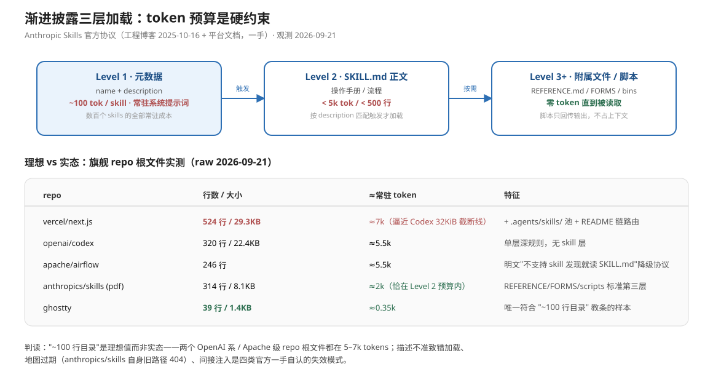

# 03a：渐进式披露深挖——原文摘录档案

> 编号说明：本档案旧编号 03a（渐进披露 03a，与 AGENTS.md 治理档案旧编号同为 03a、以主题区分），抽出后文件名重编为 01a；正文中"03a B1–B9"式引用即指本档案小节。本档案正文所称"03 文档"指上游 `research/01-context-engineering.md`（旧称），与 `final/03` 无关（2026-09-21 升格消歧）。

> **元数据**
> - accessed_at：2026-09-21（本轮逐条 web_fetch 回源；结构仿 `02a-harness-convergence-evidence.md`）
> - 上游：`01-context-engineering.md` §「渐进披露深挖（2026-09-21 二轮）」（本文件为其全文证据档案，只放摘录与回源状态，不放结论性判读）
> - 回源途径标注：**一手** = 直接抓到原文页面/文件；**半回源** = 原文页抓到但正文未全读；**转述** = 原文抓不到，仅消化稿/转引。半回源只降级、不下否定性结论。
> - 摘录纪律：所有英文原句为本次回源页面逐字摘录（含原文笔误，如 codex 文档 "If you find one, Claude reads it instead of `AGENTS.md`" 一类口语化表述均保留原样）；抓不到的如实标注，不代拟。
> - 规模量化说明：token 数为按英文 ≈4 字符/token 的**估算值**，字节/行数为 raw 文件实测（2026-09-21 curl 实测）。

---

> 三层 token 预算 + 五 repo 实测对照（理想 ~100 行 vs 实态 39–524 行）。

## B1. Anthropic 工程博客——三层披露的命名源

### B1.1 回源结果

| 文本 | 状态 |
|---|---|
| 《Equipping agents for the real world with Agent Skills》，[anthropic.com/engineering/equipping-agents-for-the-real-world-with-agent-skills](https://www.anthropic.com/engineering/equipping-agents-for-the-real-world-with-agent-skills)，署名 Barry Zhang, Keith Lazuka, Mahesh Murag，Published **Oct 16, 2025**（页内更新注记："_Update: We've published Agent Skills as an open standard for cross-platform portability. (December 18, 2025)_"） | **一手**（2026-09-21 全文回源） |

### B1.2 原文摘录（三层定义，一手）

三层模型的最权威表述（level 1 = 常驻元数据；level 2 = SKILL.md 正文；level 3+ = 附属文件）：

> At its simplest, a skill is a directory that contains a `SKILL.md file`. This file must start with YAML frontmatter that contains some required metadata: `name` and `description`. At startup, the agent pre-loads the `name` and `description` of every installed skill into its system prompt.
>
> This metadata is the **first level** of _progressive disclosure_: it provides just enough information for Claude to know when each skill should be used without loading all of it into context. The actual body of this file is the **second level** of detail. If Claude thinks the skill is relevant to the current task, it will load the skill by reading its full `SKILL.md` into context.

> As skills grow in complexity, they may contain too much context to fit into a single `SKILL.md`, or context that's relevant only in specific scenarios. In these cases, skills can bundle additional files within the skill directory and reference them by name from `SKILL.md`. These additional linked files are the **third level** (and beyond) of detail, which Claude can choose to navigate and discover only as needed.

加载触发条件（level 1→2 的触发者是模型自己的判断，基于 description）：

> Progressive disclosure is the core design principle that makes Agent Skills flexible and scalable. Like a well-organized manual that starts with a table of contents, then specific chapters, and finally a detailed appendix, skills let Claude load information only as needed […]

> Pay special attention to the `name` and `description` of your skill. Claude will use these when deciding whether to trigger the skill in response to its current task.

无上限论断：

> Agents with a filesystem and code execution tools don't need to read the entirety of a skill into their context window when working on a particular task. This means that the amount of context that can be bundled into a skill is effectively unbounded.

### B1.3 机制细节

- 同文给出 context window 四步时序：startup（系统提示词 + 各 skill 元数据）→ Claude 以 Bash 读 `pdf/SKILL.md` → 读 `forms.md` → 执行任务。
- 安全注意段（失效模式 §4 间接注入的一手来源之一）：

> Skills provide Claude with new capabilities through instructions and code. While this makes them powerful, it also means that malicious skills may introduce vulnerabilities in the environment where they're used or direct Claude to exfiltrate data and take unintended actions.

---

## B2. Anthropic 平台官方文档——三层加载的量化表

### B2.1 回源结果

| 文本 | 状态 |
|---|---|
| 《Agent Skills》overview，[platform.claude.com/docs/en/agents-and-tools/agent-skills/overview](https://platform.claude.com/docs/en/agents-and-tools/agent-skills/overview)（本次经 `.md` 直出全文抓取） | **一手**（2026-09-21） |

### B2.2 原文摘录（一手）

三层数量化的官方口径（token 成本逐层表）：

> This filesystem-based architecture enables **progressive disclosure:** Claude loads information in stages as needed, rather than consuming context upfront.

> | Level                     | When loaded             | Token cost             | Content                                                                                                                    |
> | **Level 1: Metadata**     | Always (at startup)     | \~100 tokens per Skill | `name` and `description` from YAML frontmatter                                                                             |
> | **Level 2: Instructions** | When Skill is triggered | Under 5k tokens        | SKILL.md body with instructions and guidance                                                                               |
> | **Level 3+: Resources**   | As needed               | None until accessed    | Bundled files. Reference files load into context when read. Scripts run through bash, and only their output enters context |

> Claude loads this metadata at startup and includes it in the system prompt. The `description` is what Claude matches your request against when determining whether to trigger the Skill, so it must say both what the Skill does and when to use it. This lightweight approach means you can install many Skills without context penalty: until a Skill is triggered, only its name and description occupy context.

Level 2 的触发动作是"模型自己 cat 文件"：

> When you request something that matches a Skill's description, Claude reads SKILL.md from the filesystem using bash. Only then does this content enter the context window.

Level 3 的零成本论断与脚本特殊性：

> Claude accesses these files only when referenced. [sic 勘误：前稿误作 "when needed"] **On-demand file access:** […] Claude reads only the files each task needs. A Skill can include dozens of reference files, but if your task only needs the sales schema, that's the one file Claude loads. The rest stay on the filesystem and cost zero tokens.

> When Claude runs `validate_form.py`, the script's code never loads into the context window. Only its output (such as "Validation passed" or a specific error message) consumes tokens

### B2.3 字段约束（一手）

> `name`: Maximum 64 characters; Must contain only lowercase letters, numbers, and hyphens; Cannot contain XML tags; Cannot contain reserved words: "anthropic", "claude"
> `description`: Must be non-empty; Maximum 1024 characters; Cannot contain XML tags

---

## B3. Skill authoring best practices——官方自认的失效模式清单

### B3.1 回源结果

| 文本 | 状态 |
|---|---|
| 《Skill authoring best practices》，[platform.claude.com/docs/en/agents-and-tools/agent-skills/best-practices](https://platform.claude.com/docs/en/agents-and-tools/agent-skills/best-practices)（本次经 `.md` 直出全文抓取） | **一手**（2026-09-21） |

### B3.2 失效模式原文摘录（一手）

**（a）描述不准 → 加载错/漏加载**——官方把 description 定性为唯一路由依据：

> Each Skill has exactly one description field. The description is critical for skill selection: Claude uses it to choose the right Skill from potentially 100+ available Skills. Your description must provide enough detail for Claude to know when to select this Skill, while the rest of SKILL.md provides the implementation details.

视角不一致会导致发现失败（官方 Warning 原文）：

> **Always write in third person**. The description is injected into the system prompt, and inconsistent point-of-view can cause discovery problems.
> * **Good:** "Processes Excel files and generates reports"
> * **Avoid:** "I can help you process Excel files"

**（b）嵌套引用 → 部分读取**（第三层自身的坑）：

> **Avoid deeply nested references**
> Claude may partially read files when they're referenced from other referenced files. When encountering nested references, Claude might use commands like `head -100` to preview content rather than reading entire files, resulting in incomplete information.
> **Keep references one level deep from SKILL.md**. All reference files should link directly from SKILL.md to ensure Claude reads complete files when needed.

配套缓解：>100 行的 reference 文件顶部放目录，"This ensures Claude can see the full scope of available information even when previewing with partial reads."

**（c）加载行为需观测、结构可能反直觉**（官方要求作者做行为观测）：

> * **Unexpected exploration paths:** Does Claude read files in an order you didn't anticipate? This might indicate your structure isn't as intuitive as you thought
> * **Missed connections:** Does Claude fail to follow references to important files? Your links might need to be more explicit or prominent
> * **Overreliance on certain sections:** If Claude repeatedly reads the same file, consider whether that content should be in the main SKILL.md instead
> * **Ignored content:** If Claude never accesses a bundled file, it might be unnecessary or poorly signaled in the main instructions

**（d）地图过期类**——官方反模式"时间敏感信息"：

> ### Avoid time-sensitive information
> Don't include information that will become outdated:
> **Bad example: Time-sensitive** (will become wrong):
> If you're doing this before August 2025, use the old API.
> After August 2025, use the new API.

**（e）工具/依赖假设失效**：

> Without the server prefix, Claude may fail to locate the tool, especially when multiple MCP servers are available.（MCP 工具必须写全限定名 `ServerName:tool_name`）

### B3.3 预算数字（一手）

> Keep SKILL.md body under 500 lines for optimal performance. If your content exceeds this, split it into separate files using the progressive disclosure patterns described earlier.

---

## B4. Claude Code 官方文档——记忆/嵌套作用域与 AGENTS.md 原生支持

### B4.1 回源结果

| 文本 | 状态 |
|---|---|
| 《How Claude remembers your project》，[code.claude.com/docs/en/memory](https://code.claude.com/docs/en/memory)（经 `.md` 直出全文抓取；其中 AGENTS.md 一节的个别段落位于抓取结果省略的 2843 字节内，该小节判定见 B4.4） | **一手**（2026-09-21）；AGENTS.md 支持条件小节为**半回源**（全文已在 spill 文件中核对主链路，个别尾部段落未逐字复核） |

### B4.2 嵌套作用域语义原文摘录（一手）

父链拼接而非覆盖、子目录按需加载——与 Codex/Cursor 语义不同的关键段：

> Claude Code loads `CLAUDE.md` and `CLAUDE.local.md` from your current working directory and every directory above it. Run Claude Code in `foo/bar/` and it loads instructions from `foo/bar/CLAUDE.md`, `foo/CLAUDE.md`, and any `CLAUDE.local.md` files alongside them.
>
> All discovered files are concatenated into context rather than overriding each other. Across the directory tree, content is ordered from the filesystem root down to your working directory.

> Claude also discovers `CLAUDE.md` and `CLAUDE.local.md` files in subdirectories under your current working directory. Instead of loading them at launch, they are included when Claude reads files in those subdirectories.

路径作用域规则（`.claude/rules/` 的 `paths` frontmatter，触发条件 = 读到匹配文件）：

> Path-scoped rules trigger when Claude reads files matching the pattern, not on every tool use.

### B4.3 AGENTS.md 原生支持（一手，澄清 03 文档 limitations 第 2 条）

Claude Code 已原生读 AGENTS.md，但有版本与配置前提——2026-09-21 口径：

> * You're on a Claude Code version before v2.1.277（此条为"何时**不**可用"列表之一）

默认加载策略（CLAUDE.md 优先）与双读开关：

> `claude-md-or-agents-md` | Your `CLAUDE.md` files, or your `AGENTS.md` files when you have no `CLAUDE.md` or `CLAUDE.local.md` in your working directory or above it. This is the default
> `claude-md-and-agents-md` | Your `CLAUDE.md` and `AGENTS.md` files together, each directory's `CLAUDE.md` files first and its `AGENTS.md` after them.

"我的 AGENTS.md 不加载"排查段（半回源边界内，正文已抓到的相邻段落佐证默认策略）：

> the usual cause is a `CLAUDE.md` somewhere on the project path. By default Claude reads `AGENTS.md` only when you have no `CLAUDE.md` or `CLAUDE.local.md` in your working directory or above it.

### B4.4 auto memory 的两层披露实例（一手）

MEMORY.md 索引层常驻 + topic 文件按需读，是渐进披露在记忆侧的同构：

> The first 200 lines of `MEMORY.md`, or the first 25KB, whichever comes first, are loaded at the start of every conversation.
> Claude Code doesn't load topic files such as `user_role.md` or `feedback_testing.md` at startup. Claude reads them on demand using its standard file tools when it needs the information.

### B4.5 与 03 文档旧口径的关系

03 文档 limitations 曾记"Claude Code 是否原生支持 AGENTS.md 口径不一（官方 FAQ 称 pending）"。本轮一手证据显示官方文档已有完整支持矩阵（v2.1.277+、feature flag、`/config` 开关），该 limitation 可升级为"已支持、有前置条件"。

---

## B5. agents.md 官方站——嵌套的规范层口径

### B5.1 回源结果

| 文本 | 状态 |
|---|---|
| [agents.md](https://agents.md/) 官方站（AAIF / Linux Foundation，页脚 "Copyright © AGENTS.md a Series of LF Projects, LLC"） | **一手**（2026-09-21） |

### B5.2 原文摘录（一手）

> ### 4. Large monorepo? Use nested AGENTS.md files for subprojects
> Place another AGENTS.md inside each package. Agents automatically read the nearest file in the directory tree, so the closest one takes precedence and every subproject can ship tailored instructions. For example, at time of writing the main OpenAI repo has 88 AGENTS.md files.

> ### What if instructions conflict?
> The closest AGENTS.md to the edited file wins; explicit user chat prompts override everything.

> ### Are there required fields?
> No. AGENTS.md is just standard Markdown. Use any headings you like; the agent simply parses the text you provide.

---

## B6. Codex 官方文档——逐目录至多一份、32 KiB 截断

### B6.1 回源结果

| 文本 | 状态 |
|---|---|
| 《Custom instructions with AGENTS.md》，[developers.openai.com/codex/guides/agents-md](https://developers.openai.com/codex/guides/agents-md)（请求时 302 → [learn.chatgpt.com/docs/agent-configuration/agents-md.md](https://learn.chatgpt.com/docs/agent-configuration/agents-md.md)，按重定向目标抓到全文；域名为 OpenAI ChatGPT 文档域，判定为官方一手） | **一手**（2026-09-21） |

### B6.2 发现链原文摘录（一手）

> Codex builds an instruction chain when it starts (once per run; in the TUI this usually means once per launched session). Discovery follows this precedence order:
> 1. **Global scope:** In your Codex home directory (defaults to `~/.codex`, unless you set `CODEX_HOME`), Codex reads `AGENTS.override.md` if it exists. Otherwise, Codex reads `AGENTS.md`. Codex uses only the first non-empty file at this level.
> 2. **Project scope:** Starting at the project root (typically the Git root), Codex walks down to your current working directory. If Codex cannot find a project root, it only checks the current directory. In each directory along the path, it checks for `AGENTS.override.md`, then `AGENTS.md`, then any fallback names in `project_doc_fallback_filenames`. Codex includes at most one file per directory.
> 3. **Merge order:** Codex concatenates files from the root down, joining them with blank lines. Files closer to your current directory override earlier guidance because they appear later in the combined prompt.

> Codex skips empty files and stops adding files once the combined size reaches the limit defined by `project_doc_max_bytes` (32 KiB by default). [...] Raise the limit or split instructions across nested directories when you hit the cap.

截断是真实的失效模式（官方 Troubleshoot 原文）：

> **Instructions truncated:** Raise `project_doc_max_bytes` or split large files across nested directories to keep critical guidance intact.

---

## B7. Cursor 官方文档——嵌套合并 + 更具体者优先

### B7.1 回源结果

| 文本 | 状态 |
|---|---|
| 《Rules》，[cursor.com/docs/rules](https://cursor.com/docs/rules)（经 `.md` 直出全文抓取） | **一手**（2026-09-21） |

### B7.2 原文摘录（一手）

> ### Nested AGENTS.md support
> Nested `AGENTS.md` support in subdirectories is now available. You can place `AGENTS.md` files in any subdirectory of your project, and they will be automatically applied when working with files in that directory or its children.

> Instructions from nested `AGENTS.md` files are combined with parent directories, with more specific instructions taking precedence.

四类规则的触发矩阵（progressive disclosure 的 Cursor 对应物）：

> | `alwaysApply` | `description` | `globs`  | Behavior                                                         |
> | `true`        | —             | —        | Always included. Globs and description are ignored.              |
> | `false`       | —             | provided | Auto-attached when a matching file is in context.                |
> | `false`       | provided      | omitted  | Agent reads the description and pulls the rule in when relevant. |
> | `false`       | omitted       | omitted  | Included only when you `@`\-mention the rule in chat.             |

官方 best practice 的"指路不抄"段（与 OpenAI docs 地图同构）：

> - Reference files instead of copying their contents—this keeps rules short and prevents them from becoming stale as code changes

---

## B8. 真实 repo 披露结构解剖（raw 实测，2026-09-21）

> 观测途径：全部为 `raw.githubusercontent.com` 逐文件抓取 + curl 实测行数/字节，判**一手**。规模量化为估算：英文 Markdown ≈4 字符/token。

### B8.1 vercel/next.js（canary 分支）——"入口路由 + skill 池"的旗舰样本

实测：根 `AGENTS.md` **524 行 / 29,312 字节（≈7k tokens）**；`CLAUDE.md` 是 symlink（文件首行原话，一手）：

> **Note:** `CLAUDE.md` is a symlink to `AGENTS.md`. They are the same file.

嵌入的 README 链披露规则（第 2 层触发条件 = "改某目录前"）：

> Before editing or creating files in any subdirectory (e.g., `packages/*`, `crates/*`), read all `README.md` files in the directory path from the repo root up to and including the target file's directory. This helps identify any local patterns, conventions, and documentation.

skill 池路由节（AGENTS.md 只放一行描述 + `$skill` 指针）：

> ## Specialized Skills
> Use skills for conditional, deep workflows. Keep baseline iteration/build/test policy in this file.
> - `$pr-status-triage` - CI failure and PR review triage with `scripts/pr-status.js`
> - `$flags` - feature-flag wiring across config/schema/define-env/runtime env
> （canary 2026-09-21 实测 12 个 `$` 条目，前记 13 系把 Test Gotchas 节的 $router-act 误计入本节；另有 "Development Anti-Patterns" 节把 4 个 runtime 内部规则指向 `.agents/skills/*/SKILL.md`）

skill 文件实测（`.agents/skills/pr-status-triage/SKILL.md`，74 行；`.agents/skills/flags/SKILL.md`，45 行），frontmatter 逐字：

> description: >
>   Triage CI failures and PR review comments using scripts/pr-status.js.
>   Use when investigating failing CI jobs, flaky tests, or PR review feedback.
>   Covers blocker-first prioritization (build > lint > types > tests),
>   CI env var matching for local reproduction, and the Known Flaky Tests
>   distinction.

注意：29.3KB 已逼近 Codex 默认 32KiB 截断线——这是"嵌套 AGENTS.md + 截断上限"两个机制在真实大 repo 相遇的实例。

### B8.2 openai/codex（main）——根文件即子模块深度规则

实测：`AGENTS.md` **320 行 / 22,397 字节（≈5.5k tokens）**。特点：无 codebase overview，全部是 Rust 编码纪律 + 沙箱红线（"Never add or modify any code related to `CODEX_SANDBOX_NETWORK_DISABLED_ENV_VAR`..."）。文件头："# Rust/codex-rs / In the codex-rs folder where the rust code lives:"——即根级 AGENTS.md 实际承担 codex-rs 子目录角色，与 agents.md 站宣传的"根文件放全局"形态不同。

### B8.3 apache/airflow（main）——生成块 + skill 降级路径

实测：`AGENTS.md` **246 行 / 22,206 字节（≈5.5k tokens）**。两个披露结构点：
① 命令节是自动生成块（一手逐字）：

> <!-- START generated-commands, please keep comment here to allow auto update -->
> - **Run a single test:** `uv run --project <PROJECT> pytest path/to/test.py::TestClass::test_method -xvs`
> <!-- END generated-commands, please keep comment here to allow auto update -->

② 明文写出"skill 不可用时的降级协议"（渐进披露依赖运行时支持，需 fallback——一手逐字）：

> Use the contribution skills below when available. If the runtime does not support
> skill discovery, read the linked `SKILL.md` directly. If either skill is
> unavailable, do not publish, push, create or modify GitHub issues or pull
> requests, or rename or add Git remotes.

③ 深文档指路：安全模型节把权威细节指到 `airflow-core/docs/security/security_model.rst`（"The authoritative reference is..."）。

### B8.4 anthropics/skills——官方三层结构的活标本

实测：`skills/pdf/SKILL.md` **314 行 / 8,072 字节（≈2k tokens，符合官方 "under 5k tokens" 的 Level 2 预算）**。仓库 2026-09-21 实测布局：根目录只有 `.claude-plugin/`、`README.md`、`skills/`（20 个 skill 目录）、`spec/`（agent-skills-spec.md，87 字节，指向开放标准站）、`template/`。
SKILL.md 的层间指路原句（一手逐字）：

> This guide covers essential PDF processing operations using Python libraries and command-line tools. For advanced features, JavaScript libraries, and detailed examples, see REFERENCE.md. If you need to fill out a PDF form, read FORMS.md and follow its instructions.

（注意：03 文档引用过的旧路径 `document-skills/pdf` 在 2026-09-21 实测 404，官方博客配图中的旧结构已重组为 `skills/pdf`——repo 自身就是"披露地图过期"的注脚。勘误 2026-09-21：该路径现行文见上游 §7.4，原记"§3"系旧节号。）

### B8.5 ghostty-org/ghostty（复核，观测 2026-09-20 → 2026-09-21）

实测：**39 行 / 1,388 字节（≈350 tokens）**，与 03 文档 §2.2 口径一致（勘误 2026-09-21：上游现行 §2.2 已记"39 行（raw 实测）"，"约 30 行"系旧稿口径，引以 39 为准）。作为单层自足型对照样本保留。

### B8.6 五样本披露结构对照表（本轮新数据）

| repo | 常驻层大小（实测） | 第 2 层载体 | 第 3 层载体 | 指向什么 / 触发条件 |
|---|---|---|---|---|
| vercel/next.js | 524 行 / 29.3KB（≈7k tok） | `.agents/skills/` 12 个 $ 条目 + 4 个反模式节指向（B8.1 勘误后口径；45–74 行级）+ README 链 | 各 skill 的 scripts/、`.github/pull_request_template.md` | 任务类匹配（`$skill` 显式指针）；"改子目录前读 README 链" |
| openai/codex | 320 行 / 22.4KB（≈5.5k tok） | 无（单层深规则） | `codex-rs/tui/styles.md`（"See `codex-rs/tui/styles.md`"） | 文件头目录限定（codex-rs） |
| apache/airflow | 246 行 / 22.2KB（≈5.5k tok） | `.agents/skills/` 2 个贡献 skill + magpie 插件 skill | `contributing-docs/*.rst`、security model rst | 显式"runtime 不支持则直读 SKILL.md"降级协议 |
| anthropics/skills (pdf) | —（skill 本体） | SKILL.md 314 行 / 8.1KB（≈2k tok） | REFERENCE.md / FORMS.md / scripts/ | "If you need to fill out a PDF form, read FORMS.md" |
| ghostty | 39 行 / 1.4KB（≈350 tok） | 无 | 无 | 自足，无披露层 |

---

## B9. 未回源/不采用说明

- 2026-09-21 一轮 web_search 返回的部分结果（如 `NousResearch/hermes-agent` 的 PR #102819 / issue #54256 等声称"skill 路由边界失效"的页面）**无法确认真伪、未回源原文，本文一概不采用**，避免以幻觉源立论。
- 各工具"嵌套作用域"的**行为级实测差异**（同一 monorepo 喂给三个工具对比加载结果）本轮未做——本文只收集了三方官方文档口径（B4/B6/B7）与规范口径（B5），实测差异留作后续任务。
- Anthropic 官方文档与工程博客**未给出**"三层架构 vs 单体文件"的对照实验数据；该空白与 03 文档 §3(d) 结论一致，本轮未发现新证据推翻。
