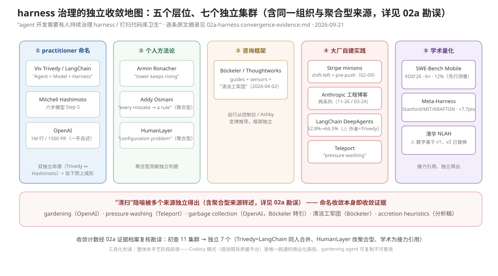

# 深挖四：Harness 治理派——治理对象从 spec 文档转向 agent 执行链路

> **元数据**
> - 观测日期：2026-09-20（2026 材料优先；OpenAI 原文 2026-02-11，Hashimoto 2026-02-05，arXiv 2026-08-31）
> - 底稿：`../../beyond_spec_driven_development/README.md` §3（原单文件底稿 `02_research/spec_driven_development/alternatives.md` 第 4 节；2026-09-21 随目录升格为 beyond_spec_driven_development 并重排节号，同日随实践层拆分迁至 `03_practice/beyond_spec_driven_development/`）（本文为深挖展开，不复制底稿结论）
> - 定位：五形态中**证据最硬、最可能是团队级收敛点**的一条，故挖最深
> - 证据强度说明：OpenAI 一手原文（openai.com）在本次观测中直接抓取被拒（403），细节经两个高保真第三方消化源交叉核验后引用，已逐条标注；一手源（Hashimoto、arXiv HTML 全文）均直接回源
> - 上游文档指针：五形态总览见 `../../beyond_spec_driven_development/README.md` §0–§5、光谱图见其 §6；验证优先派见 `../../beyond_spec_driven_development/01-verifiable-specs.md`（跨目录）

---

## 0.5 收敛判读（2026-09-20 三轮补查后计）

> 五层位 × 独立集群收敛地图（含复核勘误后的计数：11→7）与"清扫"隐喻命名收敛带。

排除本文 §1–§4 已收四源（OpenAI/Hashimoto/arXiv 2609.00252/腾讯云）后，初查得 11 个集群；**经 [02a](02a-harness-convergence-evidence.md) 全文证据档案复核勘误（Trivedy 即 LangChain deepagents 作者，两集群合并；HumanLayer 引用链齐全改判聚合型），确认独立集群 7 个**（计数口径勘误说明：11 为初查集群总数（含聚合型），8 为其中初判独立数——见 02a 文首勘误 1；图题"11→7"记总数、下文结论句"8→7"记独立数，两说同轨不矛盾）——它们**独立说出同一件事**（agent 开发需要有人持续治理 harness/代码库卫生）：

1. **Viv Trivedy（亦即 LangChain DeepAgents 作者）**（术语独立命源：Agent = Model + Harness；LangChain 团队实测只改 harness，TerminalBench 52.8%→66.5%）
2. **Birgitta Böckeler / Thoughtworks**（guides/sensors + 持续调优 + 漂移传感器框架，自行从控制论推导，文中仅把 OpenAI/Stripe 当案例引用）
3. **Stripe minions 团队**（shift-left feedback、pre-push 启发式 linter，纯自建实践；发布 2026-02-09；⚠ 正文 JS 渲染未回源，独立性待正文确认）
4. **Anthropic 工程博客两个独立系列**（长任务 harness 设计；"harness 每个组件都编码了一个模型做不到的假设"）
5. **学术三篇接力式收敛**：SWE-Bench Mobile（KDD'26）先行独立测量同模型跨 scaffold 6× → Meta-Harness（Stanford/MIT/KRAFTON）引用其 6× 作动机、自行得出同结论 → 清华 NLAH 引用 Meta-Harness——**独立得出、接力引用**，非零引用平行（见 [02b](02b-harness-academic-and-metrics.md)）
6. **Armin Ronacher**（harness loop 代价、塔与共享理解的衰减——独立从维护/卫生角度切入）
7. **Teleport**（"pressure washing the codebase with LLMs"——一个季度/13 工程师；卫生/清扫命名的又一独立实例）

弱独立或聚合型（引用他人但贡献独立判据）：HumanLayer（"it's not a model problem. It's a configuration problem."——引用链指向 Hashimoto/Trivedy/OpenAI，改判聚合型）、Addy Osmani（聚合 Trivedy/Anthropic，但"every mistake becomes a rule"棘轮纪律为独立表述，且其身份是 Claude Code 团队 MTS）、Simon Willison（agentic loop 设计正典，维护/清扫角度着墨少）、Vercel（减工具实验，harness 简化侧）、Geoffrey Huntley（Ralph 循环——治理对象是"让 agent 一直跑"，非清扫，弱相关）、Olimpiu Pop / InfoQ（媒体确认"from vibe coding to harness engineering"已成为行业叙事）。

**结论**：与 §1 单一 OpenAI 案例相比，"需要有人/机制持续打扫 harness"在 2026H1 已出现** practitioner 命名（Trivedy/LangChain）、个人方法论（Hashimoto/Osmani）、咨询公司框架（Thoughtworks）、大厂自建实践（Stripe/Anthropic/Vercel）、学术量化（3 篇独立得出、接力引用的论文）五个层位的独立收敛（层位例证含聚合型成员——Osmani/Vercel 为汇聚点，不计入独立集群数）——**复核勘误后独立集群数从 8 下调为 7，但五层位结构不变**（逐条原文摘录与引用链核验见 [02a](02a-harness-convergence-evidence.md)）**——且各层术语（gardening / cleanup / pressure washing / 清洁工军团 / accretion heuristics / garbage collection）各自独立发明了"清扫"隐喻。这是本文五形态中最强的多人独立收敛信号。

---

## 0. 一句话立场

Harness 治理派的立场不是"不写 spec"，而是**把工程投入的重心从"把 spec 写对"移到"把 agent 的执行环境工程化"**：agent 出错时，标准反应不再是"把 spec 写得更细"，而是"执行链路里还缺什么能力——linter？验证脚本？日志？review loop？"spec 在这套系统里降格为一个**可替换组件**，而非方法论本体。

---

## 1. OpenAI《Harness Engineering》（2026-02-11）：1500 PR / 1M 行的组织方式全文细节

*一手源：[openai.com/index/harness-engineering](https://openai.com/index/harness-engineering/)（Ryan Lopopolo，2026-02-11；原文直接抓取 403，以下细节经 [pankaj28843/agentic-engineering-research](https://github.com/pankaj28843/agentic-engineering-research/blob/main/research/06-openai-harness-engineering/guide/00-README.md) 的逐章消化稿与 [FlorianBruniaux/claude-code-ultimate-guide 的资源评估卡](https://github.com/FlorianBruniaux/claude-code-ultimate-guide/blob/main/docs/resource-evaluations/2026-02-11-openai-harness-engineering.md) 交叉核验，两源一致处才收录）*

### 1.1 实验基设

- 5 个月、3 人工程团队、内部 beta 产品、**零手写代码**（Codex 写应用逻辑、测试、CI 配置、文档、可观测性、内部工具、review 评论、生产 dashboard 定义），约 100 万行、约 1500 个 PR，即**约 3.5 PR/工程师/天**。所有数字为一手自述，无独立验证（评估卡原文即如此标注）。
- 中心命题："Humans steer. Agents execute."——人类不再是代码的直接来源，而是**环境设计者**；稀缺资源被明确定义为**人的注意力**，harness 的所有设计决策都从这个约束推出。

### 1.2 三个文档目录的格式与生命周期

仓库知识库是"system of record"：**不在 repo 里的知识，对 agent 而言不存在**。三个目录是这套知识库的三个生命周期阶段：

| 目录 | 承载内容 | 格式要点 | 生命周期 |
|---|---|---|---|
| `docs/product-specs/` | 产品行为、用户可见验收标准、产品原则 | 带 `index.md` 索引； tribal 产品原则（"问团队才知道"的那种）必须落成文档 | 行为变更的**同一 PR 内必须同步更新**（ownership 规则），否则由 doc linter / gardening agent 抓漂移 |
| `docs/design-docs/` | 架构决策与"为什么"（worldmonitor 实例中对应 "Design Philosophy"） | 交叉引用 `ARCHITECTURE.md`，含 source-file 引用与所有权 | 决策变更时更新；陈旧化由 freshness linter 检测 |
| `docs/exec-plans/` | 执行计划（first-class artifact） | `active/` + `completed/` + `tech-debt-tracker.md` 三段结构；active 计划含 goal、验收标准、来源链接、状态、checklist、决策、验证命令、证据产物、**recovery note** | 小改动用轻量计划，复杂工作用完整 exec plan；完成后移入 completed；tech debt 进 tracker 而非散落 |

exec plan 里的 recovery note 是给"无记忆的新 agent"用的恢复内存：长循环挺过 context 压缩、进程重启和交接，靠的是把事实写进计划文件而非聊天记录。这是它与人用 todo list 的本质差异——**读者可能是一个全新 agent**。

入口是**约 100 行的 `AGENTS.md`**，只做"目录/路由"：repo 是什么、哪些命令证明工作、先读哪些 docs、哪些边界不可协商。更深的 docs 因为只在任务相关时才被读取，可以写长——这是 progressive disclosure 在 repo 级的应用（与 Codex Agent Skills 的 name/description 先见、SKILL.md 按需读同一原理）。

### 1.3 doc-gardening agent 怎么工作

- **触发与动作**：周期性后台 agent，扫描"陈旧/过时文档"，**直接开 fix-up PR**（不是发报告）。
- **配套机器**：专门 linter + CI job 校验知识库"最新、互链、结构正确"（链接健康、必需章节、生成文档新鲜度、plan 状态）。生成文档（db-schema、routes、openapi 等）的规则是"**必须新鲜或明确标 stale**"——陈旧的生成 schema 比没有更糟，因为 agent 会信它；CI 用 `git diff --exit-code docs/generated` 兜底。
- **可复刻的下位替代**（消化稿给出的最小实现）：`rg "TODO|TBD|stale|deprecated" docs` + 链接检查 + owner/freshness 元数据表。要点不是 paperwork，而是**让文档变得可被 agent 维护**——有 owner、有保鲜期、有校验，gardening agent 才开得出有用的 PR。

### 1.4 完整模式清单（评估卡归纳的 10 条）

1. AGENTS.md 作 ~100 行 TOC，不是百科全书
2. "agent 看不见的就不存在"：一切隐性约定必须编码为 repo 内容
3. exec plans 为 first-class artifact（active/completed/tech-debt-tracker）
4. **每 worktree 一份临时可观测性栈**（Vector + VictoriaLogs/Metrics/Traces，LogQL/PromQL/TraceQL）——agent 可直接查运行时行为
5. taste invariants：偏好评**机械化为自定义 linter，错误信息写给 agent 读**（错误消息即"善意 prompt 注入"：不只说错，还说怎么修、为什么重要）
6. doc-gardening agent（见 1.3）
7. 反熵：后台 cleanup agent 按域追踪质量分（QUALITY_SCORE.md），技术债变成增量小 PR 而非大重构
8. 分层域架构（Types/Config/Repo/Service/Runtime/UI）**由 linter 强制**——在 agent 规模下是前置条件而非"以后再补"
9. 高吞吐 merge 哲学："修复便宜、等待昂贵"——PR 生命周期短、阻塞门最少、flake 用后续运行解决。**仅在真实 agent 吞吐 + 修复成本低的前提下成立**，直接照搬即鲁莽
10. agent 自主度渐进：从 bug 复现到 PR 到 merge 的全环自主，人类在更高抽象层在环

### 1.5 他们自述的失败与调整（这部分比成功清单更值钱）

- **"一个巨型 AGENTS.md"失败**：他们先试过单文件大全，结果是 context 压力、指导稀释（什么都重要=什么都不重要）、快速腐烂、难以验证。调整为短 TOC + 分层 docs。这是一手承认的结构性失败，直接反驳"把规则都写进一个 CLAUDE.md/AGENTS.md"的常见做法。
- **人类当浏览器的瓶颈**：早期每个 UI 修复都要人肉看页面。调整为 per-worktree 可启动 app + CDP + DOM 截图/导航 skills，让 agent 自证视觉修复；人的 review 从"看每个页面"上移到"审计证据、判断这类检查是否足够"。
- **merge 规范被吞吐倒逼修改**：传统 PR 门禁在高吞吐下变成反生产。他们没有宣布"去掉所有门禁"，而是把门禁与**修复成本对齐**（见 9 条）。
- **明确承认的未知**（原文自述）：①完全 agent 生成的系统**多年后的架构一致性如何演化，他们不知道**——这是核心长期风险；②私有 harness 中哪些要素是本质、哪些是偶然，不清楚；③报告的速度有多少归功模型能力 vs harness 成熟度，无法分离；④brownfield（深遗留约束）场景是否适用，未验证。OpenAI 官方 Codex 文档同时给出自主度边界的下限设计：本地 workspace-write 默认断网、merge 默认拒绝需显式策略。

---

## 2. Hashimoto 六阶段模型逐阶段展开

*一手源：[mitchellh.com/writing/my-ai-adoption-journey](https://mitchellh.com/writing/my-ai-adoption-journey)（2026-02-05，全文已回源）*

**勘误先行**：底稿称"第六阶段 Engineer the Harness"，实际原文是**六步（Step 1–6）结构，"Engineer the Harness"是 Step 5**，Step 6 是"Always Have an Agent Running"。底稿引用时错位了一步，本文按原文展开（建议回改底稿）。

| 阶段 | 一手内容要点 | 对 harness 派的意义 |
|---|---|---|
| Step 1 Drop the Chatbot | chatbot 在 brownfield 项目产出差、来回贴代码低效；"必须用 agent"——最低要求是能读文件、执行程序、发 HTTP 请求 | 起点：把交互面从对话换成有工具回路的执行环境 |
| Step 2 Reproduce Your Own Work | 强迫自己把每个手动 commit 用 agent 重做一遍（做两次），痛苦但形成专家直觉：①拆小任务不要一次画完猫头鹰；②模糊请求拆 planning/execution 两段会话；③**给 agent 验证手段，它多半能自修并防回归** | 第三条直觉是 Step 5 的种子：验证能力是 harness 的第一等公民 |
| Step 3 End-of-Day Agents | 每天最后 30 分钟启动 overnight agent：深度调研、并行试探模糊想法、`gh` 做 issue/PR triage（只出报告、不许回复） | 证明"人不在场的正进度"需要 harness 里有可供 agent 自主消费的报告面 |
| Step 4 Outsource the Slam Dunks | 高置信任务全外包，自己同时做别的**真正的深度工作**；关键纪律：**关掉 agent 桌面通知**——打断权在人不在 agent；对 Anthropic 技能形成论文的回应：委派的任务不形成技能，但手动做的任务继续形成 | 注意力经济学与 OpenAI 的"人是稀缺资源"同一逻辑 |
| **Step 5 Engineer the Harness** | 见下 | 该文对 harness 派的直接命名贡献 |
| Step 6 Always Have an Agent Running | 目标状态（当前只做到 10–20% 工作日有后台 agent）：持续问"现在有没有 agent 能替我做的事"；配 Amp deep mode（GPT-5.2-Codex）等慢模型跑长任务；**明确不为跑而跑**，多 agent 并行暂时不要 | 阶段六是 harness 建成后的"产能利用"问题，本身不是 harness 手段 |

**Step 5 的具体手段清单**（原文完整清单，就两条，但每条都有锚点实例）：

1. **更好的隐性提示（AGENTS.md）**：agent 反复读错命令、找错 API 这类简单错误 → 更新 AGENTS.md。一手锚点：[Ghostty 的 src/inspector/AGENTS.md](https://github.com/ghostty-org/ghostty/blob/ca07f8c3f775fe437d46722db80a755c2b6e6399/src/inspector/AGENTS.md)——**"文件里每一行都对应一个真实的 agent 坏行为"，且这些行几乎完全消除了对应错误**。这就是底稿说的"每次 agent 犯错就工程化地消灭该错误类别"的最小可复制单位：一行坏行为 = 一行规则。
2. **真正的程序化工具**：截图脚本、过滤测试运行器等可执行验证工具，**且通常配套一条 AGENTS.md 告诉 agent 这个工具存在**（工具不写进地图等于不存在——与 OpenAI 第 2 条模式同构）。

Hashimoto 与 OpenAI 的口径差异值得记录：他自述"不知道这有没有行业通用名，我自己管这叫 harness engineering"——即这个词是 2026 年初由 practitioner 独立命名、OpenAI 同期把它组织化、arXiv 论文随后学术化的一条传播链，而非自上而下的发明。

---

## 3. arXiv 2609.00252：technical harness vs methodological harness 的完整框架

*一手源：[arxiv.org/abs/2609.00252](https://arxiv.org/abs/2609.00252) + [HTML 全文](https://arxiv.org/html/2609.00252v1)（Díaz, Gayoso, Cimminio, Pérez；Universidad Politécnica de Madrid；2026-08-31 提交）*

### 3.1 论文的问题意识：productivity paradox

个体生产力上升、团队吞吐/review 能力/稳定性下降。证据链全部引自工业报告：Faros AI（10,000 开发者/1,255 团队：合并 PR +98%，但 review 时间 +91%、人均缺陷 +9%）、DORA 2024→2025（2025 的总结句："AI 不修复团队，只放大既有特征"）、METR RCT（老手在自己 repo 慢了 19% 却自以为快 20%）、GitClear（2020–2024 重构占比 25%→<10%，重复代码块 ×8）。理论化工具是 **Amdahl 定律套 SDLC**：只加速代码生产、review/验证/集成仍按原容量，上游创造的价值被下游瓶颈吃掉。

### 3.2 harness 二分框架

论文把 practitioner 文献里的 harness（"Agent = Model + Harness"，引 Böckeler & Fowler 2026、LangChain 2026）**从模型级扩展到团队级**，正式二分：

- **Technical harness（围着 agent）**：让单个 agent 的能力变成可靠产出的一切技术机制——上下文工程、工具、验证脚本、可观测性、并行隔离等。
- **Methodological harness（围着团队）**：让多个 agent × 多个人变成可治理团队的一切方法机制——规范、咨询结构、验收证据、自主度分级。

操作化为 **8 个 harness 机制**（第 5 节，每个带 worked example）：①context engineering；②persistent shared knowledge（repo 作系统记录）；③executable specifications；④N-version 心智 + 并行 agent（**用 worktree 不用共享分支**）；⑤normative specifications；⑥structured consultation；⑦evidence-backed acceptance；⑧graduated autonomy。前两个偏 technical，后几个本质是 methodological——注意 **③⑤ 两个机制就是"spec"在 harness 内部的两个合法座位**（见第 5 节）。

### 3.3 它对 SDD 的重述与保留

论文不是反 SDD 的，恰恰相反：**它把 SDD 学术化为"ASE 的使能学科"**——

- spec 是人机协作的 **contract substrate**：vibe coding 溶解了三个合约（accountability、verifiability、transferability），SDD 以 spec 为中心形态把它们重建：accountability 变成"对 spec 的合约责任"，verification 从"从 diff 反推意图"变成"审计证据"，onboarding 从"读代码猜"变成"读 spec"。
- 五种人机交互模式重新定义人的角色：briefing、consultation、review、norm encoding、orchestration。
- **方法论的诚实**值得全录：论文明确声明依据主要是 gray literature（实践报告、演讲、工具文档），因为"两个核心构念（团队级 SDD、harness）尚无同行评审研究定义、划界或测度过"；自我定位是"走向学术-工业共识的第一步，不是已验证的理论"。这使它比一般"论文背书"弱一级——引用时应作为**概念框架的先行者**而非实证结论。
- 论文自列的五大风险恰好是第 4 节的成本框架的学术版：talent bifurcation（技能分化）、cultural fracture（文化断裂）、**cost spiral**（成本螺旋）、specification drift（spec 漂移）、platform lock-in（平台锁定）。

---

## 4. 反面与成本：harness 建设的真实代价

### 4.1 平台工程投入的量级

- **OpenAI 样本的隐含门槛**：per-worktree 临时可观测性栈（Vector + Victoria 三件套 + LogQL/PromQL/TraceQL）、CDP 接入、自定义 linter 族、CI 知识库校验、cleanup agent 调度——评估卡的原话是"some patterns require significant investment to replicate"、"assumes infrastructure access not universally available"。3 人 5 个月做出 1M 行的另一面是：**这 3 人的全部时间都花在建设 harness 上，一行产品代码没写**。"no manual code"不是道德律令而是实验的 forcing function——消化稿明确警告不要照抄这一条。
- **厂商激励偏差**：这是 OpenAI 讲的关于 Codex 的成功故事，"unusually concrete and includes caveats, but it is still OpenAI telling a success story"。1500 PR 的质量无独立验证；PR 数/行数本身被消化稿列为**不应作为度量**的虚荣指标（应量：issue→validated PR 时长、每接受 PR 的人工分钟、返工率、merge 后 bug 率、cleanup PR 量、架构 lint 违规趋势、每接受变更 token 成本）。
- **量级参照**：个人级入口约 $200/月（Codex Pro 20x / Claude Max 20x）只买到模型与产品面；"Product subscriptions buy access to models and surfaces. They do not buy the harness." 团队级的真实成本在 observability/CI/linter/cleanup 基建，属典型平台工程预算，无公开定价可比，只能按自建组件数估计。

### 4.2 过度建设的信号

消化稿的"knowledge base smells"清单可直接用作体检表：AGENTS.md 长成手册；docs 里写"问团队"；产品决策只在 ticket 里；生成文档无新鲜度检查；active plan 无状态字段；架构文档与 lint 不挂钩；同一规则在 review 评论里反复出现（→该升格为 lint/doc 了）。另一侧信号是**收益侧的**："如果 PR 数上升而 cleanup 和 bug 上升更快，harness 在生产债务"；cleanup agent 制造 churn 或掩盖更深层设计问题，被列为 open unknown。

### 4.3 小团队：一个可核查的模仿样本（半成功案例）

[worldmonitor 的 harness-engineering-roadmap.md](https://github.com/koala73/worldmonitor/blob/main/docs/harness-engineering-roadmap.md)（2026-03-14）是小团队照 OpenAI 文章自评的公开记录：7 支柱自评，**当时就绪度 ~25%**——强项在纯文档与 lint（P1 支柱 7/10、P2 6/10），弱项恰在平台投入最重的三块（agent 可观测性 2/10、agent-to-agent review 0/10、自愈 GC 0/10）。它的执行顺序本身就证明了正确的小团队路径：**P0 lint/测试进 CI → P1 可观测性 → P2 review loop → P3 自愈 → P4 全自主**，每级都以前一级为安全网（"self-merge pipeline requires P0–P2 as safety net"）。反面教训亦有：进度日志显示一天内完成的多是 lint 类快赢，平台级支柱（可观测性、自愈）数周后仍停留在 P1/P3 待办——**投入梯度与 OpenAI 原文的重要性排序相反，是模仿者最普遍的失真形态**。未找到公开的"全套照搬后失败"案例记录；arXiv 论文也把 organizational adoption pathways 列为 RA4 未来工作——这个空缺本身就是证据：团队级路线尚无成熟轨迹可抄。

### 4.4 场景边界

探索期项目过度设计（底稿已判，维持）；OpenAI 自认 brownfield 未验证；"修复便宜等待昂贵"的 merge 哲学在受监管数据、金融动作、难回滚迁移场景必须反转（消化稿给出风险×merge 姿态矩阵：低风险 agent review+验证即可，中风险定向测试+人/高级 agent review，高风险 auth/billing/破坏性变更必须人审+回滚计划+生产证据）。

---

## 5. 与 SDD 的组合方案：spec 在 harness 里的最佳位置

### 5.1 spec 类文件在 OpenAI 三目录中的角色

OpenAI 体系里，"spec"没有消失，而是被**按生命周期拆位**：`product-specs/` 是产品行为的语义真源（最接近 SDD 的 feature spec），`design-docs/` 承载"为什么"（SDD 的 design doc），`exec-plans/` 承载"怎么干+干到哪"（SDD 的 plan）。与经典 SDD 的关键差别有三：

1. **可发现性结构**：spec 不再是自由文档，而是挂在 ~100 行 AGENTS.md 路由之下、有 index、有 owner、有保鲜期的知识库节点——"写好 spec"不够，必须"agent 找得到、读得对、信得过（新鲜度可验证）"。
2. **漂移有机器管**：spec 与代码行为的漂移由同-PR 更新规则 + doc linter + doc-gardening agent 三层兜底，不再靠人的自觉。这正是底稿指出的"spec 漂移是沉默的"缺口在该派内的解法。
3. **spec 不是唯一合约**：一部分原属 spec 的约束被**下沉为 lint/结构测试**（架构规则、taste），一部分**上浮为验收证据**（可观测性产物、测试输出）。spec 保留了"意图与为什么"，机器约束接管了"可机械判定的部分"——arXiv 论文的 ③executable specifications 与 ⑤normative specifications 正是这两个下沉/保留座位的学名。

### 5.2 已有 SDD 实践团队的渐进 harness 化路径

按 worldmonitor 验证过的 P0→P4 梯度，把 SDD 工件当作第一批发酵底物：

- **P0（零平台投入，两周级）**：spec 目录原样迁入 `docs/` 三段结构；AGENTS.md 砍成 ~100 行路由；`make validate`（测试+lint）成为 handoff 硬命令。SDD 工件的位置变化：spec 从"方法论中心"变为"知识库节点"，**格式与内容不用改**。
- **P1**：把 spec 里可机械判定的条款逐条抽成 lint/结构测试（抽一条，spec 瘦一条）；加 doc 链接/新鲜度 linter；生成类文档加 CI 新鲜度检查。判据：review 评论里第二次出现的规则就升级为 lint/doc。
- **P2**：per-worktree 可启动 + 最小运行时证据（截图/健康端点）；agent review 以 advisory 起步、分角色（正确性/架构/安全）、强制 findings 分类与 author pushback 权利（防 review 噪声死循环）。
- **P3**：doc-gardening / cleanup agent 上线，开 fix-up PR；tech-debt-tracker 接管漂移债。
- **P4**：低风险类目自 merge（必须有 P0–P2 安全网 + 高风险类目保留人审的 merge 姿态矩阵）。

**判断收敛点的口径**：harness 是真的，当它改变了任务完成的方式（新 agent 能沿 AGENTS.md 找到正确文档、挂掉的 validate 会让 agent 自修、gardening PR 真的有用），而不是"我们有了这些文档"。对 SDD 团队，终点形态即底稿那句话的落地：**spec 从方法论本体降格为 harness 中被持续校验的可替换组件**——但它通常恰恰是最后一个该被替换的组件，因为它承载着 lint 和测试都承载不了的"为什么"。

---

## 6. 遗留开放问题

1. OpenAI 全部数字（1500 PR/1M 行/3.5 PR/人/天）仍是一手自述，无独立验证——本次观测亦无法直接回源原文（403），依赖两个独立消化稿交叉一致。
2. 全 agent 生成系统的多年架构一致性：OpenAI 自认不知道，是全派最大未决风险。
3. 团队级采纳路径（arXiv RA4）：尚无成熟轨迹，worldmonitor 是罕见的公开自评样本但只走到 ~25%。
4. cleanup/gardening agent 的净质量收益（churn vs 修复）无量化研究。
5. Hashimoto 模型是个人向的；个人 harness（AGENTS.md+脚本）与团队 harness（observability+review loop+cleanup）之间仍差一个数量级的基建，中间形态（5–20 人团队）的公开案例在观测日仍未出现。

---

## 7. 独立收敛声音补遗（2026-09-20 三轮观测；越新越重）

> 补查方法：三轮 web 检索 + 一手回源（本文其余各节为 2026-09-20 早前观测，勿混淆）。每条标注：日期 | 人物/团队 | 原话/主张 | 对应治理点 | URL | **独立性判定**。收敛计数见 §0.5。

### 7.1 Viv Trivedy —— "Agent = Model + Harness" 术语独立命源（约 2026-01）

- **日期**：X 帖 "Anatomy of an Agent Harness"（2026-01，据 Osmani 转引）。（⚠ 日期勘误，见 02a A1.1：HaaS 文实为 2025-09-23；Anatomy 正式版 2026-03-10 发于 LangChain 博客并署名 Vivek Trivedy；X 帖原日期未精确核验，"约 2026-01"系转引估计）
- **影响力**：独立 practitioner，"harness engineering" 一词被 Osmani/Böckeler/arXiv 论文多方指认从他扩散。
- **原话**："**Agent = Model + Harness. If you're not the model, you're the harness.**"；"good agent building is an exercise in iteration. You can't do iterations if you don't have a v0.1."；另提出 **Harness-as-a-Service (HaaS)**：从"建在 LLM API 上"转向"建在 harness API 上"。
- **对应治理点**：把治理对象正式命名为 harness 本身；"if you can't name the behaviour a component exists to deliver, it probably shouldn't be there" 即组件级 hygiene 判据。
- **URL**：[x.com/Vtrivedy10/status/2031408954517971368](https://x.com/Vtrivedy10/status/2031408954517971368)；[vtrivedy.com HaaS 文](https://www.vtrivedy.com/posts/claude-code-sdk-haas-harness-as-a-service)（经 [Osmani 2026-04-19 文](https://addyosmani.com/blog/agent-harness-engineering/)转引，原帖未直接回源）
- **独立性**：**独立**。术语自铸，未见引用 OpenAI/Hashimoto；与 Hashimoto 的"我自己管这叫 harness engineering"（§2）构成双命源。

### 7.2 HumanLayer —— "skill issue" 重构：失败是配置问题（2026-H1）

- **原话**："**it's not a model problem. It's a configuration problem.**"；"success is silent, failures are verbose"；AGENTS.md 保持在 60 行内。
- **对应治理点**：linter/钩子反馈回路（失败信息注入循环）；规则行的"棘轮"纪律。
- **URL**：[humanlayer.dev/blog/skill-issue-harness-engineering-for-coding-agents](https://www.humanlayer.dev/blog/skill-issue-harness-engineering-for-coding-agents)（经 Osmani 转引）
- **独立性**：**聚合型（02a A2.3 改判：文中直接引用 Hashimoto 原文、Trivedy 两文、OpenAI 博客与 ETH 研究，引用链齐全）**；独立增量在 stop-hook 验证回路实操、MCP→CLI 降级与"失败清单"。原文"独立"系初判，其 TerminalBench 数据点为转引 Trivedy 而非独立测得。

### 7.3 Birgitta Böckeler / Thoughtworks —— guides/sensors 控制论框架 + 持续调优（2026-04-02，全文已回源）

- **日期**：martinfowler.com 正式文 2026-04-02（取代其 2026-02-17 备忘录）。
- **影响力**：Thoughtworks Distinguished Engineer，martinfowler.com 平台。
- **原话/主张**：
  - 二分：**Guides（前馈：AGENTS.md、skills、LSP）/ Sensors（反馈：linter、结构测试、AI review）**；传感器信号"针对 LLM 消费优化——自定义 linter 消息中包含自我纠正指令，一种积极的 prompt injection"（与 OpenAI 的 taste linter §1.4-5 同构但独立）。
  - **持续调优**："每当一个问题多次出现，就应该改进前馈和反馈控制"——即 Hashimoto/Hashimoto 式"坏行为→规则"棘轮的团队版。
  - **漂移清扫的命名**：列出"持续漂移与健康传感器"（死代码检测、覆盖率质量、依赖扫描、日志异常）；自述 Thoughtworks 团队用"**清洁工军团**"提升代码质量。
  - 直接引用 OpenAI 案例："周期性的'垃圾回收'来扫描漂移并让 agent 建议修复"，并引其结论"我们最困难的挑战现在集中在设计环境、反馈环路和控制系统上"。
  - **Hygiene 元问题**（最有分量的一句）："如果传感器从不触发，这是高质量的标志还是检测机制不足？我们需要一种类似代码覆盖率对测试那样的方法，来评估 **harness 覆盖率和质量**。"——即 harness 本身也需要被治理。
- **对应治理点**：反馈回路、漂移传感器、gardening 的咨询公司级系统化。
- **URL**：[martinfowler.com/articles/harness-engineering.html](https://martinfowler.com/articles/harness-engineering.html)
- **独立性**：**框架独立**（自行从控制论/Ashby 定律推导），OpenAI/Stripe 仅作案例引用；其"持续漂移传感器"一节与 OpenAI doc-gardening 是互不引用的平行发明。

### 7.4 Stripe minions 团队 —— shift-left feedback 与预推送钩子（发布 2026-02-09；03-17 系消化稿日期，原稿误标，已勘误）

- **影响力**：Stripe 工程博客，亿行级 Ruby/Sorbet 代码库，周千级 minion 生成、人审合并的 MR（官方摘要句："Though humans review the code, minions write it from start to finish"——生成无人值守 ≠ 评审无人值守）。
- **主张**："反馈左移"（shift-left feedback）：本地 <5 秒快速 lint、失败自动修复再进 CI；pre-push 钩子按启发式只跑相关 linter；"blueprints" 把反馈传感器整合进 agent 工作流；混合"智能循环 + 确定性操作（Git、测试、linting）"。
- **对应治理点**：linter 作为 agent 自修回路；启发式清扫（只跑相关检查）是成本治理。
- **URL**：[stripe.dev/blog/minions-stripes-one-shot-end-to-end-coding-agents](https://stripe.dev/blog/minions-stripes-one-shot-end-to-end-coding-agents)（一手直接抓取被引至第三方逐条消化稿 [jerrylususu/bookmark-summary](https://github.com/jerrylususu/bookmark-summary) 2026-03-17，细节以消化稿一致转述，标注为半回源）
- **独立性**：**独立**（⚠ 降级待核：原文正文 JS 渲染未回源，此判定待正文确认——02a A4.4；可核的外部证据仅有 Böckeler 的反向引用）。金融级自建实践，与 OpenAI 无引用关系；Böckeler 反向引用了它（说明其影响级）。

### 7.5 Anthropic 工程博客 —— 两个独立系列的 harness 方法论（2025-11 / 2026-03-24）

- **系列 A**：["Effective harnesses for long-running agents"](https://www.anthropic.com/engineering/effective-harnesses-for-long-running-agents)（2025-11）。
- **系列 B**：Prithvi Rajasekaran, ["Designing a harness for long-running application development"](https://www.anthropic.com/engineering/harness-design-long-running-apps)（2026-03-24）：planner/generator/evaluator 三 agent；关键负结果："When asked to evaluate work they've produced, agents tend to respond by confidently praising the work"——故验证必须外置。
- **核心原话**："**every component in a harness encodes an assumption about what the model can't do on its own.**"（模型变强 → 该组件变成死代码应删除）——这是 **harness 侧的 hygiene：定期删除失效机制**，与代码侧 gardening 互为镜像。
- **对应治理点**：evaluator 反馈回路；harness 组件级的"拔枯枝"。
- **独立性**：**独立**（厂商一手，时间早于/平行于 OpenAI 文）；Osmani 将系列 B 评为"最好的公开长任务 harness 设计拆解"。

### 7.6 LangChain DeepAgents 团队 —— 只改 harness 的受控实验（2026-02-17）

- **主张**：deepagents-cli 在 TerminalBench-2 上 52.8%→66.5%，**gpt-5.2-codex 恒定**，靠五项 middleware 改造：self-verification loop（`PreCompletionChecklistMiddleware`）、启动期目录/工具映射、按文件编辑计数检测 "doom loops"、reasoning sandwich（xhigh-high-xhigh）、时间预算告警。
- **对应治理点**：**doom-loop 检测**是"清扫 agent 卡死状态"的具名机制；self-verification 即反馈回路。
- **URL**：[langchain.com/blog/improving-deep-agents-with-harness-engineering](https://www.langchain.com/blog/improving-deep-agents-with-harness-engineering)（经 flying-coyote 分析稿交叉核验）
- **独立性**：**独立**（arXiv 2609.00252 §3.2 亦引用其 harness 说法，但实验为自发）。

### 7.7 学术端三重收敛：SWE-Bench Mobile / Meta-Harness / Tsinghua NLAH（2026-02~03；独立得出、接力引用——原判"互不引用"已按 04a 勘误修正）

- **Stanford/MIT/KRAFTON**（Lee, Nair, Zhang, Lee, Khattab, Finn 等），[arXiv:2603.28052](https://arxiv.org/abs/2603.28052)（2026-03-30）："Changing the harness around a fixed LLM can produce a 6× performance gap on the same benchmark."（⚠ 归属勘误：该句实出自 SWE-Bench Mobile arXiv:2602.09540 摘要，Meta-Harness 摘要无此句、系经其引文 [47] 转述——引用时归 SWE-Bench Mobile）
- **Tsinghua+Harbin IT**（Pan et al.），[arXiv:2603.25723](https://arxiv.org/abs/2603.25723)（2026-03-26）：harness 表示法改为自然语言后同任务 30.4%→47.2%、LLM 调用 1200→34；消融显示**外挂 verifier 模块反而有害**（-0.8 SWE-bench / -8.4 OSWorld），self-evolution 是唯一 consistently helpful 模块。（⚠ 数字待核，见 02a A7.2："30.4%→47.2%、1200→34"在 v2 未出现，可能出自 v1；消融数字基于 v1，v2 已换后端待复核——引用时必须带此限定；v2 口径数字见 02b A.2 表）
- **SWE-Bench Mobile**（Tian et al.），[arXiv:2602.09540](https://arxiv.org/abs/2602.09540)（2026-02-10，KDD '26）：最佳配置 12%，跨 agent 最大差距 6×（摘要口径；Cursor 12% vs OpenCode 2% 的具体配比待回源全文核对）。
- **另加独立旁证**：Andrej Karpathy（No Priors 播客，2026-03）在未引用上述论文的情况下独立提出"meta-optimization of program.md"同一概念。
- **对应治理点**：为"harness 是一级工程对象"提供了 practitioners 拿不出的受控证据；Tsinghua 消融还给出了 hygiene 的反例边界（不要预防性堆 verifier——机制也要打扫）。
- **独立性**：**三群独立得出（fixed-model-only-harness 受控设计），与工业界五源无引用关系；限定：Meta-Harness 开篇单向事后引用了 SWE-Bench Mobile 的 6× 作动机（晚于其自身实验设计）**——仍为最强独立收敛，详见 [02b](02b-harness-academic-and-metrics.md)。

### 7.8 Armin Ronacher —— harness loop 的代价与"塔与卫生"（2026-06/07，三篇连续）

- **["The Coming Loop"](https://lucumr.pocoo.org/2026/6/23/the-coming-loop/)**（2026-06-23）：区分 inner agent loop 与 outer harness loop；命名 "harness loops"（把工作维持过模型自身停止点之后的循环）及其**在永久代码库上的代价**——治理对象是"循环本身需要被管理"。
- **["Better Models: Worse Tools"](https://lucumr.pocoo.org/2026/7/4/better-models-worse-tools/)**（2026-07-04）：Opus 4.8 / Sonnet 5 会在第三方 edit schema 里发明虚假字段；"Tool schemas are not neutral"——harness 组件对模型版本敏感，**每次模型升级都是一次 harness 复检触点**。
- **["The Tower Keeps Rising"](https://lucumr.pocoo.org/2026/7/13/the-tower-keeps-rising/)**（2026-07-13）："agent 辅助编码移除了过去维持团队共享理解的摩擦……**The tower does not fall, it just keeps rising.**（原句勘误：前稿"and so we do not notice what was lost"系意译误作直引）"——直指**漂移是无声的**：harness 能让代码库继续跑，而团队对它的心智模型在悄悄腐烂，且没有任何 harness 指标会报告这一点。这是对"必须有人负责打扫理解层卫生"的最强独立表述。
- **独立性**：**独立**。个人实践者视角，无 OpenAI/Thoughtworks 引用链；其"accretion heuristics"（harness 积垢无人拔除）被社区分析稿视为与 Bitter Lesson 诊断并立的独有贡献。

### 7.9 Addy Osmani（Anthropic Claude Code MTS；前 Google——自述 "most recently as a Director at Google Cloud AI"，见 02a A9.1 逐字；原记"Chrome/Gemini 总监"不确，已勘误）—— "每个错误变成一条规则"（2026-04-19）

- **原话**："**Roughly: anytime you find an agent makes a mistake, you take the time to engineer a solution such that the agent never makes that mistake again.**"；"**Every line in a good AGENTS.md should be traceable back to a specific thing that went wrong.**"；"A decent model with a great harness beats a great model with a bad harness."；"harnesses don't shrink, they move."
- **对应治理点**：与 Hashimoto Step 5、Ghostty AGENTS.md 完全同构的棘轮纪律，但以团队/平台权威身份系统化；并记录"harness-as-a-living-system, not a config file you set up once"。
- **URL**：[addyosmani.com/blog/agent-harness-engineering/](https://addyosmani.com/blog/agent-harness-engineering/)（一手已回源）
- **独立性**：**聚合型但纪律独立**。明确署名引用 Trivedy/HumanLayer/Anthropic/Böckeler/Willison——它是收敛的**汇聚点证据**（一人核实并背书五路独立来源），自身增量是棘轮表述与"模型-harness 训练循环"。

### 7.10 Simon Willison —— agentic loop 设计正典（2025-09-30 起，持续至 2026-08）

- **主张**："an agent is a system that runs tools in a loop to achieve a goal"（[Designing agentic loops](https://simonwillison.net/2025/Sep/30/designing-agentic-loops/)，2025-09-30）；后续材料汇入 [Agentic Engineering Patterns](https://simonwillison.net/2026/Feb/23/agentic-engineering-patterns/)（2026-02-23 起）；["Judgement"](https://simonwillison.net/2026/Jul/3/judgement/)（2026-07-03）：机械性工作下放便宜模型、判断留在主循环。
- **对应治理点**：反馈回路/工具-循环设计是所有后续 harness 治理文献的共同引用基座（arXiv 2609.00252、Osmani 均引）。
- **独立性**：**独立但角度偏 loop 设计**。2026H1 观测内**未找到**他关于 gardening/代码库卫生的直接专文——此线索保留为未证实，勿在 talk 中引用。

### 7.11 "清扫"隐喻的独立命名群（gardening / pressure washing / garbage collection / 清洁工军团）

- **Teleport**（一手：goteleport.com 博客《We Had 13 Engineers Spend Three Months Finding Vulnerabilities with LLMs》，Rob Picard，2026-08-19，全文回源见 02a A10）："**pressure washing**"——用前沿模型从多角度、可重复地 review 存量代码找安全漏洞；**一个季度 / 13 工程师**专项（⚠ 勘误：原稿"90 days"系意译误作直引，原文为 "Three Months"/"the past quarter"；场景为安全漏洞清扫，非泛代码卫生）。
- **OpenAI**："doc-gardening agent"（§1.3，已有）。
- **Böckeler/Thoughtworks**："清洁工军团"、"持续漂移与健康传感器"、"garbage collection（转引 OpenAI）"。
- **flying-coyote 分析稿**："accretion heuristics"（harness 积垢）+ "auto-garbage-collection"支柱（worldmonitor 自评 0/10 项，见 §4.3）。
- **判定**：至少 4 个互不引用的来源各自发明了"打扫"隐喻——**命名收敛本身即独立收敛证据**：当多个团队不约而同需要同一个新隐喻时，说明该活动在各自实践中真实存在而非从同一文本扩散。

### 7.12 边缘/弱相关线索（记录防重复检索）

- **Geoffrey Huntley / Ralph loop**：治理对象是"让 agent 持续跑"（循环工程），与清扫/harness 治理相邻但不同轴；[howaiworks.ai 梳理](https://howaiworks.ai/blog/geoffrey-huntley-ralph-agentic-coding-loop)。Osmani 将 Ralph loops 归入 harness 的 long-horizon 原语——可作为"循环治理 ⊂ harness 治理"的桥梁引用。
- **Vercel**（Andrew Qu，["We removed 80% of our agent's tools"](https://vercel.com/blog/we-removed-80-percent-of-our-agents-tools)，2025-12-22）：工具面 -80% 后 tokens -37%、3.5× 提速——harness **减法**卫生的一手实验（n=5，引用时注意样本量）。
- **InfoQ / Olimpiu Pop**（[播客 "From MCP and Vibe Coding to Harness Engineering"](https://www.infoq.com/podcasts/mcp-vibe-coding-harness-engineering/)）：媒体层确认 harness engineering 已取代 vibe coding 成为 2026 年行业叙事关键词——传播广度证据，非独立主张。
- **腾讯云/Dive-into-Claude-Code 等**：已收或消化稿层，不另立条目。

### 7.13 补遗对本文结论的修正

1. §6-2 的"最大未决风险"有了新表述者：Ronacher 的"塔"（§7.8）说明**团队理解层的腐烂连指标都没有**，比 OpenAI 自认的架构一致性风险更不可见。
2. §6-4（cleanup agent 净收益无量化）部分被学术端反向补足：Tsinghua 消融证明**机制堆叠有害**，但 doc-gardening 类 PR 的净收益仍无量化。
3. 新增遗留问题：**harness 自身的覆盖率/质量如何度量**（Böckeler 之问，§7.3）——**分层表述（已按 [02b](02b-harness-academic-and-metrics.md) 深挖收窄；其检索记录为 4 轮，见 02b §B.4）**：指令文件文本质量度量已有工具级雏形（agent-config-harness / schliff 两源独立 + arXiv:2604.07236 方法论）；但**传感器元覆盖率**（哪些失效模式没有任何 sensor 在看）与**团队理解层腐烂度量**（Ronacher 之塔）在 2026-09-20 仍为零方案——后者才是真正无主的开放问题。
4. 术语链修正：§2 称 Hashimoto"独立命名 harness engineering"，补遗显示 Trivedy 为另一独立命源且传播更广——**双命源**成立，"自下而上多源命名"本身就是本派收敛强度的直接证据。

---

## 8. 工具化与产品化信号（2026-09-20 三轮，深挖版）

> 本节回答：**"给 agent 打扫卫生"在 2026 年有没有从个人实践变成工具/产品赛道？** 观测日 2026-09-20，三轮检索（drift 检测 / gardening 实例 / 规则文件治理 + CI 形态 + 反信号）。所有 GitHub/npm/crates.io 数据为当日 API 实测（stars/forks/contributors/release/下载量），每条含机制展开、量化数据、用户侧证据、协议/定价、竞品对照。

### 8.1 drift / 文档腐烂检测

**8.1.1 CorvidLabs/spec-sync（本轮品类内完成度最高的开源品）**
- 日期/作者：2026-03-18 创建，0xLeif（389 commits）+ corvid-agent（172 commits，**一个 bot 贡献者排第二**）+ 2 名外围，共 4 contributors。
- 机制展开：不是 LLM 判定，是**规则引擎 + 语言解析器**：把 `specs/*/requirements.md` 精炼成"模块合约表"（`auth.spec.md` 里列出每个 public function），Rust 单二进制解析 33 种语言的导出符号，双向比对——**代码里有合约没写 = undocumented export，合约里有代码删了 = vanished symbol**，任一发生即 CI fail。输出：GitHub Marketplace Action 徽章（spec coverage JSON endpoint）+ CI 失败详情；同时提供 **MCP server**（agent 可在会话内直接查漂移）。README 的 60 秒示例：新增 `pub fn revoke_all_sessions` 未更新合约表即被抓住。
- 量化数据（GitHub/crates API 实测，2026-09-20）：6★、1 fork、47 open_issues（含 PR；纯 issue 口径 46）、MIT、Rust；**release 迭代极快**：47 个版本、最新 v6.0.0（2026-09-09），此前一周连发 rc.13/rc.14；crates.io 全历史 866 次下载、近 30 天 253 次、活跃推送至 2026-09-19。
- 用户侧证据：关联 repo `CorvidLabs/corvid-agent` 的 [issue #190 "Review existing specs against current code for drift"](https://github.com/CorvidLabs/corvid-agent/issues/190)——同一作者体系内部把它当真实工作流用；46 个 open issues 说明有真实 issue 流量（尽管可能多为自驱动 bot 产出，需打折）。
- 协议/定价：MIT，免费，README 明言"no SpecSync API key required"。
- 竞品对照：对 8.1.2 freshdocs（只做新鲜度门控、无符号级解析）和 8.1.3 docgarden（只做文档健康、不懂代码）——spec-sync 是唯一做到"spec↔代码符号级双向比对"的，代价是要求 spec 按它的表格格式写（**采用成本最高的一个**）。
- URL：[github.com/CorvidLabs/spec-sync](https://github.com/CorvidLabs/spec-sync)

**8.1.2 Supersynergy/freshdocs + patkusch/kontext（"文档新鲜度门控"长尾）**
- 日期：freshdocs 2026-07-02 创建；kontext 2026-08-20 创建；两者观测当日均仍推送（09-13 / 09-18）。
- 机制展开：freshdocs 口号"Stop AI coding agents from using stale docs"——为 agent 消费的文档建立新鲜度元数据并做门控；kontext 更进一步："给 markdown 生命周期"，**用 git 历史做陈旧性证明**（文档最后实质修改距今多久、对应代码是否已变），输出是"为 agent 打包的新鲜 context 集"。两者都是规则/git 证据驱动，非 LLM 判定。
- 量化数据：两者均 0★、单人 contributor（GitHub API 实测）。
- 用户侧证据：无——没有 issue、没有第三方引用，README-only 项目。
- 协议：freshdocs/kontext 均开源（GitHub 实测仓库公开、MIT 系）；无定价。
- 竞品对照：与 8.1.1（spec-sync）相比无符号级能力；与 OpenAI 自建的 freshness linter（`git diff --exit-code docs/generated` + 元数据表）相比，功能等价于其"可复刻下位替代"的产品化封装——**这两个项目恰好证明该功能 30 分钟可自建**。
- URL：[freshdocs](https://github.com/Supersynergy/freshdocs) / [kontext](https://github.com/patkusch/kontext)

**8.1.3 docgarden + a2a-drift（品类外溢）**
- 日期：docgarden 首版 2026-04-23（crates.io），a2a-drift 2026-09-18 创建（观测当日仍在推送）。
- 机制：docgarden 自述"Repository knowledge tooling for agentic engineering repositories"（关键词 agents/documentation/linter/markdown），Rust CLI；a2a-drift 把 drift 检测对象从文档**外溢到协议合规**：扫 A2A agent card、端点、spec 版本、JSON-RPC 一致性。
- 量化数据：docgarden 全历史 65 次下载、近 30 天 23 次、停在 0.1.0（crates.io API 实测）；a2a-drift 0★、单人、9 个 open issues（GitHub API 实测）。
- 用户侧证据：两者皆无。
- 协议：均为开源；无定价。
- 对照：docgarden 与 ctxlint（8.3.3）同做"context 文件健康"但一个是 Rust 零下载、一个有 npm 分发——**分发渠道（npm/npx）比实现语言更决定触达**。
- URL：[crates.io/crates/docgarden](https://crates.io/crates/docgarden) / [a2a-drift](https://github.com/yunaremaia/a2a-drift)

**8.1.4 商业侧：Mintlify / Swimm / Sourcegraph 文档 agent（2026-04-18 综述）**
- agentmarketcap.ai 综述《Documentation Agents Hit Production》称三家已把文档 agent 推进生产：从"生成文档"转向"随代码演进保持不腐"。**这是 drift 需求目前唯一有商业收入支撑的形态**——但它作为平台功能存在，不设独立品类定价；本文未回源三家的采用数（综述为二手行业观察，证据强度弱于一手）。对照：独立 drift 工具（8.1.1–8.1.3）全部无商业模式；结论是 drift 检测**被吸收而非独立成品类**。
- URL：[agentmarketcap.ai](https://agentmarketcap.ai/blog/2026/04/18/ai-agents-technical-documentation-mintlify-swimm-sourcegraph)

### 8.2 gardening / janitor agent 公开实例（OpenAI 之外）

**8.2.1 martymcenroe/AssemblyZero #94 "Lu-Tze: The Janitor"**
- 日期：issue 落于活跃期；repo 2026-01-11 创建、推送至 2026-09-19。
- 机制：AssemblyZero 是 Claude Code / Gemini 的参数化多 agent 编排框架（Python），#94 提案把"repo 卫生"设为**编制内的固定 agent 岗位**（名字取 Diskworld 的 janitor Lu-Tze），周期性清扫而非按需触发——与 OpenAI doc-gardening 同构，但作为可配置编排角色而非一次性脚本。
- 量化数据：112★、2 forks、**612 open issues**（agent 驱动开发的自产 issue 海量堆积，本身就是 harness 治理需求的活体证据）、license 字段 NOASSERTION（自定义协议）。
- 用户侧证据：612 个 issue 的 tracker 活动即真实使用面；无第三方博客。
- 对照：与 sliamh11/Deus（见 8.2.1 内对照行）相比，Deus 用最朴素的一手指令文件（`.claude/agents/doc-gardener.md` + weekly cron commit，2026-03-21 落地，52★、2026-09-13 推送）——**两者代表 gardening 的两极：框架化岗位 vs 单文件配方**，共同点是没有一个做成产品。
- URL：[AssemblyZero#94](https://github.com/martymcenroe/AssemblyZero/issues/94) / [Deus doc-gardener](https://github.com/sliamh11/Deus/blob/dd8fd769/.claude/agents/doc-gardener.md)
- 另记分发层：jssblck/agents 的 doc-gardening 被 [skills.sh](https://www.skills.sh/jssblck/agents/doc-gardening) 收录为可安装 skill、KyleKreuter/agent-docs（0★，2026-09-10）做"自感知陈旧度"的 brief skill——gardening 正以 **skill 模板**而非 SaaS 的形态传播。

### 8.3 AGENTS.md / 规则文件治理工具

**8.3.1 Codacy AgentLinter（唯一商业厂商，上轮已知标题，本轮深挖）**
- 日期：2026-06-23 扫描报告；开源配套 repo codacy/codacy-agentlinter 2026-03-02 创建、2026-07-29 推送、Apache-2.0、3 名 Codacy 员工 contributor、1★（实测）。
- 机制展开：静态规则引擎（非 LLM 判定）扫 CLAUDE.md/.cursorrules/AGENTS.md/copilot-instructions，三类规则：①可读性（未定义术语、模糊指令、超长句）；②escape hatch 缺失（无失败停机条件/升级路径）；③安全（危险命令授权、PII、外泄指令、硬编码 secret）。集成形态：IDE 反馈 → git hook → PR check → CI 强制，与主产品 Codacy 的 quality/security 管道合并；配套系列文（AI Risk Hub、Guardrails、Codacy Skills）表明它被定位为主平台的一个扫描器类别，非独立产品。
- 量化数据：34,266 repo / 1,353 组织；354 组织（26.2%）有 findings、1,604 repo 中招、>13,000 条可读性问题（未定义术语 >7,700）、~5,000 缺 escape hatch + 2,000+ 重复矛盾指令、安全类 978 条（449 危险命令 + 437 PII + 71 外泄 + 21 硬编码 secret）。定价：走 Codacy 主产品定价页（开源免费、按贡献者数的商业 SaaS），AgentLinter 本身不单独计价。
- 用户侧证据：样本本身即 1,353 个组织的真实启用数据（厂商一手，但带获客动机——报告尾部直接导流注册）。
- 竞品对照：见 8.3.2/8.3.3；Codacy 的差异化是**组织级样本与安全规则**，开源竞品均无安全类扫描或只有雏形。
- URL：[扫描报告](https://blog.codacy.com/we-scanned-34266-repos.-1-in-4-orgs-showed-gaps-in-ai-agent-config-files) / [codacy-agentlinter](https://github.com/codacy/codacy-agentlinter)

**8.3.2 seojoonkim/agentlinter（开源同品类最高星）**
- 日期：2026-02-05 创建、推送至 2026-08-14。
- 机制：CLI 对整个 agent workspace（Claude Code/OpenClaw/Cursor/Windsurf/Copilot 等框架的 config）做**八维打分**：位置风险警告、token 效率、矛盾检测、secret 泄露等，诊断 + 自动修；明确自我定位"ESLint for AI Agents"，README 直接引 Anthropic CLAUDE.md 指南作规则依据（规则引擎，非 LLM）。
- 量化数据：80★、9 forks、2 contributors（seojoonkim 52 commits 占绝对主导）、无 license 字段（README 自称 MIT，与 repo 元数据不一致——本身就是治理工具没管好自己元数据的讽刺注脚）、最新 release v1.1.0（2026-03-01）；**npm `agentlinter` 近 30 天 3,732 次下载（实测，本品类最高）**。
- 用户侧证据：[issue #9 "Version stale in npm"（1 评论）](https://github.com/seojoonkim/agentlinter/issues/9)、issue #12 要求发 Docker Hub——**真实用户在追着要发布通道**，是全品类最硬的第三方需求证据。
- 竞品对照：下载量 3,732 vs agents-lint 1,845 vs ctxlint 128（近 30 天实测）；比 Codacy 多了"打分/自动修"的产品味，少了安全扫描深度与组织级视图。
- URL：[github.com/seojoonkim/agentlinter](https://github.com/seojoonkim/agentlinter)

**8.3.3 giacomo/agents-lint 与 tqakdev/ctxlint（机制互补的两个"停更样本"）**
- agents-lint（2026-02-27 创建，最后 release v0.5.0 于 2026-03-26，此后停更；13★、单人、npm 近 30 天 1,845 下载、无 license 字段）：机制是**真实性校验**——路径存在性（"Path does not exist: ./src/services/auth"）、框架过时模式（"References NgModules — Angular 14+ uses standalone components"）、跨 context 文件一致性（AGENTS.md 有而 CLAUDE.md 没写的路径）、甚至扫描 `~/.claude/projects/.../MEMORY.md` 记忆文件的死链；输出 0–100 健康分 + 修复建议。它回答的是"**AGENTS.md 是不是在撒谎**"（repo 描述原话），与 agentlinter 的"写得够不够好"正交。
- ctxlint（2026-07-07 创建、07-09 后停更，仅存活 2 天；1★、单人、MIT、npm 128 下载/月）：功能设计最全——**per-tool 负载画像**（每个工具每次请求实际注入哪些文件、多少 token）、重复/漂移/矛盾规则、死链、以及"用最近 commits 判定哪些规则是死规则"；三合一（linter+profiler+coverage）但无人接盘。
- 用户侧证据：agents-lint 有真实下载曲线（月均 ~1,800）但无 issue/博客；两者停更后无社区接手——**单人项目死亡即品类损耗**的直接证据。
- 对照结论：agentlinter（维护中、分最全）↔ agents-lint（真实性好但停更）↔ ctxlint（机制最深但停更）：品类里"机制深度"与"持续维护"从未在同一个人手里同时成立。
- URL：[agents-lint](https://github.com/giacomo/agents-lint) / [ctxlint](https://github.com/tqakdev/ctxlint)

### 8.4 CI 集成形态

**8.4.1 SpecShield CLI（spec/合约校验进 CI 的商业化尝试）**
- 机制展开：OpenAPI diff 并在 breaking change 时 fail CI；双向合约测试（BDCT）+ `can-i-deploy` 部署门禁（Pact 的无 DSL 替代）；`bdct capture from-har` 把真实流量录成消费者合约；`bdct verify-provider` 验证**运行中的 provider 是否符合其 OpenAPI spec**（spec-vs-production conformance——即运行时漂移检测）；提供 **GitHub App PR Checks** 与 GitHub Actions 工作流，local 模式不上传 spec，另有 login/远程比对（云服务迹象）。
- 量化数据：npm `specshield` 近 30 天 647 次下载、迭代到 v3.2.6（实测）。
- 用户侧证据：无独立 repo 星数与 issue 可查（npm 包 + 变更日志分发），社区面薄弱。
- 协议/定价：MIT（README badge），含托管比对功能的云部分定价未公开。
- 竞品对照：对 Hulupeep/Specflow（"specs that enforce themselves"，25★、4 forks、**2 contributors、69 open issues、release 至 v0.11.0（2026-07-02）、代码推送至 2026-09-20——活跃项目，本轮实测修正了初稿"停更"的误判**；机制是把 spec 变成 LLM 改不坏的合约并强制 reviewer continuation）与 AwareByDefault/specbase（0★，2026-09-05 立项的治理面板）：SpecShield 是三者中唯一有 GitHub App/PR 门禁完整形态的。
- URL：[npmjs.com/package/specshield](https://www.npmjs.com/package/specshield) / [Specflow](https://github.com/Hulupeep/Specflow)
- 监管侧论据：Gartner 2026-05-26 预测"2027 年 40% 企业将降级/下线自主 agent"（治理缺口事故后才暴露），经 Codacy 报告转引——为"spec/规则校验必须是 CI 硬门禁而非文档约定"提供需求侧叙事（预测，非实测）。

### 8.5 反信号（证据链版）

1. **长尾零采用 + 无接盘**：freshdocs/kontext/specbase/a2a-drift/Stale-AI 均 0★、单人、无 issue；ctxlint 存活 2 天（2026-07-07→07-09 最后推送，无 release，无任何人开 issue）——停更时间线清晰、社区反应为零（连"求维护"的 issue 都没有），即**死亡时无人在场**。
2. **agents-lint 的"有用户无维护"曲线**：npm 月下载 ~1,845 持续至今，但 repo 最后推送 2026-03-26（v0.5.0 后 6 个月无 commit）；1 个 open issue 无人处理——下载曲线与维护曲线分离，是单人开源撑不住品类的典型形态。
3. **agentlinter 的发布链断裂**：3,732 月下载 + 用户开 issue 追 npm 版本陈旧（[#9](https://github.com/seojoonkim/agentlinter/issues/9)）、要 Docker 镜像（#12）——真实需求存在，但 repo 2026-08-14 后推送停滞、release 停在 2026-03；**需求侧热度领先供给侧维护能力**。
4. **drift 检测未成独立品类**：商业实现全部寄生（Mintlify/Swimm 平台功能、Codacy 主扫描器类别）；唯一"符号级双向比对"的 spec-sync 只有 6★/866 总下载；spec-kit 生态同期出现集成下线（Roo Code 扩展 2026-05 关停，[spec-kit#3167](https://github.com/github/spec-kit/issues/3167)）——工具层自身不稳定抬高品类存活门槛。
5. **gardening agent 无产品化且无第三方验证**：AssemblyZero（112★）的 janitor 是设计 issue、Deus 是 26 行指令文件、skills.sh 是模板分发——全部无效果数据；本节未找到任何"第三方用了某 gardener 工具并报告收益"的一手记录，OpenAI 的 doc-gardening 收益同样只是一家自述。
