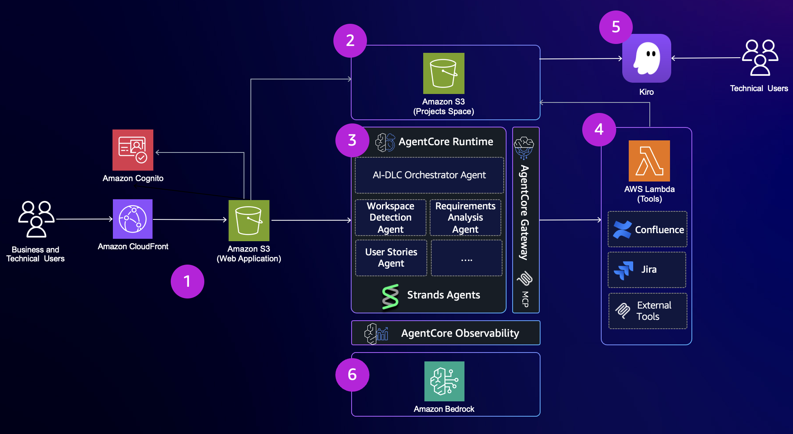
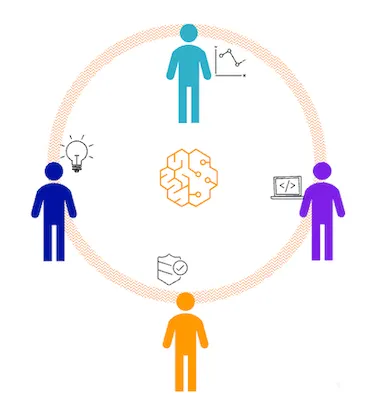
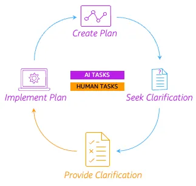
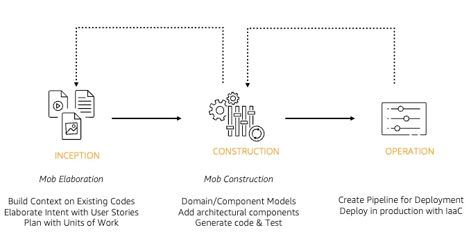

# AWS AI-DLC 平台架构与流程可视化

## 14-Node AgentCore 平台架构全景



*AWS AI-DLC 参考实现：基于 Bedrock AgentCore + Strands GraphBuilder 的 14-Node 多 Agent 编排器。覆盖 Inception → Construction 全阶段，含专用 Agent（需求、设计、代码生成、构建测试、安全、DevOps、文档）。来源：[aws-samples/sample-ai-driven-development-lifecycle-platform](https://github.com/aws-samples/sample-ai-driven-development-lifecycle-platform)*

---

## 三阶段生命周期流程

| | | |
|---|---|---|
|  |  |  |
| Inception→Construction→Operations 三阶段流程 | 自适应执行模型：条件 Stage 根据复杂度动态执行 | 产物流与状态管理三元组 |

*来源：[AWS DevOps Blog](https://aws.amazon.com/blogs/devops/ai-driven-development-life-cycle/)*

---

## 平台架构分层

```
 ┌──────────────────────────────────────────────────────┐
 │                   用户接入层                            │
 │  ┌──────────┐  ┌──────────┐  ┌───────────────────┐   │
 │  │React Web │  │Kiro IDE  │  │Amazon Q Developer │   │
 │  │Cognito   │  │CLI 集成   │  │VS Code / JetBrains│   │
 │  └──────────┘  └──────────┘  └───────────────────┘   │
 └──────────────────────────────────────────────────────┘
                          │
 ┌──────────────────────────────────────────────────────┐
 │            Amazon Bedrock AgentCore (编排层)           │
 │                                                       │
 │  Strands GraphBuilder Orchestrator (14-Node)          │
 │  ┌────────┐┌────────┐┌──────┐┌────────┐┌───────┐    │
 │  │Incept. ││Req     ││Design││Code Gen││Build  │    │
 │  │Agent   ││Agent   ││Agent ││Agent   ││Agent  │    │
 │  └────────┘└────────┘└──────┘└────────┘└───────┘    │
 │  ┌────────┐┌────────┐┌──────┐                        │
 │  │Security││DevOps  ││Doc   │                        │
 │  │Agent   ││Agent   ││Agent │                        │
 │  └────────┘└────────┘└──────┘                        │
 │                                                       │
 │  AgentCore Memory + MCP Gateway                       │
 └──────────────────────────────────────────────────────┘
                          │
 ┌──────────────────────────────────────────────────────┐
 │                    数据/存储层                          │
 │  Amazon S3 (产物) · Graph DB (可追溯性) · Confluence   │
 └──────────────────────────────────────────────────────┘
```

---

## 开源参考实现

| 仓库 | 说明 |
|------|------|
| [awslabs/aidlc-workflows](https://github.com/awslabs/aidlc-workflows) | 核心工作流规则——自适应 Stage 选择、状态管理、审批关隘 |
| [aws-samples/sample-ai-driven-development-lifecycle-platform](https://github.com/aws-samples/sample-ai-driven-development-lifecycle-platform) | Bedrock AgentCore + Strands SDK 完整参考实现 |
| [aws-samples/sample-collaborative-ai-dlc](https://github.com/aws-samples/sample-collaborative-ai-dlc) | 协作版——Yjs/CRDT 实时协同编辑、Neo4j 图谱追溯、并行多 Agent 构建 |
