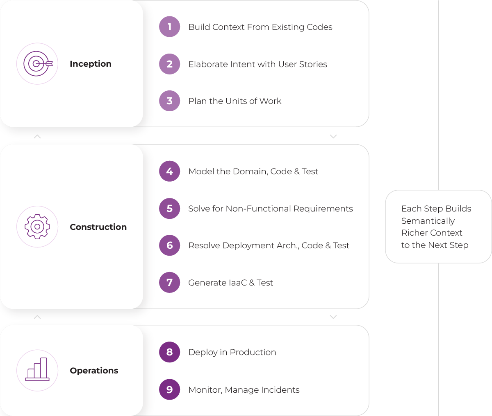
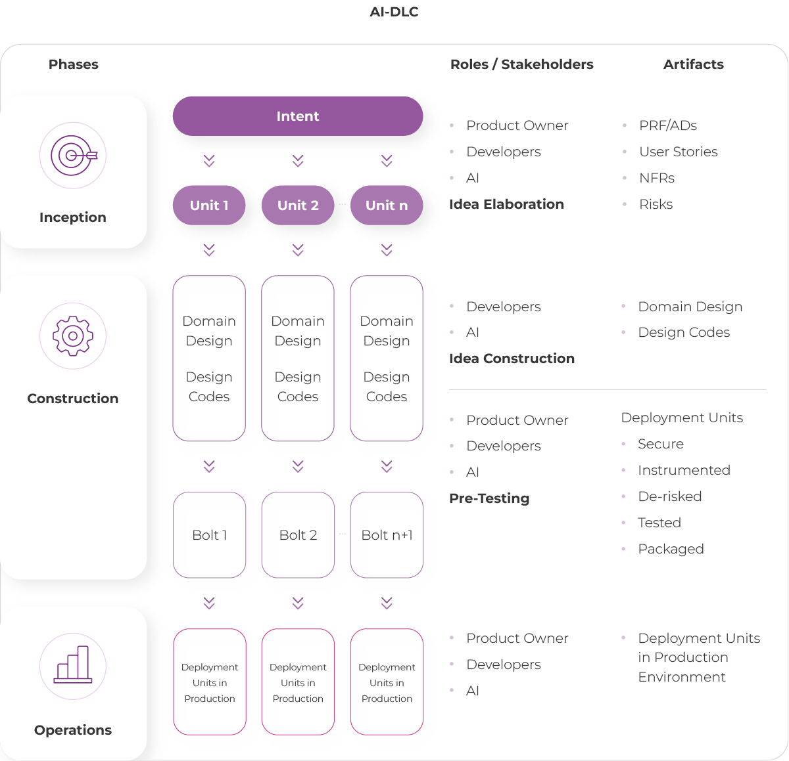
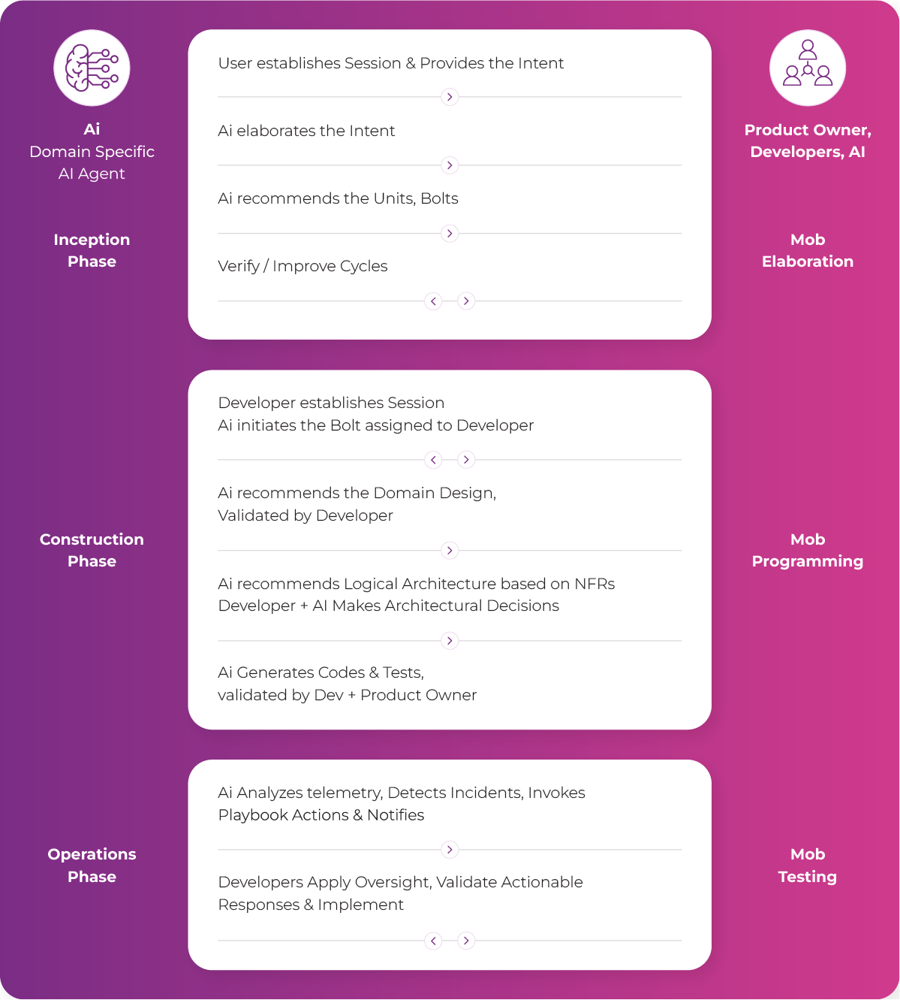

# TT PSC 第三方分析：AWS AI-DLC 深度拆解

> TT PSC 是波兰一家技术服务公司，对 AWS AI-DLC 做了最详尽的第三方拆解分析。以下图表来自其 2026 年 6 月的博文。

---

## 三阶段深度拆解

*AI-DLC 三阶段的完整拆解——从 Inception 的需求捕获到 Construction 的代码生成再到 Operations 的部署监控。来源：[TT PSC](https://ttpsc.com/en/blog/how-aws-ai-dlc-defines-an-ai-native-methodology/)*

---

## 产物流与质量门控

*各阶段产出的具体产物以及阶段间的质量门控（Gating）机制。* 

---

## Operations 阶段示例

*Operations 阶段的完整流程——部署自动化、可观测性集成、生产就绪验证、回滚策略，展示了一个真实 Sprint 中 AI 生成的 IaC 和监控配置。*

---

## TT PSC 的核心观点

1. **AI-DLC 是一种方法论，不是工具**——它独立于具体 IDE/模型/Agent，可以在 Claude Code、Cursor、Amazon Q 等平台上实现
2. **从"用 AI 辅助编码"到"AI 驱动全生命周期"**——这是质的飞跃，不只是速度提升
3. **上下文持久化是关键**——AI-DLC 要求需求和设计决策作为产物留存，而非存在于开发者的脑子里
4. **Human-in-the-Loop 是宪章性的**——不是可选的。AWS 明确将"流程萎缩"（process atrophy）标识为过度自动化的核心风险

---

## 来源

- [TT PSC: How AWS's AI-DLC defines an AI-Native methodology](https://ttpsc.com/en/blog/how-aws-ai-dlc-defines-an-ai-native-methodology/) (June 2026)
