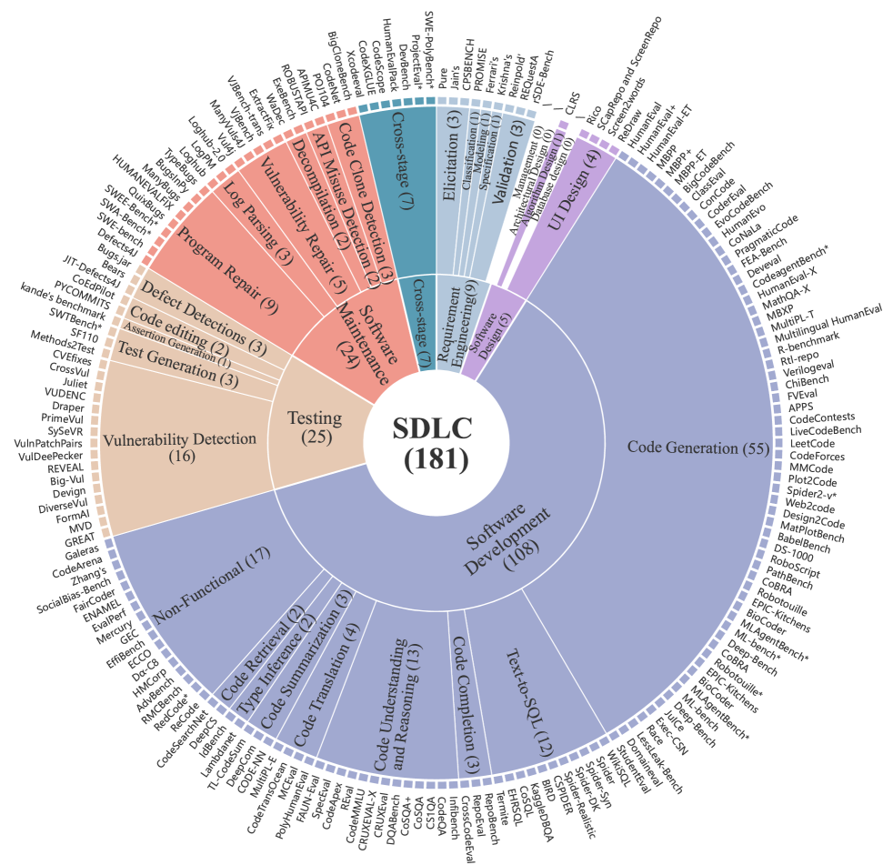
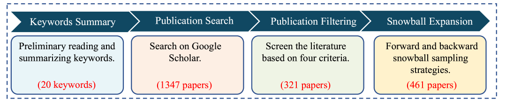
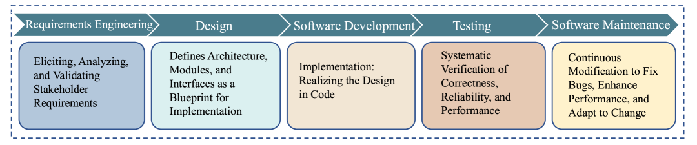
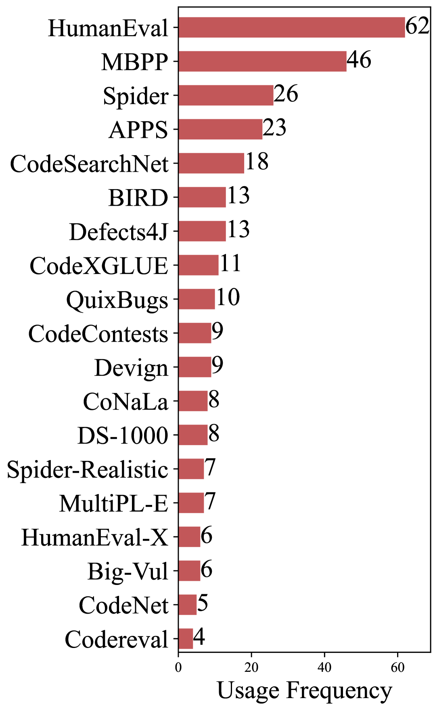
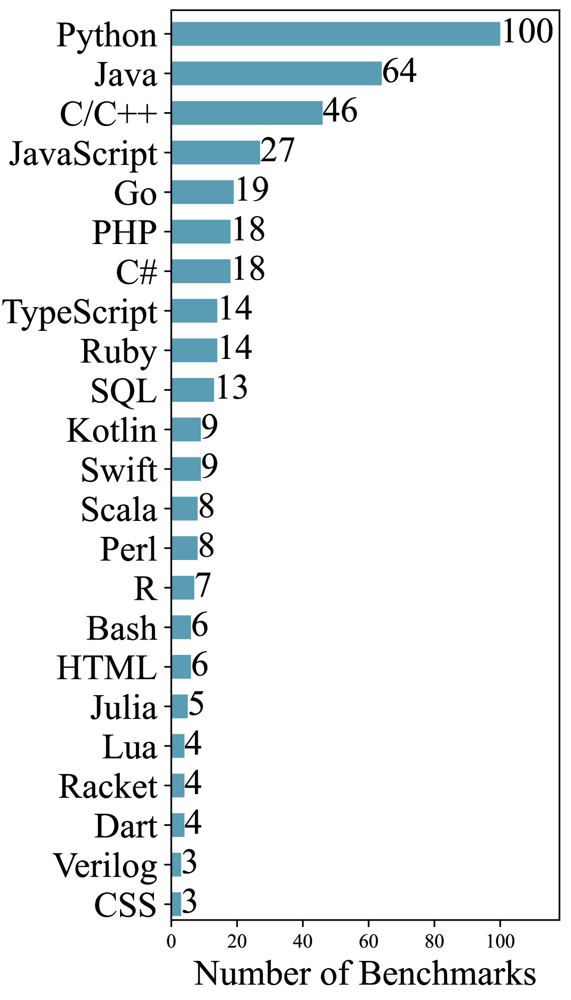
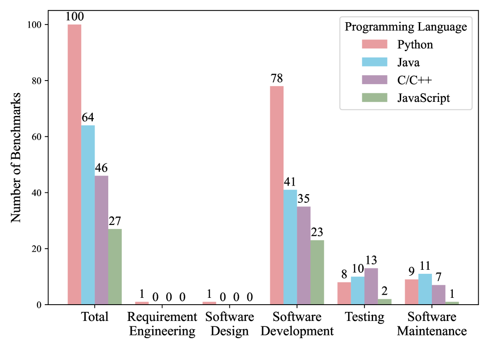
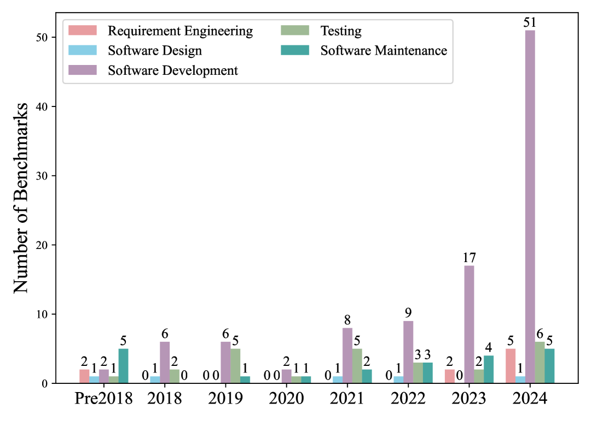

# Dimension 5: Core Drivers — Technological, Economic, and Organizational Forces

## Overview

The push toward AI-driven software development lifecycles is not a single trend but the convergence of multiple independent forces: technological capability breakthroughs, compelling (though contested) economic incentives, and fundamental organizational pressures. Understanding these drivers separately reveals why AIDLC is likely irreversible even as specific claims, tools, and frameworks evolve.

---

## 1. Technological Drivers

### 1.1 Model Capability Acceleration
- **SWE-bench trajectory**: 1.96% (Oct 2023) → 78.4% (April 2026) — a 40x improvement in ~2.5 years
- **Context windows**: From 4K tokens (GPT-3) to 1M+ tokens (Claude Sonnet 4) — enabling whole-codebase understanding
- **Reasoning models**: Chain-of-thought, process supervision, and self-reflection dramatically improving code reliability
- **Multi-modal models**: Understanding code + documentation + screenshots + error logs simultaneously
- **Key insight**: Gains come from scaffolding and agent-computer interface design, not just raw model capability. Non-agentic systems plateau near 20% on SWE-bench while agentic systems reach 78%.

### 1.2 Agentic Infrastructure
- **Agent-Computer Interface (ACI) design**: SWE-agent demonstrated ACI matters as much as model quality
- **Sandboxed execution**: Docker sandboxes, MicroVMs, and managed agent platforms enabling safe autonomous execution
- **MCP (Model Context Protocol)**: Open standard connecting agents to tools, knowledge bases, and internal systems
- **Multi-agent orchestration**: MetaGPT, ChatDev, MOSAIC — specialized agents for different SDLC roles
- **Long-term memory**: Agents maintaining context across sessions, learning from past transcripts (Anthropic's "Dreaming")

### 1.3 Tool Ecosystem Maturation
- **From point tools to platforms**: Individual coding assistants → integrated agentic platforms covering the full SDLC
- **CLI-resident agents**: Claude Code, Codex CLI — operating directly in developer terminals with full filesystem access
- **IDE integration**: Cursor, Windsurf, Copilot Agent Mode — native agentic capabilities in development environments
- **CI/CD integration**: Agents in pipelines for automated testing, security scanning, deployment
- **Managed agent services**: Claude Managed Agents, Tessl — decoupling agent "brain" from execution "hands"

### 1.4 Evaluation & Benchmarking Infrastructure
- **Beyond HumanEval**: SWE-bench, SWE-bench Pro, Terminal-Bench, FeatureBench, OctoBench, RigorBench
- **Process evaluation**: Not just "did it work?" but "did it plan, verify, and recover correctly?"
- **Human-AI collaboration metrics**: CentaurEval measuring partnership quality, not just autonomous performance
- **Key finding from FeatureBench (ICLR 2026)**: Claude Opus 4.5 scores 74.4% on SWE-bench but only 11.0% on end-to-end feature development — revealing the remaining frontier

*上图：181 个 CodeLLM/Agent 基准测试按 SDLC 阶段分布——约 60% 集中在编码实现，需求工程仅 5%，软件设计仅 3%。来源：arXiv:2505.05283 (Wang et al., May 2025)*

 

*左：基准测试发布时间线，反映研究热点从代码生成向测试、维护等下游阶段扩散。右：各 SDLC 阶段基准覆盖热力图。来源：同上*

*编程语言与任务类型分布——Python 占据绝对主导，反映基准测试的语言偏斜。来源：同上*

 

*左：模型性能对标矩阵，不同 LLM 在各基准上的表现对比。右：研究趋势与空白分析——显示当前工具的盲区和未来方向。来源：同上*

*基准评估维度对比——不同评测维度（正确性、效率、可读性、安全性等）在各基准中的覆盖率差异。来源：同上*

### 1.5 Security & Governance Technology
- **Runtime governance**: Policy enforcement between agent and action (not just system prompts)
- **Scoped identity**: Agent-specific credentials with task-scoped, short-lived tokens
- **Immutable recovery**: Logically air-gapped backups outside agent blast radius
- **Observability by design**: 78% of teams now prompt AI to embed telemetry in generated code (New Relic 2026)
- **Declarative governance**: ai-sdlc-framework mapping to EU AI Act, NIST AI RMF, ISO 42001

---

## 2. Economic Drivers

### 2.1 Market Size & Growth
- **Generative AI in SDLC market**: $624.8M (2025) → $845M (2026) → $9.5B projected (2034) — 35.3% CAGR (Fortune Business Insights)
- **AI-SDLC services market**: Projected $2-4B by 2028 (ELEKS)
- **$200B identified opportunity** in AI tech services (BCG)
- **5 funding rounds exceeding $500M** closed in 2025 alone
- **M&A activity**: Cognition acquired Windsurf ($250M); Google acquired Windsurf ($2.4B); OpenAI attempted $3B acquisition

### 2.2 Productivity Economics (Contested)
- **Vendor-claimed gains**: 10-15x (AWS AI-DLC), 55% faster task completion (GitHub), 26% more weekly tasks (Microsoft/Accenture)
- **Independent findings**: 19% slower on familiar repos (METR), "no meaningful relationship" at economy level (Goldman Sachs), "unremarkable savings" (Bain)
- **Anthropic's internal finding**: Devs use AI ~60% of the time but fully delegate only ~20% of tasks
- **TELUS case study**: 30% faster shipping, 500,000+ hours saved
- **Rakuten case study**: 79% faster feature delivery, 5x parallel task execution
- **The productivity paradox**: Perception of massive gains vs. difficulty of objective measurement; task-dependency, codebase-dependency, expertise-dependency

### 2.3 Cost Structure Transformation
- **Labor/tech cost split shifting**: From 90/10 (AI-assisted) → 75/25 (re-engineered) → human focused on intent/oversight (AI-native)
- **Compute replacing headcount**: Software production costs shifting from salaries to API/compute costs
- **"Smarts can be bought by token"** (Mike Cannon-Brookes): Intelligence as a variable cost, not fixed salary cost
- **The junior developer economics problem**: If AI handles junior-level tasks, the economic rationale for hiring junior engineers collapses — with long-term pipeline consequences
- **The maintenance cost trap** (James Shore): "Twice as quick to write, but have you halved maintenance costs?"

### 2.4 Competitive Pressure Dynamics
- **"Thoughtful adoption feels like a liability"**: Competitive pressure to adopt AI tools even without clear ROI evidence
- **The timing gap**: Productivity gains compress existing SDLC services TAM before AI-driven demand creates new market (3-year lag per Forrester/HFS)
- **"Coming battle for share in SDLC services"**: Intense pricing competition as AI changes the economics of software delivery
- **92% of enterprises** plan to increase AI budgets, yet **42% abandoned AI initiatives** in 2025 (McKinsey/BCG)

### 2.5 Platform Consolidation Economics
- **20+ major AI coding players** → economics favor consolidation to ~3 ecosystems
- **Ecosystem lock-in**: Microsoft/GitHub (Copilot + Azure + VS Code), Google (Gemini + Cloud + Android Studio), Anthropic (Claude Code)
- **Winner-take-most dynamics**: Network effects from developer familiarity, organizational standards, and integration depth
- **Venture capital exit pressure**: Driving M&A as frontier model costs become "punishing"

### 2.6 The Individual-Enterprise Gap
- **84% of individual developers** use AI tools (JetBrains 2025)
- **Only 44% of organizations** have fully adopted AI in workflows
- **Only 20%** have pervasive integration across the full SDLC (Forrester)
- **40-point gap** represents both the biggest risk (uncoordinated AI use creating technical debt) and opportunity (structured adoption as competitive advantage)

---

## 3. Organizational Drivers

### 3.1 Role Transformation
- **Developer → Orchestrator**: From writing code to defining intent, providing context, reviewing outputs
- **PM → Coder**: Product managers using AI to build prototypes and even production features
- **Designer → Builder**: Moving from static mockups to working prototypes in IDEs
- **QA → Quality Architect**: From writing test cases to designing verification strategies for AI-generated code
- **Manager → Context Engineer**: From managing people and timelines to managing context quality
- **Cross-functional blurring**: Traditional role boundaries dissolving as AI enables everyone to participate in the build process

### 3.2 Workflow Compression
- **Traditional sequential phases → simultaneous fluid operations**: Design, code, test, deploy happening concurrently
- **Sprint → Bolt**: AWS AI-DLC replaces 2-week sprints with hours/days delivery cycles
- **Planning → JIT (Just-in-Time)**: Less upfront design documentation; more rapid prototyping and iteration
- **Continuous-left**: Testing, security, and governance shifting from post-code phases to concurrent with initial development
- **Mob Elaboration / Mob Construction**: AWS AI-DLC team rituals replacing isolated individual coding

### 3.3 Institutional Knowledge Challenges
- **"Your moat is Institutional Memory"** (Mike Cannon-Brookes): Competitive advantage shifts from code output to accumulated organizational context
- **Teamwork Graph** (Atlassian): 15B+ connections forming "neural backbone" for AI context — turning institutional knowledge into machine-readable form
- **Mozilla.ai's cq**: "Stack Overflow for agents" — rebuilding institutional Q&A after public Stack Overflow collapsed post-ChatGPT
- **Context Development Lifecycle** (Tessl): Humans manage context quality as primary work product; agents execute SDLC
- **Risk**: Organizations that don't formalize institutional knowledge become unable to effectively direct AI agents

### 3.4 Governance & Compliance Pressure
- **EU AI Act**: Requirements for high-risk AI systems in software development
- **NIST AI RMF**: Framework for managing AI risks in development processes
- **ISO 42001**: AI management system standard
- **DSSE (Dependency Security Supply Chain)**: Attestation requirements increasingly applied to AI-generated code
- **IP/License compliance**: Copyright ambiguity (Thaler v. Perlmutter Supreme Court refusal, March 2026); "copyleft laundering" risk; only 54% of orgs evaluate IP risks in AI code
- **ai-sdlc-framework**: Open-source declarative governance mapping to all major regulatory frameworks

### 3.5 Talent & Workforce Pressures
- **The seniority cliff**: Current senior engineers aging out; AI-dependent juniors not developing fundamentals
- **CS enrollment decline**: Predicted 20% drop as AI lowers perceived value of formal CS education
- **Anthropic 2026 Economic Index**: Hiring of workers aged 22-25 into high-exposure roles slowed ~14%
- **The "botsitting" burnout**: Engineers spending more time reviewing/fixing AI code than creating; "the craftsmen are tired"
- **Mandatory AI use**: Some Big Tech companies tying AI adoption to performance reviews; "performance theater"
- **Developer exodus**: Growing reports of engineers leaving the industry entirely

### 3.6 The Rethinking of "Software Development" Itself
- **"Not everyone who builds software will call themselves a developer"** (Logan Kilpatrick): AI builders who don't write traditional code
- **"Become Builders, Not Coders"** (Indeed Engineering Blog, March 2026): Redefining engineering identity around outcomes, not code production
- **"Vibe coding" and its disavowal**: The rapid cycle from "surrender-based development" to "agentic engineering" in ~13 months signals how fast the concept of development work is evolving
- **Software becoming a commodity input**: If AI can generate most code, software creation costs approach orchestration costs + compute costs — fundamentally different economic model

---

## 4. Forces Resisting or Complicating AIDLC Adoption

These are not drivers but countervailing forces that shape how drivers manifest:

### 4.1 Technical Limitations
- **Performance cliff on complex tasks**: FeatureBench showing 11% on end-to-end features vs. 74% on SWE-bench
- **Hallucination inevitability**: Mathematical arguments that LLMs are structurally incapable of reliable agentic tasks beyond certain complexity (Sikka & Sikka)
- **Observability gap**: Cambridge/UEA paper demonstrating structural feedback failure; output-only human feedback cannot converge on correct solutions
- **Probabilistic output vs. deterministic requirements**: Same prompt, different results — compounding into architectural debt at scale

### 4.2 Organizational Inertia
- **42% AI initiative abandonment rate** (BCG 2025)
- **7 of 9 sectors stuck in pilot phase** (MIT)
- **Only 47% of companies have GenAI security controls**
- **Rigid workflows and entrenched power structures** resisting transformation (HBR)

### 4.3 Trust Deficit
- **Only 3% of developers** have high trust in AI outputs (Stack Overflow 2025)
- **Open source community rejection**: Formal bans by Zig, OpenJDK, NetBSD, Gentoo, QEMU, and others
- **67.9% of rejected agentic PRs** lack explicit reviewer feedback — opaque rejection process erodes trust
- **"Confident but incorrect" pattern**: AI outputs look technically sound but contain errors; overconfidence compounds trust issues

### 4.4 The Measurement Problem
- **No standard productivity metric** for AI-assisted development
- **Lines-of-code and PR-count metrics** actively harmful — incentivize AI output volume over quality
- **Felt productivity vs. measured productivity**: METR trial's 39-point gap between belief and reality
- **"Agent debt"** (New Relic): Unvetted architectural logic causing downstream production incidents — hard to measure, easy to accumulate

---

## 5. Synthesis: The Irreversible Trajectory

Despite significant resisting forces, the drivers toward AIDLC appear structurally irreversible for several reasons:

1. **The capability trajectory is one-way**: Models are improving; scaffolding is improving; the direction of travel is clear even if the pace is debated
2. **Economic incentives are massive**: Even at the low end of productivity estimates, the ROI makes adoption economically rational for most organizations
3. **Competitive dynamics compel adoption**: Organizations that don't adopt risk being out-competed by those that do, regardless of whether the gains are real or perceived
4. **The definition of "software development" is expanding**: More people building software through AI; more software being built; the pie is growing even as roles shift
5. **Regulatory and governance frameworks are emerging**: Credible standards (IEEE P3398, NIST AI RMF, ISO 42001) are being developed, addressing the governance gap

The question is not **whether** AIDLC will happen, but **how fast**, **how well-governed**, and **how equitably distributed** the transformation will be. The gap between individual developer adoption (84%) and organizational integration (20%) remains the defining challenge — and opportunity — of the 2025-2026 period.

---

## Key Sources

- Fortune Business Insights: Generative AI in SDLC Market Report (2025-2034)
- Forrester: State of Agentic Software Development (2026); Predictions 2026
- Gartner: Innovation Insight for AI-Native Software Engineering (2025)
- METR: Randomized Controlled Trial on AI Coding Productivity (2025)
- Goldman Sachs: AI Productivity Analysis (Q4 2025)
- New Relic: 2026 State of AI Coding Report
- BCG: AI Initiative Abandonment Rates (2025)
- JetBrains: State of Developer Ecosystem (2025)
- Stack Overflow: Developer Survey (2025)
- Anthropic: Economic Index (2026); Engineering Blog series
- IEEE: P3398 Draft Standard (March 2026)
- arXiv:2606.15283 (AI-Driven SD: Pragmatic Path, 2026)
- ELEKS: AI-SDLC Maturity Model and Predictions (2025-2026)
- Atlassian Team '26: AI-Native SDLC announcements
